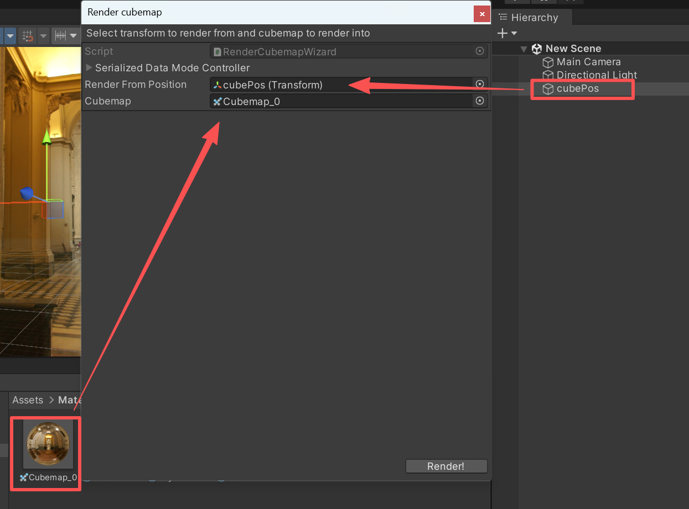
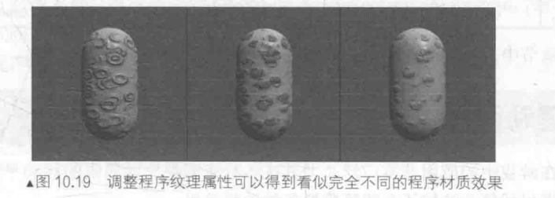

# 10 高级纹理

## 1. **立方体纹理 (Cubemap)**

 **核心概念：**

一种由6张二维纹理构成的特珠资源，分别对应立方体的六个面。采样时提供一个三维方向向量，从立方体中心出发，与某个面相交以获取颜色值。

**应用场景：**

* 天空盒（Skybox）
* 环境反射（模拟金属、镜面）
* 环境折射（模拟透明材质如水、玻璃）.

### 1.1 天空盒

新建一个材质Skyboxmal，在shader的下拉菜单选择Unity自带的Skybox/6 Sides


当然，为了更灵活地使用天空盒，可以为不同摄像机设置不同的天空盒颜色。

将摄像机的camera组件中的clear flags设置为sky box，才可以正确显示天空盒子。

* Clear Flags 包含以下4种方式：

> Skybox：天空盒(默认项)。在屏幕空白处显示当前摄像机的天空盒，如果没有指定天空盒，则会显示默认背景色。
>
> Solid Color：空白处将显示默认此处设置的背景色。
>
> Depth only：仅深度，该模式用于对象不被裁剪。
>
> Don't Clear：不清除，该模式不清楚任何颜色和或深度缓存，但这样做每帧渲染的结果都会叠加在下一帧之上。

### 1.2 反射

使用反射效果的物体像镀了一层金属。想要模拟反射效果很简单。我们只需要通过放入射光线和表面法线来计算反射方向，再利用反射方向采样立方体纹理即可。


首先在unity的脚本手册中给出了如何使用canmera.RenderToCubemap来建立立方体纹理的代码。

..\Assets\Editor\RenderCubemapWizard.cs

由于该代码需要添加菜单栏条目，因此需要把它放在Editor文件夹才可运行。


从Unity菜单栏选择GameObject—>Render into Cubemap.

可以在窗口看到存进Editor文件夹的脚本。把新建的空物体和Legacy——cubemap（要勾选readable）拖进去。



点击Render按钮就把场景中指定位置的视角cubemap渲染到cubemap_0中了。

这时，新建一个material和shader，打开一个Teapot模型，按照正常顺序把material和shader设置给茶壶，同时把cubemap0放进material里即可。

### 1.3 折射

折射可以使用斯涅尔定律来计算折射角：


1）先声明四个新属性

```
Properties {
	_Color ("Color Tint", Color) = (1, 1, 1, 1)
	_RefractColor ("Refraction Color", Color) = (1, 1, 1, 1)
	_RefractAmount ("Refraction Amount", Range(0, 1)) = 1
	_RefractRatio ("Refraction Ratio", Range(0.1, 1)) = 0.5
	_Cubemap ("Refraction Cubemap", Cube) = "_Skybox" {}
}
```

2）在顶点着色器中，计算折射方向：

参数1：归一化入射光，参数2：归一化法线，参数3：折射率比值

```
v2f vert(a2v v) {
	v2f o;
	o.pos = UnityObjectToClipPos(v.vertex);
	
	o.worldNormal = UnityObjectToWorldNormal(v.normal);
	
	o.worldPos = mul(unity_ObjectToWorld, v.vertex).xyz;
	
	o.worldViewDir = UnityWorldSpaceViewDir(o.worldPos);
	
	// Compute the refract dir in world space
	o.worldRefr = refract(-normalize(o.worldViewDir), normalize(o.worldNormal), _RefractRatio);
	
	TRANSFER_SHADOW(o);
	
	return o;
}
```

3）在片元着色器中使用折射方向对立方体纹理采样：

```
fixed4 frag(v2f i) : SV_Target {
	fixed3 worldNormal = normalize(i.worldNormal);
	fixed3 worldLightDir = normalize(UnityWorldSpaceLightDir(i.worldPos));
	fixed3 worldViewDir = normalize(i.worldViewDir);
					
	fixed3 ambient = UNITY_LIGHTMODEL_AMBIENT.xyz;
	
	fixed3 diffuse = _LightColor0.rgb * _Color.rgb * max(0, dot(worldNormal, worldLightDir));
	
	// Use the refract dir in world space to access the cubemap
	fixed3 refraction = texCUBE(_Cubemap, i.worldRefr).rgb * _RefractColor.rgb;
	
	UNITY_LIGHT_ATTENUATION(atten, i, i.worldPos);
	
	// Mix the diffuse color with the refract color
	fixed3 color = ambient + lerp(diffuse, refraction, _RefractAmount) * atten;
	
	return fixed4(color, 1.0);
}
```


## **2. 渲染纹理 (Render Texture)**

### 2.1 渲染目标纹理(Render Target Texture)

现代的 GPU 允许我们把整个三维场景渲染到一个**<u>中间缓冲</u>**中，即**渲染目标纹理(Render TargeTexture，RTT)**，而不是传统的帧缓冲或后备缓冲(backbufer)。

与之相关的是**多重渲染目标(Multiple Render Target，MRT)**，这种技术指的是GPU允许我们把场景同时渲染到多个渲染目标纹理中，而不再需要为每个渲染目标纹理单独渲染完整的场景。**延迟渲染**就是使用多重渲染目标的一个应用。

> 一般来说，延迟渲染使用的Pass数量就是两个。
>
> **第一个Pass：几何通道 (Geometry Pass)**
>
> > 这个阶段不进行光照计算，收集场景中所有不透明物体表面的原始几何和材质信息，并将其存储到一系列称为**G-Buffer（几何缓冲区）** 的纹理中。
>
> **第二个Pass：光照通道 (Lighting Pass)**
>
> > 在这个阶段，利用G-buffer里的各个片元信息，如法线，视角方向，漫反射系数等等，进行真正的光照计算。
>
> 由于 G-Buffer 只存储了最终可见的像素信息，那些被遮挡的（不可见）片段不会进入此阶段，从而**避免了大量无效的光照计算**

 **核心概念：**

一种特殊的纹理类型，其内容并非来自图片文件，而是由一个摄像机的实时渲染结果直接填充。可以理解为一张动态的“画布”。

**应用场景：**

镜子、监控屏幕、画面内显示屏、玻璃折射效果（通过抓取屏幕图像实现扭曲）、延迟渲染等高级特性。

### 2.2 镜子效果

Unity定义了一种专门的纹理类型，渲染纹理（Render Target）。Unity中使用渲染纹理的两种方式：

1. 摄像机的渲染结果实时更新到渲染纹理中。
2. 在屏幕后处理时用GrabPass命令和OnRenderImage函数来获取当前屏幕图像。


这里第一次新建的RT不知为何有bug，会无限重叠渲染。第二次新建的RT就正常了。把源代码的o.uv.x = 1 - o.uv.x;改成`o.uv.y = 1 - o.uv.y;`了。

1）新建一个shader和材质MirrorMat，把shader赋给它。

2）新建一个四边形Quad（Plane之类也可以）作为镜子，把材质MirrorMat赋给它。

3）Project视图下创建一个渲染纹理（Create——Render Texture）, 该渲染纹理名为 MirrorTexture。

4) 从镜子平面方向往反射方向看，新建摄像机，把渲染纹理赋给它。


5）把 MirrorTexture赋给镜子材质的main tex中，即可实现。

shader'中，需要对x（根据具体情况可能是y或z）进行反转

```
v2f vert(a2v v) {
	v2f o;
	o.pos = UnityObjectToClipPos(v.vertex);
	
	o.uv = v.texcoord;
	// Mirror needs to filp x
	o.uv.y = 1 - o.uv.y;
	
	return o;
}
```

### 2.3 玻璃


Cubemap依据1.2中的canmera.RenderToCubemap.cs脚本来实现。

(1)首先，我们需要声明该Shader使用的各个属性:

```
	Properties {
		_MainTex ("Main Tex", 2D) = "white" {}
		_BumpMap ("Normal Map", 2D) = "bump" {}
		_Cubemap ("Environment Cubemap", Cube) = "_Skybox" {}
		_Distortion ("Distortion", Range(0, 100)) = 10
		_RefractAmount ("Refract Amount", Range(0.0, 1.0)) = 1.0
	}
```

其中，MainTex是该玻璃的材质纹理，默认为白色纹理;BumpMap是玻的法线纹理:Cubemap是用于模拟反射的环境纹理;Distortion 则用于控制模拟折射时图像的扭曲程度:RefractAmount 用于控制折射程度，当RefractAmount 值为0时，该玻璃只包含反射效果，当RefractAmount值为1时，该玻璃只包括折射效果。

(2)定义相应的渲染队列，并使用GrabPass来获取屏幕图像:

```
SubShader {
	// We must be transparent, so other objects are drawn before this one.
	Tags { "Queue"="Transparent" "RenderType"="Opaque" }
	
	// This pass grabs the screen behind the object into a texture.
	// We can access the result in the next pass as _RefractionTex
	GrabPass { "_RefractionTex" }
```

我们首先在 SubShader 的标签中将渲染队列设置成 Transparent，尽管在后面的 RenderType 被设置为了 Opaque。这两者看似矛盾，但实际上服务于不同的需求。我们在之前说过，把 Queue设置成 Transparent 可以确保该物体渲染时，其他所有不透明物体都已经被渲染到屏幕上了，否则就可能无法正确得到“透过玻璃看到的图像”。而设置RenderType则是为了在使用着色器替换(Shader Replacement)时，该物体可以在需要时被正确渲染。

3)定义渲染玻璃所需的Pass。为了在Shader 中访问各个属性，我们首先需要定义它们对应的变量。

```
sampler2D _MainTex;
float4 _MainTex_ST;
sampler2D _BumpMap;
float4 _BumpMap_ST;
samplerCUBE _Cubemap;
float _Distortion;
fixed _RefractAmount;
sampler2D _RefractionTex;
float4 _RefractionTex_TexelSize;
```

需要注意的是，我们还定义了 RefractionTex和RefractionTex TexelSize 变量，这对应了在使用 GrabPass 时指定的纹理名称。RefractionTex TexelSize 可以让我们得到该纹理的纹素大小，例如一个大小为 256x512的纹理，它的纹素大小为(17256,1/512)。我们需要在对屏幕图像的采样坐标进行偏移时使用该变量。

4）顶点着色器

```
v2f vert (a2v v) {
	v2f o;
	o.pos = UnityObjectToClipPos(v.vertex);
	
	o.scrPos = ComputeGrabScreenPos(o.pos);
	
	o.uv.xy = TRANSFORM_TEX(v.texcoord, _MainTex);
	o.uv.zw = TRANSFORM_TEX(v.texcoord, _BumpMap);
	
	float3 worldPos = mul(unity_ObjectToWorld, v.vertex).xyz;  
	fixed3 worldNormal = UnityObjectToWorldNormal(v.normal);  
	fixed3 worldTangent = UnityObjectToWorldDir(v.tangent.xyz);  
	fixed3 worldBinormal = cross(worldNormal, worldTangent) * v.tangent.w; 
	
	o.TtoW0 = float4(worldTangent.x, worldBinormal.x, worldNormal.x, worldPos.x);  
	o.TtoW1 = float4(worldTangent.y, worldBinormal.y, worldNormal.y, worldPos.y);  
	o.TtoW2 = float4(worldTangent.z, worldBinormal.z, worldNormal.z, worldPos.z);  
	
	return o;
}
```


5）片元着色器

```
fixed4 frag (v2f i) : SV_Target {		
	float3 worldPos = float3(i.TtoW0.w, i.TtoW1.w, i.TtoW2.w);
	fixed3 worldViewDir = normalize(UnityWorldSpaceViewDir(worldPos));
	
	// Get the normal in tangent space
	fixed3 bump = UnpackNormal(tex2D(_BumpMap, i.uv.zw));	
	
	// Compute the offset in tangent space
	float2 offset = bump.xy * _Distortion * _RefractionTex_TexelSize.xy;
	i.scrPos.xy = offset * i.scrPos.z + i.scrPos.xy;
	fixed3 refrCol = tex2D(_RefractionTex, i.scrPos.xy/i.scrPos.w).rgb;
	
	// Convert the normal to world space
	bump = normalize(half3(dot(i.TtoW0.xyz, bump), dot(i.TtoW1.xyz, bump), dot(i.TtoW2.xyz, bump)));
	fixed3 reflDir = reflect(-worldViewDir, bump);
	fixed4 texColor = tex2D(_MainTex, i.uv.xy);
	fixed3 reflCol = texCUBE(_Cubemap, reflDir).rgb * texColor.rgb;
	
	fixed3 finalColor = reflCol * (1 - _RefractAmount) + refrCol * _RefractAmount;
	
	return fixed4(finalColor, 1);
}
```

我们首先通过 TtoW0等变量的w分量得到世界坐标，并用该值得到该片元对应的视角方向。随后，我们对法线纹理进行采样，得到切线空间下的法线方向。我们使用该值和Distortion 属性以及 RefractionTex TexelSize 来对屏幕图像的采样坐标进行偏移，模拟折射效果。 Distortion 值越大，偏移量越大，玻璃背后的物体看起来变形程度越大。在这里，我们选择使用切线空间下的法线方向来进行偏移，是因为该空间下的法线可以反映顶点局部空间下的法线方向。随后，我们对 scrPos透视除法得到真正的屏幕坐标(原理可参见4.9.3节)，再使用该坐标对抓取的屏幕图像RefactionTex进行采样，得到模拟的折射颜色。

## **3. 程序纹理 (Procedural Texture)**

 **核心概念：**

其纹理像素颜色并非预先绘制，而是通过计算机算法和数学公式动态生成。搜索结果中未详细展开，但这是其核心特征。

**应用场景：**

生成自然界的不规则图案（如木材、大理石、云朵纹理）、创建无缝贴图、动态效果（如动态变化的能量场）、减少内存占用（无需存储大尺寸位图）。

在 Unity中，有一类专门使用程序纹理的材质，叫做程序材质(Procedural Materials)。这类材质和我们之前使用的那些材质在本质上是一样的，不同的是，它们使用的纹理不是普通的纹理,而是程序纹理。需要注意的是，程序材质和它使用的程序纹理并不是在Unity中创建的，而是使用了一个名为Substance Designer 的软件在 Unity 外部生成的。

Substance Designer 是一个非常出色的纹理生成工具,很多 3A的游戏项目都使用了由它生成的材质。我们可以从Unity的资源商店或网络中获取到很多免费或付费的Substance 材质。这些材质都是以.sbsar 为后缀的，如图10.17所示(资源来源于htps:!/www.assetstore.unity3d.com/en/#!content1352)。我们可以直接把这些材质像其他资源一样拖入Unity项目中。

当把这些文件导入 Unity 后，Unity 就会生成一个程序纹理资源(Procedural Material Asset)。程序纹理资源可以包含一个或多个程序材质，例如图10.18中就包含了两个程序纹理--Cereals和 Cereals1，每个程序纹理使用了不同的纹理参数，因此 Unity 为它们生成了不同的程序纹理，例如Cereals Diffuse和Cereals l Diffuse 等。

