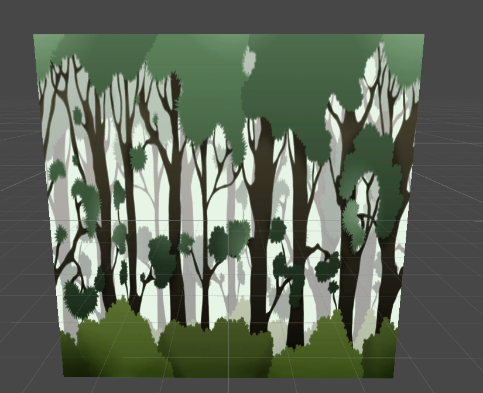
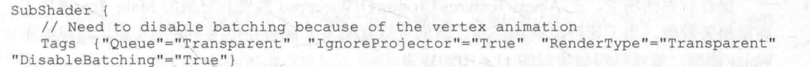

# 11 动态纹理

Unity shader内置的时间变量

| 名称            | 类型   | 描述                                                         |
| --------------- | ------ | ------------------------------------------------------------ |
| _Time           | float4 | t是自该场景加载开始所经过的时间，4个分量的值分别是(t/20,t,2t,3t)。 |
| _SinTime        | float4 | t是时间的正弦值，4个分量的值分别是(t/8,t/4,t/2,t)            |
| _CosTime        | float4 | t是时间的余弦值，4个分量的值分别是(t/8,t/4,t/2,t)            |
| unity_DeltaTime | float4 | dt是时间增量，4个分量的值分别是(dt,1/dt,smoothDt,1/smoothDt) |

## 11.1 播放序列帧动画

首先，新建material ，新建shader，并赋给一个新建的quad（四边形）。

上述序列帧动画的精髓在于，我们需要在每个时刻计算该时刻下应该播放的关键帧的位置，并对该关键帧进行纹理采样。打开新建的 Chapter11-ImageSequenceAnimation，删除原有的代码，并添加如下关键代码。

1) 声明。

```
Properties {
	_Color ("Color Tint", Color) = (1, 1, 1, 1)
	_MainTex ("Image Sequence", 2D) = "white" {}
   	_HorizontalAmount ("Horizontal Amount", Float) = 4
   	_VerticalAmount ("Vertical Amount", Float) = 4
   	_Speed ("Speed", Range(1, 100)) = 30
}
```

MainTex 就是包含了所有关键帧图像的纹理。 HorizontalAmount和 VerticalAmount 分别代表了该图像在水平方向和竖直方向包含的关键帧图像的个数。而Speed 属性用于控制序列帧动画
的播放速度。

2）序列帧通常透明底，需要渲染透明效果

```
Tags {"Queue"="Transparent" "IgnoreProjector"="True" "RenderType"="Transparent"}

Pass {
	Tags { "LightMode"="ForwardBase" }
	
	ZWrite Off
	Blend SrcAlpha OneMinusSrcAlpha
```

通过blend命令来开启设置透明模式，并关闭深度写入。

3）顶点着色器

```
v2f vert (a2v v) {  
	v2f o;  
	o.pos = UnityObjectToClipPos(v.vertex);  
	o.uv = TRANSFORM_TEX(v.texcoord, _MainTex);  
	return o;
} 
```

4）片元着色器

```
			fixed4 frag (v2f i) : SV_Target {
				float time = floor(_Time.y * _Speed);  
				float row = floor(time / _HorizontalAmount);
				float column = time - row * _HorizontalAmount;
				
//				half2 uv = float2(i.uv.x /_HorizontalAmount, i.uv.y / _VerticalAmount);
//				uv.x += column / _HorizontalAmount;
//				uv.y -= row / _VerticalAmount;
				half2 uv = i.uv + half2(column, -row);
				uv.x /=  _HorizontalAmount;
				uv.y /= _VerticalAmount;
				
				fixed4 c = tex2D(_MainTex, uv);
				c.rgb *= _Color;
				
				return c;
			}
```

我们需要计算出每个时刻需要播放的关键帧在纹理中的位置。而由于序列帧纹理都是按行按列排列的，因此这个位置可以认为是该关键帧所在的行列索引数。因此，在上面的代码的前3行中我们计算了行列数，其中使用了Unity的内置时间变量Time。由11.1节可以知道， Time.y就是自该场景加载后所经过的时间。我们首先把Time.y 和速度属性Speed 相乘来得到模拟的时间，并使用CG的oor 函数对结果值取整来得到整数时间time。然后，我们使用time除以HorizontalAmount 的结果值的商来作为当前对应的行索引，除法结果的余数则是列索引。

5)回调

```
FallBack "Transparent/VertexLit"
```


## 11.2 视差效果

很多2D游戏都使用了不断滚动的背景来模拟游戏角色在场景中的穿梭，这些背景往往包含了多个层(layers)来模拟一种视差效果。

1) 在Window→LightingSkybox中去掉场景中的天空盒子。由于本例模拟的是 2D游戏中的滚动背景，因此我们需要把摄像机的投影模式设置为正交投影。
(2) 新建一个材质。在本书资源中，该材质名为ScrollingBackgroundMat，新建一个 UnityShader。在本书资源中,该 Shader 名为 Chapter11-ScrollingBackground。把新的 Shader 赋给第2步中创建的材质。

1）声明

```
Properties
{
    _MainTex ("Base Layer (RGB)", 2D) = "white" {}
    _DetailTex ("2nd Layer (RGB)", 2D) = "white" {}
    _ScrollX ("Base Layer speed", Float) = 1.0
    _Scroll2X ("2nd Layer speed", Float) = 1.0
    _Multiplier("Layer Multiplier",Float) = 1
}
```

其中，MainTex和 DetailTex分别是第一层(较远)和第二层(较近)的背景纹理，而 ScrollX和 Scrol2X对应了各自的水平滚动速度。 Multiplier 参数则用于控制纹理的整体亮度。

2）顶点着色器

```
v2f vert (a2v v) {
	v2f o;
	o.pos = UnityObjectToClipPos(v.vertex);
	
	o.uv.xy = TRANSFORM_TEX(v.texcoord, _MainTex) + frac(float2(_ScrollX, 0.0) * _Time.y);
	o.uv.zw = TRANSFORM_TEX(v.texcoord, _DetailTex) + frac(float2(_Scroll2X, 0.0) * _Time.y);
	
	return o;
}
```

`frac`是一个 HLSL/Cg 中的内置数学函数，它的作用是**提取一个数值的小数部分**。`frac(x)`的数学定义是 `x - floor(x)`，其中 `floor(x)`函数返回的是不大于 `x`的最大整数

例如：frac（3.7） = 0.7；

作用：

1. **随时间偏移**：`_ScrollX`是一个控制滚动速度的属性，`_Time.y`是自游戏开始以来经过的时间（以秒为单位）。两者相乘 `(_ScrollX * _Time.y)`得到一个持续线性增大的偏移量。
2. **利用frac实现循环**：直接使用这个持续增大的偏移量，纹理坐标会变得非常大，可能导致精度问题或非预期的采样。用 `frac`对这个偏移量取小数部分，能确保用于实际偏移的值始终被限制在 `[0, 1)`的范围内。
3. **无缝滚动**：当偏移量的整数部分被 `frac`函数“剥离”后，小数部分会从0增长到接近1，然后瞬间跳回0，接着重新开始增长。这个过程循环往复，就形成了纹理在指定方向上平滑、无限循环的滚动效果，而不会出现任何跳跃或断层。


3) 片元着色器

```
fixed4 frag (v2f i) : SV_Target {
	fixed4 firstLayer = tex2D(_MainTex, i.uv.xy);
	fixed4 secondLayer = tex2D(_DetailTex, i.uv.zw);
	
	fixed4 c = lerp(firstLayer, secondLayer, secondLayer.a);
	c.rgb *= _Multiplier;
	
	return c;
}
```

`lerp`函数会根据第三个参数（混合因子，这里用的是`secondLayer.a`）的值，在前两个参数（`firstLayer`和`secondLayer`）之间进行平滑的插值。

这意味着：

- 在`secondLayer.a`值为**0**（完全透明）的地方，`lerp`函数返回`firstLayer`的颜色，即完全显示第一层背景。
- 在`secondLayer.a`值为**1**（完全不透明）的地方，`lerp`函数返回`secondLayer`的颜色，即完全显示第二层背景。
- 在`secondLayer.a`值介于**0和1之间**的地方，则显示两层背景的混合色，实现平滑的过渡效果。这相当于把第二层纹理的Alpha通道当作了一个**蒙版**，来控制第二层显示多少以及如何与第一层融合




## 11.3 顶点动画


1）声明


其中， MainTex是河流纹理，Color用于控制整体颜色，Magnitude 用于控制水流波动的幅度，Frequency用于控制波动频率，InvWaveLength用于控制波长的倒数(InvWaveLength 越大波长越小)，Speed用于控制河流纹理的移动速度。

2) 我们需要为透明效果设置合适的subshader标签：



在上面的设置中，我们除了为透明效果设置Queue、IgnoreProjector 和RenderType 外，还设置了一个新的标签--DisableBatching。我们在 3.3.3节中介绍过该标签的含义:一些 Subshader 在使用 Unity 的批处理功能时会出现问题，这时可以通过该标签来直接指明是否对该 SubShader 使用批处理。而这些需要特殊处理的 Shader通常就是指包含了模型空间的顶点动画的 Shader。这是因为，批处理会合并所有相关的模型，而这些模型各自的模型空间就会丢失。而在本例中，我们需要在物体的模型空间下对顶点位置进行偏移。因此，在这里需要取消对该Shader 的批处理操作。

3）设置pass的状态


这里关闭了深度写入，开启并设置了混合模式，并关闭了剔除功能。这是为了让水流的每个
面都能显示。

4）然后，我们在顶点着色器中进行了相关的顶点动画:

```
v2f vert(a2v v) {
	v2f o;
	
	float4 offset;
	offset.yzw = float3(0.0, 0.0, 0.0);
	offset.x = sin(_Frequency * _Time.y + v.vertex.x * _InvWaveLength + v.vertex.y * _InvWaveLength + v.vertex.z * _InvWaveLength) * _Magnitude;
	o.pos = UnityObjectToClipPos(v.vertex + offset);
	
	o.uv = TRANSFORM_TEX(v.texcoord, _MainTex);
	o.uv +=  float2(0.0, _Time.y * _Speed);
	
	return o;
}
```

我们首先计算顶点位移量。我们只希望对顶点的x方向进行位移，因此yzw的位移量被设置为0。然后，我们利用Frequency属性和内置的Time.y变量来控制正弦函数的频率。为了让不同位置具有不同的位移，我们对上述结果加上了模型空间下的位置分量，并乘以nvWaveLength来控制波长。最后，我们对结果值乘以 Magnitude属性来控制波动幅度，得到最终的位移。剩下的工作，我们只需要把位移量添加到顶点位置上，再进行正常的顶点变换即可。
在上面的代码中，我们还进行了纹理动画，即使用Time.y和 Speed 来控制在水平方向上的纹理动画。

5) 片元着色

```
fixed4 frag(v2f i) : SV_Target {
	fixed4 c = tex2D(_MainTex, i.uv);
	c.rgb *= _Color.rgb;
	
	return c;
} 
```

6）最后，我们把 Fallback设置为内置的Transparent/VertexLit(也可以选择关闭Fallback):

```
Fallback "Transparent/VertexLit"
```

保存后返回场景，把 Assets/Textures/Chapter11/Water.psd 拖曳到材质的 Main Tex属性上，并调整相关参数。为了让河流更加美观，我们可以复制多个材质并使用不同的参数，再赋给不同的Water模型，就可以得到类似图11.4中的效果。

### 顶点动画阴影

如果我们想要对包含了顶点动画的物体添加阴影，那么如果仍然像9.4节中那样使用内置的 Difuse 等包含的阴影 Pass 来渲染，就得不到正确的阴影效果(这里指的是无法向其他物体正确地投射阴影)。

这是因为，我们讲过Unity的阴影绘制需要调用一个 ShadowCaster Pass，而如果直接使用这些内置的 ShadowCaster Pass,这个 Pass 中并没有进行相关的顶点动画,因此 Unity会仍然按照原来的顶点位置来计算阴影，这并不是我们希望看到的。

这时，我们就需要提供一个自定义的 ShadowCaster Pass，在这个Pass中，我们将进行同样的顶点变换过程。需要注意的是，在前面的实现中，如果涉及半透明物体我们都把Fallback设置成了Transparent/VertexLit，而[ransparent/VertexLit 没有定义 ShadowCaster Pass，因此也就不会产生阴影(详见9.4.5节)。


此时没有正确的阴影效果。

为了正确绘制变形对象的阴影，我们就需要提供自定义的ShadowCasterPass。读者可以在本书资源的Chapter11-VertexAnimationWithShadow中找到对应的Unity Shader。

**核心的shadow caster Pass部分：**

```
Pass {
	Tags { "LightMode" = "ShadowCaster" }
	
	CGPROGRAM
	
	#pragma vertex vert
	#pragma fragment frag
	
	#pragma multi_compile_shadowcaster
	
	#include "UnityCG.cginc"
	
	float _Magnitude;
	float _Frequency;
	float _InvWaveLength;
	float _Speed;
	
	struct v2f { 
	    V2F_SHADOW_CASTER;
	};
	
	v2f vert(appdata_base v) {
		v2f o;
		
		float4 offset;
		offset.yzw = float3(0.0, 0.0, 0.0);
		offset.x = sin(_Frequency * _Time.y + v.vertex.x * _InvWaveLength + v.vertex.y * _InvWaveLength + v.vertex.z * _InvWaveLength) * _Magnitude;
		v.vertex = v.vertex + offset;

		TRANSFER_SHADOW_CASTER_NORMALOFFSET(o)
		
		return o;
	}
	
	fixed4 frag(v2f i) : SV_Target {
	    SHADOW_CASTER_FRAGMENT(i)
	}
	ENDCG
}
```

阴影投射的重点在于我们需要按正常Pass的处理来剔除片元或进行顶点动画，以便阴影可以和物体正常渲染的结果相匹配。


在自定义的阴影投射的Pass 中，我们通常会使用 Unity 提供的内置宏V2F SHADOW CASTER、TRANSFER SHADOW CASTER NORMALOFFSET(旧版本中会使用TRANSFERSHADOWCASTER)和SHADOWCASTERFRAGMENT来计算阴影投射时需要的各种变量，而我们可以只关注自定义计算的部分。在上面的代码中，我们首先在v2f结构体中利用V2F SHADOW CASTER来定义阴影投射需要定义的变量。随后，在顶点着色器中我们首先按之前对顶点的处理方法计算顶点的偏移量，不同的是，我们直接把偏移值加到顶点位置变量中，再使用TRANSFERSHADOWCASTERNORMALOFFSET来让Unity为我们完成剩下的事情。在片元着色器中，我们直接使用SHADOWCASTERFRAGMENT来让Unity自动完成阴影投射的部分，把结果输出到深度图和阴影映射纹理中。


## 11.4 广告牌

常见的顶点动画就是广告牌技术(Biboarding)。

**什么是广告牌（BillBoarding）？**

广告牌技术会根据**视角方向**来旋转一个被纹理着色的多边形(通常就是简单的四边形，这个多边形就是广告牌)，使得**多边形看起来好像总是面对着摄像机**。

**应用：**

广告牌技术被用于很多应用，比如**渲染烟雾、云朵、闪光效果**等。

**计算：**

广告牌技术的难点在于，如何根据需求来构建3个相互正交的基向量。

计算过程通常是，我们首先会通过初始计算得到目标的**表面法线**(例如就是视角方向)和**指向上**的方向，而两者往往是不垂直的。但是，两者其中之一是固定的。

> 例如当模拟草丛时，我们希望广告牌的指向上的方向永远是(0,1,0)，而法线方向应该随视角变化;而当模拟粒子效果时，我们希望广告牌的法线方向是固定的，即总是指向视角方向，指向上的方向则可以发生变化。

我们假设法线方向是固定的，首先，我们根据初始的表面法线和指向上的方向来计算出目标方向的指向右的方向 (通过叉积操作):

```
right = up × normal
```

对其归一化后，再由法线方向和指向右的方向计算出正交的指向上的方向L:

```
up' = normal × right
```


**效果：**


正常准备material和shader即可。

1）声明

```
Properties {
	_MainTex ("Main Tex", 2D) = "white" {}
	_Color ("Color Tint", Color) = (1, 1, 1, 1)
	_VerticalBillboarding ("Vertical Restraints", Range(0, 1)) = 1 
}
```

其中，MainTex是广告牌显示的透明纹理，Color用于控制显示整体颜色
VerticalBilboarding 则用于调整是固定法线还是固定指向上的方向，即约束垂直方向的程度。

2）在本例中，我们需要为透明效果设置合适的Subshader标签

```
SubShader
{
	Tags {"Queue"="Transparent","DisableBatching"="True",
	"IqnoreProjector"="True","RenderType"="Transparent"}
```

在上面的设置中，我们除了为透明效果设置Queue、IgnoreProjector和RenderType 外，还设置了一个新的标签——**DisableBatching**。我们在3.3.3节中介绍过该标签的含义。

**为什么不用批处理？**

我们在3.3.3节中介绍过该标签的含义：

一些SubShader在使用 Unity的**批处理**功能时会出现问题，这时可以通过该标签来直接指明是否对该SubShader使用批处理。而这些需要特殊处理的 Shader通常就是指包含了模型空间的顶点动画的Shader。这是因为，批处理会合并所有相关的模型，而这些模型各自的模型空间就会被丢失。而在广告牌技术中，我们需要使用物体的模型空间下的位置来作为锚点进行计算。因此。在这里需要取消对该Shader的批处理操作。

(3)接着，我们设置了Pass 的渲染状态:

```
Pass { 
	Tags { "LightMode"="ForwardBase" }
	
	ZWrite Off
	Blend SrcAlpha OneMinusSrcAlpha
	Cull Off
```

关闭了深度写入，开启混合模式，关闭了剔除功能。目的：让广告牌的每个面都能显示。

4）顶点着色器（核心）。**所有的计算都是在模型空间下进行的。**首先选择模型空间的原点作为广告牌的锚点，并利用内置变量获取模型空间下的视角位置。

```
v2f vert (a2v v) {
	v2f o;
	
	// Suppose the center in object space is fixed
	float3 center = float3(0, 0, 0);
	float3 viewer = mul(unity_WorldToObject,float4(_WorldSpaceCameraPos, 1));
```

然后，我们开始计算3个正交矢量。首先，我们根据观察位置和锚点计算目标法线方向，并根据 VerticalBillboarding属性来控制垂直方向上的约束度。

```
float3 normalDir = viewer - center;
	// If _VerticalBillboarding equals 1, we use the desired view dir as the normal dir
	// Which means the normal dir is fixed
	// Or if _VerticalBillboarding equals 0, the y of normal is 0
	// Which means the up dir is fixed
	normalDir.y =normalDir.y * _VerticalBillboarding;
	normalDir = normalize(normalDir);
```

当 VerticalBillboarding为1时，意味着法线方向固定为视角方向;当VerticalBillboarding 为0时，意味着向上方向固定为(0,1,0)。最后，我们需要对计算得到的法线方向进行归一化操作来得到单位矢量。
接着，我们得到了粗略的向上方向。为了防止法线方向和向上方向平行(如果平行，那么叉积得到的结果将是错误的)，我们对法线方向的y分量进行判断，以得到合适的向上方向。然后，根据法线方向和粗略的向上方向得到向右方向，并对结果进行归一化。但由于此时向上的方向还是不准确的，我们又根据准确的法线方向和向右方向得到最后的向上方向:

```
// Get the approximate up dir
	// If normal dir is already towards up, then the up dir is towards front
	float3 upDir = abs(normalDir.y) > 0.999 ? float3(0, 0, 1) : float3(0, 1, 0);
	float3 rightDir = normalize(cross(upDir, normalDir));
	upDir = normalize(cross(normalDir, rightDir));
	
	// Use the three vectors to rotate the quad
	float3 centerOffs = v.vertex.xyz - center;
	float3 localPos = center + rightDir * centerOffs.x + upDir * centerOffs.y + normalDir * centerOffs.z;
  
	o.pos = UnityObjectToClipPos(float4(localPos, 1));
	o.uv = TRANSFORM_TEX(v.texcoord,_MainTex);

	return o;
}
```

5）片元着色器

```
fixed4 frag (v2f i) : SV_Target {
	fixed4 c = tex2D (_MainTex, i.uv);
	c.rgb *= _Color.rgb;
	
	return c;
}
```

6）最后，我们把 Fallback设置为内置的Transparent/VertexLit(也可以选择关闭Fallback):

```
Fallback "Transparent/VertexLit"
```

需要说明的是，在上面的例子中，我们**使用的是Unity自带的四边形(Quad)来作为广告牌,而不能使用自带的平面(Plane)。**

这是因为，我们的代码是建立在一个竖直摆放的多边形的基础上的，也就是说，这个多边形的顶点结构需要满足在模型空间下是竖直排列的。只有这样，我们才能使用 v.vertex 来计算得到正确的相对于中心的位置偏移量。保存后返回场景，把本书资源中的 Assets/Textures/Chapter11/star.png拖曳到材质的 Main Tex中，即可得到类似图 11.6中的效果。