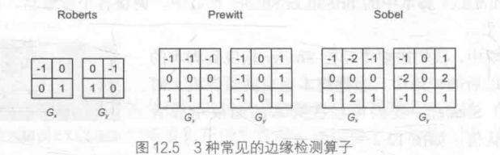
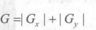

# 12 屏幕后处理

屏幕后处理，顾名思义，通常是指在渲染完整个场景得到屏幕图像后，再对这个图像进行一系列操作，实现各种屏幕特效。例如：景深（Depth of Field），运动模糊（Motion Blur）等。

因此，想要实现屏幕后处理的基础在于得到渲染后的屏幕图像，即抓取屏幕，而Unity为我们提供了这样一个方便的接口--0nRenderImage函数。它的函数声明如下:

```c#
MonoBehaviour.OnRenderImage(RenderTexture src, RenderTexture dest)
```

在 OnRenderlmage 函数中，我们通常是利用Graphics.Blit函数来完成对渲染纹理的: 

```
public static void Blit(Texture src,RenderTexture dest);
public static void Blit(Texture src,RenderTexture dest,Material mat,int pass = -1);
public static void Blit( Texture src,Material mat,int pass=-1);
```

* 参数src：

  源纹理，在屏幕后处理技术中，unity通常会将当前屏幕渲染纹理（或者上一步处理后的渲染纹理）存储在src源纹理中。

* 参数dest：

  目标渲染纹理，如果它的值为null，会直接将结果显示在屏幕上。不为null则通过函数的一系列操作后，unity再将dest渲染到屏幕上。

* 参数mat

  我们使用的材质，这个材质使用的unity shader会进行各种屏幕后处理操作。而src纹理将会被传递给shader中名为MainTex的代码.

* 参数pass

  默认值为-1，表示将会依次调用shader内的所有pass，否则只会调用索引值的pass。

> 在默认情况下，OnRenderImage函数会在所有的不透明和透明的Pass执行完毕后被调用，以便对场景中所有游戏对象都产生影响。但有时，我们希望在不透明的Pass(即渲染队列小于等于2500的Pass，内置的 Background、Geometry和 AlphaTest 渲染队列均在此范围内)执行完毕后立即调用 OnRenderlmage 函数,从而不对透明物体产生任何影响。此时,我们可以在 OnRenderlmage函数前添加ImageEfectOpaque 属性来实现这样的目的。13.4节展示了这样一个例子，在13.4节

## 12.1 基础unity屏幕后处理脚本系统

因此，要在 Unity 中实现屏幕后处理效果，过程通常如下:

1）首先需要在**摄像机**中添加一个用于屏幕后处理的脚本。在这个脚本中，我们会实现OnRenderlmage函数来获取当前屏幕的渲染纹理。

2）然后，调用 Graphics.Blit 函数使用特定的 Unity Shader 来对当前图像进行处理，再把返回的渲染纹理显示到屏幕上。

3）对于一些复杂的屏幕特效，我们可能需要多次调用Graphics.Blit 函数来对上一步的输出结果进行下一步处理。

> 但是，在进行屏幕后处理之前，我们需要检查一系列条件是否满足，例如当前平台是否支持渲染纹理和屏幕特效，是否支持当前使用的UnityShader 等。为此，我们创建了一个用于屏幕后处理效果的基类，在实现各种屏幕特效时，我们只需要继承自该基类，再实现派生类中不同的操作即可。读者可在本书资源的 <u>Assets/Scripts/Chapter12/PostEffectsBase.cs</u> 中找到该脚本。

`PostEffecrsBase.cs`

(1)首先，所有屏幕后处理效果都需要绑定在某个摄像机上，并且我们希望在编辑器状态下也可以执行该脚本来查看效果:

```
[ExecuteInEditMode]
[RequireComponent (typeof(Camera))]
public class PostEffectsBase : MonoBehaviour {
```

(2)为了提前检查各种资源和条件是否满足，我们在Start函数中调用CheckResources 函数:

```
	// Called when start
	protected void CheckResources() {
		bool isSupported = CheckSupport();
		
		if (isSupported == false) {
			NotSupported();
		}
	}

	// Called in CheckResources to check support on this platform
	protected bool CheckSupport() {
		if (SystemInfo.supportsImageEffects == false || SystemInfo.supportsRenderTextures == false) {
			Debug.LogWarning("This platform does not support image effects or render textures.");
			return false;
		}
		
		return true;
	}

	// Called when the platform doesn't support this effect
	protected void NotSupported() {
		enabled = false;
	}
	
	protected void Start() {
		CheckResources();
	}
```


(3)由于每个屏幕后处理效果通常都需要指定一个shader 来创建一个用于处理渲染纹理的材质，因此基类中也提供了这样的方法:

```
protected Material CheckShaderAndCreateMaterial(Shader shader, Material material) {
		if (shader == null) {
			return null;
		}
		
		if (shader.isSupported && material && material.shader == shader)
			return material;
		
		if (!shader.isSupported) {
			return null;
		}
		else {
			material = new Material(shader);
			material.hideFlags = HideFlags.DontSave;
			if (material)
				return material;
			else 
				return null;
		}
	}
```

**CheckShaderAndCreateMaterial**函数接受两个参数，第一个参数指定了该特效需要使用的Shader，第二个参数则是用于后期处理的材质。该函数首先检査Shader 的可用性，检查通过后就返回一个使用了该 Shader的材质，否则返回null。


## 12.2 调整屏幕的亮度/饱和度和对比度

1）新建场景，包括相机，平行光。去掉天空盒子。

2）把本书资源中的 Assets/Textures/Chapter12/Sakura0,jpg拖曳到场景中，并调整其的位置使它可以填充整个场景。
3）新建一个脚本。在本书资源中，该脚本名为BrightnessSaturationAndContrast.cs。把该脚本拖曳到摄像机上。
4）新建一个Unity Shader。在本书资源中,该 Shader 名为Chapter12-BrightnessSaturationAndContrast.shader。

### BrightnessSaturationAndContrast.cs脚本

首先来编写 BrightnessSaturationAndContrast.cs脚本。打开该脚本，并进行如下修改：

1. 首先继承12.1的基类

```
public class BrightnessSaturationAndContrast : PostEffectsBase {
```

2. 声明该效果需要的shader，并依据此创建相应的材质：

```c#
public Shader briSatConShader;
	private Material briSatConMaterial;
	public Material material {  
		get {
			briSatConMaterial = CheckShaderAndCreateMaterial(briSatConShader, briSatConMaterial);
			return briSatConMaterial;
		}  
	}
```

在上述代码中，briSatConShader是我们指定的Shader，对应了后面将会实现的Chapter12-BrightnessSaturationAndContrast。briSatConMaterial是创建的材质，我们提供了名为 material 的材质来访问它，material的get函数调用了基类的CheckShaderAndCreateMaterial 函数来得到对应的材质。

3. 我们还在脚本中提供了调整亮度、饱和度和对比度的参数:

```
	[Range(0.0f, 3.0f)]
	public float brightness = 1.0f;

	[Range(0.0f, 3.0f)]
	public float saturation = 1.0f;

	[Range(0.0f, 3.0f)]
	public float contrast = 1.0f;
```

4. 最后定义OnRenderImage来真正的后处理：

```
void OnRenderImage(RenderTexture src, RenderTexture dest) {
		if (material != null) {
			material.SetFloat("_Brightness", brightness);
			material.SetFloat("_Saturation", saturation);
			material.SetFloat("_Contrast", contrast);

			Graphics.Blit(src, dest, material);
		} else {
			Graphics.Blit(src, dest);
		}
	}
```

每当 OnRenderlmage函数被调用时，它会检查材质是否可用。如果可用，就把参数传递给材质，再调用 Graphics.Blit进行处理；否则，直接把原图像显示到屏幕上，不做任何处理。

### BrightnessSaturationAndContrast.shader

下面，我们来实现 Shader 的部分。打开Chapter12-BrightnessSaturationAndContrast，进行如下修改。

1)声明

```
Properties {
	_MainTex ("Base (RGB)", 2D) = "white" {}
	_Brightness ("Brightness", Float) = 1
	_Saturation("Saturation", Float) = 1
	_Contrast("Contrast", Float) = 1
}
```

在 12.1节中，我们提到 Graphics.Blit(src,dest,material)将把第一个参数传递给 Shader 中名为MainTex的属性。因此，我们必须声明一个名为MainTex的纹理属性。除此之外，我们还声明了用于调整亮度、饱和度和对比度的属性。这些值将会由脚本传递而得。事实上，我们可以省略Properties中的属性声明，Properties中声明的属性仅仅是为了显示在材质面板中，但对于屏幕特效来说，它们使用的材质都是临时创建的，我们也不需要在材质面板上调整参数，而是直接从脚本传递给 Unity Shader。

2）定义用于屏幕后处理的pass

```
SubShader {
	Pass {  
		ZTest Always Cull Off ZWrite Off
```

3）为了在代码中访问各个属性，我们需要在CG代码块中声明对应的变量:

```
sampler2D _MainTex;  
half _Brightness;
half _Saturation;
half _Contrast;
```

4）定义顶点着色器：屏幕特效使用的顶点着色器代码通常都比较简单，我们只需要进行必需的顶点变换，更重要的是，我们需要把正确的纹理坐标传递给片元着色器，以便对屏幕图像进行正确的采样:

```
struct v2f {
	float4 pos : SV_POSITION;
	half2 uv: TEXCOORD0;
};
  
v2f vert(appdata_img v) {
	v2f o;
	
	o.pos = UnityObjectToClipPos(v.vertex);
	
	o.uv = v.texcoord;
			 
	return o;
}
```

**appdata_img结构体：**使用了Unity内置的appdata_img结构体作为顶点着色器的输入,读者可以在 UnityCGcginc 中找到该结构体的声明,它只包含了图像处理时必需的顶点坐标和纹理
坐标等变量

5）接着，我们实现了用于调整亮度、饱和度和对比度的片元着色器:

```
fixed4 frag(v2f i) : SV_Target {
	fixed4 renderTex = tex2D(_MainTex, i.uv);  
	  
	// Apply brightness
	fixed3 finalColor = renderTex.rgb * _Brightness;
	
	// Apply saturation
	fixed luminance = 0.2125 * renderTex.r + 0.7154 * renderTex.g + 0.0721 * renderTex.b;
	fixed3 luminanceColor = fixed3(luminance, luminance, luminance);
	finalColor = lerp(luminanceColor, finalColor, _Saturation);
	
	// Apply contrast
	fixed3 avgColor = fixed3(0.5, 0.5, 0.5);
	finalColor = lerp(avgColor, finalColor, _Contrast);
	
	return fixed4(finalColor, renderTex.a);  
}  
```

我们得到对原屏幕图像**(存储在MainTex中)**的采样结果renderTex。然后，利用_Brightness属性来调整亮度。

亮度的调整非常简单,我们只需要把原颜色乘以亮度系数 Brightness即可。

然后，我们计算该像素对应的亮度值(luminance)，这是通过对每个颜色分量乘以一个特定的系数再相加得到的。

我们使用该亮度值创建了一个饱和度为0的颜色值，并使用Saturation属性在其和上一步得到的颜色之间进行插值，从而得到希望的饱和度颜色。对比度的处理类似，我们首先创建一个对比度为0的颜色值(各分量均为0.5)，再使用Contrast属性在其和上一步得到的颜色之间进行插值，从而得到最终的处理结果

6)回调

```
Fallback Off
```

## 12.3 边缘检测

边缘检测的原理是利用一些边缘检测算子对图像进行卷积(convolution)操作。


**什么是卷积？**

在图像处理中，卷积操作指的就是使用一个卷积核(kernel)对一张图像中的每个像素进行一系列操作。卷积核通常是一个四方形网格结构(例如2x2、3x3的方形区域)，该区域内每个方格都有一个权重值。当对图像中的某个像素进行卷积时,我们会把卷积核的中心放置于该像素上，如图12.4所示，翻转核之后再依次计算核中每个元素和其覆盖的图像像素值的乘积并求和，得到的结果就是该位置的新像素值。


这样的计算过程虽然简单，但可以实现很多常见的图像处理效果，例如图像模糊、边缘检测等。


**几种不同的边缘检测算子**



3种常见的边缘检测算子如图12.5所示，它们都包含了两个方向的卷积核，分别用于检测水平方向和竖直方向上的边缘信息。在进行边缘检测时，我们需要对每个像素分别进行一次卷积计算，得到两个方向上的梯度值G和G，而整体的梯度可按下面的公式计算而得:

由于上述计算包含了开根号操作，出于性能的考虑，我们有时会使用绝对值操作来代替开根号操作:



**实现过程**

###  EdgeDetection.cs 脚本

1）新建场景，包括相机，平行光。去掉天空盒子。

2）把本书资源中的 Assets/Textures/Chapter12/Sakura0,jpg拖曳到场景中，并调整其的位置使它可以填充整个场景。
3）新建一个脚本。在本书资源中，该脚本名为EdgeDetection.cs。把该脚本拖曳到摄像机上。
4）新建一个Unity Shader。在本书资源中,该 Shader 名为Chapter12-EdgeDetection.shader。

首先来编写 EdgeDetection.cs 脚本。打开该脚本，并进行如下修改：

1. 首先继承12.1的基类

```
public class BrightnessSaturationAndContrast : PostEffectsBase {
```

2. 声明该效果需要的shader，并据此创建相应的材质

```
public Shader edgeDetectShader;
	private Material edgeDetectMaterial = null;
	public Material material {  
		get {
			edgeDetectMaterial = CheckShaderAndCreateMaterial(edgeDetectShader, edgeDetectMaterial);
			return edgeDetectMaterial;
		}  
	}

```

在上述代码中，edgeDetectShader是我们指定的Shader，对应了后面将会实现的Chapter12-EdgeDetection。

3. 在脚本中提供用于调整边缘线强度、描边颜色以及背景颜色的参数:

```
[Range(0.0f, 1.0f)]
public float edgesOnly = 0.0f;

public Color edgeColor = Color.black;

public Color backgroundColor = Color.white;
```

当edgesOnly值为0时，边缘将会叠加在原渲染图像上;当edgesOnly值为1时，则会只显示边缘，不显示原渲染图像。其中，背景颜色由backgroundColor指定，边缘颜色由edgeColor 指定。

4. 最后，我们定义OnRenderlmage函数来进行真正的特效处理:

```
void OnRenderImage (RenderTexture src, RenderTexture dest) {
		if (material != null) {
			material.SetFloat("_EdgeOnly", edgesOnly);
			material.SetColor("_EdgeColor", edgeColor);
			material.SetColor("_BackgroundColor", backgroundColor);

			Graphics.Blit(src, dest, material);
		} else {
			Graphics.Blit(src, dest);
		}
	}
```

每当 OnRenderlmage 函数被调用时，它会检查材质是否可用。如果可用，就把参数传递给材质，再调用 Graphics.Blit进行处理;否则，直接把原图像显示到屏幕上，不做任何处理。

### Chapter12-EdgeDetection

下面，我们来实现Shader 的部分。打开Chapter12-EdgeDetection，进行如下修改。

1)	定义

```
Properties {
	_MainTex ("Base (RGB)", 2D) = "white" {}
	_EdgeOnly ("Edge Only", Float) = 1.0
	_EdgeColor ("Edge Color", Color) = (0, 0, 0, 1)
	_BackgroundColor ("Background Color", Color) = (1, 1, 1, 1)
}
```

2） 设置屏幕后处理的 Pass

```
SubShader {
	Pass {  
		ZTest Always Cull Off ZWrite Off
```

3）为了代码中访问各个属性，需要在CG代码块中声明变量：

```
sampler2D _MainTex;  
uniform half4 _MainTex_TexelSize;
fixed _EdgeOnly;
fixed4 _EdgeColor;
fixed4 _BackgroundColor;
```

在上面的代码中，我们还声明了一个新的变量MainTexTexelSize。xxxTexelSize是 Unity为我们提供的访问 xxx 纹理对应的每个纹素的大小。例如，一张 512x512大小的纹理，该值大约为0.001953(即112)。由于卷积需要对相邻区域内的纹理进行采样，因此我们需要利用MainTex TexelSize 来计算各个相邻区域的纹理坐标。

4）在顶点着色器的代码中，我们计算了边缘检测时需要的纹理坐标:

```
struct v2f {
	float4 pos : SV_POSITION;
	half2 uv[9] : TEXCOORD0;
};
  
v2f vert(appdata_img v) {
	v2f o;
	o.pos = UnityObjectToClipPos(v.vertex);
	
	half2 uv = v.texcoord;
	
	o.uv[0] = uv + _MainTex_TexelSize.xy * half2(-1, -1);
	o.uv[1] = uv + _MainTex_TexelSize.xy * half2(0, -1);
	o.uv[2] = uv + _MainTex_TexelSize.xy * half2(1, -1);
	o.uv[3] = uv + _MainTex_TexelSize.xy * half2(-1, 0);
	o.uv[4] = uv + _MainTex_TexelSize.xy * half2(0, 0);
	o.uv[5] = uv + _MainTex_TexelSize.xy * half2(1, 0);
	o.uv[6] = uv + _MainTex_TexelSize.xy * half2(-1, 1);
	o.uv[7] = uv + _MainTex_TexelSize.xy * half2(0, 1);
	o.uv[8] = uv + _MainTex_TexelSize.xy * half2(1, 1);
			 
	return o;
}
```

我们在v2f结构体中定义了一个维数为9的纹理数组，对应了使用Sobel算子采样时需要的9个邻域纹理坐标。通过把计算采样纹理坐标的代码从片元着色器中转移到顶点着色器中，可以减少运算，提高性能。由于从顶点着色器到片元着色器的插值是线性的，因此这样的转移并不会影响纹理坐标的计算结果。

5）片元着色器是我们的重点

```
fixed4 fragSobel(v2f i) : SV_Target {
	half edge = Sobel(i);
	
	fixed4 withEdgeColor = lerp(_EdgeColor, tex2D(_MainTex, i.uv[4]), edge);
	fixed4 onlyEdgeColor = lerp(_EdgeColor, _BackgroundColor, edge);
	return lerp(withEdgeColor, onlyEdgeColor, _EdgeOnly);
	}
```

我们首先调用Sobel函数计算当前像素的梯度值edge，并利用该值分别计算了**背景为原图和纯色下的颜色值,**然后利用 EdgeOnly 在两者之间插值得到最终的像素值。Sobel 函数将利用 Sobel算子对原图进行边缘检测，它的定义如下:

```
fixed luminance(fixed4 color) {
	return  0.2125 * color.r + 0.7154 * color.g + 0.0721 * color.b; 
}

half Sobel(v2f i) {
	const half Gx[9] = {-1,  0,  1,
							-2,  0,  2,
							-1,  0,  1};
	const half Gy[9] = {-1, -2, -1,
							0,  0,  0,
							1,  2,  1};		
	
	half texColor;
	half edgeX = 0;
	half edgeY = 0;
	for (int it = 0; it < 9; it++) {
		texColor = luminance(tex2D(_MainTex, i.uv[it]));
		edgeX += texColor * Gx[it];
		edgeY += texColor * Gy[it];
	}
	
	half edge = 1 - abs(edgeX) - abs(edgeY);
	
	return edge;
}
```

我们首先定义了水平方向和竖直方向使用的卷积核G和G。接着，我们依次对9个像素行采样，计算它们的亮度值，再与卷积核G和G,中对应的权重相乘后，叠加到各自的梯度值上最后，我们从1中减去水平方向和竖直方向的梯度值的绝对值，得到edge。edge值越小，表明位置越可能是一个边缘点。至此，边缘检测过程结束。
(6)当然，我们也关闭了该Shader的Fallback:

```
Fallback Off
```

## 12.4 高斯模糊

高斯模糊同样利用了卷积计算，它使用的卷积核名为高斯核。高斯核是一个正方形大小的滤波核，其中每个元素的计算都是基于下面的高斯方程:


高斯方程很好地模拟了邻域每个像素对当前处理像素的影响程度--距离越近，影响越大。

> 高斯核的维数越高,模糊程度越大。使用一个NxN 的高斯核对图像进行卷积滤波,就需要NxNxWxH(W 和H分别是图像的宽和高)次纹理采样。当N的大小不断增加时，采样次数会变得非常巨大。幸运的是，我们可以把这个二维高斯函数拆分成两个一维函数。也就是说，我们可以使用两个一维的高斯核(图12.8中的右图)先后对图像进行滤波，它们得到的结果和直接使用二维高斯核是一样的，但采样次数只需要 2xNxWxH。我们可以进一步观察到，两个一维高斯核中包含了很多重复的权重。对于一个大小为5的一维高斯核，我们实际只需要记录3个权重值即可。
>
> 

**实验过程**

1）新建场景，包括相机，平行光。去掉天空盒子。

2）把本书资源中的 Assets/Textures/Chapter12/Sakura0,jpg拖曳到场景中，并调整其的位置使它可以填充整个场景。
3）新建一个脚本。在本书资源中，该脚本名为GaussianBlur.cs。把该脚本拖曳到摄像机上。
4）新建一个Unity Shader。在本书资源中,该 Shader 名为Chapter12-GaussianBlur.shader。

### GaussianBlur.cs脚本

首先来编写 BrightnessSaturationAndContrast.cs脚本。打开该脚本，并进行如下修改：

1. 首先继承12.1的基类

```
public class BrightnessSaturationAndContrast : PostEffectsBase {
```

2. 声明需要用到的shader并创建相应材质

```
public Shader gaussianBlurShader;
	private Material gaussianBlurMaterial = null;

	public Material material {  
		get {
			gaussianBlurMaterial = CheckShaderAndCreateMaterial(gaussianBlurShader, gaussianBlurMaterial);
			return gaussianBlurMaterial;
		}  
	}
```

3. 在脚本中，我们还提供了调整高斯模糊的迭代次数 ，模糊范围和缩放系数的参数：

```
// Blur iterations - larger number means more blur.
	[Range(0, 4)]
	public int iterations = 3;
	
	// Blur spread for each iteration - larger value means more blur
	[Range(0.2f, 3.0f)]
	public float blurSpread = 0.6f;
	
	[Range(1, 8)]
	public int downSample = 2;
	
```

blurSpread 和 downSample 都是出于性能的考虑。在高斯核维数不变的情况下，BlurSize 越大，模糊程度越高，但采样数却不会受到影响。但过大的BlurSize值会造成虚影，这可能并不是我们希望的。而 downSample 越大，需要处理的像素数越少，同时也能进一步提高模糊程度，但过大的 downSample 可能会使图像像素化。

4. 最后，我们需要定义关键的 OnRenderlmage函数。我们首先来看第一个版本，也就是最简单的 OnRenderImage 的实现:

```
void OnRenderImage (RenderTexture src, RenderTexture dest) {
		if (material != null) {
			int rtW = src.width/downSample;
			int rtH = src.height/downSample;

			RenderTexture buffer0 = RenderTexture.GetTemporary(rtW, rtH, 0);
			buffer0.filterMode = FilterMode.Bilinear;

			Graphics.Blit(src, buffer0);

			for (int i = 0; i < iterations; i++) {
				material.SetFloat("_BlurSize", 1.0f + i * blurSpread);

				RenderTexture buffer1 = RenderTexture.GetTemporary(rtW, rtH, 0);

				// Render the vertical pass
				Graphics.Blit(buffer0, buffer1, material, 0);

				RenderTexture.ReleaseTemporary(buffer0);
				buffer0 = buffer1;
				buffer1 = RenderTexture.GetTemporary(rtW, rtH, 0);

				// Render the horizontal pass
				Graphics.Blit(buffer0, buffer1, material, 1);

				RenderTexture.ReleaseTemporary(buffer0);
				buffer0 = buffer1;
			}

			Graphics.Blit(buffer0, dest);
			RenderTexture.ReleaseTemporary(buffer0);
		} else {
			Graphics.Blit(src, dest);
		}
	}
```

与上两节的实现不同,我们这里利用 RenderTexture.GetTemporary 函数分配了一块与屏幕图像大小相同的缓冲区。这是因为，高斯模糊需要调用两个Pass，我们需要使用一块中间缓存来存储第一个 Pass 执行完毕后得到的模糊结果。如代码所示，我们首先调用 Graphics.Blit(src,buffer,material,0)，使用 Shader 中的第一个Pass(即使用竖直方向的一维高斯核进行滤波)对 src 进行处理，并将结果存储在了buffer中。然后,再调用 Graphics.Blit(bufer,dest,material,1),使用 Shader中的第二个 Pass(即使用水平方向的一维高斯核进行滤波)对 buffer 进行处理，返回最终的屏幕图像。最后，我们还需要调用RenderTexture.ReleaseTemporary 来释放之前分配的缓存。

5. 在理解了上述代码后，我们可以实现第二个版本的 OnRenderlmage 函数。在这个版本中，我们将利用缩放对图像进行降采样，从而减少需要处理的像素个数，提高性能。

```
	void OnRenderImage (RenderTexture src, RenderTexture dest) {
		if (material != null) {
			int rtW = src.width/downSample;
			int rtH = src.height/downSample;
			RenderTexture buffer = RenderTexture.GetTemporary(rtW, rtH, 0);
			buffer.filterMode = FilterMode.Bilinear;

			// Render the vertical pass
			Graphics.Blit(src, buffer, material, 0);
			// Render the horizontal pass
			Graphics.Blit(buffer, dest, material, 1);

			RenderTexture.ReleaseTemporary(buffer);
		} else {
			Graphics.Blit(src, dest);
		}
	}
```

与第一个版本代码不同的是，我们在声明缓冲区的大小时，使用了小于原屏幕分辨率的尺寸,并将该临时渲染纹理的滤波模式设置为双线性。这样，在调用第一个Pass时，我们需要处理的像素个数就是原来的几分之一。对图像进行降采样不仅可以减少需要处理的像素个数，提高性能,而且适当的降采样往往还可以得到更好的模糊效果。尽管 downSample 值越大，性能越好，但过大的 downSample 可能会造成图像像素化。

6. 最后一个版本的代码还考虑了高斯模糊的迭代次数:

```
	// / 1st edition: just apply blur
	void OnRenderImage(RenderTexture src, RenderTexture dest) {
		if (material != null) {
			int rtW = src.width;
			int rtH = src.height;
			RenderTexture buffer = RenderTexture.GetTemporary(rtW, rtH, 0);

			// Render the vertical pass
			Graphics.Blit(src, buffer, material, 0);
			// Render the horizontal pass
			Graphics.Blit(buffer, dest, material, 1);

			RenderTexture.ReleaseTemporary(buffer);
		} else {
			Graphics.Blit(src, dest);
		}
	} 
```

> 上面的代码显示了如何利用两个临时缓存在迭代之间进行交替的过程。在迭代开始前，我们首先定义了第一个缓存 bufer0，并把src 中的图像缩放后存储到 bufer0中。在迭代过程中，我们又定义了第二个缓存 bufer1。在执行第一个Pass时，输入是 buffer0，输出是buffer1，完毕后首先把 bufer0 释放，再把结果值 bufer1存储到 buffer0中，重新分配 bufer1，然后再调用第二个Pass，重复上述过程。迭代完成后，bufer0将存储最终的图像，我们再利用Graphics.Blit(bufer0.dest)把结果显示到屏幕上，并释放缓存。

### Chapter12- GaussianBlur.shader

```
// Upgrade NOTE: replaced 'mul(UNITY_MATRIX_MVP,*)' with 'UnityObjectToClipPos(*)'

Shader "Unity Shaders Book/Chapter 12/Gaussian Blur" {
	Properties {
		_MainTex ("Base (RGB)", 2D) = "white" {}
		_BlurSize ("Blur Size", Float) = 1.0
	}
	SubShader {
		CGINCLUDE
		
		#include "UnityCG.cginc"
		
		sampler2D _MainTex;  
		half4 _MainTex_TexelSize;
		float _BlurSize;
		  
		struct v2f {
			float4 pos : SV_POSITION;
			half2 uv[5]: TEXCOORD0;
		};
		  
		v2f vertBlurVertical(appdata_img v) {
			v2f o;
			o.pos = UnityObjectToClipPos(v.vertex);
			
			half2 uv = v.texcoord;
			
			o.uv[0] = uv;
			o.uv[1] = uv + float2(0.0, _MainTex_TexelSize.y * 1.0) * _BlurSize;
			o.uv[2] = uv - float2(0.0, _MainTex_TexelSize.y * 1.0) * _BlurSize;
			o.uv[3] = uv + float2(0.0, _MainTex_TexelSize.y * 2.0) * _BlurSize;
			o.uv[4] = uv - float2(0.0, _MainTex_TexelSize.y * 2.0) * _BlurSize;
					 
			return o;
		}
		
		v2f vertBlurHorizontal(appdata_img v) {
			v2f o;
			o.pos = UnityObjectToClipPos(v.vertex);
			
			half2 uv = v.texcoord;
			
			o.uv[0] = uv;
			o.uv[1] = uv + float2(_MainTex_TexelSize.x * 1.0, 0.0) * _BlurSize;
			o.uv[2] = uv - float2(_MainTex_TexelSize.x * 1.0, 0.0) * _BlurSize;
			o.uv[3] = uv + float2(_MainTex_TexelSize.x * 2.0, 0.0) * _BlurSize;
			o.uv[4] = uv - float2(_MainTex_TexelSize.x * 2.0, 0.0) * _BlurSize;
					 
			return o;
		}
		
		fixed4 fragBlur(v2f i) : SV_Target {
			float weight[3] = {0.4026, 0.2442, 0.0545};
			
			fixed3 sum = tex2D(_MainTex, i.uv[0]).rgb * weight[0];
			
			for (int it = 1; it < 3; it++) {
				sum += tex2D(_MainTex, i.uv[it*2-1]).rgb * weight[it];
				sum += tex2D(_MainTex, i.uv[it*2]).rgb * weight[it];
			}
			
			return fixed4(sum, 1.0);
		}
		    
		ENDCG
		
		ZTest Always Cull Off ZWrite Off
		
		Pass {
			NAME "GAUSSIAN_BLUR_VERTICAL"
			
			CGPROGRAM
			  
			#pragma vertex vertBlurVertical  
			#pragma fragment fragBlur
			  
			ENDCG  
		}
		
		Pass {  
			NAME "GAUSSIAN_BLUR_HORIZONTAL"
			
			CGPROGRAM  
			
			#pragma vertex vertBlurHorizontal  
			#pragma fragment fragBlur
			
			ENDCG
		}
	} 
	FallBack "Diffuse"
}

```

## 12.5 Bloom效果

Bloom 特效是游戏中常见的一种屏幕效果。这种特效可以模拟真实摄像机的一种图像效果,它让画面中较亮的区域“扩散”到周围的区域中，造成一种朦胧的效果。

Bloom 的实现原理非常简单:我们首先根据一个值提取出图像中的较亮区域，把它们存储在一张渲染纹理中，再利用高斯模糊对这张渲染纹理进行模糊处理，模拟光线扩散的效果，最后再将其和原图像进行混合，得到最终的效果。

 [Chapter12-Bloom.shader](F:\UNITY\（冯乐乐）Unity_Shaders_Book\Assets\Shaders\Chapter12\Chapter12-Bloom.shader) 

```
// Upgrade NOTE: replaced 'mul(UNITY_MATRIX_MVP,*)' with 'UnityObjectToClipPos(*)'

Shader "Unity Shaders Book/Chapter 12/Bloom" {
	Properties {
		_MainTex ("Base (RGB)", 2D) = "white" {}
		_Bloom ("Bloom (RGB)", 2D) = "black" {}
		_LuminanceThreshold ("Luminance Threshold", Float) = 0.5
		_BlurSize ("Blur Size", Float) = 1.0
	}
	SubShader {
		CGINCLUDE
		
		#include "UnityCG.cginc"
		
		sampler2D _MainTex;
		half4 _MainTex_TexelSize;
		sampler2D _Bloom;
		float _LuminanceThreshold;
		float _BlurSize;
		
		struct v2f {
			float4 pos : SV_POSITION; 
			half2 uv : TEXCOORD0;
		};	
		
		v2f vertExtractBright(appdata_img v) {
			v2f o;
			
			o.pos = UnityObjectToClipPos(v.vertex);
			
			o.uv = v.texcoord;
					 
			return o;
		}
		
		fixed luminance(fixed4 color) {
			return  0.2125 * color.r + 0.7154 * color.g + 0.0721 * color.b; 
		}
		
		fixed4 fragExtractBright(v2f i) : SV_Target {
			fixed4 c = tex2D(_MainTex, i.uv);
			fixed val = clamp(luminance(c) - _LuminanceThreshold, 0.0, 1.0);
			
			return c * val;
		}
		
		struct v2fBloom {
			float4 pos : SV_POSITION; 
			half4 uv : TEXCOORD0;
		};
		
		v2fBloom vertBloom(appdata_img v) {
			v2fBloom o;
			
			o.pos = UnityObjectToClipPos (v.vertex);
			o.uv.xy = v.texcoord;		
			o.uv.zw = v.texcoord;
			
			#if UNITY_UV_STARTS_AT_TOP			
			if (_MainTex_TexelSize.y < 0.0)
				o.uv.w = 1.0 - o.uv.w;
			#endif
				        	
			return o; 
		}
		
		fixed4 fragBloom(v2fBloom i) : SV_Target {
			return tex2D(_MainTex, i.uv.xy) + tex2D(_Bloom, i.uv.zw);
		} 
		
		ENDCG
		
		ZTest Always Cull Off ZWrite Off
		
		Pass {  
			CGPROGRAM  
			#pragma vertex vertExtractBright  
			#pragma fragment fragExtractBright  
			
			ENDCG  
		}
		
		UsePass "Unity Shaders Book/Chapter 12/Gaussian Blur/GAUSSIAN_BLUR_VERTICAL"
		
		UsePass "Unity Shaders Book/Chapter 12/Gaussian Blur/GAUSSIAN_BLUR_HORIZONTAL"
		
		Pass {  
			CGPROGRAM  
			#pragma vertex vertBloom  
			#pragma fragment fragBloom  
			
			ENDCG  
		}
	}
	FallBack Off
}

```

 [Bloom.cs](F:\UNITY\（冯乐乐）Unity_Shaders_Book\Assets\Scripts\Chapter12\Bloom.cs) 

## 12.6 运动模糊

运动模糊是真实世界中的摄像机的一种效果。如果在摄像机曝光时，拍摄场景发生了变化，就会产生模糊的画面。

运动模糊的实现有多种方法。一种实现方法是利用一块累积缓存(accumulationbuffer) 来混合多张连续的图像。当物体快速移动产生多张图像后,我们取它们之间的平均值作为最后的运动模糊图像。然而，这种暴力的方法对性能的消耗很大，因为想要获取多张帧图像往往意味着我们需要在同一帧里渲染多次场景。另一种应用广泛的方法是创建和使用速度缓存(velocitybufer)，这个缓存中存储了各个像素当前的运动速度，然后利用该值来决定模糊的方向和大小。

在本节中，我们将使用类似上述第一种方法的实现来模拟运动模糊的效果。我们不需要在一帧中把场景渲染多次，但需要保存之前的渲染结果，不断把当前的渲染图像叠加到之前的渲染图像中，从而产生一种运动轨迹的视觉效果。这种方法与原始的利用累计缓存的方法相比性能更好但模糊效果可能会略有影响。

为此，我们需要进行如下准备工作。

(1)新建一个场景。在本书资源中，该场景名为Scene126。在Unity5.2中，默认情况下场景将包含一个摄像机和一个平行光，并且使用了内置的天空盒子。在Window→Lighting→Skybox中去掉场景中的天空盒子。

(2)我们需要搭建一个测试运动模糊的场景。在本书资源的实现中，我们构建了一个包含3面墙的房间，并放置了4个立方体，它们均使用了我们在9.5节中创建的标准材质。同时，我们把本书资源中的 Translating.cs脚本拖曳给摄像机，让其在场景中不断运动。

(3)新建一个脚本。在本书资源中，该脚本名为MotionBlur.cs。把该脚本拖曳到摄像机上。

(4)新建一个 Unity Shader。在本书资源中，该 Shader名为 Chapter12-MotionBlur。

```
// Upgrade NOTE: replaced 'mul(UNITY_MATRIX_MVP,*)' with 'UnityObjectToClipPos(*)'

Shader "Unity Shaders Book/Chapter 12/Motion Blur" {
	Properties {
		_MainTex ("Base (RGB)", 2D) = "white" {}
		_BlurAmount ("Blur Amount", Float) = 1.0
	}
	SubShader {
		CGINCLUDE
		
		#include "UnityCG.cginc"
		
		sampler2D _MainTex;
		fixed _BlurAmount;
		
		struct v2f {
			float4 pos : SV_POSITION;
			half2 uv : TEXCOORD0;
		};
		
		v2f vert(appdata_img v) {
			v2f o;
			
			o.pos = UnityObjectToClipPos(v.vertex);
			
			o.uv = v.texcoord;
					 
			return o;
		}
		
		fixed4 fragRGB (v2f i) : SV_Target {
			return fixed4(tex2D(_MainTex, i.uv).rgb, _BlurAmount);
		}
		
		half4 fragA (v2f i) : SV_Target {
			return tex2D(_MainTex, i.uv);
		}
		
		ENDCG
		
		ZTest Always Cull Off ZWrite Off
		
		Pass {
			Blend SrcAlpha OneMinusSrcAlpha
			ColorMask RGB
			
			CGPROGRAM
			
			#pragma vertex vert  
			#pragma fragment fragRGB  
			
			ENDCG
		}
		
		Pass {   
			Blend One Zero
			ColorMask A
			   	
			CGPROGRAM  
			
			#pragma vertex vert  
			#pragma fragment fragA
			  
			ENDCG
		}
	}
 	FallBack Off
}

```

 [MotionBlur.cs](F:\UNITY\（冯乐乐）Unity_Shaders_Book\Assets\Scripts\Chapter12\MotionBlur.cs) 

注意：Translating.cs脚本拖曳给摄像机，让其在场景中不断运动。

 [Translating.cs](F:\UNITY\（冯乐乐）Unity_Shaders_Book\Assets\Scripts\Helpers\Translating.cs) 