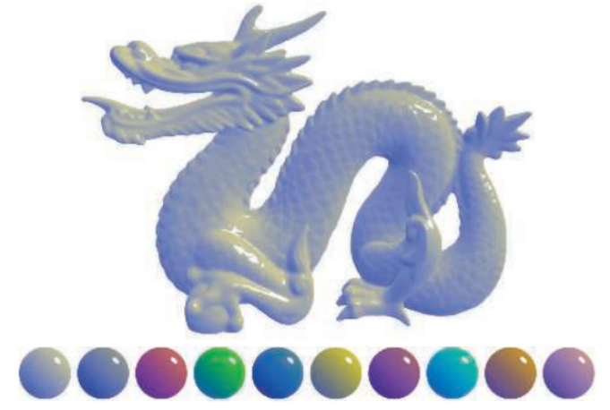

**非真实感渲染(Non-Photorealistic Rendering , NPR )**的一个主要目标是，使用一些渲染方法使得画面达到和某些特殊的绘画风格相似的效果，例如卡通、水彩风格等。

## 1.卡通风格的渲染

卡通风格是游戏中常见的一种渲染风格。使用这种风格的游戏画面通常有一些共有的特点，例如物体都被黑色的线条描边，以及分明的明暗变化等。由日本卡普空(英文名:Capcom)株式会社开发的游戏《大神》(英文名:Okami)就使用了水墨+卡通风格来渲染整个画面。


除了光照模型不同外，卡通风格通常还需要在物体边缘部分绘制轮廓。在之前的章节中，我们曾介绍使用屏幕后处理技术对屏幕图像进行描边。

在本节，我们将会介绍**基于模型的描边方法**，这种方法的实现更加简单，而且在很多情况下也能得到不错的效果。

要实现卡通渲染有很多方法，其中之一就是使用基于色调的着色技术(tone-based shading)。Gooch 等人在他们1998年的一篇论文!中提出并实现了基于色调的光照模型。



在实现中，我们往往会使用漫反射系数对一张一维纹理进行采样，以控制漫反射的色调。我们曾在7.3节使用渐变纹理实现过这样的效果。卡通风格的高光效果也和我们之前学习的光照不同。在卡通风格中，模型的高光往往是一块块分界明显的纯色区域。

### 1.1 渲染轮廓线的方法

在《Real Time Rendering, 3th》一书中，作者把绘制模型轮廓线的方法分成了
5种类型。

* **基于观察角度和表面法线的轮廓线渲染。**这种方法使用视角方向和表面法线的点乘结果来得到轮廓线的信息。这种方法简单快速，可以在一个Pass中就得到渲染结果，但局限性很大，很多模型渲染出来的描边效果都不尽如人意。
* **过程式几何轮廓线渲染。**这种方法的核心是使用**<u>两个Pass</u>**渲染。第一个Pass渲染背面的面片，并使用某些技术让它的轮廓可见;第二个Pass再正常渲染正面的面片。这种方法的优点在于快速有效，并且适用于绝大多数表面平滑的模型，但它的缺点是不适合类似于立方体这样平整的模型。
* **基于图像处理的轮廓线渲染。**我们在第12、13章介绍的边缘检测的方法就属于这个类别。这种方法的优点在于，可以适用于任何种类的模型。但它也有自身的局限所在，一些深度和法线变化很小的轮廓无法被检测出来，例如桌子上的纸张。
* **基于轮廓边检测的轮廓线渲染。**上面提到的各种方法，一个最大的问题是，无法控制轮廓线的风格渲染。对于一些情况,我们希望可以渲染出独特风格的轮廓线,例如水墨风格等。为此，我们希望可以检测出精确的轮廓边，然后直接渲染它们。检测一条边是否是轮廓边的公式很简单，我们只需要检查和这条边相邻的两个三角面片是否满足以下条件:

$$
(n_0 \cdot v > 0) \neq (n_1 \cdot v > 0)
$$


其中，**n0**和**n1**分别表示两个相邻三角面片的法向，v是从视角到该边上任意顶点的方向。上述公式的本质在于检查两个相邻的三角面片是否一个朝正面、一个朝背面。我们可以在几何着色器(Geometry Shader)的帮助下实现上面的检测过程。

当然，这种方法也有缺点，除了实现相对复杂外，它还会有动画连贯性的问题。也就是说，由于是逐帧单独提取轮廓，所以在帧与帧之间会出现跳跃性。

*  **混合上述的几种渲染方法。**例如，首先找到精确的轮边，把模型和轮廓边渲染到纹理中，再使用图像处理的方法识别出轮廓线，并在图像空间下进行风格化渲染。


本节方法中，使用到的是【过程式几何轮廓线渲染】

在第一个Pass中，，我们会使用轮廓线颜色来渲染整个背面的面片，并在视角空间下把模型顶点沿着法线方向向外扩张一段距离：

```
viewPos = viewPos + viewNormal * _Outline;
```

但是直接使用法线外扩展，对于一些内凹的模型，就可能发生背面面片遮住正面面片的情况。为了避免这种情况，我们要：

1）对顶点法线在z分量进行处理，等于一个定值。

2）把法线归一化，然后再对顶点进行扩张。

```
viewNormal.z = -0.5;
viewNormal = normalize(viewNormal);
viewPos = viewPos + viewNormal * _Outline;
```

### 1.2 添加高光

前面提到过，卡通风格中的高光往往是模型上一块块分界明显的纯色区域。为了实现这种效果，我们就不能再使用之前学习的光照模型。

回顾一下，在之前实现 Blinn-Phong 模型的过程中:

法线 dot  1/2（光照方向+视角方向）+ _Gloss

```
float spec = pow(max(0,dot(normal,halfDir)), _Gloss);
```

由于卡通渲染的高光区域是分界明显的纯色区域，我们不能用原先标准的光照自然过渡的样子，而是要把高光截断。具体而言：
1）计算normal和halfDir的结果

2）把该值和一个阈值比较，如果小于该阈值，则高光反射系数为0；否则返回1.

```
float spec = dot(worldNormal,worldHalfDir);
spec = step(threshold, spec);
```

在上面的代码中，我们使用CG的step函数来实现和值比较的目的。step函数接受两个参数，第一个参数是参考值，第二个参数是待比较的数值。如果第二个参数大于等于第一个参数，则返回1，否则返回0。

但是，这种粗暴的判断方法会在高光区域的边界造成锯齿，如图14.3左图所示。出现这种问题的原因在于，高光区域的边缘不是平滑渐变的，而是由0突变到1。要想对其进行抗锯齿处理我们可以在边界处很小的一块区域内，进行平滑处理。代码如下:

```
float spec = dot(worldNormal,worldHalfDir);
spec=lerp(0,1,smoothstep(-w，w，spec-threshold));
```

在上面的代码中，我们没有像之前一样直接使用step函数返回0或1，而是首先使用了CG的 smoothstep函数。其中,w是一个很小的值，当spec-threshold小于-w时，返回0,大于w时,返回1，否则在0到1之间进行插值。这样的效果是，我们可以在[-w,w]区间内，即高光区域的边界处，得到一个从0到1平滑变化的spec值，从而实现抗锯齿的目的。尽管我们可以把w设为一个很小的定值，但在本例中，我们选择使用邻域像素之间的近似导数值，这可以通过CG的fwidth 函数来得到。


#### 扩展：

如果希望随意伸缩，方块化光照区域，可以参考乐乐姐的这篇：

http://blog.csdn.net/candycat1992/article/details/47284289

### ToonShading.shader

1）声明

```
Properties{
// ===固有色===
	_Color ("Color Tint",Color) = (1,1,1,1)
	_MainTex ("Main Tex",2D) = "white" {}
	_Ramp ("Ramp Texture",2D) = "white" {}
// ===描边===
	_Outline ("Outline",Range(0,1)) = 0.1
	_OutlineColor ("Outline Color",Color) = (0,0,0,1)
// ===高光===
	_SpecularColor ("SpecularColor",Color) = (1,1,1,1)
	_SpecularScale ("Specular Scale",Range(0,0.1)) = 0.01
}
```

其中，Ramp是用于控制漫反射色调的渐变纹理，Outline用于控制轮线宽度，OutlineColor对应了轮廓线颜色，Specular是高光反射颜色，SpecularScale 用于控制计算高光反射时使用的阈值。

2）定义渲染轮廓线需要的pass，这个pass只渲染北面的三角面片

```
 SubShader {
		Tags { "RenderType"="Opaque" "Queue"="Geometry"}
		
		Pass {
			NAME "OUTLINE"
			
			Cull Front
```

`Cull Front`使用cull指令把正面的三角面片剔除，只渲染背面。值得注意的是，描边在非真实感渲染中是非常常见的，为该Pass定义名称可以让我们在后面的使用中不需要再重复编写此Pass，而只需要调用它的名字即可。

3）顶点和片元着色器

```
			v2f vert (a2v v) {
				v2f o;
				
				float4 pos = mul(UNITY_MATRIX_MV, v.vertex); 
				float3 normal = mul((float3x3)UNITY_MATRIX_IT_MV, v.normal);  
				normal.z = -0.5;
				pos = pos + float4(normalize(normal), 0) * _Outline;
				o.pos = mul(UNITY_MATRIX_P, pos);
				
				return o;
			}
			
			float4 frag(v2f i) : SV_Target { 
				return float4(_OutlineColor.rgb, 1);               
			}
			
			ENDCG
		}
```

在顶点着色器中我们首先把顶点和法线变换到视角空间下，这是为了让描边可以在观察空间达到最好的效果。随后，我们设置法线的z分量，对其归一化后再将顶点沿其方向扩张，得到扩张后的顶点坐标。对法线的处理是为了尽可能避免背面扩张后的顶点挡住正面的面片。最后，我们把顶点从视角空间变换到裁剪空间。

4）定义光照模型所需要的Pass，以渲染模型的正面。

```
Pass {
			Tags { "LightMode"="ForwardBase" }
			
			Cull Back
		
			CGPROGRAM
		
			#pragma vertex vert
			#pragma fragment frag
			
			#pragma multi_compile_fwdbase
		
```

在上面的代码中，我们将LightMode设置为ForwardBase，指令，这些都是为了让Shader中的光照变量可以被正确赋值。并且使用#pragma语句设置了编译。


5）顶点着色器

```
			v2f vert (a2v v) {
				v2f o;
				
				o.pos = mul( UNITY_MATRIX_MVP, v.vertex);
				o.uv = TRANSFORM_TEX (v.texcoord, _MainTex);
				o.worldNormal  = UnityObjectToWorldNormal(v.normal);
				o.worldPos = mul(_Object2World, v.vertex).xyz;
				
				TRANSFER_SHADOW(o);
				
				return o;
			}
```

在上面的代码中，我们计算了世界空间下的法线方向和顶点位置，并使用Unity提供的内置宏SHADOWCOORDS和TRANSFERSHADOW来计算阴影所需的各个变量。这些宏的实现原理可以参见 9.4节。

6）片元着色器中包含了计算光照模型的关键代码：

```
float4 frag(v2f i) : SV_Target { 
				fixed3 worldNormal = normalize(i.worldNormal);
				fixed3 worldLightDir = normalize(UnityWorldSpaceLightDir(i.worldPos));
				fixed3 worldViewDir = normalize(UnityWorldSpaceViewDir(i.worldPos));
				fixed3 worldHalfDir = normalize(worldLightDir + worldViewDir);
				
				fixed4 c = tex2D (_MainTex, i.uv);
				fixed3 albedo = c.rgb * _Color.rgb;
				
				fixed3 ambient = UNITY_LIGHTMODEL_AMBIENT.xyz * albedo;
				
				UNITY_LIGHT_ATTENUATION(atten, i, i.worldPos);
				
				fixed diff =  dot(worldNormal, worldLightDir);
				diff = (diff * 0.5 + 0.5) * atten;
				
				fixed3 diffuse = _LightColor0.rgb * albedo * tex2D(_Ramp, float2(diff, diff)).rgb;
				
				fixed spec = dot(worldNormal, worldHalfDir);
				fixed w = fwidth(spec) * 2.0;
				fixed3 specular = _Specular.rgb * lerp(0, 1, smoothstep(-w, w, spec + _SpecularScale - 1)) * step(0.0001, _SpecularScale);
				
				return fixed4(ambient + diffuse + specular, 1.0);
			}
```

7）最后为shader设置了合适的fallback

```
	FallBack "Diffuse"
```

类似于cocos 的引擎内，其实已经内置了toon shader，可以快速实现这种二分明确/有描边的卡通渲染。

> 贴图设置问题，如果出现亮部有黑点，是贴图设置问题。
>
> 


微软研究院的Praun等人在2001年的SIGGRAPH 上发表了一篇非常著名的论文。在这篇文章中，他们使用了提前生成的素描纹理来实现实时的素描风格渲染,这些纹理组成了一个色调艺术映射(TonalArt Map,TAM),如图 14.4所示。在图14.4中，从左到右纹理中的笔触逐渐增多，用于模拟不同光照下的漫反射效果，从上到下则对应了每张纹理的多级渐远纹理(mipmaps)。这些多级渐远纹理的生成并不是简单的对上层纹理进行降采样，而是需要保持笔触之间的间隔，以便更真实地模拟素描效果。


**1.**本文简化了论文的操作方式，不需要用mipmap，使用6张纹理即可

```
	Properties {
		_Color ("Color Tint", Color) = (1, 1, 1, 1)
		_TileFactor ("Tile Factor", Float) = 1
		_Outline ("Outline", Range(0, 1)) = 0.1
		_Hatch0 ("Hatch 0", 2D) = "white" {}
		_Hatch1 ("Hatch 1", 2D) = "white" {}
		_Hatch2 ("Hatch 2", 2D) = "white" {}
		_Hatch3 ("Hatch 3", 2D) = "white" {}
		_Hatch4 ("Hatch 4", 2D) = "white" {}
		_Hatch5 ("Hatch 5", 2D) = "white" {}
	}
```

其中， Color 是用于控制模型颜色的属性。 TileFactor 是纹理的平铺系数， TileFactor 越大,模型上的素描线条越密,在实现图14.5的过程中,我们把 TileFactor设置为8。Hatch0至 Hatch5对应了渲染时使用的6张素描纹理，它们的线条密度依次增大。

**2.**由于素描风格往往也需要在物体周围渲染轮廓线，因此我们直接使用14.1节中渲染轮廓

```
SubShader {
		Tags { "RenderType"="Opaque" "Queue"="Geometry"}
		
		UsePass "Unity Shaders Book/Chapter 14/Toon Shading/OUTLINE"
		
```

我们使用 UsePass 命令调用了 14.1节中实现的轮廓线渲染的 Pass,Unity Shaders Book/Chapter14/Toon Shading 对应了14.1 节中 Chapter14-ToonShading 文件里 Shader 的名字，而 Unity 内部会把 Pass的名称全部转成大写格式，所以我们需要在 UsePass 中使用大写格式的 Pass 名称。


3. 下面，我们需要定义光照模型所在的Pass。为了能够正确获取各个光照变量，我们设置了Pass的标签和相关的编译指令

```
	Pass {
			Tags { "LightMode"="ForwardBase" }
			
			CGPROGRAM
			
			#pragma vertex vert
			#pragma fragment frag 
			
			#pragma multi_compile_fwdbase
```


(4)由于我们需要在顶点着色器中计算6张纹理的混合权重，我们首先需要在 v2f结构体中添加相应的变量:

```
			struct v2f {
				float4 pos : SV_POSITION;
				float2 uv : TEXCOORD0;
				fixed3 hatchWeights0 : TEXCOORD1;
				fixed3 hatchWeights1 : TEXCOORD2;
				float3 worldPos : TEXCOORD3;
				SHADOW_COORDS(4)
			};
```

由于一共声明了6张纹理，这意味着需要6个混合权重，我们把它们存储在两个fixed3 类型的变量(hatchWeights0 和 hatchWeights1)中。为了添加阴影效果，我们还声明了 worldPos 变量,并使用 SHADOWCOORDS宏声明了阴影纹理的采样坐标。

5)然后，我们定义了关键的顶点着色器:

```
v2f vert(a2v v) {
				v2f o;
				
				o.pos = UnityObjectToClipPos(v.vertex);
				
				o.uv = v.texcoord.xy * _TileFactor;
				
				fixed3 worldLightDir = normalize(WorldSpaceLightDir(v.vertex));
				fixed3 worldNormal = UnityObjectToWorldNormal(v.normal);
				fixed diff = max(0, dot(worldLightDir, worldNormal));
				
				o.hatchWeights0 = fixed3(0, 0, 0);
				o.hatchWeights1 = fixed3(0, 0, 0);
				
				float hatchFactor = diff * 7.0;
				
				if (hatchFactor > 6.0) {
					// Pure white, do nothing
				} else if (hatchFactor > 5.0) {
					o.hatchWeights0.x = hatchFactor - 5.0;
				} else if (hatchFactor > 4.0) {
					o.hatchWeights0.x = hatchFactor - 4.0;
					o.hatchWeights0.y = 1.0 - o.hatchWeights0.x;
				} else if (hatchFactor > 3.0) {
					o.hatchWeights0.y = hatchFactor - 3.0;
					o.hatchWeights0.z = 1.0 - o.hatchWeights0.y;
				} else if (hatchFactor > 2.0) {
					o.hatchWeights0.z = hatchFactor - 2.0;
					o.hatchWeights1.x = 1.0 - o.hatchWeights0.z;
				} else if (hatchFactor > 1.0) {
					o.hatchWeights1.x = hatchFactor - 1.0;
					o.hatchWeights1.y = 1.0 - o.hatchWeights1.x;
				} else {
					o.hatchWeights1.y = hatchFactor;
					o.hatchWeights1.z = 1.0 - o.hatchWeights1.y;
				}
				
				o.worldPos = mul(unity_ObjectToWorld, v.vertex).xyz;
				
				TRANSFER_SHADOW(o);
				
				return o; 
			}
```

我们首先对顶点进行了基本的坐标变换。然后，使用TileFactor 得到了纹理采样坐标。在计算6张纹理的混合权重之前，我们首先需要计算逐顶点光照。因此，我们使用世界空间下的光照方向和法线方向得到漫反射系数 diff。

之后,我们把权重值初始化为0,并把 diff缩放到[0,7]范围，得到 hatchFactor。

我们把[0,7]的区间均匀划分为7个子区间，通过判断 hatchFactor 所处的子区间来计算对应的纹理混合权重。

最后，我们计算了顶点的世界坐标，并使用TRANSFERSHADOW宏来计算阴影纹理的采样坐标。

6.片元着色器

```
fixed4 frag(v2f i) : SV_Target {			
				fixed4 hatchTex0 = tex2D(_Hatch0, i.uv) * i.hatchWeights0.x;
				fixed4 hatchTex1 = tex2D(_Hatch1, i.uv) * i.hatchWeights0.y;
				fixed4 hatchTex2 = tex2D(_Hatch2, i.uv) * i.hatchWeights0.z;
				fixed4 hatchTex3 = tex2D(_Hatch3, i.uv) * i.hatchWeights1.x;
				fixed4 hatchTex4 = tex2D(_Hatch4, i.uv) * i.hatchWeights1.y;
				fixed4 hatchTex5 = tex2D(_Hatch5, i.uv) * i.hatchWeights1.z;
				fixed4 whiteColor = fixed4(1, 1, 1, 1) * (1 - i.hatchWeights0.x - i.hatchWeights0.y - i.hatchWeights0.z - 
							i.hatchWeights1.x - i.hatchWeights1.y - i.hatchWeights1.z);
				
				fixed4 hatchColor = hatchTex0 + hatchTex1 + hatchTex2 + hatchTex3 + hatchTex4 + hatchTex5 + whiteColor;
				
				UNITY_LIGHT_ATTENUATION(atten, i, i.worldPos);
								
				return fixed4(hatchColor.rgb * _Color.rgb * atten, 1.0);
			}
```

7.合适的fallback

```
Fallback “Diffuse”
```


