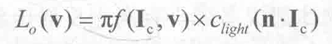
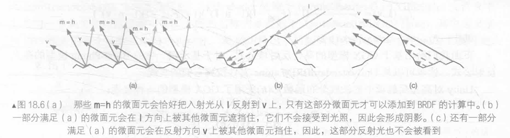
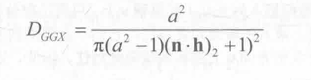

# 第18章 基于物理的渲染

在之前的章节中，我们学习了Lambert光照模型、Phong光照模型和Blinn-Phong光照模型。但这些光照模型的缺点在于，它们都是经验模型。如果我们需要渲染更高质量的画面，这些经验模型就显得不再能满足我们的要求了。

近年来，基于物理的渲染技术（Physically Based Shading，PBS）被逐渐应用于实时渲染中。总体来说，PBS是为了对光和材质之间的行为进行更加真实的建模。PBS早已被广泛应用到电影行业中，但游戏中的PBS是近年来才逐渐流行起来的。Unity最早在2012年的《蝴蝶效应》（英文名：Butterfly Effect）的demo中大量使用了PBS，并在Unity5中正式将PBR引入到引擎渲染中。Unity5引入了一个名为Standard Shader的可在不同材质之间通用的着色器，而该着色器就是使用了基于物理的光照模型。需要注意的是，PBS并不意味着渲染出来的画面一定是像照片一样真实的，例如，Pixar和Disney尽管长期使用PBS渲染电影画面，但它们得到的风格是非常有特色的艺术风格。相信很多读者或多或少看到过使用PBS渲染出来的画面是多么的酷炫，并很想了解这背后的技术原理。如果你是一个程序员，可能有很大的冲动想要自己实现一个PBS渲染框架，但往往走到后面会发现有很多看不懂的名词以及一大堆与之相关的论文：如果你是一个美工人员，你可能会找到很多关于如何制作PBS中使用的纹理教程，但你大概也了解，想要使用PBS实现出色的渲染效果，并不是纹理+一个shader这么简单的问题。

现在，我们有一个好消息和一个坏消息要告诉大家。先说好消息，Unity5引入的基于物理的渲染不需要我们过多地了解PBS是如何实现的，就能利用各种内置工具来实现一个不错的渲染效果。然而坏消息是，我们很难通过短短几段文字来非常详细地告诉读者这些渲染到底是如何实现的，因为这其中需要牵扯许多复杂的光照模型，如果要完全理解每一种模型的话，大概还要讲很多论文和其他参考文献。不过还有一个好消息是，我们相信读者在学完本章后可以了解一些PBS的原理，如果你对PBS有着浓厚的兴趣，想要尝试自己构建一个PBS的渲染框架，可以在本章的扩展阅读部分找到许多非常有价值的参考资料。

在本章中，我们首先会讲解PBS的基本原理，让读者了解它们与我们之前所学的渲染方式到底有哪些不同。尽管本书的定位并不是“教你如何使用Unity”，但我们决定花一点时间来告诉读者Unity5引入的Standard Shader是如何工作的，以及如何在Unity5中使用它和其他工具来搭建一个场景，我们希望通过这些内容来让读者明白PBS中的一些关键因素。尽管PBS在手机上的应用并不十分广泛，但我们相信这是未来的发展趋势，希望本章可以为读者打开PBS的大门。

## 18.1 PBS的理论和数学基础

在学习如何实现PBS之前，我们非常有必要来了解基于物理的渲染所基于的理论和数学基础。我们不会过多地牵扯一些论文资料，但如果在阅读过程中读者发现无法理解一些光照模型的实现原理，这可能意味着你需要阅读更多的参考文献。本节主要参考了Naty Hoffman在SIGGRAPH2013上做的名为Background: Physics and Math of Shading的演讲[1]。

### 18.1.1 光是什么

尽管我们之前一直讲光照模型，但要问读者，光到底是什么，可能没有多少人可以解释清楚。在物理学中，光是一种电磁波。首先，光由太阳或其他光源中被发射出来，然后与场景中的对象相交，一些光线被吸收（absorption），而另一些则被散射（scattering），最后光线被一个感应器（例如我们的眼睛）吸收成像。

通过上面的过程，我们知道材质和光线相交会发生两种物理现象：散射和吸收（其实还有自发光现象）。光线会被吸收是由于光被转化成了其他能量，但吸收并不会改变光的传播方向。相反的，散射则不会改变光的能量，但会改变它的传播方向。在光的传播过程中，影响光的一个重要的特性是材质的折射率（refractive index）。我们知道，在均匀的介质中，光是沿直线传播的。但如果光在传播时介质的折射率发生了变化，光的传播方向就会发生变化。特别是，如果折射率是突变的，就会发生光的散射现象。

实际上，在现实生活中，光和物体之间的交互过程是非常复杂的，大多数情况下并不存在一种可分析的解决方法。但为了在渲染中对光照进行建模，我们往往只考虑一种特殊情况，即只考虑两个介质的边界是无限大并且是光学平滑（optically flat）的。尽管真实物体的表面并不是无限延伸的，也不是绝对光滑的，但和光的波长相比，它们的大小可以被近似认为是无限大以及光学平滑的。在这样的前提下，光在不同介质的边界会被分割成两个方向：反射方向和折射方向。而有多少百分比的光会被反射（另一部分就是被折射了）则是由菲涅耳等式（Fresnel equations）来描述的，如图18.1所示。

但是，这些与光线的交界处真的是像镜子一样平坦吗？尽管在上面我们已经说过，相对于光的波长来说，它们的确可以被认为是光学平坦的。但是，如果想象我们有一个高倍放大镜，去放大这些被照亮的物体表面，就会发现有很多之前肉眼不可见的凹凸不平的平面。在这种情况下，物体的表面和光照发生的各种行为，更像是一系列微小的光学平滑平面和光交互的结果，其中每个小平面会把光分割成不同的方向。

这种建立在微表面的模型更容易解释为什么有些物体看起来粗糙，而有些看起来就平滑，如图18.2所示。想象我们用一个放大镜去观察一个光滑物体的表面，尽管它的表面仍然由许多凹凸不平的微表面构成，但这些微表面的法线方向变化角度小，因此，由这些表面反射的光线方向变化也比较小，如图18.2左图所示，这使得物体的高光反射更加清晰。而图18.2右图所示的粗糙表面则相反，由此得到的高光反射效果更模糊。

在下面的内容中，我们并没有讨论那些被微表面折射的光。这些光被折射到物体的内部，一部分被介质吸收，一部分又被散射到外部。金属材质具有很高的吸收系数，因此，所有被折射的光往往会被立刻吸收，被金属内部的自由电子转化成其他形式的能量。而非金属材质则会同时表现出吸收和散射两种现象，这些被散射出去的光又被称为次表面散射光（subsurface-scattered light）。在图18.3中，我们给出了一条由微表面折射的光的传播路径（实际反射面可看到监线）。

现在，我们把放大镜从物体表面拿开，继续从渲染的层级大小上考虑光与表面一点的交互行为。那么，由微表面反射的光可以被认为是该点上一些方向变化不大的反射光，如图18.4中的黄线所示。而折射光线（蓝线）则需要更多的考虑。那些次表面散射光会从不同于入射点的位置从物体内部再次射出，如图18.4左图所示。而这些离入射点的距离值和像素大小之间的关系会产生两种建模结果。如果像素要大于这些散射距离的话，意味着这些次表面散射产生的距离可以被忽略，那我们的渲染就可以在局部进行，如图18.4右图所示。如果像素要小于这些散射距离，我们就不可以选择忽略它们了，要实现更真实的次表面散射效果，我们需要使用特殊的渲染模型，也就是所谓的次表面散射渲染技术。

我们下面的内容均建立在不考虑次表面散射的距离，而完全使用局部着色渲染的前提下。

### 18.1.2 双向反射分布函数（BRDF）

在了解了上面的理论基础后，我们现在来学习如何用数学表达式来表示上面的光照模型。这意味着，我们要对光这个看似抽象的概念进行量化。

我们可以用辐射率（radiance）来量化光。辐射率是单位面积、单位方向上光源的辐射通量，通常用L来表示，被认为是对单一光线的亮度和颜色评估。在渲染中，我们通常会基于表面的入射光线的入射辐射率L来计算出射辐射率Lo，这个过程也往往被称为是着色（shading）过程。而要得到出射辐射率Lo，我们需要知道物体表面一点是如何和光进行交互的。而这个过程就可以使用BRDF（Bidirectional Reflectance Distribution Function，中文名称为双向反射分布函数）来定量分析。大多数情况下，BRDF可以用f(I,V)来表示，其中I为入射方向，V为观察方向（双向的含义）。这种情况下，绕着表面法线旋转入射方向或观察方向并不会影响BRDF的结果，这种BRDF被称为是各项同性（isotropic）的BRDF。与之对应的则是各向异性（anisotropic）的BRDF。

那么，BRDF到底表示的含义是什么呢？BRDF有两种理解方式——第一种理解是，当给定入射角度后，BRDF可以给出所有出射方向上的反射和散射光线的相对分布情况；第二种理解是，当给定观察方向（即出射方向）后，BRDF可以给出从所有入射方向到该出射方向的光线分布。一个更直观的理解是，当一束光线沿着入射方向I到达表面某点时，f(I,V)表示了有多少部分的能量被反射到了观察方向V上。

据此，我们给出基于物理渲染的技术中，第一个重要的等式——反射等式（reflection equation）：

反射等式实际上是渲染方程的一个特殊情况，但它是基于物理基础的。尽管上面的式子看起来有些复杂，但很好理解，即给定观察视角V，该方向上的出射辐射率Lo(V)等于所有入射方向的辐射率积分乘以它的BRDF值f(I,V)，再乘以一个余弦值（n·I）。如果积分的概念对某些读者来说难以理解，我们使用更简单的方式来理解。想象我们现在要计算表面上某点的出射辐射率，我们知道该点的观察方向，该点的出射辐射率是由从许多不同方向的入射辐射率叠加后的结果。其中，BRDF表示了不同方向的入射光在该观察方向上的权重分布。我们把这些不同方向的光辐射率（Li(I)部分）乘以观察方向上所占的权重（f(I,V)部分），再乘以它们在该表面的投影结果（(n·I)部分），最后再把这些值加起来（即做积分）就是最后的出射辐射率。

在游戏渲染中，我们通常和一些精确光源（punctual light sources）打交道的，而不是计算所有入射光线在半球面上的积分。精确光源指的是那些方向确定、大小为无限小的光源，例如，常见的点光源、聚光灯等。我们使用I来表示它的方向，使用C_light表示它的颜色。使用精确光源的最大的好处在于，我们可以大大简化上面的反射等式。这里省略推导过程（有兴趣的读者可以阅读参考文献[1]），直接给出结论，即对于一个精确光源，我们可以使用下面的等式来计算它在某个观察方向V上的出射辐射率：

和之前使用积分形式的原始反射等式相比，上面的式子使用一个特定的BRDF值来代替积分操作，这大大简化了计算。如果场景中包含了多个精确光源，我们可以把它们分别代入上面的式子进行计算，然后把它们的结果相加即可。

下面，我们来看一下反射等式中的重要组成部分——BRDF是如何得到的。可以看出，BRDF决定了着色过程是否是基于物理的。这可以由BRDF是否满足两个特性来判断：它是否满足交换律（reciprocity）和能量守恒（energy conservation）。

交换律要求当交换I和V的值后，BRDF的值不变，即：
$$
f(I,V) = f(V,I)
$$
而能量守恒则要求表面反射的能量不能超过入射的光能，即：

基于这些理论，BRDF可以用于描述两种不同的物理现象：表面反射和次表面散射。针对每种现象，BRDF通常会包含一个单独的部分来描述它们——用于描述表面反射的部分被称为高光反射项（specular term），以及用于描述次表面散射的漫反射项（diffuse term），如图18.5所示。

### 18.1.3 漫反射项

我们之前所学习的Lambert模型就是最简单、也是应用最广泛的漫反射BRDF。准确的Lambertian BRDF的表示为：

其中，C_diff表示漫反射光线所占的比例，它也通常被称为是漫反射颜色（diffuse color）。与我们之前讲过的Lambert光照模型不太一样的是，上面的式子实际上是一个定值，我们常见到的余弦（即(n·I)）因子部分实际是反射等式的一部分，而不是BRDF的部分。上面的式子之所以要除以π，是因为我们假设漫反射在所有方向上的强度都是相同的，而BRDF要求在半球内的积分值为1。因此，给定入射方向I的光源在表面某点的出射漫反射辐射率为：

Lambert模型虽然简单，但很多基于物理的渲染选择使用了更复杂的漫反射项来模拟次表面散射的结果。例如，在Disney使用的BRDF[2]中，它的漫反射项为：

其中，F_D90 = 0.5 + 2 × roughness × (h·I)²

在Disney的实现中，baseColor是表面颜色，通常由纹理采样得到，roughness是表面的粗糙度。上面的漫反射项既考虑了在掠射角（glancing angles）漫反射项的能量变化，还考虑了表面的粗糙度对漫反射的影响。而上面的式子也正是Unity5内部使用的漫反射项。

### 18.1.4 高光反射项

在现实生活中，几乎所有的物体都或多或少有高光反射现象。John Hable在他的文章中就强调了Everything is Shiny。但在许多传统的shader中，很多材质只考虑了漫反射效果，而并没有添加高光反射，这使得渲染出来的画面并不那么真实可信。在基于物理的渲染中，BRDF中的高光反射项大多数都是建立在微面元理论（microfacet theory）的假设上的。微面元理论认为，物体表面实际是由许多人眼看不到的微面元组成的，虽然物体表面并不是光学平滑的，但这些微面元可以被认为是光学平滑的，也就是说它们具有完美的高光反射。当光线和物体表面一点相交时，实际上是和一系列微面元交互的结果。正如我们在18.1.1节中看到的，当光和这些微面元相交时，光线会被分割成两个方向——反射方向和折射方向。这里我们只需要考虑被反射的光线，而折射光线已经在之前的漫反射项中考虑过了。当然，微面元理论也仅仅是真实世界的散射的一种近似理论，它也有自身的缺陷，仍然有一些材质是无法使用微面元理论来描述的。

假设表面法线为n，这些微面元的法线m并不都等于n，因此，不同的微面元会把同一入射方向的光线反射到不同的方向上。而当我们计算BRDF时，入射方向I和观察方向V都会被给定，这意味着只有一部分微面元反射的光线才会进入到我们的眼睛中，这部分微面元会恰好把光线反射到方向V上，即它们的法线m等于I和V的一半，也就是我们一直看到的半角度矢量h（half-angle vector，也被称为half vector），如图18.6（a）所示。

然而，这些m=h的微面元反射也并不会全部添加到BRDF的计算中。这是因为，它们其中一部分会在入射方向I上被其他微面元挡住（shadowing），如图18.6（b）所示，或是在它们的反射方向V上被其他微面元挡住了（masking），如图18.6（c）所示。微面元理论认为，所有这些被遮挡住的微面元不会添加到高光反射项的计算中（实际上它们中的一些由于多次反射仍然会被我们看到，但这不在微面元理论的考虑范围内）。

基于微面元理论的这些假设，BRDF的高光反射项可以用下面的形式来表示：

这就是著名的Torrance-Sparrow微面元模型[5]。上面的式子看起来难以理解，实际上其中的各个项对应了我们之前讲到的不同现象。D(h)是微面元的法线分布函数（normal distribution function，NDF），它用于计算有多少比例的微面元的法线满足m=h，只有这部分微面元才会把光线从I方向反射到V上。G(I,V,h)是阴影-遮掩函数（shadowing-masking function），它用于计算那些满足m=h的微面元中有多少会由于遮挡而不会被人眼看到，因此它给出了活跃的微面元（active microfacets）所占的浓度，只有活跃的微面元才会成功地把光线反射到观察方向上。F(I,h)则是这些活跃微面元的菲涅耳反射（Fresnel reflectance）函数，它可以告诉我们每个活跃的微面元会把多少入射光线反射到观察方向上，即表示了反射光线占入射光线的比率。事实上，现实生活中几乎所有的物体都会表现出菲涅耳现象，读者可以在一篇很有意思的文章Everything has Fresnel中看到一些这样的例子。最后，分母4(n·I)(n·V)是用于校正从微面元的局部空间到整体宏观表面数量差异的校正因子。

这些不同的部分又可以衍生出很多不同的BRDF实现。例如，我们之前学习的Blinn-Phong模型就是一种非常简单的模型，它使用的法线分布函数D(h)为：

但实际上Blinn-Phong模型并不能真实地反映很多真实世界中物体的微面元法线反射分布，因此，很多更加复杂的分布函数被提了出来，例如GGX[3]、Beckmann[4]等。同样，阴影-遮掩函数G(I,V,h)也有很多相关工作被提了出来，例如Smith模型[6]。这些数学模型都是为了更加接近使用光学测量仪器测量出来的真实物体的反射分布数据。

尽管存在很多基于物理的BRDF模型，但在真实的电影或游戏制作中，我们希望在直观性和物理可信度之间找到一个平衡点，使得实现的BRDF既可以让美工人员直观地调节各个参数，而又有一定的物理可信度。当然，有时候为了满足直观性我们不得不牺牲一定的物理特性，得到的BRDF可能不是严格基于物理原理的。

在下面的内容中，我们给出Unity5使用的实现。

### 18.1.5 Unity中的PBS实现

在之前的内容中，我们提到了Unity5的PBS实际上是受Disney的BRDF[2]的启发。这种BRDF最大的好处之一就是很直观，只需要提供一个万能的shader就可以让美工人员通过调整少量参数来渲染绝大部分常见的材质。我们可以在Unity内置的UnityStandardBRDF.cginc文件中找到它的实现。

总体来说，Unity5一共实现了两种PBS模型。一种是基于GGX模型的，另一种则是基于归一化的Blinn-Phong模型的。这两种模型使用了不同的公式来计算高光反射项中的法线分布函数D(h)和阴影-遮掩函数G(I,V,h)。在默认情况下，Unity5使用基于归一化后的Blinn-Phong模型来实现基于物理的渲染（尽管很多引擎选择使用GGX模型）。

如前面所讲，Unity使用的BRDF中的漫反射项使用的公式如下：

其中，F_D90 = 0.5 + 2 × roughness × (h·I)²

下面我们给出基于GGX模型的高光反射项公式。对于基于归一化的Blinn-Phong模型的高光反射公式，读者可以从UnityStandardBRDF.cginc文件找到它们的实现。

Unity对高光反射项中的法线分布函数D(h)采用了GGX模型的一种实现：

其中，α = roughness²

阴影-遮掩函数G(I,V,h)则使用了一种由GGX衍生出的Smith-Schlick模型：
$$
G(I,V,h) = 1 / (((n·I) × (1 - k) + k) × ((n·V) × (1 - k) + k))
$$
其中，k = roughness² / 2

而菲涅耳反射F(I,h)则使用了图形学中经常使用的Schlick菲涅耳近似等式：

其中F0表示高光反射系数，在Unity中往往指的就是高光反射颜色。

上面的公式对于某些读者来说可能晦涩难懂，实际上，这些数学大多来源于对真实世界中各种物体的BRDF的分析，再使用不同的数学模型进行逼近。如果读者想要深入了解基于物理的渲染的数学原理和应用的话，可以参见本章的扩展阅读部分。

幸运的是，在Unity中我们不需要自己在shader中实现上面的公式，Unity已经为我们提供了现成的基于物理着色的shader，也就是Standard Shader。

## 18.2 Unity5的Standard Shader

当我们在Unity5中新创建一个模型或是新创建一个材质时，其默认使用的着色器都是一个名为Standard的着色器。这个Standard Shader就使用了我们之前所讲的基于物理的渲染。

Unity支持两种流行的基于物理的工作流程：金属工作流（Metallic workflow）和高光反射工作流（Specular workflow）。其中，金属工作流是默认的工作流程，对应的Shader为Standard Shader。而如果想要使用高光反射工作流，就需要在材质的Shader下拉框中选择Standard（Specular setup）。需要注意的是，通常来讲，使用不同的工作流可以实现相同的效果，只是它们使用的参数不同而已。金属工作流也不意味着它只能模拟金属类型的材质，金属工作流的名字来源于它定义了材质表面的金属值（是金属类型的还是非金属类型的）。高光反射工作流的名字来源于它可以直接指定表面的高光反射颜色（有很强的高光反射还是很弱的高光反射）等，而在金属工作流中这个颜色需要由漫反射颜色和金属值衍生而来。在实际的游戏制作过程中，我们可以选择自己更偏好的工作流来制作场景，这更多的是个人喜好的问题。当然也可以同时混用两种工作流。

在下面的内容中，我们用Standard Shader来统称Standard和Standard（Specular setup）着色器。Unity提供的Standard Shader允许让我们只使用这一种shader来为场景中所有的物体进行着色，而不需要考虑它们是否是金属材质还是塑料材质等，从而大大减少我们不断调整材质参数所花费的时间。

### 18.2.1 它们是如何实现的

Standard和Standard（Specular setup）的Shader源代码可以在Unity内置的builtin_shaders-5.x/DefaultResourcesExtra文件夹中找到，这些shader依赖于builtin_shaders-5.x/CGIncludes文件夹中定义的一些头文件。这些相关的头文件的名称大多类似于UnityStandardXXX.cginc，其中定义了和PBS相关的各个函数、结构体和宏等。表18.1列出了这些头文件的名称以及它们的主要用处。

**表18.1**

| 文件                          | 描述                                                         |
| ----------------------------- | ------------------------------------------------------------ |
| UnityPBSLighting.cginc        | 定义了表面着色器使用的标准光照函数和相关的结构体等，如LightingStandardSpecular函数和SurfaceOutputStandardSpecular结构体 |
| UnityStandardCore.cginc       | 定义了Standard和Standard（Specular setup）Shader使用的顶点/片元着色器和相关的结构体、辅助函数等，如vertForwardBase、fragForwardBase、MetallicSetup、SpecularSetup函数和VertexOutputForwardBase、FragmentCommonData结构体 |
| UnityStandardBRDF.cginc       | 实现了Unity中基于物理的渲染技术，定义了BRDF1_Unity_PBS、BRDF2_Unity_PBS和BRDF3_Unity_PBS等函数，来实现不同平台下的BRDF |
| UnityStandardInput.cginc      | 声明了Standard Shader使用的相关输入，包括shader使用的属性和顶点着色器的输入结构体VertexInput，并定义了基于这些输入的辅助函数，如TexCoords、Albedo、Occlusion、SpecularGloss等函数 |
| UnityStandardUtils.cginc      | Standard Shader使用的一些辅助函数，将来可能会移到UnityCG.cginc文件中 |
| UnityStandardConfig.cginc     | 对Standard Shader的相关配置，例如默认情况下关闭简化版的PBS实现（将UNITY_STANDARD_SIMPLE设为0），以及使用基于归一化的Blinn-Phong模型而非GGX模型来实现BRDF（将UNITY_BRDF_GGX设为0） |
| UnityStandardMeta.cginc       | 定义了Standard Shader中“LightMode”为“Meta”的Pass（用于提取光照纹理和全局光照的相关信息）使用的顶点/片元着色器，以及它们使用的输入/输出结构体 |
| UnityStandardShadow.cginc     | 定义了Standard Shader中“LightMode”为“ShadowCaster”的Pass（用于投射阴影）使用的顶点/片元着色器，以及它们使用的输入/输出结构体 |
| UnityGlobalIllumination.cginc | 定义了和全局光照相关的函数，如UnityGlobalIllumination函数    |

我们可以打开Standard.shader和StandardSpecular.shader文件来分析Unity是如何实现基于物理的渲染的。总体来讲，这两个shader的代码基本相同——它们都定义了两个SubShader，第一个SubShader使用的计算更加复杂，主要针对非移动平台（通过`#pragma exclude_renderers gles`来排除GLES平台），并定义了前向渲染路径和延迟渲染路径使用的Pass，以及用于投射阴影和提取元数据的Pass；第二个SubShader定义了4个Pass，其中两个Pass用于前向渲染路径，一个Pass用于投射阴影，另一个Pass用于提取元数据，该SubShader主要针对移动平台。

Standard.shader和StandardSpecular.shader最大的不同之处在于，它们在设置BRDF的输入时使用了不同的函数来设置各个参数——基于金属工作流的Standard Shader使用MetallicSetup函数来设置各个参数，基于高光反射工作流的Standard（Specular setup）Shader使用SpecularSetup函数来设置。MetallicSetup和SpecularSetup函数均在UnityStandardCore.cginc文件中被定义。图18.7给出了Standard Shader中用于前向渲染路径的典型实现，这是由对内置文件的分析所得。

从图18.7中可以看出，两个Pass的代码大体相同，只是ForwardBase Pass进行了更多的光照计算，例如，计算全局光照、自发光等效果，这些计算只需要在物体的整个渲染过程中计算一次即可，因此不需要在ForwardAdd Pass中再计算一次，这与我们之前学习前向渲染时的经验一致。

### 18.2.2 如何使用Standard Shader

我们之前提到，Unity5的Standard Shader适用于各种材质的物体，但是，我们应该如何使用Standard Shader来得到不同的材质效果呢？

我们首先来回答一个问题，为什么不同的材质看起来是如此不同呢？这需要回顾我们在18.1节讲到的内容。我们知道，材质和光的交互可以分成漫反射和高光反射两个部分，其中漫反射对应了次表面散射的结果，而高光反射则对应了表面反射的结果。通过对金属材质和非金属材质的分析，我们可以得到它们的漫反射和高光反射的一些特点。

1. 金属材质
   - 几乎没有漫反射，因为所有被吸收的光都会被自由电子立刻转化为其他形式的能量
   - 有非常强烈的高光反射
   - 高光反射通常是有颜色的，例如金子的反光颜色为黄色

2. 非金属材质
   - 大多数角度高光反射的强度比较弱，但在掠射角时高光反射强度反而会增强，即菲涅耳现象
   - 高光反射的颜色比较单一
   - 漫反射的颜色多种多样

但真实的材质大多混合了上面的这些特性，Unity提供的工作流就是为了更加方便地让我们针对以上特性来调整材质效果。在Unity官方提供的示例项目ShaderCalibrationScene（https://www.assetstore.unity3d.com/en/#!/content/25422）中，Unity提供了两个非常有参考价值的校准表格，如图18.8所示，它们分别对应了金属工作流和高光反射工作流使用的参考属性值，来方便我们针对不同类型的材质来调整参数。读者也可以在本书资源的Assets/Textures/Chapter18/Charts文件夹找到这两张校准表格。

我们以图18.8的左图，即金属工作流使用的校准表格为例，来解释如何使用这张校准表格来指导我们调整材质。在本书资源的场景文件Scene_18_2中，我们提供了一个简单的场景来展示不同材质的结果。图18.9显示了场景结果以及物体使用的材质。需要注意的是，读者需要在Edit→Project Settings→Player→Other Settings→Color Space中选择Linear才可以得到和图18.9中相同的效果，这是因为基于物理的渲染需要使用线性空间（详见18.3.4节）来进行相关计算。

在金属工作流中，材质面板中的Albedo定义了物体的整体颜色，它通常就是我们视觉上认为的物体颜色。从亮度来看，非金属材质的亮度范围通常在50~243之间，而金属材质的亮度一般在186~255之间。Unity给的校准表格（见图18.8中的左图）中还给出了一些非金属材质和金属材质使用的示例Albedo属性值，我们可以直接使用这些示例值来作为材质属性。当然，也可以直接使用一张纹理作为材质的Albedo值。在我们的例子中，我们把金属材质（图18.9中的左边的球体）的Albedo设为银灰色，而把塑料材质（图18.9中的右边的球体）的设为蓝绿色。材质面板中的下一个属性是Metallic，它定义了该物体表面看起来是否更像金属或非金属。同样，我们也可以使用一张纹理来采样得到表面的Metallic值，此时该纹理中的R通道值将对应了Metallic值。在我们的例子中，我们把金属材质的Metallic值设为1，表明该物体几乎完全是一个金属材质，同时把塑料材质的Metallic值设为0，表明该物体几乎没有任何金属特性。最后一个重要的材质属性是Smoothness，它是上一个属性Metallic的附属值，定义了从视觉上来看该表面的光滑程度。如果我们在设置Metallic属性时使用的是一张纹理，那么这张纹理的A通道就对应了表面的Smoothness值（此时纹理的GB通道则被忽略）。在我们的例子中，我们把金属材质的Smoothness值设置为相对较大的0.7，表明该金属表面比较光滑，而把塑料材质的Smoothness值设为0.4，表明该塑料表面比较粗糙。

高光反射工作流使用的面板和上述金属工作流使用的基本相同，只是使用了不同含义的Albedo属性，并使用Specular代替了上述的Metallic属性。在高光反射工作流中，材质的Albedo属性定义了表面的漫反射强度。对于非金属材质，它的值通常仍然是视觉上认为的物体颜色，但对于金属材质，Albedo的值通常非常接近黑色（还记得吗，金属材质几乎不存在次表面散射的现象）。高光反射工作流的Specular属性则定义了表面的高光反射强度。非金属材质通常使用一个灰度值范围在0～55的深灰色来作为Specular值，表明非金属材质的高光反射较弱。金属材质则通常会使用视觉上认为的该金属的颜色作为它的Specular值。Specular属性同样也有一个子属性Smoothness，它定义了从视觉上来看该表面的光滑程度。和上面的金属工作流类似，如果使用了一张纹理来为Specular属性赋值，那么纹理的RGB通道对应了Specular属性值，A通道对应了Smoothness属性值。

上述材质属性都属于材质面板中的Main Maps部分，除了上述提到的属性外，Main Maps还包含了其他材质属性，例如，切线空间下的法线纹理、遮挡纹理、自发光纹理等。Main Maps部分的下面还有一个Secondary Maps的属性部分，这个部分的属性是用来定义额外的细节信息，这些细节通常会直接绘制在Main Maps的上面，来为材质提供更多的微表面或细节表现。

除了上述属性，我们还可以为Standard Shader选择它使用的渲染模式，即材质面板上的Render Mode选项。Standard Shader支持4种渲染模式，分别是Opaque、Cutout、Fade和Transparent。其中，Opaque用于渲染最常见的不透明物体，这也是默认的渲染模式。对于像玻璃这样的材质，我们可以选择Transparent模式，在这个渲染模式下，Albedo属性的A通道用于控制材质的透明度。而在Cutout渲染模式下，Albedo属性中纹理的A通道会成为一个掩码纹理，而它的子属性Alpha Cutoff将是透明度测试时使用的阈值。Fade模式和Transparent模式是类似的，不同的是：在Transparent模式下，当材质的透明值不断降低时，它的反射仍然能被保留，而在Fade模式下，该材质的所有渲染效果都会逐渐从屏幕上淡出。

需要注意的是，尽管Standard Shader的材质面板有许多可供调节的属性，但我们不用担心由于没有使用一些属性而会对性能有所影响。Unity在背后已经进行了高度优化，在我们生成可执行程序时，Unity会检查哪些属性没有被使用到，同时也会针对目标平台进行相应的优化。

从上面的内容可以看出，要想得到可信度更高的渲染结果，我们需要对不同材质使用合适的属性值，尤其是一些重要的属性值，例如Albedo、Metallic和Specular。当然，想要让整个场景的渲染结果令人满意，尤其包含了复杂光照的场景，仅仅有这些使用了PBS的材质是不够的，我们需要使用Unity提供的其他一些重要的技术，例如HDR格式的Skybox、全局光照、反射探针、光照探针、HDR和屏幕后处理等。

## 18.3 一个更加复杂的例子

在本章最后，我们将以一个更加复杂的、基于物理渲染的场景结束，该场景对应了本书资源中的Scene_18_3。本场景使用的元素大多来源于Unity官方的示例项目Viking Village（https://www.assetstore.unity3d.com/jp/#!/content/29140），读者可以下载完整的项目来更加深入地学习Unity中的PBS。

图18.10展示了在不同光照条件下本例实现的效果。需要注意的是，读者需要在Edit→Project Settings→Player→Color Space中选择Linear才可以得到和图18.9中相同的效果，这是因为基于物理的渲染需要使用线性空间（详见18.3.4节）来进行相关计算。

那么，基于物理的Standard Shader是如何与其他Unity功能相互配合得到这样的场景呢？

### 18.3.1 设置光照环境

我们首先需要为场景设置光照环境。在默认情况下，Unity5中一个新创建的场景会包含一个默认的Skybox。在本例中，我们使用一个自定义的Skybox来代替默认值。做法是，打开Window→Lighting，在Scene标签页下把本例使用的SunsetSkyboxHDR拖曳到Skybox选项中，如图18.11所示。

本例中的Skybox使用了一个HDR格式的Cubemap，这与我们之前在10.1节中制作Skybox时使用的纹理不同。这需要解释HDR（High Dynamic Range）的相关知识，我们将在18.4.3节更加详细地介绍HDR的原理和应用。但在这里，我们只需要知道，使用HDR格式的Skybox可以让场景中物体的反射更加真实，有利于我们得到更加可信的光照效果。

我们还可以设置场景使用的环境光照，这些环境光照可以对场景中所有的物体表面产生影响，在图18.11所示的设置面板中，我们可以选择环境光照的来源（Ambient Source选项），是来自于场景使用的Skybox，还是使用渐变值，亦或是某个固定的颜色。我们还可以设置环境光照的强度（Ambient Intensity参数），如果想要场景中的所有物体不接受任何环境光照，可以把该值设为0。在使用了Standard Shader的前提下，如果我们关闭场景中所有的光源，并把环境光照的强度设为0，场景中的物体仍然可以接受一些光照，如图18.12中的左图所示。

那么，这些光照是从哪里来的呢？答案就是反射。默认的反射源（Reflection Source选项）是场景使用的Skybox。如果我们不想让场景中的物体接受任何默认的反射光照，可以把反射源设置为自定义（即Custom），并把自定义的Cubemap保留为空即可（另一种方式是直接把场景使用的Skybox设为空），如图18.12右图所示。但为了得到更加逼真的渲染结果，我们通常是不会这样做的。在渲染实现上，即便场景中没有任何光源，Unity在内部仍然会调用ForwardBase Pass（假设使用的是前向渲染路径的话），并使用反射的光照信息来填充光源信息，再进行基于物理的渲染计算。读者可以通过帧调试器（Frame Debugger）来查看渲染过程。需要注意的是，这里设置的反射源是默认的反射源，如果我们在场景中添加了其他反射探针（Reflection Probes，见18.3.2节），物体可能会使用其他反射源。当默认反射源是Skybox时，Unity会由场景使用的Skybox生成一个Cubemap，我们可以通过Resolution选项来控制它每个面的分辨率。

除了Standard Shader外，Unity还引入了一个重要的流水线——实时全局光照（Global Illumination，GI）流水线。使用GI，场景中的物体不仅可以受直接光照的影响，还可以接受间接光照的影响。直接光照指的是那些直接把光照射到物体表面的光源，在本书之前的章节中，我们使用的都是直接光照来渲染场景中的物体。但在现实生活中，物体还会受到间接光照的影响。例如，想象一个红色墙壁旁边放置了一个球体，尽管墙壁本身不发光，但球体靠近墙的一面仍会有少许的红色，这是由于红色墙壁把一些间接光照投射到了球体上。在Unity中，间接光照指的就是那些被场景中其他物体反弹的光，这些间接光照会受反弹光的表面的颜色影响（例如之前例子中的红色的墙壁），这些表面会在反弹光线时把自身表面的颜色添加到反射光的计算中。在Unity5中，我们可以使用这些直接光照和间接光照来创建更加真实的视觉效果。

下面，我们首先设置场景使用的直接光照——一个平行光。在PBR（Physically Based Rendering）中，想要让渲染效果更加真实可信，我们需要保证平行光的方向和Skybox中的太阳或其他光源的位置一致，使得物体产生的光照信息可以与Skybox互相吻合。有时，我们可能会使用一张耀斑纹理（Flare Texture）来模拟太阳等光源，此时我们同样需要确保平行光的方向与耀斑纹理的位置一致。与之类似的还有平行光的颜色，我们应该尽量让平行光的颜色和场景环境相匹配。例如，在图18.10的左图中，场景的光照环境为日落时分，因此平行光的颜色为浅黄色，如图18.13所示，而在图18.10的右图中，场景的光照环境更接近傍晚，此时平行光的颜色为淡蓝色。我们还在Skybox的材质面板上调整天空的旋转角度及曝光度，来调整场景的背景。

在平行光面板的烘焙选项（即Baking）中，我们选择了Realtime模式，这意味着，场景中受平行光影响的所有物体都会进行实时的光照计算，当光源或场景中其他物体的位置、旋转角度等发生变化时，场景中的光照结果也会随之变化。然而，实时光照往往需要较大的性能消耗，对于移动平台这样资源比较短缺的平台，我们可以选择Baked模式，此时，Unity会把该光源的光照效果烘焙到一张光照纹理（lightmap）中，这样我们就不用实时为物体计算复杂的光照，而只需要通过纹理采样来得到光照结果。选择烘焙模式的缺点在于，如果场景中的物体发生了移动，但是它的阴影等光照效果并不会发生变化。烘焙选项中的Mixed模式则允许我们混合使用实时模式和烘焙模式，它会把场景中的静态物体（即那些被标识为Static的物体）的光照烘焙到光照纹理中，但仍然会对动态物体产生实时光照。

Unity5引入了实时间接光照的功能，在这个系统下，场景中的直接光照会在场景中各个物体之间来回反射，产生间接光照。正如我们之前讲到的，间接光照可以让那些没有直接被光源照亮的物体同样可以接受到一定的光照信息，这些光照是由它周围的物体反射到它的表面上的。当一条光线从光源被发射出来后，它会与场景中的一些物体相交，第一个和光线相交的物体受到的光照即为直接光照。当得到直接光照在该物体上的光照结果后，该物体还会继续反射该光线，从而对其他物体产生间接光照。此后与该光线相交的物体，就会受到间接光照的影响，同时它们也会继续反射。当经过多次反射后，该光线最后完全消失。这些间接光照的强度是由GI系统计算得到的默认亮度值。图18.13所示的光源面板中的Bounce Intensity参数可以让我们调节这些间接光照的强度。当我们把它设为0时，意味着一条光线仅会和一个物体相交，不再被继续反射，也就是说，场景中的物体只会受到直接光照的影响。图18.14显示了Bounce Intensity分别为0和8时，场景的渲染结果，注意其中阴影部分的细节。

除了上述调整单个光源的间接光照强度，我们也可以对整个场景的间接光照强度进行调整。这是按照图18.11所示的光照面板来实现的。在光照面板的Scene标签页下，我们可以调整General GI参数块中的Bounce Boost参数来控制场景中反射的间接光照的强度，它会和单个光源的Bounce Intensity参数一起来控制间接光照的反射强度。除此之外，把Indirect Intensity参数调大同样可以增大间接光照的强度。需要注意的是，间接光照还有可能来自一些自发光的物体。

### 18.3.2 放置反射探针

回忆我们在10.1节中讲到的环境映射，在实时渲染中，我们经常会使用Cubemap来模拟物体的反射效果。例如，在赛车游戏中，我们需要对车身或车窗使用反射映射的技术来模拟它们的反光材质。然而，如果我们永远使用同一个Cubemap，那么，当赛车周围的场景发生较大变化时，就很容易出现“穿帮镜头”，因为车身或车窗的环境反射并没有随环境变化而发生变化。一种解决办法是可以在脚本中控制何时生成从当前位置观察到的Cubemap，而Unity5为我们提供了一种更加方便的途径，即使用反射探针（Reflection Probes）。反射探针的工作原理和光照探针（Light Probes）类似，它允许我们在场景中的特定位置上对整个场景的环境反射进行采样，并把采样结果存储在每个探针上。当游戏中包含反射效果的物体从这些探针附近经过时，Unity会把从这些邻近探针存储的反射结果传递给物体使用的反射纹理。如果物体周围存在多个反射探针，Unity还会在这些反射结果之间进行插值，来得到平滑渐变的反射效果。实际上，Unity会在场景中放置一个默认的反射探针，这个反射探针存储了对场景使用的Skybox的反射结果，来作为场景的环境光照（见18.3.1节）。如果我们需要让场景中的物体包含额外的反射效果，就需要放置更多的反射探针。

反射探针同样有3种类型：Baked，这种类型的反射探针是通过提前烘焙来得到该位置使用的Cubemap的，在游戏运行时反射探针中存储的Cubemap并不会发生变化。需要注意的是，这种类型的反射探针在烘焙的同样只会处理那些静态物体（即那些被标识为ReflectionProbeStatic的物体）；Realtime，这种类型则会实时更新当前的Cubemap，并且不受静态物体还是动态物体的影响。当然，这种类型的反射探针需要花费更多的处理时间，因此，在使用时应当非常小心它的性能。幸运的是，Unity允许我们从脚本中通过触发来精确控制反射探针的更新；最后一种类型是Custom，这种类型的探针既可以让我们从编辑器中烘焙它，也可以让我们使用一个自定义的Cubemap来作为反射映射，但自定义的Cubemap不会被实时更新。

我们在本节使用的场景中放置了3个反射探针，它们的类型都是Baked（前提是我们把场景中的物体标识成了Static）。使用反射探针前后的对比效果如图18.15所示。

需要注意的是，在放置反射探针时，我们选取的位置并不是任意的。通常来说，反射探针应该被放置在那些具有明显反射现象的物体的旁边，或是一些墙角等容易发生遮挡的物体周围。在本例使用的场景中，木屋内的盾牌具有比较明显的反射效果，而盾牌本身又被木屋遮挡，因此，其中一个反射探针的位置就在盾牌附近。当我们放置好探针后，我们还需要为它们定义每个探针的影响区域，当反射物体进入这个区域后，反射探针就会对物体的反射产生影响。通常情况下，反射探针的影响区域之间往往会有所重叠，例如，本例中盾牌附近的反射探针和另外两个（一个在木屋前方，一个在木屋后方）的影响区域都有所重叠。此时，Unity会计算反射物体的包围盒与这些重叠区域的交叉部分，并据此来选择使用的反射映射。如果当前的目标平台使用的是SM3.0及以上的话，Unity还可以允许我们在这些互相重叠的反射探针之间进行混合，来实现平缓的反射过渡效果。

使用Unity内置的反射探针的另一个好处是，我们可以模拟互相反射（interreflections）。我们曾在10.1节中讲到使用传统的Cubemap方法无法模拟互相反射的效果。例如，假设场景中有两面互相面对面的镜子，在理想情况下，它们不仅会反射自己对面的那面镜子，也会反射那面镜子里反射的图像。只要反射光线没有被完全吸收，反射就会一直进行下去。要实现这种效果，就需要追踪光线的反射轨迹，这是传统的反射方法所无法实现的。Unity5引入的GI系统让这种效果变成了可能，我们在本书资源的Scene_18_3_2场景中展示了这样的一个例子，如图18.16所示。

我们可以在图18.16中看到，两个金属反射的图像包含了两次互相反射的效果。在图18.16所示的场景中，我们在每个金属球的位置处放置了一个反射探针，并把每个金属球上的MeshRenderer组件中的Reflection Probes设置为Simple，这样保证它们只会使用离它们最近的一个反射探针。默认情况下，反射探针只会捕捉一次反射，也就是说，左边金属球使用的反射探针只会捕捉到由右边的金属球第一次反射过来的光线。但在理想情况下，反射过来的光线会继续被左边的金属球反射，并对右边的金属球造成影响。Unity允许我们控制物体之间这样来回反射的次数，这可以通过改变图18.11中的Reflection Bounces参数来实现。在图18.16所示的场景中，我们把该值设为了2。

然而，正如本节一开始所提到的，使用反射探针往往会需要更多的计算时间。这些探针实际上也是通过在它的位置上放置一个摄像机，来渲染得到一个Cubemap。如果我们把反弹次数设置的很大，或是使用实时渲染，那么这些探针很可能会造成性能瓶颈。更多关于如何优化反射探针以及它的高级用法，读者可以参见Unity的官方手册（http://docs.unity3d.com/Manual/ReflectionProbes.html）。

### 18.3.3 调整材质

要得到真实可信的渲染效果，我们需要为场景中的物体指定合适的材质。需要再次提醒读者的是，基于物理的渲染并不意味着一定要模拟像照片真实的效果。基于物理的渲染更多的好处在于，可以让我们的场景在各种光照条件下都能得到令人满意的效果，同时不需要频繁地调整材质参数。

在Unity中，要想和全局光照、反射探针等内置功能良好地配合来得到出色的渲染结果，就需要使用Unity内置的Standard Shader。我们已经在18.2.2节中学习了如何针对不同类别的物体来调整它们使用的材质属性。在本例中，我们使用了更复杂的纹理和模型，它们都来自于Unity官方的示例项目Viking Village。这些材质可以为读者制作自己的材质提供一些参考，例如，场景中所有物体都使用了高光反射纹理（Specular Texture）、遮挡纹理（Occlusion Texture）、法线纹理（Normal Texture），一些材质还使用了细节纹理来提供更多的细节表现。

### 18.3.4 线性空间

在使用基于物理的渲染方法渲染整个场景时，我们应该使用线性空间（Linear Space）来得到最好的渲染效果。默认情况下，Unity会使用伽马空间（Gamma Space），如果要使用线性空间的话，我们需要在Edit→Project Settings→Player→Other Settings→Color Space中选择Linear选项。

图18.17显示了分别在线性空间和伽马空间下场景的渲染结果。从图18.17中可以看出，使用线性空间可以得到更加真实的效果。但它的缺点在于，需要一些硬件支持来实现线性计算，但一些移动平台对它的支持并不好。这种情况下，我们往往只能退而求其次，选择伽马空间进行渲染和计算。

那么，线性空间、伽马空间到底是什么意思？为什么线性空间可以得到更加真实的效果呢？这就需要介绍伽马校正（Gamma Correction）的相关内容了。实际上，当我们在默认的伽马空间下进行渲染计算时，由于使用了非线性的输入数据，导致很多计算都是在非线性空间下进行的，这意味着我们得到的结果并不符合真实的物理期望。除此之外，由于输出时没有考虑显示器的显示伽马的影响，会导致渲染出来的画面整体偏暗，总是和真实世界不像。

尽管在Unity中我们可以通过之前所说的步骤直接选择在线性空间进行渲染，Unity会在背后为我们照顾好一切，但了解伽马校正的原理对我们理解渲染计算有很大帮助，读者可以在18.4.2节找到更多的解释。

## 18.4 答疑解惑

在上面的内容中，我们首先介绍了PBS实现的数学和理论基础，并简单概括了Unity中Standard Shader的实现原理，以及如何使用它来为不同类型的物体调整适合它们的材质参数。随后，我们通过一个更加复杂的场景，来展示如何在Unity中使用环境光照、实时光源、反射探针以及Standard Shader来渲染一个基于物理渲染的场景。但我们相信，读者在读完后仍有很多困惑，考虑到内容的连贯性，我们未能在文中对某些概念进行展开。在本节中，我们将对一些重要的概念进行更为深入地解释。

### 18.4.1 什么是全局光照

在上面的内容中，我们可以发现全局光照对得到真实的渲染结果有着举足轻重的作用。全局光照，指的就是模拟光线是如何在场景中传播的，它不仅会考虑那些直接光照的结果，还会计算光线被不同的物体表面反射而产生的间接光照。在使用基于物理的着色技术时，当渲染表面某一点时，我们需要计算该点的半球范围内所有会反射到观察方向的入射光线的光照结果，这些入射光线中就包含了直接光照和间接光照。

通常来讲，这些间接光照的计算是非常耗时间的，通常不会用在实时渲染中。一个传统的方法是使用光线追踪，来追踪场景中每一条重要的光线的传播路径。使用光线追踪能得到非常出色