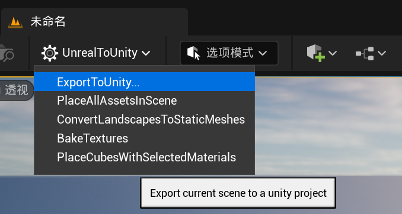
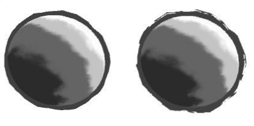
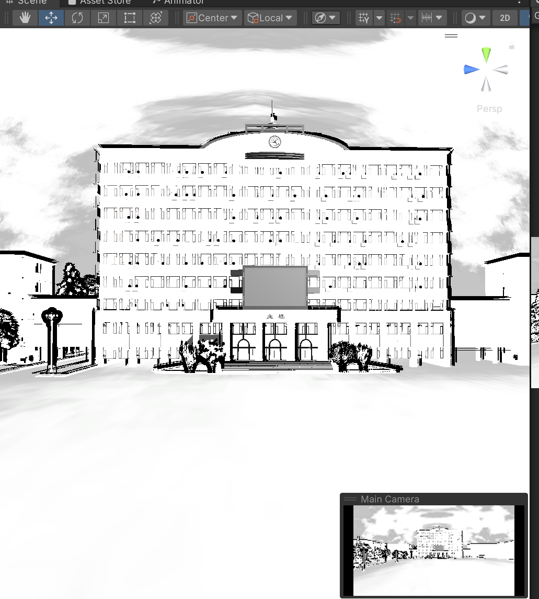

## 1.插件：UnrealToUnity

在日常创作中，经常碰到一些好的UE美术资源，可以使用这个插件把它转换到Unity当中。

[百度网盘链接](https://pan.baidu.com/s/1P5AMJ177SIdE4-fjiRFEXg?pwd=6666)


Unity：2019以上的版本

UE：版本根据自己的安装插件对应的版本自行选择，我选择的是5.3.2

**步骤：**

1. **解压对应版本的UE插件：**


2. **新建一个UE工程。**


找到工程目录，新建一个Plugins文件夹，如下：


3. **把解压后的插件文件夹整个复制到Plugins文件夹下。**


4. **重启UE，插件会在菜单栏上显示，可直接点击使用。**


把需要转成unity资产的ue美术素材uasset拖到世界中，即可。



默认设置即可导出。可以选择取消勾选shader等，因为会与unity本体的shader有冲突。


> 事实上，导入unity后大概率会进入报错的安全模式，按照console窗口的报错一步步注释掉UE转生过来的代码即可，很快就能清理完毕。另外，还是强调，尽量把ue带来的shader删除干净，在unity里重新写一遍shader。

## 2.简单水墨渲染的初步实现

### 2.1 轮廓线的渲染

《unity shader入门精要 14章》已经详细介绍轮廓线的渲染方法。

**过程式集合轮廓线渲染方法：**
1）单独一个pass将模型沿法线扩张一点，渲染成轮廓线的颜色，

2）然后再用一个pass正常内部渲染着色，遮住前面的部分。留下显示出来的部分就是轮廓线了。

```
Properties 
	{
		[Header(OutLine)]
		// Stroke Color 描边颜色
		_StrokeColor ("Stroke Color", Color) = (0,0,0,1)
		// Noise Map 噪声图
		_OutlineNoise ("Outline Noise Map", 2D) = "white" {}
		// First Outline Width 
		_Outline ("Outline Width", Range(0, 1)) = 0.1
		// Second Outline Width
		_OutsideNoiseWidth ("Outside Noise Width", Range(1, 2)) = 1.3
		_MaxOutlineZOffset ("Max Outline Z Offset", Range(0,1)) = 0.5

	}
    SubShader 
	{
		Tags { "RenderType"="Opaque" "Queue"="Geometry"}

		// the first outline pass
		Pass 
		{
                // 主要在vertex shader内进行计算 省略部分基本参数设置
			v2f vert (a2v v) 
			{
				// fetch Perlin noise map here to map the vertex
				// add some bias by the normal direction
				float4 burn = tex2Dlod(_OutlineNoise, v.vertex);

				v2f o = (v2f)0;
				float3 scaledir = mul((float3x3)UNITY_MATRIX_MV, normalize(v.normal.xyz));
				scaledir += 0.5;
				scaledir.z = 0.01;
				scaledir = normalize(scaledir);

				// camera space
				float4 position_cs = mul(UNITY_MATRIX_MV, v.vertex);
				position_cs /= position_cs.w;

				float3 viewDir = normalize(position_cs.xyz);
				float3 offset_pos_cs = position_cs.xyz + viewDir * _MaxOutlineZOffset;

				// y = cos（fov/2）
				float linewidth = -position_cs.z / (unity_CameraProjection[1].y);
				linewidth = sqrt(linewidth);
				position_cs.xy = offset_pos_cs.xy + scaledir.xy * linewidth * burn.x * _Outline ;
				position_cs.z = offset_pos_cs.z;
				o.pos = mul(UNITY_MATRIX_P, position_cs);

				return o;
			}
                // fragment shader只是输出了一个颜色 不赘述
		}
}
```

水墨画风格渲染，做了一个最简单的noise干扰，在这里使用noise纹理图片（_OutlineNoise）进行采样，这样又个好处就是随机出来的**轮廓不会随着视角的改变而改变。**


其中，

```
// y = cos（fov/2）
				float linewidth = -position_cs.z / (unity_CameraProjection[1].y);
```

增加了一个linewidth的操作，因为unity_CameraProjection[1].y = cos（fov/2）。

**目的：**保证轮廓线随着FOV的变换也是成一定比例，近大远小，而不是远近一样粗细。


最后一个小trick是，再增加了一个pass进行完全相同的操作，只是宽度再稍微增加一点，然后在fragment shader里根据noise再进行一下剔除。这也是在属性里面，之前没有用到的_OutsideNoiseWidth，来控制第二个pass的轮廓线的宽度，理论上它要大于1，比第一个pass稍微宽一些。简要的代码如下：

```
// 在vertex shader内 只需要稍微改变一点
position_cs.xy = offset_pos_cs.xy + scaledir.xy * linewidth * burn.y * _Outline * _OutsideNoiseWidth ;

// 在fragment shader内 也稍微根据noise突变做了下剔除
fixed4 frag(v2f i) : SV_Target 
{
	//clip randome outline here
	fixed4 c = _StrokeColor;
	fixed3 burn = tex2D(_OutlineNoise, i.uv).rgb;
	if (burn.x > 0.5)
		discard;
	return c;
}
```


这样可以形成毛笔笔触边缘毛边的效果：



### 2.2 内部着色

而内部着色的基本思想和unity卡通渲染的一致，使用最基本的光照方程，再映射到一张ramp图上进行采样，最后形成的就是阶梯状的颜色过渡。在这里基础物体用的ramp图如下：


天空盒用的ramp图进行了反转，否则黑天和灰色墨迹很丑：


将纹理笔触作为一个noise贴图，扰动uv的值之后再进行一次高斯模糊。在这里是用了一张笔触纹理和一个noise贴图混合的一起扰动uv。


**内部着色步骤：**

1. 先计算半郎伯特漫反射系数;

2. 用笔触纹理+noise纹理稍微扰动一下。
3. 在采样ramp纹理的时候进行高斯模糊。

```csharp
Shader "ChinesePainting/MountainShader" 
{
	Properties 
	{
		[Header(OutLine)]
		//...省略上述已介绍过的

		[Header(Interior)]
		_Ramp ("Ramp Texture", 2D) = "white" {}
		// Stroke Map
		_StrokeTex ("Stroke Tex", 2D) = "white" {}
		_InteriorNoise ("Interior Noise Map", 2D) = "white" {}
		// Interior Noise Level
		_InteriorNoiseLevel ("Interior Noise Level", Range(0, 1)) = 0.15
		// Guassian Blur
		radius ("Guassian Blur Radius", Range(0,60)) = 30
                resolution ("Resolution", float) = 800  
                hstep("HorizontalStep", Range(0,1)) = 0.5
                vstep("VerticalStep", Range(0,1)) = 0.5  

	}
        SubShader 
	{
		Tags { "RenderType"="Opaque" "Queue"="Geometry"}

		// the first outline pass
		// 省略

		// the second outline pass for random part, a little bit wider than last one
	        // 省略

		// the interior pass
                Pass 
		{
			// 之前的vertex shader部分没有特殊操作  省略
			float4 frag(v2f i) : SV_Target 
			{ 
				fixed3 worldNormal = normalize(i.worldNormal);
				fixed3 worldLightDir = normalize(UnityWorldSpaceLightDir(i.worldPos));

				// Noise
				// For the bias of the coordiante
				float4 burn = tex2D(_InteriorNoise, i.uv);
				//a little bit disturbance
				fixed diff =  dot(worldNormal, worldLightDir);
				diff = (diff * 0.5 + 0.5);
				float2 k = tex2D(_StrokeTex, i.uv).xy;
				float2 cuv = float2(diff, diff) + k * burn.xy * _InteriorNoiseLevel;

				// This iniminate the bias of the uv movement
				if (cuv.x > 0.95)
				{
					cuv.x = 0.95;
					cuv.y = 1;
				}
				if (cuv.y >  0.95)
				{
					cuv.x = 0.95;
					cuv.y = 1;
				}
				cuv = clamp(cuv, 0, 1);

				// Guassian Blur
				float4 sum = float4(0.0, 0.0, 0.0, 0.0);
                                float2 tc = cuv;
                                // blur radius in pixels
                                float blur = radius/resolution/4;     
                                sum += tex2D(_Ramp, float2(tc.x - 4.0*blur*hstep, tc.y - 4.0*blur*vstep)) * 0.0162162162;
                                sum += tex2D(_Ramp, float2(tc.x - 3.0*blur*hstep, tc.y - 3.0*blur*vstep)) * 0.0540540541;
                                sum += tex2D(_Ramp, float2(tc.x - 2.0*blur*hstep, tc.y - 2.0*blur*vstep)) * 0.1216216216;
                                sum += tex2D(_Ramp, float2(tc.x - 1.0*blur*hstep, tc.y - 1.0*blur*vstep)) * 0.1945945946;
                                sum += tex2D(_Ramp, float2(tc.x, tc.y)) * 0.2270270270;
                                sum += tex2D(_Ramp, float2(tc.x + 1.0*blur*hstep, tc.y + 1.0*blur*vstep)) * 0.1945945946;
                                sum += tex2D(_Ramp, float2(tc.x + 2.0*blur*hstep, tc.y + 2.0*blur*vstep)) * 0.1216216216;
                                sum += tex2D(_Ramp, float2(tc.x + 3.0*blur*hstep, tc.y + 3.0*blur*vstep)) * 0.0540540541;
                                sum += tex2D(_Ramp, float2(tc.x + 4.0*blur*hstep, tc.y + 4.0*blur*vstep)) * 0.0162162162;

				return float4(sum.rgb, 1.0);
			}
			ENDCG
		}
	}
	FallBack "Diffuse"
}
```

目前是这样的效果：




