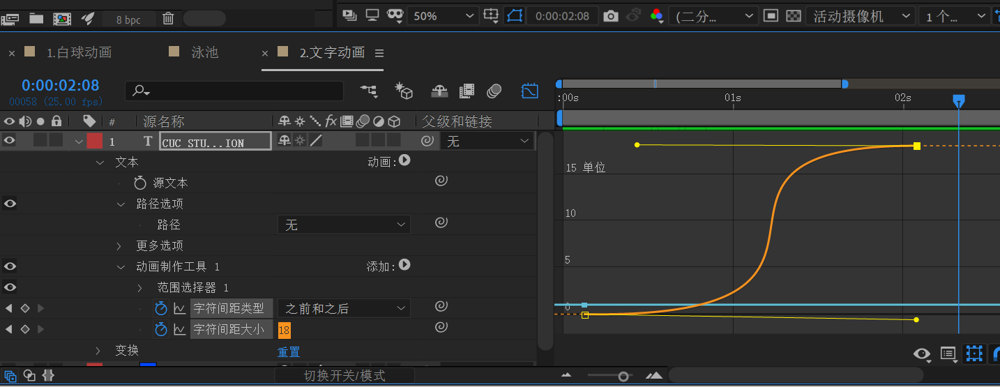
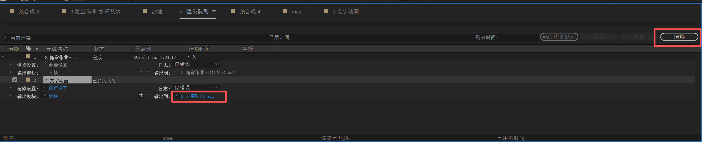

## Ae是什么？

AE 全称 **Adobe After Effects**，它是一个 **视频特效与动态图形设计软件**。
 最主要完成的三件事：

- **动画！**（动画制作）
- **特效！**（爆炸、粒子、灯光、抖动等）
- **合成！**（把图片、视频、文字、素材组合成一个画面）

**使用门槛：**

> *搞懂两个基本概念就可以。使用门槛其实比想象更低，学 30 分钟做出简单动画完全没问题滴。*

- **图层**（PS/Procreate/Sai2等等，有多图层的工具都同理）
- **关键帧**（剪映/PR/Unity/Blender等等，有时间轴的工具都同理）

## 强力推荐的入门教程



## 为什么要用Ae？

~~招新宣传片~~

~~社团/活动开场动画~~

~~前后缀动态效果~~

~~动态海报（招生、晚会、文创）~~

~~LOGO 动画~~

~~主视觉 Key visual 动画化~~

~~活动倒计时、字幕条、弹幕效果~~

~~UP 主、运营团队~~

~~学会 AE 简历更亮~~

# 给自推/OC/CP/CB/自设等等 拉磨产粮罢了。

> 高端的食材往往只需要最朴素的烹饪方式。


> 以上是本人从纯萌新开始，边学边产出，用ae做的小样例。

* AE对于制作动态效果，是自由度非常高，非常称手的工具。

* 可以和PS，AI ( Adobe Illustrator ) 等adobe家的工具配套使用，非常方便。
* 那么不用AE可以做到吗？
  - 自然是可以的，工具只是工具，掌握了方法之后，用什么都可以做创意。
  - AE之外的工具不在本次教程的讨论范围内。

## 1.基本介绍：

- [ ] 1.什么是合成（ctrl+K 合成设置-主要是做长度控制）
- [ ] 2.常用尺寸1920x1080 / 前缀尺寸:  1079 x 607
- [ ] 3.背景颜色默认，是透明的，不会显示。
- [ ] 4.图层
- [ ] 5.锚点的概念（放缩/旋转的中心点）
- [ ] 6.快捷键：
  - [ ] 位移（P）
  - [ ] 缩放（S）
  - [ ] 旋转（R）
  - [ ] 不透明度（T）
  - [ ] 所有有变化的属性关键帧 （U）

## 工具/快捷键

0.窗口设置


1.按住alt键轻敲工具栏图标即可切换常用功能

2.ctrl + shift + D 切断素材

3.选中所有关键帧+alt键：等比例缩放

4.顶部菜单栏——动画——关键帧辅助——时间反向关键帧

5.ctrl+shift+C预合成

6.消隐


7.运动模糊


## 2.文字动画 


注意对齐方式，决定了动画的间距从何处放大/缩小.


#### 什么是线性动画?什么是非线性动画?


> 从图表可见, 关键帧动画默认是线性的,即匀速运动.

再次点击图表,返回关键帧时间轴,选中所有关键帧并按F9, 加上缓动效果.


此时的图表:


夸张一点,动画效果更明显.



将图表类型改为速度:


注意：当选择了某个内容的同时,点击形状,此时添加到画布上的是蒙版,而非真正的形状.

#### 什么是蒙版?

就是:

蒙版: 自行选择区域--只展示这个区域.

#### 轨道遮罩

跟蒙版的作用类似,比蒙版更灵活一点.


## 3. 随堂作业-水杯装水

超级简单的小测试。

**限时：**5-10min

**目标：**

结合上述教程，完成一个水杯装水的小动画。


## 4.效果控件

比如：高斯模糊


加关键帧即可，实现一个模糊-清晰的入场。

比如：发光效果


设置发光半径和发光强度即可。

## 5. 进阶操作

### 如何导入psd


> 这样就可以按照PS分好的图层进行移动了。

### 图钉工具

> 大名鼎鼎的图钉工具。新手非常容易上手。可以做飘动的头发丝，叶子，衣服，丝带，挥动的手臂，抬腿，点头，呼吸等等，一切你能想到的，和你想不到的。


### 什么是预合成？

> 预合成, 就是把多个图层“打包成一个"小合成 "，让画面更干净、方便统一加动画或特效的一种分组操作。


为了让叶子和影子一起动，先选中对应叶子+影子，shift + ctrl + C，预合成。

接下来，对整个预合成打图钉，并给图钉添加关键帧即可。非常简单。


**怎么删除：**

在画面窗口中 **点击要删除的图钉**（选中后会变成黄色/高亮）

按键盘 **Delete / Backspace**
 → 那个钉子会被删除。


变形过程记得拖动时间轴，打上关键帧。

### 循环表达式

将鼠标移动至关键帧动画对应的操纵点的【秒表标志】上，按住alt的同时点秒表标志。


输入

```
loopOut("pingpong")
```

或者

```
loopOut("cycle")
```

即可实现来回循环（pingpong）或者单向循环（cycle）动画。

> pingpong 和 cycle的区别
>
> pingpong ： 1-2-3-4—**4-3-2-1**——1-2-3-4——……
>
> cycle :            1-2-3-4—1-2-3-4——1-2-3-4——……

### 抖动表达式

```
wiggle(1, 12)
```

意思是：每秒抖动 1 次，最大偏移 12像素。
用于：手持镜头晃动感、抖动标题、光点晃动，等等，这里用来实现泳圈漂移。


5.路径动画

1.普通形状or图片图层

正常k位移动画，选中位移关键帧后，图层——变换——自动定向


2.文字路径动画

**步骤 1：创建文字**

- 新建文字图层

**步骤 2：给文字图层画一条路径（Mask）**


1. 选中文字图层
2. 选择钢笔工具（G）, 注意，钢笔画出曲线：定点的同时，按住鼠标不松开并拖动。
3. **在文字图层上画一条曲线/直线**
   - 画完后，你会看到一个 Mask（蒙版）

说明：
 虽然你是在文字图层上画蒙版，但 AE 允许**把蒙版作为文字路径来使用**。

**步骤 3：启用文字的 Path Options**


1. 展开文字图层：文本——路径选项
2. 将 None 改成你的 **蒙版1**

文字就会自动贴着你画的那条路径了！

**步骤 4：做“沿路径移动”的动画（核心）**

1. 仍在 Path Options
2. 找到 **First Margin**（首端边距）

这是控制文字在路径上的位置的参数。

## 6.导出




修改路径和文件名后，别忘了点右上角的渲染，然后才开始导出。

注意，ae内只能导出avi文件，比较大，该尺寸10s视频大概到1-2G以上。

### 转换格式：

下载ffmpeg：

> FFmpeg 是一个用于处理视频、音频等多媒体文件的开源工具包。它支持几乎所有的多媒体格式转换、剪辑和编辑，是开发者和多媒体工作者必备的工具。

打开 [Dpwnload FFmpeg](https://ffmpeg.org/download.html) 官网，选择安装包Windows builds from gyan.dev


下滑找到release bulids部分，选择ffmpeg-7.0.2-essentials_build.zip

 [ffmpeg-8.0-essentials_build.7z](..\..\..\..\..\迅雷下载\ffmpeg-8.0-essentials_build.7z) 
打开文件夹，复制bin文件的路径，并添加进系统的环境变量中。


```
D:\迅雷下载\ffmpeg-8.0-essentials_build\bin
```


打开avi所在文件的根目录，将avi视频压缩后再转换格式。

```
ffmpeg -i input.avi -vf "fps=15,scale=640:-1:flags=lanczos" -loop 0 output.gif
```

原文链接：https://blog.csdn.net/Natsuago/article/details/143231558


## 前后缀的规范：


1. **前缀尺寸：**1079 x 607
2. **元素要求：**有学校的元素/CUC STU/48 th (届数)，颜色不宜过多（2-3种），其他可以相对自由发挥！
3. **时间要求：**时长7-10s是ok的，视觉上尽量快速，吸睛。
4. **文件大小：**10MB以内（微信公众平台限制）


**1.后缀尾图：**1280 x 1416

**2.往期回顾：**宽1080，高不限定。

**3.内容要求：**配色和风格互相呼应；微博和公众号的二维码；参考往届的文字信息。

**4.注意事项：**

* 后缀一共4张图。
  * 后缀尾图：1张
  * 往期回顾：3张
* 往期回顾3张都是透明底。
* 设计的元素不要压在图片上，否则换图会很麻烦。
* 制作过程中，记得检查深色模式和浅色模式是不是都可以显示，用两种方式都比较显眼的灰色。

## 作业（选做）

1.上手试试做个前缀吧！7-10s。

2.把自己手上现有的一张/多张图改成动态版，时长不限。

**一般流程：**

1.定主题颜色（2-3种）

2.找参考，小红书/b站……拆解分析一个ae动态视频/动态效果/动态海报的各个环节用到了哪些技巧。对应找教程。

3.写个简单的分镜草稿，1-3个画面即可，过审一下。

4.ps/ai/ae开搞！

## 附录

1. Me未安装（已经安装但AE找不到路径）


**解决方案：**

**注意：AE或者PR和AME的版本要一致，比如都是2020版的才能实现。**

使用mklink命令在命令提示符处创建符号链接

**1.左下角搜索框中输入cmd，右键以管理员身份运行（很重要不然会被拒绝访问）**

或者在文件夹C:\WINDOWS\system32中找到cmd.exe右键以管理员身份运行。

**2.在cmd窗口中输入命令行**

按照所安装的media encoder的版本全称和更改的安装路径输入，比如：

`Adobe Media Encoder 2020`修改的安装地址是在D:\Program Files\Adobe

```
mklink /J "C:\Program Files\Adobe\Adobe Media Encoder 2020" "F:\Program Files (x86)\Adobe\ME2021\Adobe Media Encoder 2020"
```

3.操作成功时显示

```
为 C:\Program Files\Adobe\Adobe Media Encoder 2020 &lt;&lt;===&gt;&gt; D:\Program Files\Adobe\Adobe Media Encoder 2020 创建的联接
```

说明已经创建成功.

