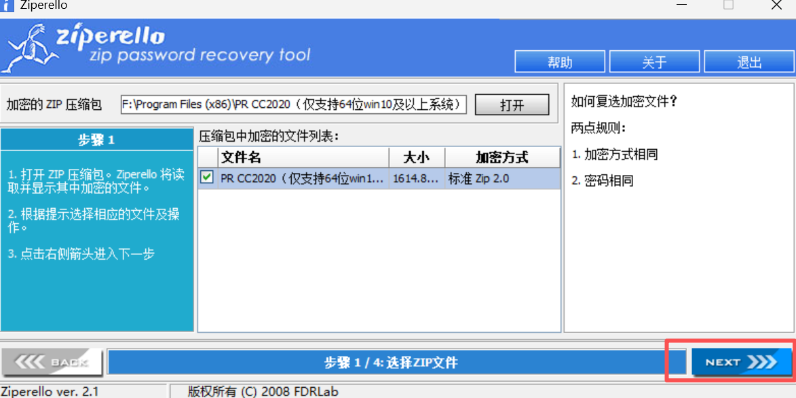

使用 Ziperello https://qweree.cn/index.php/416/ 对加了密码的压缩包进行密码破解，教程如下：

第一步，双击运行 Ziperello双击我打开程序.exe，如下图：

第二步，打开一个加了密的 ZIP 压缩包，再选择一个里面的文件，再点击下一步，如图：

第三步，这里可以选择「暴力破解」方式，继续下一步，如图：

第四步，如果对压缩包来源没有一点头绪，建议可以选数字、小写字母、大写字母这三种方式组合，毕竟这三种是大家常用的组合，继续下一步，如图：

第五步，如下图界面我们直接点击开始，程序会自动组合各种密码进行暴力尝试，当然，密码越长、越复杂破解时间也会更长！

第六步，只需静静等待，直到弹框提示正确密码，大功告成，如图：

-------

原文链接：https://blog.csdn.net/qq_29856169/article/details/139879447