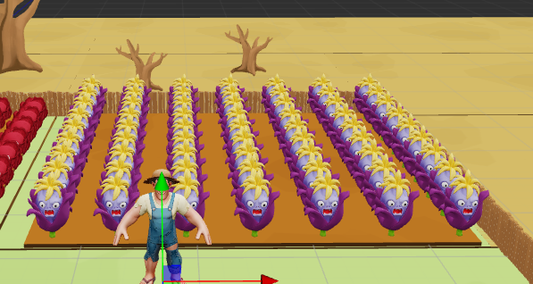

## 1.写动画需求

1.模型+动画文件大小不超过400KB

2.模型导出为npc_skin.fbx

2.骨骼动画导出为npc_ani.fbx

## 2.看工程文件

afp://[nass.funplus.io/](http://nass.funplus.io/)新前期素材/SSD-新前期素材/playable/PA Output/SSD_00158_LSS_20251114_引水救援/引水救援_工程

## 3. 地编 给康康审

1.





## 4.箭头UI

已完成

## 5.模型减面+压缩贴图

**1.初始贴图大于10MB无法直接在网站编辑，先用ffmpeg初步压缩至3MB左右**

```
ffmpeg -i texture_pbr_20250901.png -vf "scale=1280:-1" -q 5 compressed.png
```

**2.改图宝：在线修改图片——改变大小**

[改图宝 - 在线修改照片大小尺寸工具](https://www.gaitubao.com/)

尺寸：2048x2048 —> 256x256

文件大小：3.04MB —> 150.5KB

**3.熊猫压缩**

[TinyPNG – 智能压缩您的WebP、JPEG和PNG图片](https://tinify.cn/)

150.5KB —> 42.5KB


