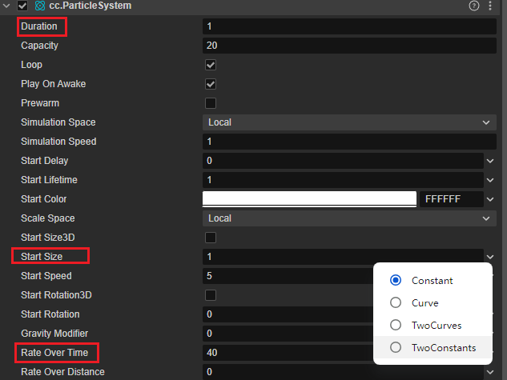
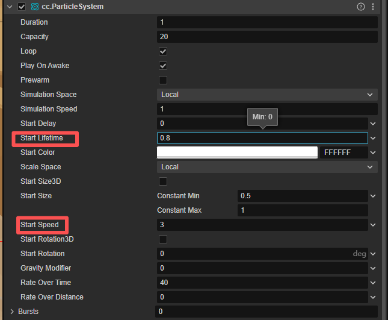
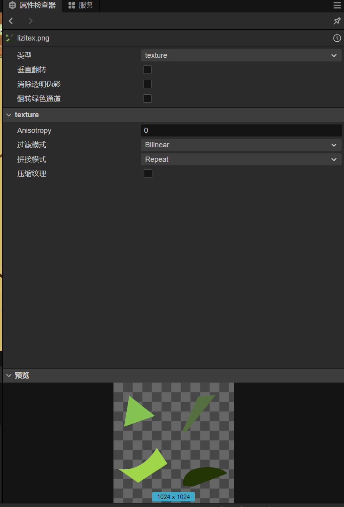
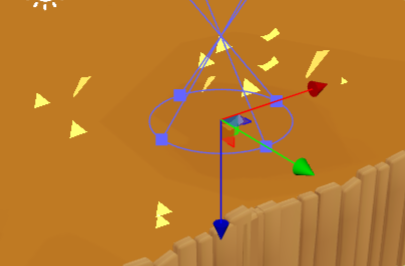
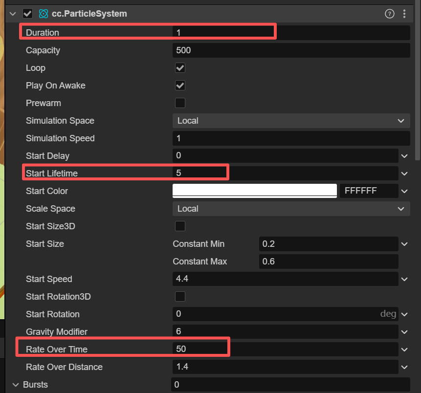

## 方法一：共享粒子配置文件（推荐）

### 1. **找到粒子文件**

- 粒子特效通常包含两个文件：`.plist`文件（粒子配置）`.png`文件（粒子纹理图片）

### 2. **文件位置**

```
Resources/
  ├── Particles/
  │   ├── explosion.plist    # 粒子配置
  │   └── particle_texture.png # 粒子纹理
```

### 3. **共享步骤**

```
# 将以下文件打包发给别人
your_project/Resources/Particles/your_effect.plist
your_project/Resources/Particles/your_texture.png
```

## 方法二：代码方式导出

### 1. **导出粒子配置代码**

```
// 如果你的粒子是用代码创建的，可以导出配置
auto particle = ParticleSystem::createWithTotalParticles(100);
particle->setDuration(-1);
particle->setGravity(Point(0, -100));
particle->setSpeed(50);
// ... 其他参数

// 保存为可共享的代码片段
```

### 2. **在对方工程中使用**

```
// 在对方项目中创建粒子
auto particle = ParticleSystem::create("Particles/your_effect.plist");
this->addChild(particle);
```

## 方法三：使用Cocos Creator的预制体

### 1. **如果使用Cocos Creator**

- 将粒子系统保存为Prefab（预制体）
- 共享`.prefab`文件和相关资源

## 具体操作步骤

### **发送方操作：**

1. 找到粒子特效文件（.plist + .png）
2. 确认纹理图片路径正确
3. 打包发送给接收方

### **接收方操作：**

1. 将文件放入自己项目的Resources文件夹
2. 在代码中加载使用：

```
// 加载粒子特效
auto particle = ParticleSystemQuad::create("Particles/your_effect.plist");
particle->setPosition(Vec2(visibleSize.width/2, visibleSize.height/2));
this->addChild(particle);
```

## 注意事项

1. **路径问题**：确保纹理图片路径在plist文件中配置正确
2. **资源依赖**：不要遗漏纹理图片文件
3. **版本兼容**：确保Cocos2d版本兼容
4. **绝对路径**：避免使用绝对路径，使用相对路径

## 初次实现粒子特效：火焰

首先创建粒子：


### shape module：

右侧栏，下滑找到shape module：

半径默认为1，调小改为0.2.

开合角默认为25（圆锥）改为0（圆柱）。


*半径改为负数可以实现向下运动的粒子。

### 主模块：

Duration(粒子系统运行时间)：1。默认是5，不需要那么久的运行时间。

RateOverTime(每秒发射的粒子数)：设置为40，默认值是10.粒子太少了的话，达不到燃烧的效果。

**粒子初始大小(StartSize)** ：两个常数的方式，设置为0.5，0.8，这样粒子的大小就会在0.5-0.8这个范围内随机。



粒子初始速度(StartSpeed)： 设置为3，默认值为5，这样可以降低粒子的速度，也可以间接控制火焰的高度。

粒子生命周期(StartLifetime)： 设置为0.8，默认值为5，这是粒子从生成到消失的时间，可以通过其控制火焰的高度。注意不要和 粒子系统运行时间(Duration)。



大小模块（size overtimeMoudule）：


设置一下火焰粒子的大小变化。让粒子从生成到消失慢慢变小。


**颜色模块(ColorOverLifetimeModule)**，我们来设置一下火焰色颜色。

选择 **渐变模式(gradient)**，设置为由黄到红的透明的渐变色。


将设置好的粒子从层级管理器拖拽到资源管理器中，就会自动生成粒子的prefab。

在资源管理器中右键——导出资源包。


导入时，需要把压缩包拖进新工程文件的资源管理器，并右键导入资源包。


选择需要的预制件导入即可。


## 复现碎叶特效

需求：复现割草时的碎叶纷飞特效。

参考教程：

[Cocos Creator 3D 粒子系统初战(一),不要钱的酷炫火焰拿走不谢!-CSDN博客](https://blog.csdn.net/yangyupeng2860/article/details/109390571)

1.新建材质，选择particles/builtin-particle


> 可以看到，可供粒子系统使用的 Effect 有红框中的三种，这里我们要使用的就是builtin-particle。

> * builtin-particle:提供给粒子系统的 渲染模块(Renderer) 中的 ParticleMaterial 使用，当使用cpu渲染时，必须使用此Effect，这个也是默认选项。

> * builtin-particle-gpu:提供给粒子系统的 渲染模块(Renderer) 中的 ParticleMaterial 使用，当使用gpu渲染时，必须使用此Effect。

> * builtin-particle-trail:提供给粒子系统的 渲染模块(Renderer) 中的 TrailMaterial 使用

2.观察特效在游戏中的实际效果，叶片的形状比较随机且锋利，可以是三角形/长条形/不规则梯形为主。


用一张2x2的纹理贴图来测试一下：

> 尺寸：1024 x 1024
>
> 分辨率：200
>
> 背景：透明底png


导入cocos，设置为texture



将贴图导入material的Maintex。记得保存。


3.将本粒子材质拖入放到**渲染模块(Renderer)** 的**CPU Material** 中。


勾选**贴图动画模块** 。


Num Tiles X/Y ：行列设置2x2。

Start Frame：设置两个常数，代表起始和结束。注意0-4（而不是0-3）

cycleCount：一个生命周期内播放几次循环，设置为1，默认值0.

效果：



4.接下来对 **主模块** 进行设置。调整：

* 重力
* 
* 速度/生命周期/数量（Rate over time）/……等等
* 

5. 调节Shape Module


效果：

