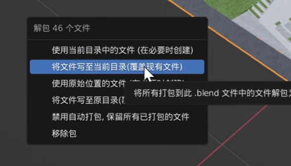
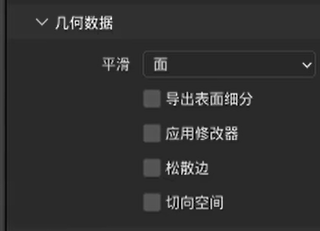
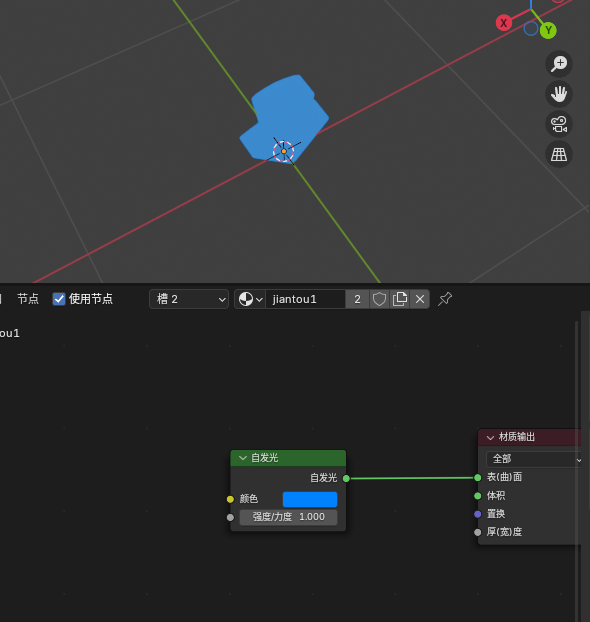
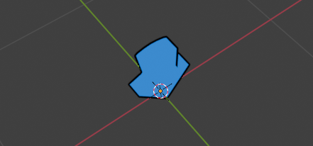
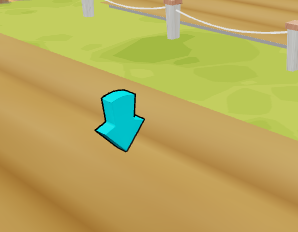

## 1. Blender导出带贴图模型

{{BV1384y1j7wt}}

1.文件—— 外部数据 ——打包资源——（第二项）将文件写至当前目录

2.着色器编辑器：

所有shader节点的贴图文件处，都需要：解包项——将文件写至当前目录（覆盖现有文件）

操作之后，确保图标变化：

3.导出——fbx

两处修改：

路径模式——复制

右侧小图标——激活

1.

2.

## 2.形态键动画导出

1.分为两个动画：

动作动画

形态键动画

要求：

动作动画长度一定要>=形态键动画

导出：

1.

2.

## 3.实体化描边

（面试题）用blender等dcc软件实体化描边比在引擎中用shader实时描边的优势？

> 原问：“你为什么用shader实时描边，而不是在blender中用实体化描边？这样不是性能更好吗？”
>
> 我：……

1）打开一个简单的 箭头网格体。将节点改成着色器-自发光（只是为方便查看效果，没有特别的作用）

2）新建第二个材质，也是自发光节点。材质命名为”描边“，该材质定义描边颜色。

注意：描边材质勾选 **“背面剔除”（Backface Culling）**。这能隐藏材质正对摄像机的正面，只让我们从模型侧面和背面看到它，这是形成描边的关键。

3）添加修改器——生成——实体化

1：法向翻转；

> **翻转**：在“法向”选项中勾选**翻转**。这会使模型背面可见，与“背面剔除”的描边材质配合形成描边

2：添加材质偏移

> **材质偏移**：如果模型有多个材质槽，将此参数设置为**1**，可使实体化修改器使用材质列表中排在下一个（索引号+1）的材质，也就是我们刚刚创建的描边材质。

最后，只需要调整厚（宽）度就可以查看到描边的效果。

转到游戏引擎内使用标准着色器会更明显：

**法线外扩与背面显示**：当勾选“翻转”法线后，模型表面的**背面**变得可见。实体化修改器根据厚度值，沿着模型顶点的法线方向创造出一个新的、略大一圈的“外壳”。

**材质赋予与正面剔除**：我们将设置了“背面剔除”的黑色材质赋予这个新外壳。这意味着，从这个外壳的**正面**（即朝向摄像机的方向）看，它是“透明”的；但从其**背面**（即边缘部分）看，它显示为描边颜色。