结构

```
test

​	-3

​		-q1

​		-q2
```


## 3 中心光辉径向渐变

Material(在Renderer设置)

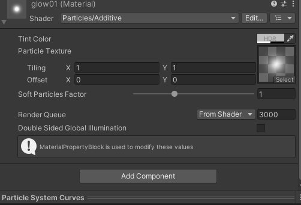


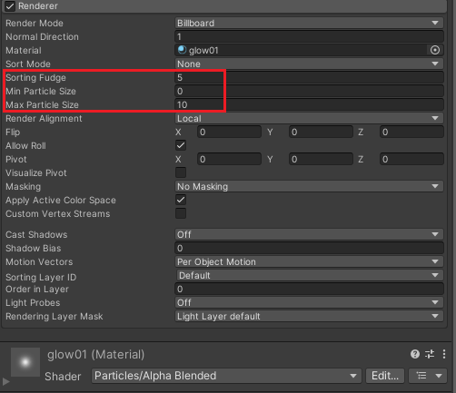

### 1）Start lifetime

Start lifetime：`0.2~0.5`

把生命周期改短，不会出现粒子下雨的长尾状。而是浮在表面上的一两个粒子。（因为很快就消失嘞）

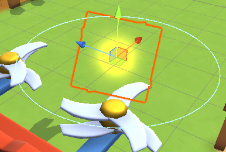

2）

Start sizee：`2 ~ 3`


3）

Start Color


4）后续默认
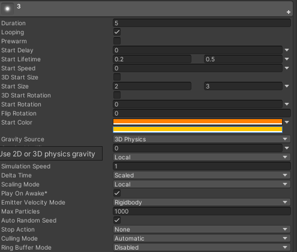

### Emission默认

### Shape取消

### Color over Lifetime颜色

### 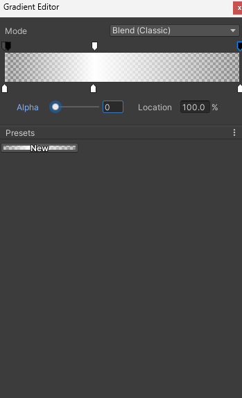 

### Size over Lifetime

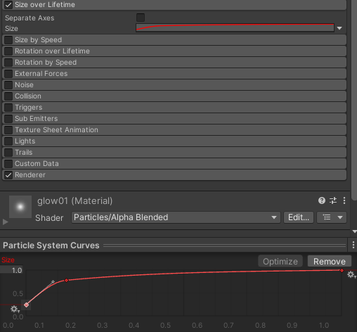

## q1 圆环光圈1

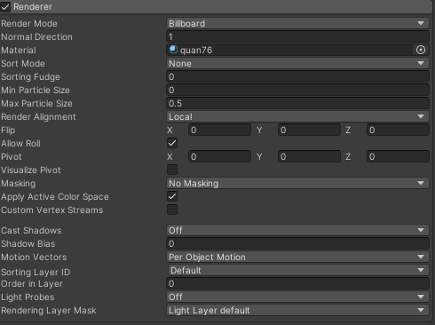


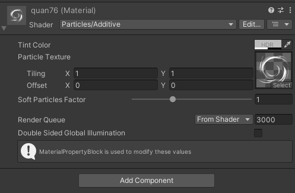

### Start lifetime

0.2~0.5

### Start Speed

0

> 设置为0就不会向下掉落了

### Start Size

2

### Start Rotation

0-360之间随机


### Start Color

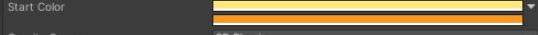

### Shape模块 取消

### Emission模块 默认

### Color over lifetime模块

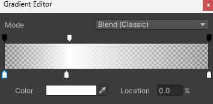

### Size over lifetime模块

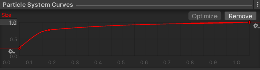

### Rotation over Lifetime模块

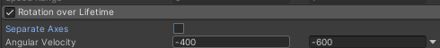

## q2 半圆弧描边2

同上，只是改个贴图，并保证start size略微大于q1的圆环。

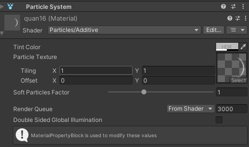


> PS：内置的particle shader有自带的广告牌效果，根据摄像机视角自动旋转角度。涉及旋转有关的特效，最好先用纯色的贴图进行代替，观测好适合的初始角度再进行后续调整。

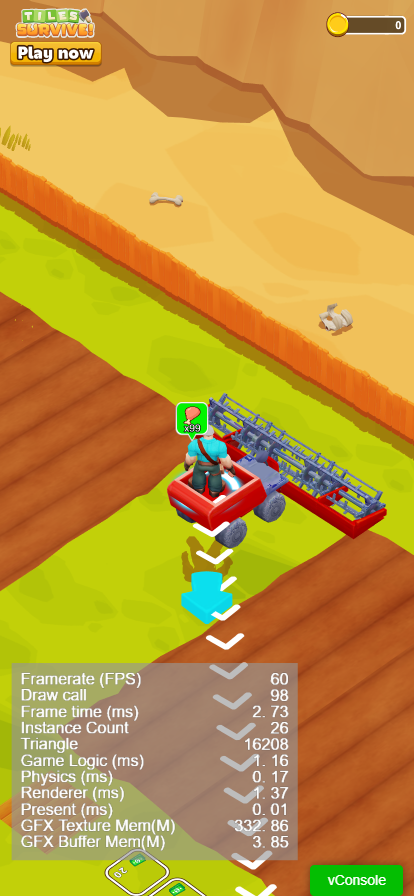

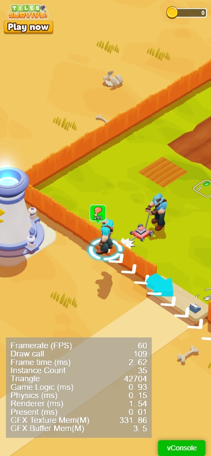
