## 1 前期准备工作

1.新建URP 3D项目

2.点击资产面板的URP资产，此时右侧面板高亮，可以Add Render Objects

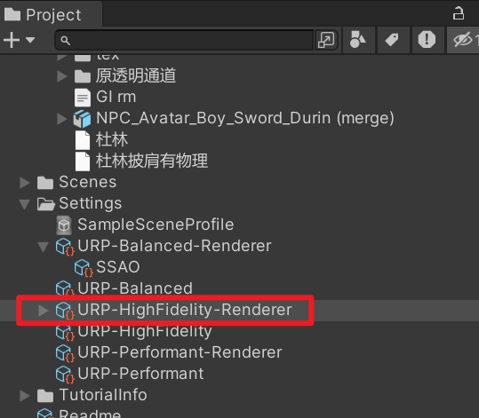

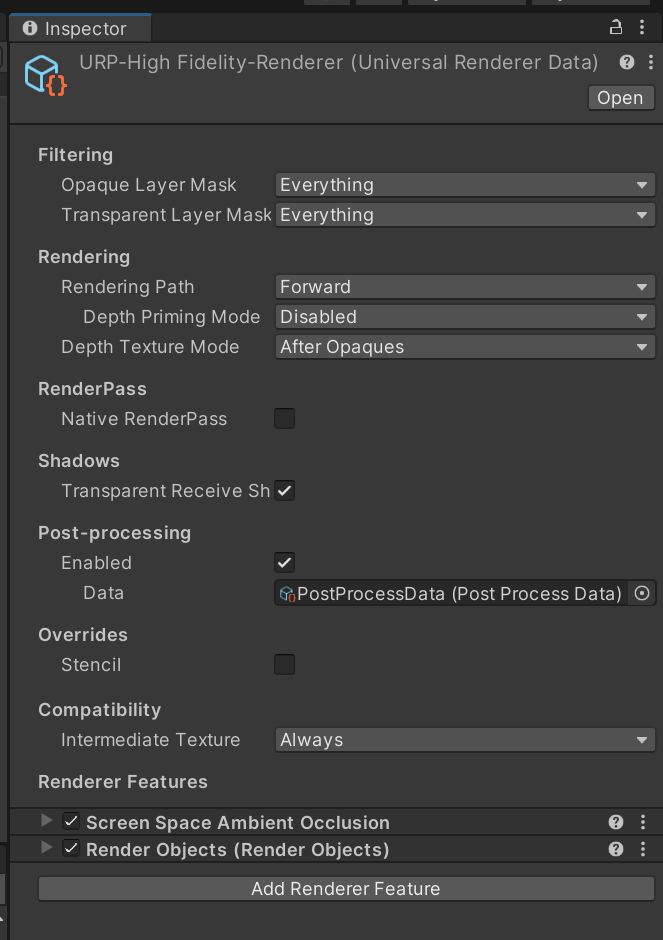

添加Render Objects

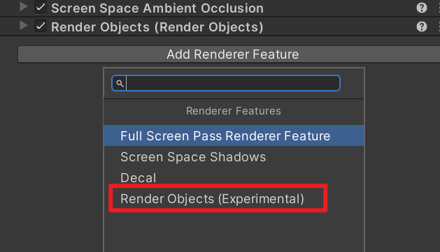

添加3个pass。

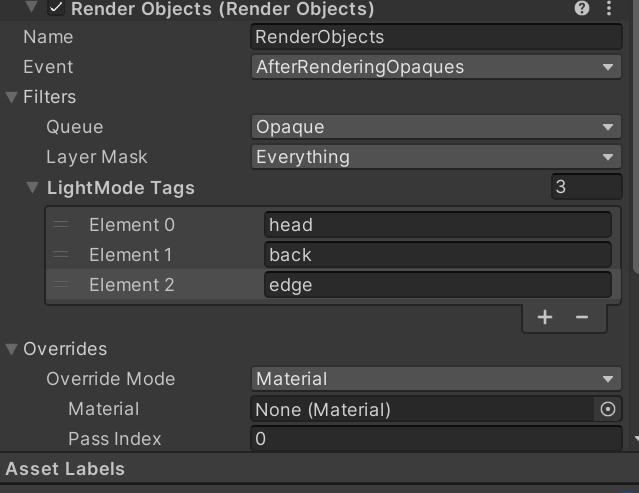

mask改为everything。

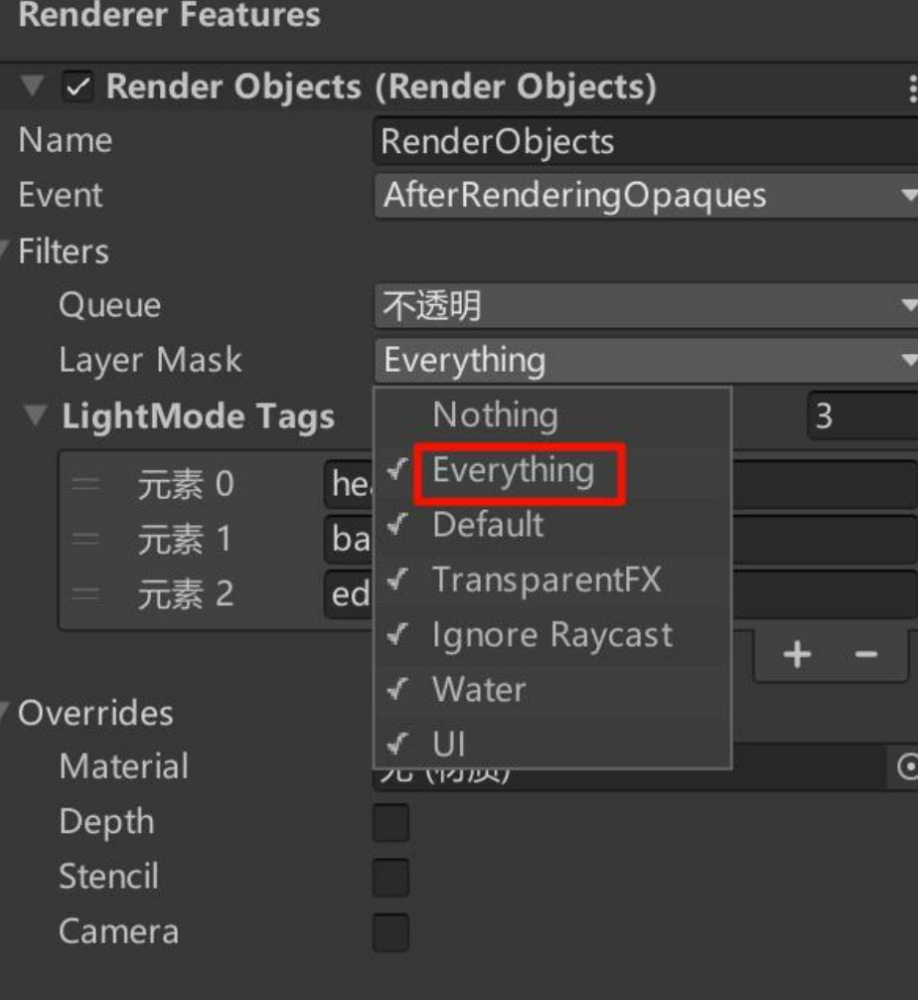

> TODO: 有仙人曾言： // 我自己试下来，在角色身上 LowQuality 比 Medium 和 High 好
>  // Medium 和 High 采样数多，过渡的区间大，在角色身上更容易出现 Perspective aliasing
>
> 等到时候自己验证一下在说 。

FaceLightmap

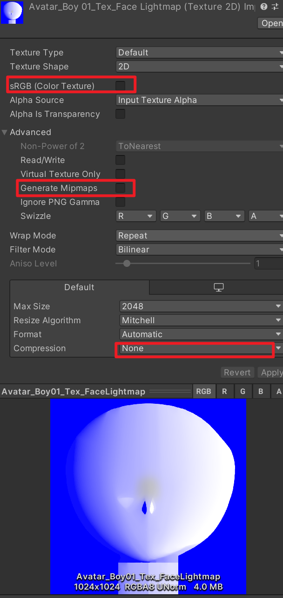

Body_Diffuse

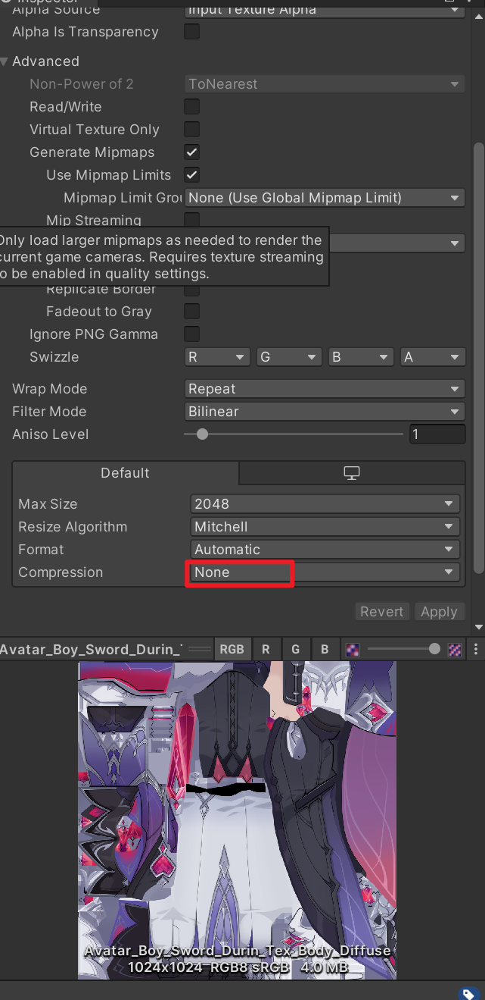

Body_lightmap

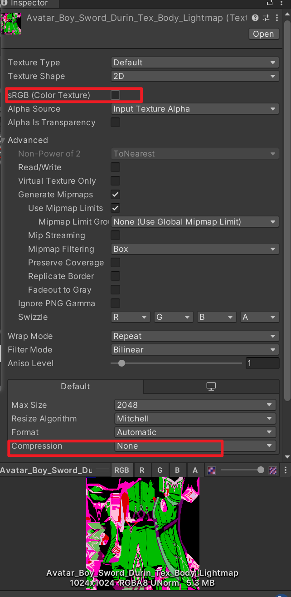

法线图

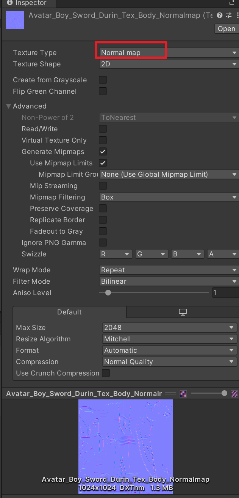

shadow ramp

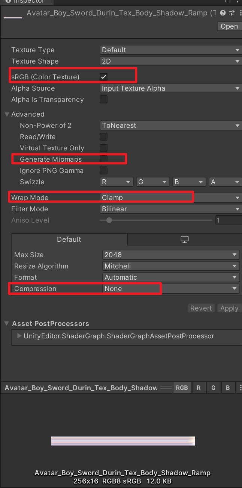

Face_Diffuse

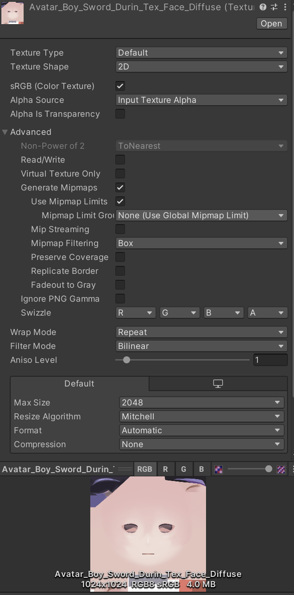

Hair_Diffuse

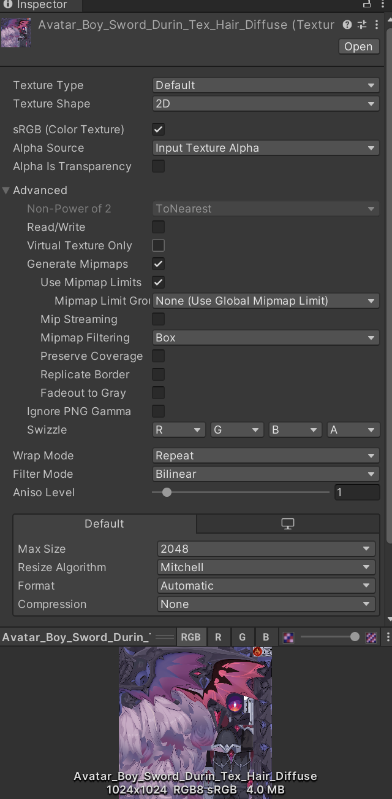

hair_lightmap

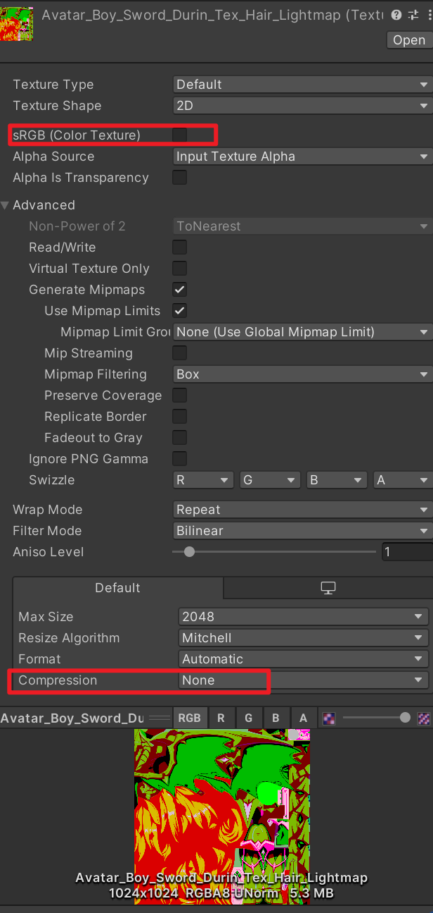

MetalMap

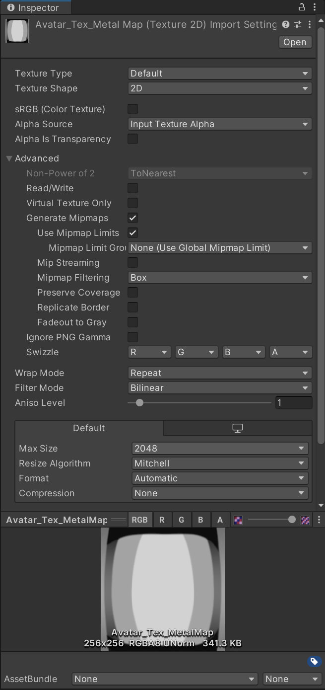

贴图设置完毕。

值得注意的是 杜林的翅膀贴图是和头发放在一起，观察一下贴图纹理的对应。

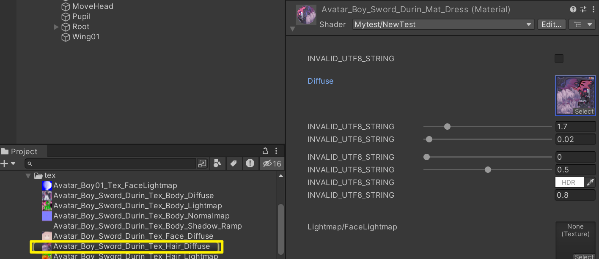


## 2 代码结构

### 1.整体结构

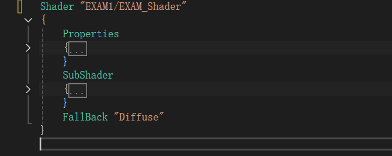

一开始不太习惯HLSL的代码结构，和CG有一定的区别，注意。

```
Shader "EXAM1/EXAM_Shader"
{
    Property
    {
        ……
    }

    Subshader
    {
        Pass
        {……}

        Pass
        {……}
    }
}

```

### 2.Subshader结构

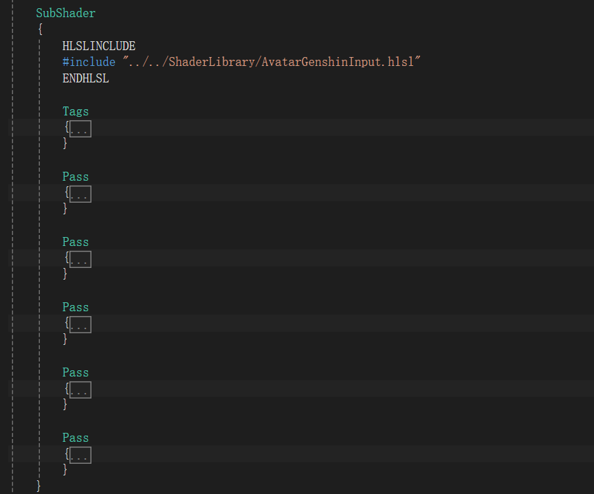

```
 SubShader
 {
     HLSLINCLUDE
     #include "../../ShaderLibrary/…….hlsl"
     ENDHLSL
     
     Tags
     {……}
     
     Pass
     {……}
     
     Pass
     {……}
 }
```

### Subshader结构

**1.HLSLINCLUDE & ENDHLSL**

```
 SubShader
 {
     HLSLINCLUDE
     //导入库
     #include "Packages/com.unity.render-pipelines.universal/ShaderLibrary/Core.hlsl"  //默认库
     #include "Packages/com.unity.render-pipelines.universal/ShaderLibrary/Lighting.hlsl"  //光照库        
     ENDHLSL

     Pass {  
         };
 }
```

**HLSLINCLUDE** 和 **ENDHLSL** 是Unity ShaderLab中的指令，它们之间的代码会被**自动包含到该着色器的所有Pass中**。

相当于一个“公共头文件”，写在这里的代码（如变量声明、函数、宏定义）对所有Pass都可见。

**为什么这样设计？**

- **减少重复**：如果不使用HLSLINCLUDE，每个Pass都需要单独声明这些变量和贴图，代码会冗长且难以维护。
- **保持一致性**：所有Pass使用同一套参数和贴图，确保渲染结果统一。

**2 HLSLPROGRAM**

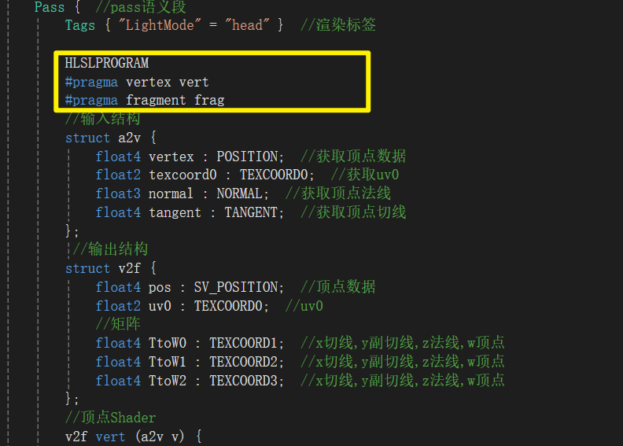

在Unity URP Shader中，每个Pass通常需要将顶点和片元着色器代码包裹在`HLSLPROGRAM`和`ENDHLSL`块中。

### Pass结构

Pass块中，需要在`Tags`之后添加`HLSLPROGRAM`：

```
Pass {
    Tags { "LightMode" = "head" }
    
    HLSLPROGRAM
    #pragma vertex vert
    #pragma fragment frag
    
    // 您的a2v和v2f结构体定义
    // 您的vert和frag函数定义
    
    ENDHLSL
}
```

**3 在 `frag` 函数内部定义函数（HLSL 不允许）**

在 `frag` 里写大量函数定义，例如：

```
half4 frag (v2f i) : SV_TARGET {

    float3 shadow_ramp(...) { ... }
    float3 Spec(...) { ... }
    float3 Metal(...) { ... }
    float3 edgeLight(...) { ... }
    float3 light(...) { ... }
    float3 Body(...) { ... }
    float3 Face(...) { ... }

    ...
}

```

这是**绝对错误**的

- **HLSL / ShaderLab 不支持函数嵌套定义**
- 函数**必须定义在全局作用域**
- DX11 编译器会直接报错

**正确写法：**

```
float3 shadow_ramp(float4 lightmap, float NdotL) { ... }
float3 Spec(...) { ... }
float3 Metal(...) { ... }
float3 edgeLight(...) { ... }
float3 light(...) { ... }
float3 Body(...) { ... }
float3 Face(...) { ... }

half4 frag(v2f i) : SV_TARGET
{
    ...
}

```

## 3 正式开始

正式开始前先把计算需要用到的变量和向量等数据准备好，先来准备面板参数，面板参数如下：

```
Properties{


}
```

URP的声明参数必须包含在CBUFFER_START(UnityPerMaterial)和CBUFFER_END之间，我们把这些代码和声明贴图的代码都用HLSLINCLUDE和ENDHLSL代码块包起来，之后写的方法也放在这里面，这样后面就不用在每个pass都声明一次了。

```
Subshader
{
	

}
```

#### 1.第一个pass：渲染正面

```
Pass{
	Tags{ "LightMode" = "head" }//渲染标签
}
```

##### 1）输入结构：a2v定义从应用阶段（CPU）到顶点着色器的顶点数据。

```
struct a2v{
	float4 vertex : POSITION;//顶点坐标
	float2 texcoord0 : TEXCOORD0;//纹理坐标UV0
	float3 normal : NORMAL;//顶点法线
	float4 tangent : TANGENT;//顶点切线
};
```

为什么`normal`是`float3`而`tangent`是`float4`？

> 1. **法线（normal）**：`float3` 法线是一个三维向量（x, y, z），表示顶点表面的朝向。 它只需要三个分量就能完整描述方向，因此使用`float3`足够。
> 2. **切线（tangent）**：`float4` 切线通常用于法线贴图（normal mapping）计算，需要与法线和副切线（binormal/bitangent）构成切线空间（tangent space）。 前三个分量（x, y, z）表示切线的方向向量。 **第四个分量（w）是一个符号值**，通常为+1或-1，用于指示副切线的方向。
>
> **关键区别**：
>
> 1. **法线的方向是绝对的**： 法线向量(x, y, z)本身就完整定义了方向 例如，法线(0, 1, 0)明确表示"向上"，没有歧义
> 2. **切线需要确定副切线方向**： 给定法线和切线后，副切线可以通过叉积计算：`副切线 = 叉积(法线, 切线)` **但叉积有两种可能方向**：左手系或右手系 `tangent.w`（通常±1）就是用来指定这个方向的： 如果`tangent.w = 1`：副切线 = 叉积(法线, 切线) 如果`tangent.w = -1`：副切线 = 叉积(切线, 法线)
> 3. **几何意义**： 法线、切线、副切线构成**切线空间基** 法线是"主方向"，切线和副切线是"辅助方向" 切线的w分量确保整个坐标系的一致性（避免镜像翻转）

##### 2）输出结构：v2f定义在顶点着色器中构建一个【切线空间到世界空间的3x4变换矩阵】，并传递到片元着色器的输出数据。

> 通常被称为 **TBN矩阵**（由Tangent、Bitangent、Normal三个向量构成），它的核心作用是**搭建一座桥梁，将法线方向从“切线空间”转换到“世界空间”**，这是实现法线贴图（Normal Mapping）效果的关键步骤

```
struct v2f{
	float4 pos : SV_POSITION;//在裁剪空间的顶点位置
	float2 uv0 : TEXCOORD0;//uv0，第一套纹理坐标
    // 这三行共同构成了一个3x4矩阵。
    float4 TtoW0 : TEXCOORD1;  //x切线,y副切线,z法线,w顶点
    float4 TtoW1 : TEXCOORD2;  //x切线,y副切线,z法线,w顶点
    float4 TtoW2 : TEXCOORD3;  //x切线,y副切线,z法线,w顶点
	//x-切线tangent
	//y-副切线bitangent
	//z-法线normal
	//w-顶点
    };
```

> 输出结构定义一个4维矩阵存放数据，以充分利用插值寄存器。
>
> a2v和v2f两个结构体中使用了两次**TEXCOORD0**语义，这是被允许的，因为语义就是会在两个结构体中有着不同的含义，可以理解成代号，但在之后的过程中这两个TEXCOORD0会指代不同的纹理寄存器，所以不会冲突。

* `TEXCOORD0` 在不同结构体中并不代表一个固定的寄存器，而是一个语义标记，这个语义对应一个四维向量（`float4`）的存储空间，用于在着色器阶段之间传递数据。

* `TEXCOORD1、TEXCOORD2、TEXCOORD3`都用于在着色器阶段间传递数据，但它们通过数字编号（1, 2, 3）来**代表不同的数据通道**，用于区分不同的信息。

* **合理规划数据用量**：一个 `float4`可以存储一个四维数据，也可以存储多个低维数据（如两个 `float2`）。合理打包数据可以节省宝贵的 `TEXCOORD`通道。

* **数量限制**：`TEXCOORD`通道的数量并非无限，存在上限（例如通常最多到 `TEXCOORD7`），需根据目标平台合理规划。

在顶点Shader将需要的数据传递给片元Shader，矩阵的xyzw分别存放切线，副切线，法线与顶点。

##### 3)  vert顶点shader：将需要的数据传递给片元Shader，矩阵的xyzw分别存放切线，副切线，法线与顶点。

```
v2f vert(a2v v)
{
	v2f o;
	o.pos = TransformObjectToClip(v.vertex.xyz);
	o.uv0 = v.texcoord0;
	
	float3 nDirWS = TransformObjectToWorldNormal(v.normal); 
	float3 tDirWS = TransformObjectToWorld(v.tangent.xyz); 
	float3 bDirWS = cross(nDirWS,tDirWS) * v.tangent.w;
	float3 posWS = TransformObjectTOWorld(v.vertex.xyz);
	
	o.TtoW0 =  float4(nDirWS.x,nDirWS.x,bDirWS.x,posWS.x);
	o.TtoW1 =  float4(nDirWS.y,nDirWS.y,bDirWS.y,posWS.y);
	o.TtoW2 =  float4(nDirWS.z,nDirWS.z,bDirWS.z,posWS.z);
	
	return o;
	
}
```

> 注意 v.vertex的顶点坐标是4维，因为齐次坐标系多1维（存平移信息）

```
 //顶点Shader
 v2f vert (a2v v) {
     v2f o;  //定义返回值
     //MVP变换(模型空间>>世界空间>>视觉空间>>裁剪空间)
     o.pos = TransformObjectToHClip(v.vertex.xyz);  
     //传递uv0(无变换)
     o.uv0 = v.texcoord0;  
     // 世界空间法线
     float3 nDirWS = TransformObjectToWorldNormal(v.normal); 
     // 世界空间切线
     float3 tDirWS = TransformObjectToWorld(v.tangent.xyz);  
     //世界空间副切线
     float3 bDirWS = cross(nDirWS, tDirWS) * v.tangent.w;  
     //世界顶点位置
     float3 posWS = TransformObjectToWorld(v.vertex.xyz);  
     //构建切线-世界空间变换矩阵
     //x切线,y副切线,z法线,w顶点
     o.TtoW0 = float4(tDirWS.x, bDirWS.x, nDirWS.x, posWS.x);  
     o.TtoW1 = float4(tDirWS.y, bDirWS.y, nDirWS.y, posWS.y);  
     o.TtoW2 = float4(tDirWS.z, bDirWS.z, nDirWS.z, posWS.z);  
     return o;  //返回顶点Shader
 }
```


#### 4）【重点】frag 片元着色器

> 回顾：在pass之前，声明的所有变量
>
> ```
> SubShader
> {
>   HLSLINCLUDE
>   //导入库
>   #include "Packages/com.unity.render-pipelines.universal/ShaderLibrary/Core.hlsl"  //默认库
>   #include "Packages/com.unity.render-pipelines.universal/ShaderLibrary/Lighting.hlsl"  //光照库
>   CBUFFER_START(UnityPerMaterial)  //常量缓冲区开头
>       //声明面板参数
>       float _genshinShader;  //是否是脸部
>       //diffuse
>       float _fresnel;  //边缘光范围
>       float _edgeLight;  //边缘光强度
>       float _diffuseA;  //diffuseA
>       float _Cutoff;  //透明阈值
>       float4 _glow;  //自发光强度
>       float _flicker;  //发光闪烁速度
>       //lightmap/FaceLightmap
>       float _bright;  //亮面范围
>       float _grey;  //灰面范围
>       float _dark;  //暗面范围
>       //normal
>       float _bumpScale;  //法线强度
>       //ramp
>       float _dayAndNight;  //是否是白天
>       float _lightmapA0;  //1.0_Ramp条数
>       float _lightmapA1;  //0.7_Ramp条数
>       float _lightmapA2;  //0.5_Ramp条数
>       float _lightmapA3;  //0.3_Ramp条数
>       float _lightmapA4;  //0.0_Ramp条数
>       //高光
>       float _gloss;  //高光范围
>       float _glossStrength;  //高光强度
>       float3 _metalMapColor;  //金属反射颜色
>       //描边
>       float _OutlineWidth;  //描边粗细
>       float _OutlineScale;  //描边范围
>       float _OutlineZOffset;  //Outline Z Offset
>       float _Alpha;  //Alpha
>       float _AlphaClip;  //Alpha Clip
>       float4 _OutlineColor0;  //描边颜色1
>       float4 _OutlineColor1;  //描边颜色2
>       float4 _OutlineColor2;  //描边颜色3
>       float4 _OutlineColor3;  //描边颜色4
>       float4 _OutlineColor4;  //描边颜色5
>       float4 _CustomOutlineCol;  //Custom Outline Color
>   CBUFFER_END  //常量缓冲区结尾
>   
>   //------声明贴图-------
>   //1.声明 纹理对象：漫反射纹理
>   TEXTURE2D(_diffuse);  //Diffuse
>   //2.声明 采样器对象：漫反射采样器
>   SAMPLER(sampler_diffuse);
>   //3.以此类推
>   TEXTURE2D(_lightmap);  //Lightmap/FaceLightmap
>   SAMPLER(sampler_lightmap);
>   TEXTURE2D(_bumpMap);  //Normal
>   SAMPLER(sampler_bumpMap);
>   TEXTURE2D(_ramp);  //Shadow_Ramp
>   SAMPLER(sampler_ramp);
>   TEXTURE2D(_metalMap);  //MetalMap
>   SAMPLER(sampler_metalMap);
>   ENDHLSL
> 
> ```
>
> ### 为什么纹理和采样器分开声明？
>
> 纹理和采样器分开声明的方式，是现代图形API的常见做法（如DirectX 11及以上、Vulkan、Metal等）的特性。以实现更灵活的纹理采样和更好的性能。
>
> **作用：复用采样器。**
>
> 这是最直接的好处。在同一个Shader中，如果多张纹理需要使用相同的过滤模式（如Linear）和包裹模式（如Repeat），那么只需声明一个具有相应模式的采样器，所有纹理都可以共享它。

片元着色器的主要任务是为模型表面的每一个像素计算最终颜色。它的工作流程可以概括为以下几步：

1. **纹理采样**：从不同的纹理中读取信息。

2. **向量准备**：计算光照和视角所需的方向向量。

3. **光照计算**：根据不同的渲染路径（身体或脸部）计算颜色。

4. **后期处理**：处理自发光或透明度裁剪。

5. **输出**：返回最终的像素颜色。

##### frag 片元着色器

```
 half4 frag (v2f i) : SV_TARGET {
     //采样贴图
     float3 baseColor = SAMPLE_TEXTURE2D(_diffuse, sampler_diffuse, i.uv0).rgb;  //diffuseRGB通道
     float diffuseA = SAMPLE_TEXTURE2D(_diffuse,sampler_diffuse, i.uv0).a;  //diffuseA通道
     float4 lightmap = SAMPLE_TEXTURE2D(_lightmap, sampler_lightmap, i.uv0).rgba;  //lightmap
     //法线贴图
     float3 nDirTS = UnpackNormal(SAMPLE_TEXTURE2D(_bumpMap, sampler_bumpMap, i.uv0)).rgb;  //切线空间法线(采样法线贴图并解码)
     nDirTS.xy *= _bumpScale;  //法线强度
     nDirTS.z = sqrt(1.0 - saturate(dot(nDirTS.xy, nDirTS.xy)));  //计算法线z分量
     //saturate的作用是把输入值钳制在（0.0, 1.0）之间.
     //准备向量
     float3 posWS = float3(i.TtoW0.w, i.TtoW1.w, i.TtoW2.w);  //世界空间顶点
     //切线空间法线转世界空间法线
     float3 nDirWS = normalize(half3(dot(i.TtoW0.xyz, nDirTS), dot(i.TtoW1.xyz, nDirTS), dot(i.TtoW2.xyz, nDirTS)));
     Light mlight = GetMainLight();  //光源
     float3 lDirWS= normalize(mlight.direction);  //世界光源方向(平行光)
     float3 vDirWS = normalize(_WorldSpaceCameraPos.xyz - posWS.xyz);  //世界观察方向
     float3 nDirVS = normalize(mul((float3x3)UNITY_MATRIX_V, nDirWS));  //世界空间法线转观察空间法线
     float3 hDirWS = normalize(vDirWS + lDirWS) ;  //半角方向
     //向量点乘
     float NdotL = dot(nDirWS, lDirWS);  //兰伯特
     float NdotH = dot(nDirWS, hDirWS);  //Blinn-Phong
     float NdotV = dot(nDirWS, vDirWS);  //菲涅尔

     float3 col = float3(0.0, 0.0, 0.0);

     //主体渲染
     if(_genshinShader == 0.0){  //身体
         col = Body(NdotL, NdotH, NdotV, lightmap, baseColor, nDirVS);
     }else if(_genshinShader == 1.0){  //脸部
         col = Face(lDirWS, baseColor, i.uv0);
     }
     //计算diffuse.a
     if(_diffuseA == 2){  //自发光
         float3 diffA = light(col, diffuseA);
         col = col + diffA;
     }else if(_diffuseA == 1){ //裁剪
         diffuseA = smoothstep(0.05, 0.7, diffuseA);  //去除噪点
         clip(diffuseA - _Cutoff);
     }
     return half4(col, 1.0);  //输出
 }
```

其中：

##### 1 Saturate

Saturate是钳制函数，作用是将输入值限制在0.0~1.0之间。

* 如果输入值 **小于0**，则返回 **0**。

* 如果输入值 **大于1**，则返回 **1**。

* 如果输入值 **在0和1之间**，则**原样返回**。

法线的z值`nDirTS.z = sqrt (1.0 - saturate( dot ( nDirTS.xy , nDirTS.xy ) ) );`等价于` z = sqrt(1 - (x² + y²)) `

数学上，平方和 `x² + y²`有可能略微超过1（例如由于纹理采样的精度问题）。如果不对其进行钳制，`1.0 - (x² + y²)`可能会得到一个负数，而对负数进行 `sqrt`开方运算会产生无效的结果（在Shader中通常会导致不可预知的渲染错误，如出现黑色斑点或NaN）。使用 `saturate`确保了开方运算的内容永远是一个非负数，从而避免了这种错误。

##### 2 TBN矩阵

```
 //切线空间法线转世界空间法线
     float3 nDirWS = normalize(half3(dot(i.TtoW0.xyz, nDirTS), dot(i.TtoW1.xyz, nDirTS), dot(i.TtoW2.xyz, nDirTS)));
```

$$
世界空间法线 = TBN矩阵 × 切线空间法线
$$

代码中混合使用了 `float`和 `half`精度。对于颜色等不需要高精度的数据，使用 `half`可以优化性能。

> 在着色器中，颜色分量（R, G, B, A）通常被规范在 `[0, 1]`的范围内。这个范围完全在 `fixed`类型的表示能力之内.
>
> **人眼的感知局限**：人眼对颜色的细微变化并不像对亮度变化那样敏感。微小的颜色量化误差（例如，`0.5`和 `0.501`的红色）在绝大多数情况下是难以察觉的.
>
> **哪些数据需要高精度**
>
> 与颜色相反，以下类型的数据通常要求使用 `float`高精度：
>
> - **空间坐标**：尤其是**世界空间坐标**和**纹理坐标**。它们的数值范围很大且变化非常细微，高精度是确保物体位置、轮廓和纹理映射准确无误的基础。
> - **复杂数学运算**：在进行三角函数计算（如`sin`, `cos`）、幂运算（`pow`）或复杂的插值时，必须使用 `float`来保证中间过程和最终结果的准确性，避免误差累积导致画面瑕疵。
> - **需要高动态范围（HDR）的颜色**：虽然普通颜色用`half`足矣，但**HDR颜色**的值会远超 `[0, 1]`的范围，因此需要 `half`或 `float`来存储和处理。

##### 3 切线空间法线贴图

**颜色特征**:

整体**偏蓝紫色**

**核心优势:**

**旋转不变性**、可复用性高

**适用场景:**

通用性强，适用于可变形、动画模型

##### 4 三个光照模型：

```
     //向量点乘
     float NdotL = dot(nDirWS, lDirWS);  //兰伯特
     float NdotH = dot(nDirWS, hDirWS);  //Blinn-Phong
     float NdotV = dot(nDirWS, vDirWS);  //菲涅尔
```

在计算前，我们看一下最终的混合分别需要什么：**漫反射(半Lambet) + 高光(BlinnPhong) + 金属(MatCap) + 边缘光(菲涅尔) + 自发光** **+ 后处理(Bloom、ToneMapping、ColorAdjustments)。**那我们就按这个顺序来一一实现一下。

##### **菲涅尔效应（Fresnel Effect）**

 是一个**核心物理规律**，用于描述**光线在物体表面的反射强度随着视角角度变化的现象**。

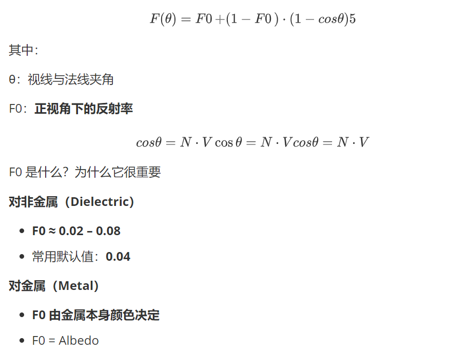

##### 兰伯特（Lambert）模型公式

理想的漫反射：

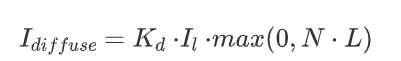
$$
I
_{diffuse}
	​

=K
_d
	​

⋅I
_l
	​

⋅max(0,N⋅L)
$$


**半兰伯特（Half-Lambert）改进**

基础兰伯特模型的一个问题是，当法线与光线方向垂直时，计算结果会直接变为0，导致背光面一片死黑。半兰伯特模型通过一个简单的缩放和平移变换来缓解这个问题

这个技巧将点乘的结果从区间 [−1,1]映射到 [0,1]，使得背光区域也能保留一定的细节，常用于卡通渲染等风格化效果中

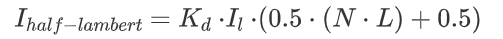
$$
I
_{half-lambert}
	​

=K
_d
	​

⋅I
_l
	​

⋅(0.5⋅(N⋅L)+0.5)
$$

##### 布林-冯（Blinn-Phong）模型公式

布林-冯模型是一个完整的光照模型，它**结合了环境光、漫反射和镜面高光**三项。其总光照强度为

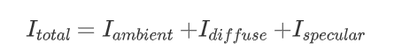
$$
I
_{total}
	​

=I
_{ambient}
	​

+I
_{diffuse}
	​

+I
_{specular}
	​
$$
**环境光（Ambient）**
$$
I
_{ambient}
	​

=K
a
	​

⋅I
a
	​
$$
Ka：材质的环境光反射系数

**漫反射（Diffuse）**
$$
I
_{diffuse}
	​

=K
_d
	​

⋅I
_l
	​

⋅max(0,N⋅L)
$$


 **镜面高光（Specular）·布林-冯的核心**

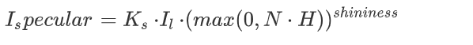
$$
I
_specular_
	​

=K
_s
	​

⋅I
_l
	​

⋅(max(0,N⋅H))
^{shininess}
$$
**H：半角向量**，通过将光线方向 L和视线方向 V相加后归一化得到：H=∣L+V∣L+V。

**shininess：**高光指数，这是一个非常重要的参数。值越大，高光点越小、越锐利，表示表面越光滑；值越小，高光范围越大、越柔和，表示表面越粗糙。

**Ks：**材质的**镜面反射系数**，决定了高光的强度和颜色


#### 5)漫反射： shadow_ramp（lightmap，NdotL）

我们看一下最终的混合分别需要什么：**漫反射(半Lambet) + 高光(BlinnPhong) + 金属(MatCap) + 边缘光(菲涅尔) + 自发光** **+ 后处理(Bloom、ToneMapping、ColorAdjustments)。**

> 原神角色的漫反射，最重要的是ramp的部分，先看一下原神的ramp图。
>
> * 共2张shadowmap，一张给body，一张给hair
> * 
>
> * 原神的ramp一共十条颜色，上面五条代表白天，下面五条代表晚上
> * 
> * 

**怎样采样这张ramp呢？**

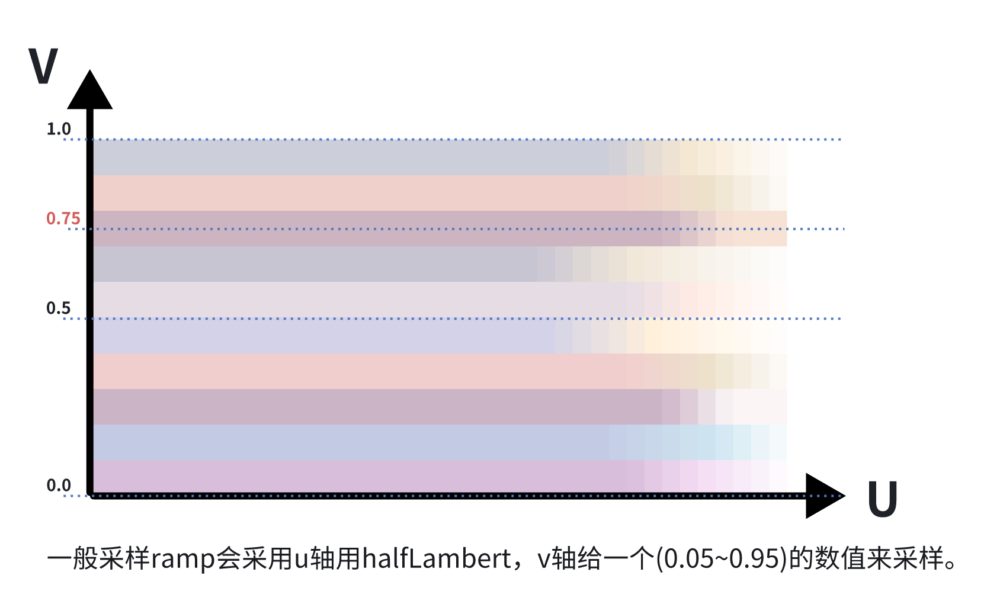

+0.05：防止采样到色块边缘。

```
//lightmap/FaceLightmap
float _bright;  //亮面范围
float _grey;  //灰面范围
float _dark;  //暗面范围
```

```
//完整的shadow_ramp
float3 shadow_ramp(float4 lightmap, float NdotL){
     lightmap.g = smoothstep(0.2, 0.5, lightmap.g);  //lightmap.g
     float halfLambert = smoothstep(0.0, _grey, NdotL + _dark) * lightmap.g;  //半Lambert
     float brightMask = step(_bright, halfLambert);  //亮面
     //判断白天与夜晚
     float rampSampling = 0.0;
     if(_dayAndNight == 0){rampSampling = 0.5;}
     //计算ramp采样条数
     float ramp0 = _lightmapA0 * -0.1 + 1.05 - rampSampling;  //0.95
     float ramp1 = _lightmapA1 * -0.1 + 1.05 - rampSampling;  //0.65
     float ramp2 = _lightmapA2 * -0.1 + 1.05 - rampSampling;  //0.75
     float ramp3 = _lightmapA3 * -0.1 + 1.05 - rampSampling;  //0.55
     float ramp4 = _lightmapA4 * -0.1 + 1.05 - rampSampling;  //0.45
     //分离lightmap.a各材质
     float lightmapA2 = step(0.25, lightmap.a);  //0.3
     float lightmapA3 = step(0.45, lightmap.a);  //0.5
     float lightmapA4 = step(0.65, lightmap.a);  //0.7
     float lightmapA5 = step(0.95, lightmap.a);  //1.0
     //重组lightmap.a
     float rampV = ramp0;  //0.0
     rampV = lerp(rampV, ramp1, lightmapA2);  //0.3
     rampV = lerp(rampV, ramp2, lightmapA3);  //0.5
     rampV = lerp(rampV, ramp3, lightmapA4);  //0.7
     rampV = lerp(rampV, ramp4, lightmapA5);  //1.0
     //采样ramp
     float3 ramp = SAMPLE_TEXTURE2D(_ramp, sampler_ramp, float2(halfLambert, rampV)); 
     float3 shadowRamp = lerp(ramp, halfLambert, brightMask);  //遮罩亮面
     return shadowRamp;  //输出结果
 }
```

##### 5.1 Lightmap.g

lightmap.g该图的g通道存储了模型的AO，仅看lightmap.g结果如下：

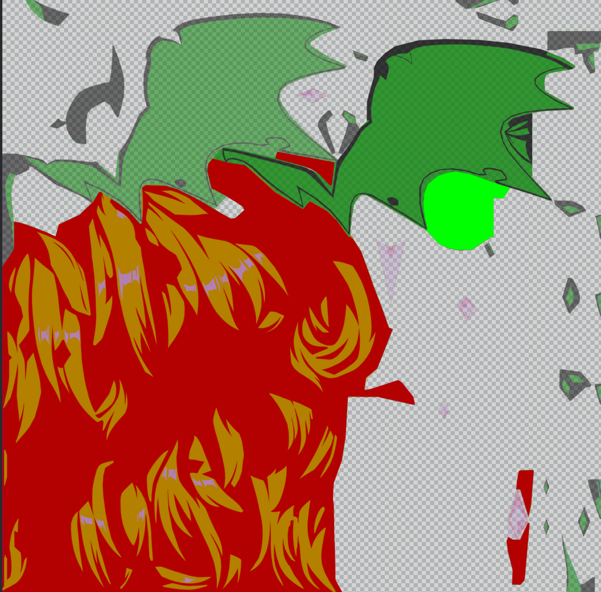

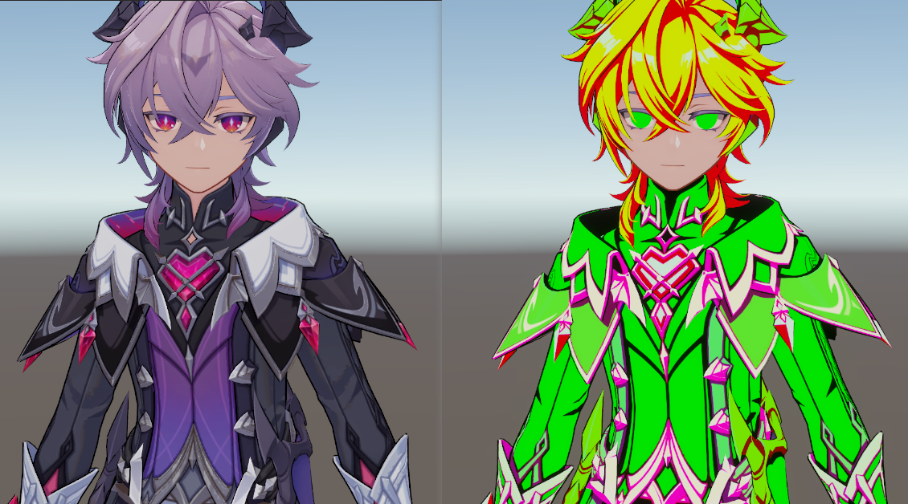

```
//这里仅做测试代码
//ramp
float3 shadow_ramp(float4 lightmap, float NdotL){
    float3 ramp = lerp(0, 1, lightmap.g); 
    return ramp;  
}

//身体//身体

float3 Body(){
    float3 ramp = shadow_ramp(lightmap, NdotL);  //ramp
    ……
    float3 body = ramp;
    return body;  //输出结果
}
```

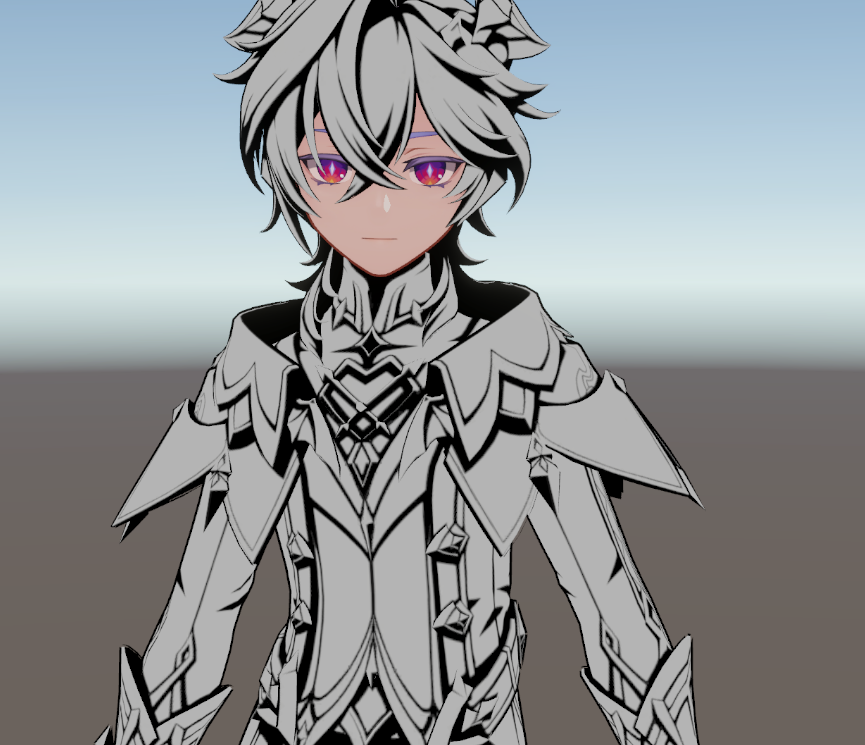

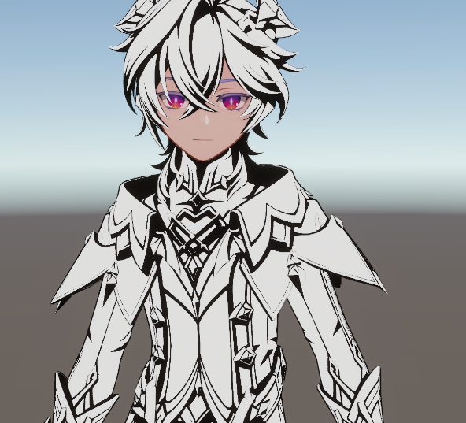

> 很显然，仅lightmap.g的AO边缘锯齿明显，smoothstep后的则平滑。

##### 5.2 halfLambert采样ramp（U轴）

```
lightmap.g = smoothstep(0.2, 0.5, lightmap.g);  //lightmap.g，0.2-0.5是我截取lightmap的rgb值估计的一个范围
float halfLambert = smoothstep(0.0, _grey, NdotL + _dark) * lightmap.g;  //半Lambert变体
```

> NdotL是顶点法向量与光照方向点积的结果，传统范围是 [-1, 1].
>
> 传统半Lambert: **halfLambert = 0.5（NdotL）+0.5**
>
> 把NdotL的范围压缩到（0，1）内。这样原本位于（-1，0）的暗部也会提亮。
>
> #### 半兰伯特模型变体
>
> ```
> halfLambert (0.0, _grey, NdotL + _dark) 
> ```
>
> * smoothstep(0.0,_grey, ...)：这个函数将 (NdotL + _dark)的值映射为：
>   * 所有小于 0.0的值被压成0（最暗），
>   * 所有大于 _grey的值被提成1（最亮），
>   * 介于 0.0和 _grey之间的值则产生平滑的过渡。
> * grey参数控制了从**暗部过渡到亮部的区域宽度**。
> * NdotL + _dark：这里的 _dark是一个偏移量（对应传统半Lambert的0.5），可以理解为**暗部阈值**。增加 _dark会整体提亮模型，因为更多的值会超过 _grey阈值；**减小它则会变暗**。

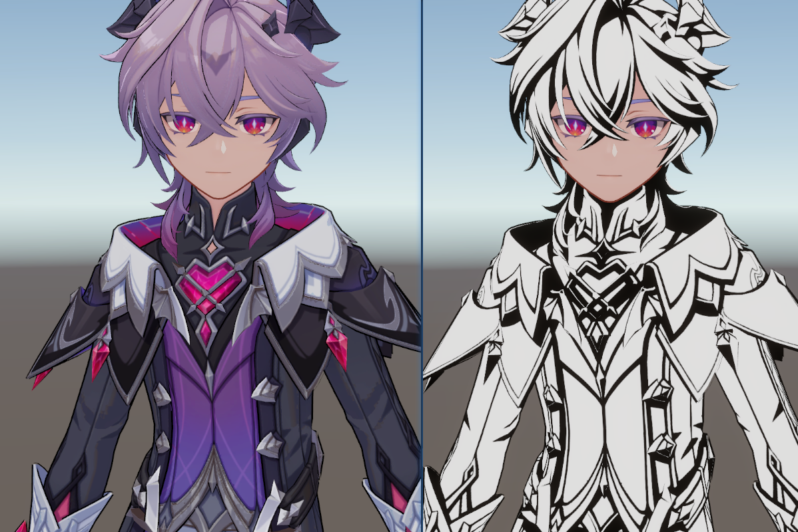

##### 5.3 rampV采样lightmap（V轴）

```reStructuredText
//判断白天与夜晚
float rampSampling = 0.0;
if(_dayAndNight == 0){rampSampling = 0.5;}
```

然后开放5个参数在面板上，方便美术调节。并把面板上1-5的采样条数转换成ramp图的取值范围。如果是白天，则是采样到0.55-0.95，而晚上则是采样到0.05-0.45.

```
//计算ramp采样条数
float ramp0 = _lightmapA0 * -0.1 + 1.05 - rampSampling;  //0.95 | 0.45
float ramp1 = _lightmapA1 * -0.1 + 1.05 - rampSampling;  //0.65 | 0.35
float ramp2 = _lightmapA2 * -0.1 + 1.05 - rampSampling;  //0.75 | 0.25
float ramp3 = _lightmapA3 * -0.1 + 1.05 - rampSampling;  //0.55 | 0.15
float ramp4 = _lightmapA4 * -0.1 + 1.05 - rampSampling;  //0.45 | 0.05
```

然后用step将lightmap.a的各个材质分离出来。

```
//分离lightmap.a各材质
float lightmapA2 = step(0.25, lightmap.a);  //0.3
float lightmapA3 = step(0.45, lightmap.a);  //0.5
float lightmapA4 = step(0.65, lightmap.a);  //0.7
float lightmapA5 = step(0.95, lightmap.a);  //1.0
```

> step(a, b)的含义
>
> | b<a  | b>=a |
> | ---- | ---- |
> | 0    | 1    |
>
> 所以 lightmapA2/3/4/5的值可以看作一个开关：要么是1，要么是0.

```
//重组lightmap.a
float rampV = ramp0;  
rampV = lerp(rampV, ramp1, lightmapA2);  //0.3
rampV = lerp(rampV, ramp2, lightmapA3);  //0.5
rampV = lerp(rampV, ramp3, lightmapA4);  //0.7
rampV = lerp(rampV, ramp4, lightmapA5);  //1.0
```

> lerp(a, b, t)
>
> `t = 0` → = a
>
> `t = 1` → = b

这整个流程就是一个**条件覆盖链**：
如果区域 ≥ 0.25 → rampV换成 ramp1
 如果区域 ≥ 0.45 → rampV再换成 ramp2
 如果区域 ≥ 0.65 → rampV再换成 ramp3
 如果区域 ≥ 0.95 → rampV最终换成 ramp4

##### 5.4 U（兰伯特）+V（rampV）采样shadowramp图

```
//采样ramp
float3 ramp = SAMPLE_TEXTURE2D(_ramp, sampler_ramp, float2(halfLambert, rampV)); 
return ramp;
```

可以得到：

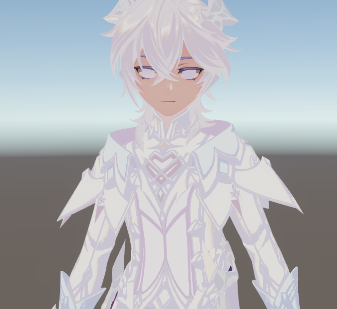

* 将亮面遮罩出来，用step来处理halfLambert分出亮面和暗面。(用smoothstep会更平滑)

```
float brightMask = step(_bright, halfLambert);  //亮面
```

_bright开放变量给inspector手动设置，一般0.90-0.99,对 step (bright, halfLambert)来说

| halfLambert | brightMask | 说明 |
| ----------- | ---------- | ---- |
| < _bright   | 0          | 暗面 |
| ≥ _bright   | 1          | 亮面 |

* 用lerp遮罩ramp和halfLambert。

```
float3 shadowRamp = lerp(ramp, halfLambert, brightMask);  //遮罩亮面
return shadowRamp;  //输出结果
```

| brightMask | 使用结果    |
| ---------- | ----------- |
| 0（暗面）  | ramp        |
| 1（亮面）  | halfLambert |

其实就是二分亮（固有色）-暗面。

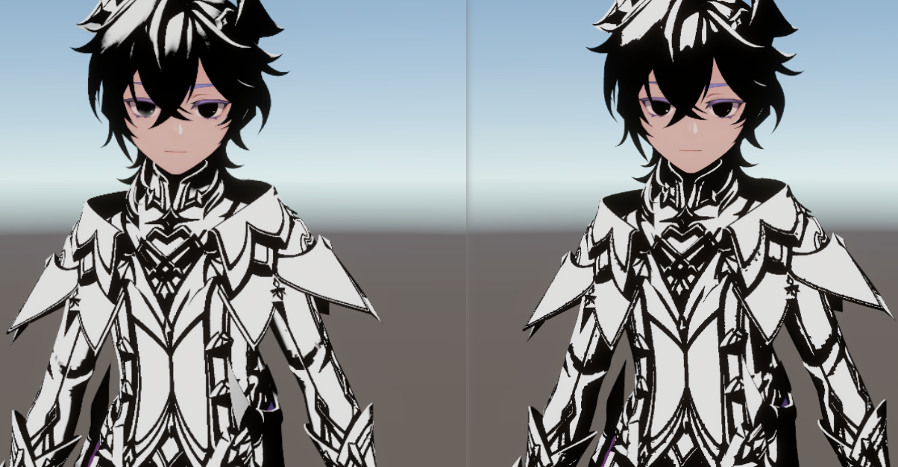

ramp的采样就结束了，最后将lerp的结果乘以baseColor就可以了.

```
    float3 Body(float NdotL, float NdotH, float NdotV, float4 lightmap, float3 baseColor, float3 nDirVS){
    float3 ramp = shadow_ramp(lightmap, NdotL) ;  //ramp
    float3 diffsue = baseColor * ramp  ;  //漫反射
}
```

#### 6）高光

高光的计算相对简单，高光使用Blinn-Phong光照模型：

```c++
 float3 Spec(float NdotL, float NdotH, float3 nDirVS, float4 lightmap, float3 baseColor)
 {
     float blinnPhong = pow(max(0.0, NdotH), _gloss);  //Blinn-Phong
     float3 specular = blinnPhong * lightmap.r * _glossStrength;  //高光强度
     specular = specular * lightmap.b;  //混合高光细节
     specular = baseColor * specular;  //叠加固有色
     lightmap.g = smoothstep(0.2, 0.3, lightmap.g);  //lightmap.g
     float halfLambert = smoothstep(0.0, _grey, NdotL + _dark) * lightmap.g;  //半Lambert
     float brightMask = step(_bright, halfLambert);  //亮面
     specular = specular * brightMask;  //遮罩暗面
     return specular;  //输出结果
 }
```

lightmap的r通道存放了模型的高光强度（值越白(1.0)的区域，高光越强；），b通道存放了模型的高光细节（形状）。

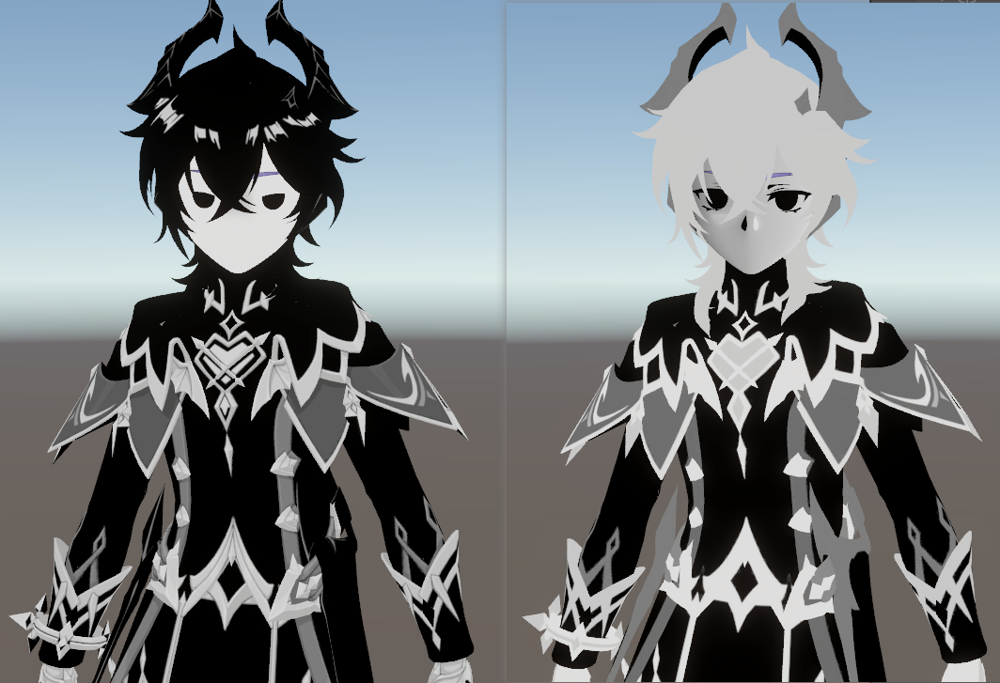

1）首先，通过经典的Blinn-Phong模型计算出一个基础的高光强度 `blinnPhong`，

```
 float blinnPhong = pow(max(0.0, NdotH), _gloss);
```

2）用Lightmap的R通道 `lightmap.r`高光强度 * 面板开放变量的 _glossStrength高光强度来调制这个高光。

```
 float3 specular = blinnPhong * lightmap.r * _glossStrength;
```

3）最后再乘以lightmap.b，得到高光形状。

```
specular = specular * lightmap.b;  //混合高光细节
```

4) 原神中角色处于暗部的部分是没有高光的，所以我们还要step一个halfLambert来遮罩亮暗部分。halfLambert的处理方式和漫反射的一样。

```
lightmap.g = smoothstep(0.2, 0.3, lightmap.g);  //lightmap.g，计算环境遮蔽AO
float halfLambert = smoothstep(0.0, _grey, NdotL + _dark) * lightmap.g;  //半Lambert
float brightMask = step(_bright, halfLambert);  //亮面
specular = specular * brightMask;  //遮罩暗面
return specular;  //输出结果
```

**在亮部区域**：半兰伯特的计算结果本身较亮，乘以 `lightmap.g`后，开阔区域（AO值为白色）保持明亮，而褶皱缝隙处（AO值为黑色或深色）则会变暗，从而自然地增添了细节。

**在暗部区域**：半兰伯特的计算结果本身较暗，再乘以 `lightmap.g`的深色值，会使这些区域（如腋下、衣褶）变得**更暗**，强化了闭塞阴影，让角色不会显得轻飘，而是牢牢地“锚定”在场景中。

#### 7）金属

金属部分用的是MatCap采样方法。


```
//金属
float3 Metal(float3 nDirVS, float4 lightmap, float3 baseColor){
    float metalMask = 1 - step(lightmap.r, 0.9);  //金属遮罩，即step(,0.9,lightmap.r)，一般不推荐取反的写法，这里标记出来纯属为了之后读到类似代码能有反应的能力。
    //采样metalMap
    float3 metalMap = SAMPLE_TEXTURE2D(_metalMap, sampler_metalMap, nDirVS.rg * 0.5 + 0.5).r;
    metalMap = lerp(_metalMapColor, baseColor, metalMap);  //金属反射颜色
    metalMap = lerp(0.0, metalMap, metalMask);  //遮罩非金属区域
    return metalMap;  //输出结果
}
```

> ```
>     float3 metalMap = SAMPLE_TEXTURE2D(_metalMap, sampler_metalMap, nDirVS.rg * 0.5 + 0.5).r;
> ```
>
> 
>
> #### 为什么用nDirVS.rg * 0.5 + 0.5 采样，而不是i.uv0？
>
> `_metalMap` 在这里的角色是 **MatCap / Reflection LUT**，
> 而不是一张“表面贴图”。
>
> `i.uv0`的适用场景
>
> * albedo
> * normal
> * roughness
> * AO
> * 手绘纹理
>
> *一般是随着建模过程中，由建模师/画师绘制好的贴图。
>
> `nDirVS.rg * 0.5 + 0.5 `
>
> 这是基于法线方向的环境反射  MatCap 技法。
>
> 一张图片只有：
>
> - 横向（U）
> - 纵向（V）
>
> 为什么选 .rg作为UV？
>
> >  x、y 刚好就是“屏幕平面方向”
> >
> > - x：左右
> > - y：上下
> >
> > 而z的含义： z（b）—— 朝不朝你
> >
> > - z = +1：正对摄像机
> > - z =  0：侧着
> > - z = -1：背对摄像机
>
> nDirVS → UV → MatCap

```
    //采样metalMap
    float3 metalMap = SAMPLE_TEXTURE2D(_metalMap, sampler_metalMap, nDirVS.rg * 0.5 + 0.5).r;
    metalMap = lerp(_metalMapColor, baseColor, metalMap);  //金属反射颜色
    metalMap = lerp(0.0, metalMap, metalMask);  //遮罩非金属区域
```

> #### 为什么metalMap要只取.r的单通道？
>
> 因为这张 `metalMap` 在这里的是“权重 / 强度 ”，而不是“颜色”，
>  所以只需要一个标量通道就够了。
>
> 注意：
>  👉 **你并没有直接把 metalMap 当颜色输出**
>  👉 而是马上拿它去做 `lerp`
>
> ```
> metalMap = lerp(_metalMapColor, baseColor, metalMap); 
> ```
>
> 也就是说：
>
> - `_metalMapColor`：颜色阈值1
> - `baseColor`：颜色阈值2
> - `metalMap`：**混合权重**
>
> #### 混合权重在图形学里永远是“单通道”的。

#### 8）菲涅尔（边缘光）

原神中用的是屏幕深度边缘光，这里用菲涅耳实现的效果。代码非常简单，就是简单的菲涅尔用step卡出硬边，再乘baseColor即可。

```
//边缘光
float3 edgeLight(float NdotV, float3 baseColor){
    float3 fresnel = pow(1 - NdotV, _fresnel);  //菲涅尔范围
    fresnel = step(0.5, fresnel) * _edgeLight * baseColor;  //边缘光强度
    return fresnel;  //输出结果
    }
```


 问题：

- 模型内部转折也会亮
- 鼻梁、衣服褶皱会出边

##### 基于屏幕深度空间的边缘光

```
float2 screenUV = i.screenPos.xy / i.screenPos.w; // 获取屏幕UV
float rawDepth = SAMPLE_DEPTH_TEXTURE(_CameraDepthTexture, sampler_CameraDepthTexture, screenUV);
float sceneDepth = Linear01Depth(rawDepth, _ZBufferParams); // 转换为线性01深度
```


#### **9）自发光**

```
//自发光
float3 light(float3 baseColor, float diffsueA){
    diffsueA = smoothstep(0.0, 1.0, diffsueA);  //去除噪点
    float3 glow = lerp(0.0, baseColor * ((sin(_Time.w * _flicker) * 0.5 + 0.5) * _glow), diffsueA);  //自发光
    return glow;  //输出结果
}
```

diffuse的a通道存放的是自发光遮罩(也有可能是透明遮罩)。这个遮罩有很多奇怪的噪点，smoothstep一下把噪点去除。

#### 10）最终混合diffsue + metal + specular + fresnel

```
 //身体
 float3 Body(float NdotL, float NdotH, float NdotV, float4 lightmap, float3 baseColor, float3 nDirVS){
     float3 ramp = shadow_ramp(lightmap, NdotL) ;  //ramp
     float3 specular = Spec(NdotL, NdotH, nDirVS, lightmap, baseColor);  //高光
     float3 metal = Metal(nDirVS, lightmap, baseColor);  //金属
     float3 diffsue = baseColor * ramp  ;  //漫反射
     diffsue = diffsue * step(lightmap.r, 0.9);  //遮罩金属区域
     float3 fresnel = edgeLight(NdotV, baseColor);  //边缘光
     //混合最终结果
     float3 body = diffsue + metal + specular + fresnel;
     return body;  //输出结果
 }
```

#### 11）脸部

原神用的SDF的方法来区分脸部明暗面，这是脸部的SDF图：

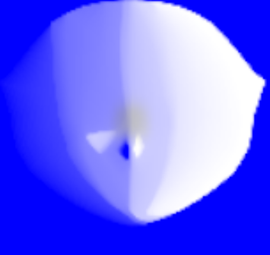

[(2 封私信 / 36 条消息) 神作面部阴影渲染还原 - 知乎](https://zhuanlan.zhihu.com/p/279334552)

```
 //脸部
 float3 Face(float3 lDirWS, float3 baseColor, float2 uv, float2 screenUV){ 
     lDirWS = -lDirWS;
     //采样贴图
     float SDF = SAMPLE_TEXTURE2D(_lightmap, sampler_lightmap, uv).r;  //采样SDF
     float SDF2 = SAMPLE_TEXTURE2D(_lightmap, sampler_lightmap, float2(1-uv.x, uv.y)).r;  //翻转x轴采样SDF
     //计算向量
     float3 up = float3(0,1,0);  //上方向
     float3 front = unity_ObjectToWorld._13_23_33;  //角色前朝向
     float3 left = cross(front, up);  //左侧朝向
     float3 right = -cross(front, up);  //右侧朝向
     //点乘向量
     float frontL = dot(normalize(front.xz), normalize(lDirWS.xz));  //前点乘光
     float leftL = dot(normalize(left.xz), normalize(lDirWS.xz));  //左点乘光
     float rightL = dot(normalize(right.xz), normalize(lDirWS.xz));  //右点乘光
     //计算阴影
     float lightAttenuation = (frontL > 0) * min((SDF > leftL), 1 - (SDF2 < rightL));
     //判断白天与夜晚
     float rampSampling = 0.0;
     if(_dayAndNight == 0){rampSampling = 0.5;}
     //计算V轴
     float rampV = _lightmapA4 * -0.1 + 1.05 - rampSampling;  //0.85
     //采样ramp
     float3 rampColor = SAMPLE_TEXTURE2D(_ramp, sampler_ramp, float2(lightAttenuation, rampV));
     //混合baseColor
     float3 face = lerp(baseColor * rampColor, baseColor, lightAttenuation);
     return face;  //输出结果
 }
```

我发现直接把SDF反向得到的另半边的SDF的结果是错误的，所以翻转x轴再采样了一遍SDF图。

用if来判断:

```
float3 col = float3(0.0, 0.0, 0.0);
    //主体渲染
    if(_genshinShader == 0.0){  //身体
    col = Body(NdotL, NdotH, NdotV, lightmap, baseColor, nDirVS,screenUV);
    }else if(_genshinShader == 1.0){  //脸部
    col = Face(lDirWS, baseColor, i.uv0,screenUV);
}
```

#### **12) 添加自发光**

diffuse的a通道，可能是自发光，也有可能是透明蒙版，我们需要开放一个参数给美术选择，当是自发光的时候，就把输出结果加上自发光效果，为透明蒙版的时候就按透明蒙版裁剪掉透明的像素。

```
//计算diffuse.a
if(_diffuseA == 2){  //自发光
    float3 diffA = light(col, diffuseA);
    col = col + diffA;
}else if(_diffuseA == 1){ //裁剪
    diffuseA = smoothstep(0.05, 0.7, diffuseA);  //去除噪点
    clip(diffuseA - _Cutoff);
}
```

### 4 描边

轮廓线实现方案：**背面膨胀法**。很常见。

> 在顶点着色器中，将模型的顶点沿着其法线方向向外轻微扩张。由于这个Pass只渲染模型的背面（通过Cull Front设置），扩张后的背面就会形成一个包裹在模型外的“壳”。


1）（debug）查看模型中存储的平滑法线。

> 美术人员可能会在UV2中存预烘焙的平滑法线，用于解决低多边形模型在轮廓线生成时的锯齿问题。我们可以假设模型里有这个平滑法线信息，输出来看看咸淡。

```
 struct a2v
 {
	 ……
     float2 packSmoothNormal : TEXCOORD2;
 };

 struct v2f
 {
	……
     float3 normalWS   : TEXCOORD2;

 };

v2f BackFaceOutlineVertex(a2v input)
{
    v2f o;
	……
	float3 smoothTS = UnpackNormalOctQuadEncode(input.packSmoothNormal);
    o.normalWS = smoothTS;
	……
    return o;
}

half4 frag(v2f i, FRONT_FACE_TYPE isFrontFace : FRONT_FACE_SEMANTIC) : SV_Target
{
    float3 normalData = i.normalWS; // 使用解码函数后的平滑法线
    float3 debugColor = (normalData + 1.0) * 0.5;
  
    return half4(debugColor, 1.0); // Alpha通道设为1，不透明

}
```

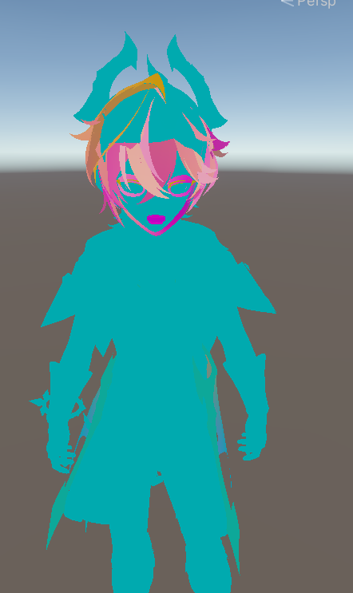

杜林模型在前发/眼睛/口腔内外部/翅膀边缘有预烘焙的平滑法线信息。这些地方的法线会特殊处理。这里也查看了一下模型的顶点颜色——顶点色是单一的，这里暂且认为顶点色不存放额外信息。

> 后记：其实在虚幻里很明显可以看出口眼鼻有平滑法线。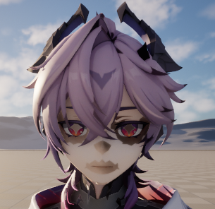

正式开工：

2）剔除表面 

```
Pass
{
    Tags { "LightMode" = "outline" }

    Cull Front
    ZWrite On
```

 shader_feature_local：本地着色器变体（Shader Variants）。表示这些特性 **只在当前 Pass 生效**，不会全局生效

```
 HLSLPROGRAM
 #pragma vertex BackFaceOutlineVertex
 #pragma fragment BackFaceOutlineFragment

 //是否开启自定义描边颜色。
 #pragma shader_feature_local _OUTLINE_CUSTOM_COLOR_ON 
 //描边根据 切线方向 计算。
 #pragma shader_feature_local _OUTLINENORMALCHANNEL_TANGENT
 //描边根据 第二 UV 通道（平滑法线，模型中的嘴/眼/翅膀部分） 计算。
 #pragma shader_feature_local _OUTLINENORMALCHANNEL_UV2

 #include "Packages/com.unity.render-pipelines.universal/ShaderLibrary/Core.hlsl"
 #include "Packages/com.unity.render-pipelines.universal/ShaderLibrary/Lighting.hlsl"

 TEXTURE2D(_ilmTex);
 SAMPLER(sampler_ilmTex);
```

定义顶点输入和输出结构体

```
  struct a2v
  {
      float4 positionOS : POSITION;
      float4 color      : COLOR;
      float3 normalOS   : NORMAL;
      float4 tangentOS  : TANGENT;
      float2 uv1        : TEXCOORD0;
      float2 uv2        : TEXCOORD1;
      float2 packSmoothNormal : TEXCOORD2;
  };

  struct v2f
  {
      float4 positionCS : SV_POSITION;
      float2 uv         : TEXCOORD0;
      float4 color      : COLOR;
      float3 positionWS : TEXCOORD1;
      float3 normalWS   : TEXCOORD2;
  };

```

3）通过 `materialID`函数，将ILM贴图的a通道的值（0到1之间）映射为不同的材质ID【0到4】，然后根据这个ID从预设的颜色数组中选择对应的轮廓颜色。这使得模型的不同区域可以根据这张贴图的定义，呈现出5种不同颜色的轮廓线。

```
float materialID(float mask)
{
    if (mask < 0.2) return 0;
    if (mask < 0.4) return 1;
    if (mask < 0.6) return 2;
    if (mask < 0.8) return 3;
    return 4;
}
```

4）看顶点着色器 `BackFaceOutlineVertex` 中：

1）获取用于顶点扩张的**世界空间法线方向**：通过着色器变体（`#pragma shader_feature_local`）提供了三种法线来源选择，以应对不同模型质量和效果。

`OUTLINENORMALCHANNEL_`运行时只启用其中一个宏，避免 if-else 运行开销。

```
float3 GetSmoothNormalWS(a2v input)
{
	//描边根据默认法线通道
    float3 smoothNormalOS = input.normalOS;
	//描边根据 切线方向 计算。
    #if defined(_OUTLINENORMALCHANNEL_TANGENT)
    smoothNormalOS = input.tangentOS.xyz;
    //描边根据 UV2 通道（平滑法线，模型中的嘴/眼/翅膀部分） 计算。
    #elif defined(_OUTLINENORMALCHANNEL_UV2)
  	//TNB矩阵：切线空间转换到模型空间变换矩阵
    float3 n = normalize(input.normalOS);
    float3 t = normalize(input.tangentOS.xyz);
    float3 b = cross(n, t) * input.tangentOS.w;
    //解码切线空间法线
    float3 smoothTS = UnpackNormalOctQuadEncode(input.packSmoothNormal);
    smoothNormalOS = mul(smoothTS, float3x3(t, b, n));
    smoothNormalOS = smoothTS;
    #endif

    return TransformObjectToWorldNormal(smoothNormalOS);
}
```

`input.packSmoothNormal`是存储在UV2中的美术人员预先烘焙的平滑法线。

`UnpackNormalOctQuadEncode`是一个解码函数，将压缩存储的二维数据还原为三维法线向量（通常范围是[-1, 1]）。这种编码方式可以高效地在纹理通道中存储三维方向信息

**输出**：`smoothTS`是在切线空间中的平滑法线向量。

**描边宽度：**

**基于距离的动态轮廓宽度**，解决轮廓线“近粗远细”或“远距离过粗”的问题。

```
 float GetOutlineWidth(float viewZ)
 {
     float fovFactor = 2.414 / UNITY_MATRIX_P[1].y;// 根据视野(FOV)进行校正
     float z = abs(viewZ * fovFactor);
     return 0.01 * _OutlineWidth * _OutlineScale * saturate(1.0 / z);
 }

```

轮廓位置：这是顶点扩张的核心函数，负责将顶点位置偏移到轮廓位置。

```
 float4 GetOutlinePosition(VertexPositionInputs posInput, float3 normalWS, float alpha)
 {
     float width = GetOutlineWidth(posInput.positionVS.z) * alpha;
     
	// 将世界法线转换到视角空间，并忽略Z分量，确保扩张在屏幕平面进行
     float3 normalVS = TransformWorldToViewNormal(normalWS);
     normalVS = normalize(float3(normalVS.xy, 0));

     float3 posVS = posInput.positionVS;
     posVS += width * normalVS;
     //处理深度冲突(Z-fighting)：将顶点轻微推向相机
     posVS += 0.01 * _OutlineZOffset * normalize(posVS);
	//将视角空间位置转换回裁剪空间
     return TransformWViewToHClip(posVS);
 }

```

顶点着色器：

```
 v2f BackFaceOutlineVertex(a2v input)
 {
     v2f o;

     VertexPositionInputs posInput = GetVertexPositionInputs(input.positionOS.xyz);

     float3 smoothNormalWS = GetSmoothNormalWS(input);
     o.positionCS = GetOutlinePosition(posInput, smoothNormalWS, input.color.a);

     o.uv = input.uv1;
     o.color = input.color;
     o.positionWS = TransformObjectToWorld(input.positionOS.xyz);
     o.normalWS = smoothNormalWS;

     return o;
 }
```

片元着色器 (`BackFaceOutlineFragment`)

```
half4 BackFaceOutlineFragment(v2f i, FRONT_FACE_TYPE isFrontFace : FRONT_FACE_SEMANTIC) : SV_Target
{
    // 1. 采样纹理，获取材质ID掩码
    half mask = SAMPLE_TEXTURE2D(_ilmTex, sampler_ilmTex, i.uv).a;
    float id = materialID(mask); // 将掩码值映射为0-4的整数ID

    // 2. 根据ID从预设颜色数组中选取轮廓色
    int idx = (int)clamp(id, 0.0, 4.0);
    float3 color = outlineColors[idx];

    // 3. 检查是否启用自定义轮廓色覆盖
    #if defined(_OUTLINE_CUSTOM_COLOR_ON)
        color = _CustomOutlineCol.rgb;
    #endif

    clip(_Alpha - _AlphaClip);

    return half4(color, 1); 
}
```

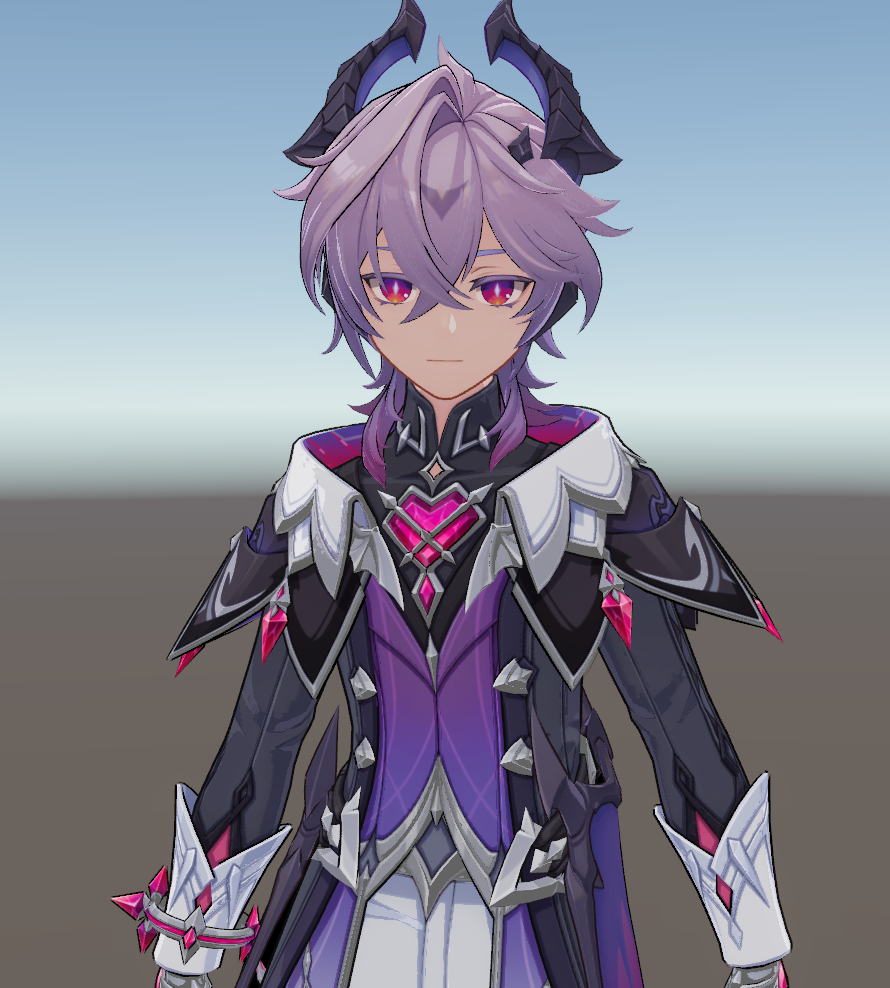


### 5 投影

使用"ShadowCaster"Pass来产生投影。

```text
UsePass "Universal Render Pipeline/Lit/ShadowCaster"    
```

### 6 后处理

后处理我使用了三个，分别是Bloom(泛光)、ToneMapping(色调映射)、ColorAdjustments(颜色调整)。


我使用的是URP自带的后处理体积，好处是不用写代码了，和UE的后处理盒子类似，坏处是URP的后处理是全屏效果的，实际后处理的效果应该只影响角色。那样就要用C#脚本传递来制作后处理，用RendererFeatures的LayerMask来控制影响的对象图层，具体实现原理可以参考这篇文章。


## 附录：

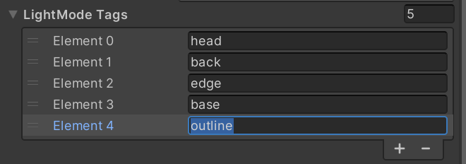

一些常见问题：

报错：INVALID UTF8 STRING

### Visual Studio 设置默认编码格式为 UTF-8 或 GB2312-80

[Visual Studio 设置默认编码格式为 UTF-8 或 GB2312-80 与文件没有高级保存选项怎么显示_visual studio 不使用简体中文gb2312编码加载文件-CSDN博客](https://blog.csdn.net/qq_41868108/article/details/105750175)

### 怎么去除边缘锯齿化

### 环境遮蔽AO

lightmap.g通道存放的是环境遮蔽信息。它是一张由美术师预先绘制或软件生成的灰度图，用于标识模型表面哪些区域不容易接收到间接光照。
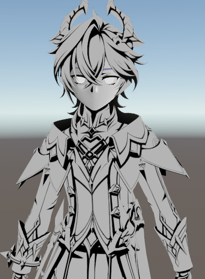

> 例如，衣服的褶皱深处、手臂与身体之间的缝隙、颈部下方等，这些地方即使在白天，也会比开阔的表面更暗。lightmap.g会在这些地方显示为黑色或深灰色。

### smoothstep 三次平滑函数

```
smoothstep(edge0, edge1, x)
```

基本形式 **Smoothstep₁(t) = t²(3 - 2t)**。它用于在两个值之间生成一条平滑的S形过渡曲线。

**工作原理**：

Smoothstep(edge0, edge1, x)在三个区间内的返回值规则是

```
x <= edge0 时，返回 0

x >= edge1 时，返回 1

edge0 < x < edge1 时，中间区域，返回在 0 和 1 之间使用埃尔米特插值得到的平滑过渡。
```

其中：中间区域通过三次多项式 t²(3 - 2t)产生平滑过渡。这种S形曲线在起点和终点的斜率接近零，过渡非常自然。

[smoothstep-三次平滑函数 | Desmos](https://www.desmos.com/calculator/1z7pfidmne?lang=zh-CN)

> 这里可以拉参数看变化来直观感受这个三次平滑函数。

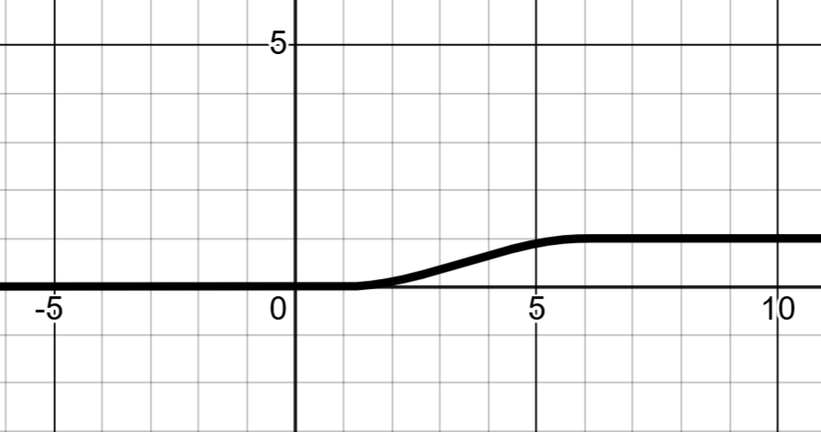

> ### 举例计算 lightmap.g = 0.25 时的输出
>
> 我们来具体计算 `smoothstep(0.2, 0.3, 0.25)`的值。计算过程完全遵循其数学定义：
>
> 1. **缩放与钳位**：首先将 `x`映射到 0 到 1 的区间。
>
>    `(0.25 - 0.2) / (0.3 - 0.2) = 0.05 / 0.1 = 0.5`
>
> 2. **三次多项式插值**：然后对结果进行平滑插值。
>
>    `0.5 * 0.5 * (3 - 2 * 0.5) = 0.25 * (3 - 1) = 0.25 * 2 = 0.5`
>
> 所以，当 `lightmap.g`的值为 0.25 时，`smoothstep(0.2, 0.3, lightmap.g)`的输出是 **0.5**。

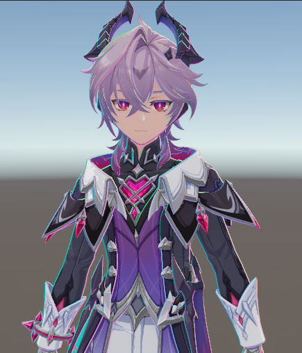