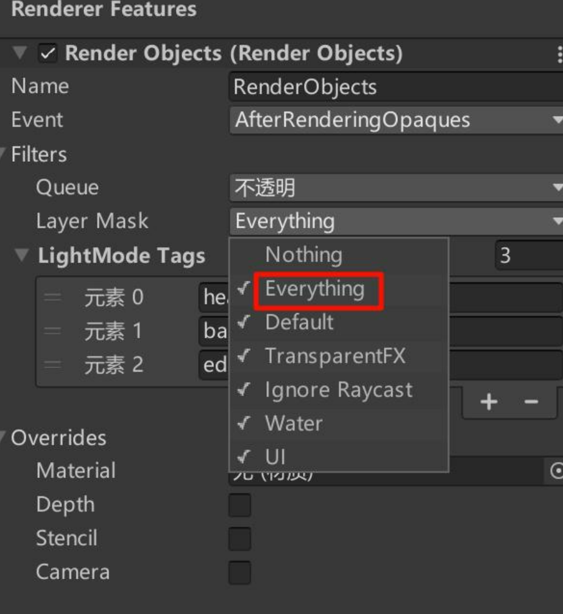
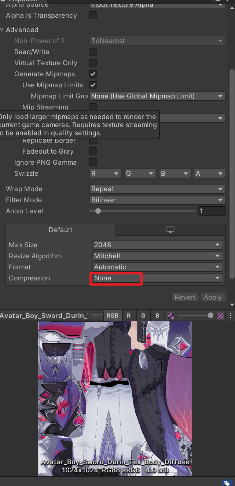
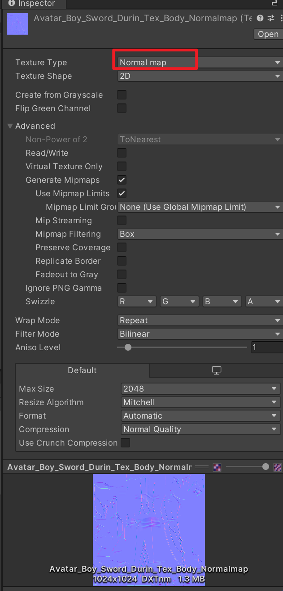
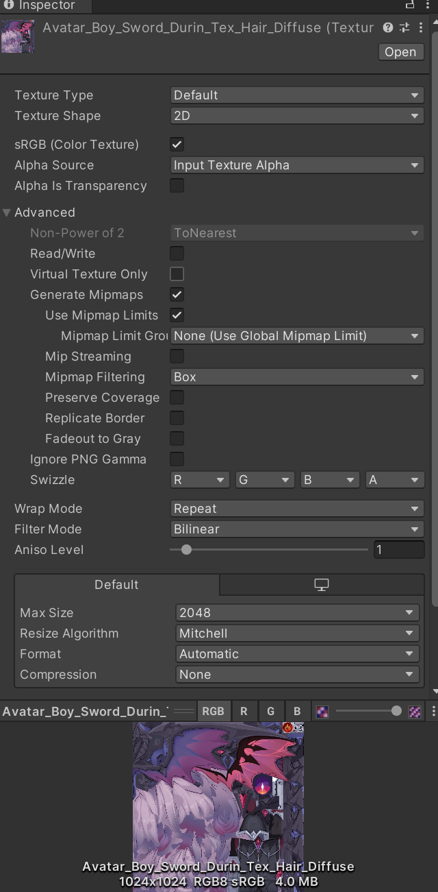

1.新建URP 3D项目

2.点击资产面板的URP资产，此时右侧面板高亮，可以Add Render Objects


添加Render Objects


添加3个pass。


mask改为everything。



## 2 开始

FaceLightmap


Body_Diffuse



Body_lightmap


法线图



shadow ramp


Face_Diffuse


Hair_Diffuse



hair_lightmap


MetalMap


贴图设置完毕。

## 代码结构

一开始不太习惯HLSL的代码结构，和CG有一定的区别，注意。

```

```

## 附录：

一些常见问题：

报错：INVALID UTF8 STRING

### Visual Studio 设置默认编码格式为 UTF-8 或 GB2312-80

[Visual Studio 设置默认编码格式为 UTF-8 或 GB2312-80 与文件没有高级保存选项怎么显示_visual studio 不使用简体中文gb2312编码加载文件-CSDN博客](https://blog.csdn.net/qq_41868108/article/details/105750175)