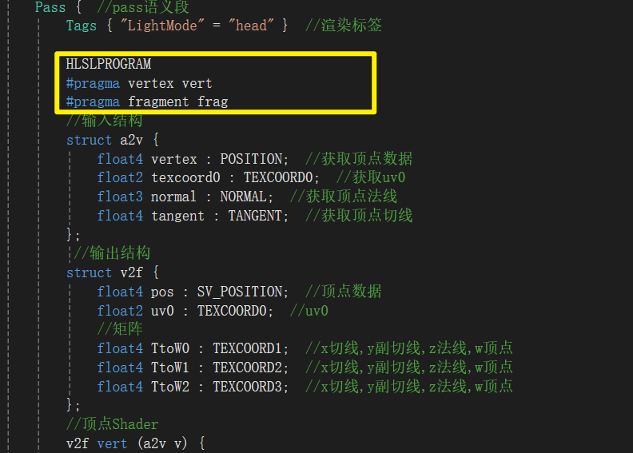
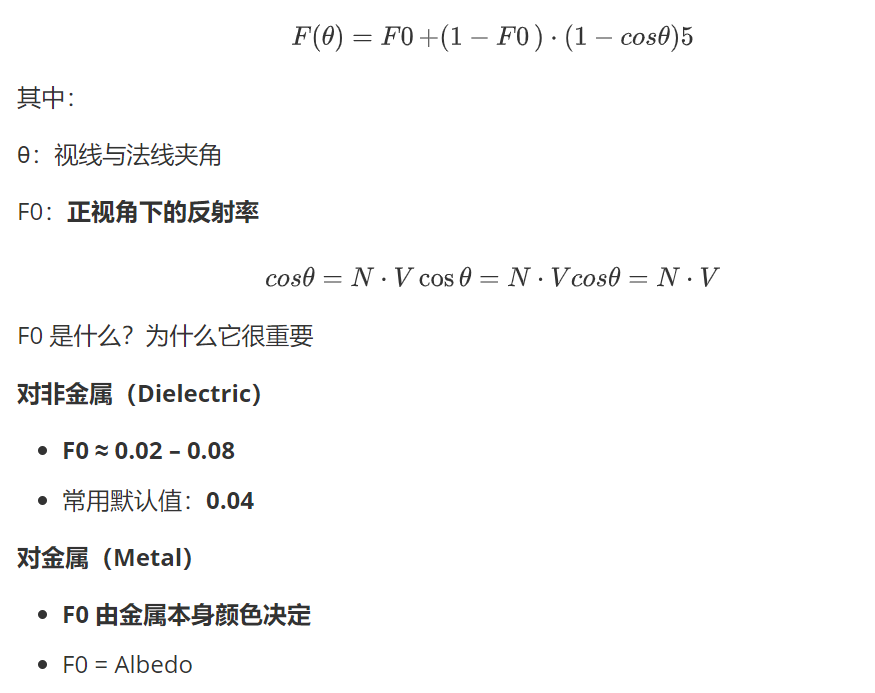

## 1 前期准备工作

1.新建URP 3D项目

2.点击资产面板的URP资产，此时右侧面板高亮，可以Add Render Objects


添加Render Objects


添加3个pass。


mask改为everything。


> TODO: 有仙人曾言： // 我自己试下来，在角色身上 LowQuality 比 Medium 和 High 好
>  // Medium 和 High 采样数多，过渡的区间大，在角色身上更容易出现 Perspective aliasing
>
> 等到时候自己验证一下在说 。

FaceLightmap


Body_Diffuse


Body_lightmap


法线图


shadow ramp


Face_Diffuse


Hair_Diffuse


hair_lightmap


MetalMap


贴图设置完毕。

值得注意的是 杜林的翅膀贴图是和头发放在一起，观察一下贴图纹理的对应。


## 2 代码结构

### 1.整体结构


一开始不太习惯HLSL的代码结构，和CG有一定的区别，注意。

```
Shader "EXAM1/EXAM_Shader"
{
    Property
    {
        ……
    }

    Subshader
    {
        Pass
        {……}

        Pass
        {……}
    }
}

```

### 2.Subshader结构


```
 SubShader
 {
     HLSLINCLUDE
     #include "../../ShaderLibrary/…….hlsl"
     ENDHLSL
     
     Tags
     {……}
     
     Pass
     {……}
     
     Pass
     {……}
 }
```

### Subshader结构

**1.HLSLINCLUDE & ENDHLSL**

```
 SubShader
 {
     HLSLINCLUDE
     //导入库
     #include "Packages/com.unity.render-pipelines.universal/ShaderLibrary/Core.hlsl"  //默认库
     #include "Packages/com.unity.render-pipelines.universal/ShaderLibrary/Lighting.hlsl"  //光照库        
     ENDHLSL

     Pass {  
         };
 }
```

**HLSLINCLUDE** 和 **ENDHLSL** 是Unity ShaderLab中的指令，它们之间的代码会被**自动包含到该着色器的所有Pass中**。

相当于一个“公共头文件”，写在这里的代码（如变量声明、函数、宏定义）对所有Pass都可见。

**为什么这样设计？**

- **减少重复**：如果不使用HLSLINCLUDE，每个Pass都需要单独声明这些变量和贴图，代码会冗长且难以维护。
- **保持一致性**：所有Pass使用同一套参数和贴图，确保渲染结果统一。

**2 HLSLPROGRAM**



在Unity URP Shader中，每个Pass通常需要将顶点和片元着色器代码包裹在`HLSLPROGRAM`和`ENDHLSL`块中。

### Pass结构

Pass块中，需要在`Tags`之后添加`HLSLPROGRAM`：

```
Pass {
    Tags { "LightMode" = "head" }
    
    HLSLPROGRAM
    #pragma vertex vert
    #pragma fragment frag
    
    // 您的a2v和v2f结构体定义
    // 您的vert和frag函数定义
    
    ENDHLSL
}
```

**3 在 `frag` 函数内部定义函数（HLSL 不允许）**

在 `frag` 里写大量函数定义，例如：

```
half4 frag (v2f i) : SV_TARGET {

    float3 shadow_ramp(...) { ... }
    float3 Spec(...) { ... }
    float3 Metal(...) { ... }
    float3 edgeLight(...) { ... }
    float3 light(...) { ... }
    float3 Body(...) { ... }
    float3 Face(...) { ... }

    ...
}

```

这是**绝对错误**的

- **HLSL / ShaderLab 不支持函数嵌套定义**
- 函数**必须定义在全局作用域**
- DX11 编译器会直接报错

**正确写法：**

```
float3 shadow_ramp(float4 lightmap, float NdotL) { ... }
float3 Spec(...) { ... }
float3 Metal(...) { ... }
float3 edgeLight(...) { ... }
float3 light(...) { ... }
float3 Body(...) { ... }
float3 Face(...) { ... }

half4 frag(v2f i) : SV_TARGET
{
    ...
}

```

## 3 正式开始

正式开始前先把计算需要用到的变量和向量等数据准备好，先来准备面板参数，面板参数如下：

```
Properties{


}
```

URP的声明参数必须包含在CBUFFER_START(UnityPerMaterial)和CBUFFER_END之间，我们把这些代码和声明贴图的代码都用HLSLINCLUDE和ENDHLSL代码块包起来，之后写的方法也放在这里面，这样后面就不用在每个pass都声明一次了。

```
Subshader
{
	

}
```

#### 1.第一个pass：渲染正面

```
Pass{
	Tags{ "LightMode" = "head" }//渲染标签
}
```

##### 1）输入结构：a2v定义从应用阶段（CPU）到顶点着色器的顶点数据。

```
struct a2v{
	float4 vertex : POSITION;//顶点坐标
	float2 texcoord0 : TEXCOORD0;//纹理坐标UV0
	float3 normal : NORMAL;//顶点法线
	float4 tangent : TANGENT;//顶点切线
};
```

为什么`normal`是`float3`而`tangent`是`float4`？

> 1. **法线（normal）**：`float3` 法线是一个三维向量（x, y, z），表示顶点表面的朝向。 它只需要三个分量就能完整描述方向，因此使用`float3`足够。
> 2. **切线（tangent）**：`float4` 切线通常用于法线贴图（normal mapping）计算，需要与法线和副切线（binormal/bitangent）构成切线空间（tangent space）。 前三个分量（x, y, z）表示切线的方向向量。 **第四个分量（w）是一个符号值**，通常为+1或-1，用于指示副切线的方向。
>
> **关键区别**：
>
> 1. **法线的方向是绝对的**： 法线向量(x, y, z)本身就完整定义了方向 例如，法线(0, 1, 0)明确表示"向上"，没有歧义
> 2. **切线需要确定副切线方向**： 给定法线和切线后，副切线可以通过叉积计算：`副切线 = 叉积(法线, 切线)` **但叉积有两种可能方向**：左手系或右手系 `tangent.w`（通常±1）就是用来指定这个方向的： 如果`tangent.w = 1`：副切线 = 叉积(法线, 切线) 如果`tangent.w = -1`：副切线 = 叉积(切线, 法线)
> 3. **几何意义**： 法线、切线、副切线构成**切线空间基** 法线是"主方向"，切线和副切线是"辅助方向" 切线的w分量确保整个坐标系的一致性（避免镜像翻转）

##### 2）输出结构：v2f定义在顶点着色器中构建一个【切线空间到世界空间的3x4变换矩阵】，并传递到片元着色器的输出数据。

> 通常被称为 **TBN矩阵**（由Tangent、Bitangent、Normal三个向量构成），它的核心作用是**搭建一座桥梁，将法线方向从“切线空间”转换到“世界空间”**，这是实现法线贴图（Normal Mapping）效果的关键步骤

```
struct v2f{
	float4 pos : SV_POSITION;//在裁剪空间的顶点位置
	float2 uv0 : TEXCOORD0;//uv0，第一套纹理坐标
    // 这三行共同构成了一个3x4矩阵。
    float4 TtoW0 : TEXCOORD1;  //x切线,y副切线,z法线,w顶点
    float4 TtoW1 : TEXCOORD2;  //x切线,y副切线,z法线,w顶点
    float4 TtoW2 : TEXCOORD3;  //x切线,y副切线,z法线,w顶点
	//x-切线tangent
	//y-副切线bitangent
	//z-法线normal
	//w-顶点
    };
```

> 输出结构定义一个4维矩阵存放数据，以充分利用插值寄存器。
>
> a2v和v2f两个结构体中使用了两次**TEXCOORD0**语义，这是被允许的，因为语义就是会在两个结构体中有着不同的含义，可以理解成代号，但在之后的过程中这两个TEXCOORD0会指代不同的纹理寄存器，所以不会冲突。

* `TEXCOORD0` 在不同结构体中并不代表一个固定的寄存器，而是一个语义标记，这个语义对应一个四维向量（`float4`）的存储空间，用于在着色器阶段之间传递数据。

* `TEXCOORD1、TEXCOORD2、TEXCOORD3`都用于在着色器阶段间传递数据，但它们通过数字编号（1, 2, 3）来**代表不同的数据通道**，用于区分不同的信息。

* **合理规划数据用量**：一个 `float4`可以存储一个四维数据，也可以存储多个低维数据（如两个 `float2`）。合理打包数据可以节省宝贵的 `TEXCOORD`通道。

* **数量限制**：`TEXCOORD`通道的数量并非无限，存在上限（例如通常最多到 `TEXCOORD7`），需根据目标平台合理规划。

在顶点Shader将需要的数据传递给片元Shader，矩阵的xyzw分别存放切线，副切线，法线与顶点。

##### 3)  vert顶点shader：将需要的数据传递给片元Shader，矩阵的xyzw分别存放切线，副切线，法线与顶点。

```
v2f vert(a2v v)
{
	v2f o;
	o.pos = TransformObjectToClip(v.vertex.xyz);
	o.uv0 = v.texcoord0;
	
	float3 nDirWS = TransformObjectToWorldNormal(v.normal); 
	float3 nDirWS = TransformObjectToWorld(v.tangent.xyz); 
	float3 bDirWS = cross(nDirWS,tDirWS) * v.tangent.w;
	float3 posWS = TransformObjectTOWorld(v.vertex.xyz);
	
	o.TtoW0 =  float4(nDirWS.x,nDirWS.x,bDirWS.x,posWS.x);
	o.TtoW1 =  float4(nDirWS.y,nDirWS.y,bDirWS.y,posWS.y);
	o.TtoW2 =  float4(nDirWS.z,nDirWS.z,bDirWS.z,posWS.z);
	
	return o;
	
}
```

> 注意 v.vertex的顶点坐标是4维，因为齐次坐标系多1维（存平移信息）

```
 //顶点Shader
 v2f vert (a2v v) {
     v2f o;  //定义返回值
     //MVP变换(模型空间>>世界空间>>视觉空间>>裁剪空间)
     o.pos = TransformObjectToHClip(v.vertex.xyz);  
     //传递uv0(无变换)
     o.uv0 = v.texcoord0;  
     // 世界空间法线
     float3 nDirWS = TransformObjectToWorldNormal(v.normal); 
     // 世界空间切线
     float3 tDirWS = TransformObjectToWorld(v.tangent.xyz);  
     //世界空间副切线
     float3 bDirWS = cross(nDirWS, tDirWS) * v.tangent.w;  
     //世界顶点位置
     float3 posWS = TransformObjectToWorld(v.vertex.xyz);  
     //构建切线-世界空间变换矩阵
     //x切线,y副切线,z法线,w顶点
     o.TtoW0 = float4(tDirWS.x, bDirWS.x, nDirWS.x, posWS.x);  
     o.TtoW1 = float4(tDirWS.y, bDirWS.y, nDirWS.y, posWS.y);  
     o.TtoW2 = float4(tDirWS.z, bDirWS.z, nDirWS.z, posWS.z);  
     return o;  //返回顶点Shader
 }
```


#### 4）【重点】frag 片元着色器

> 回顾：在pass之前，声明的所有变量
>
> ```
>  SubShader
>  {
>      HLSLINCLUDE
>      //导入库
>      #include "Packages/com.unity.render-pipelines.universal/ShaderLibrary/Core.hlsl"  //默认库
>      #include "Packages/com.unity.render-pipelines.universal/ShaderLibrary/Lighting.hlsl"  //光照库
>      CBUFFER_START(UnityPerMaterial)  //常量缓冲区开头
>          //声明面板参数
>          float _genshinShader;  //是否是脸部
>          //diffuse
>          float _fresnel;  //边缘光范围
>          float _edgeLight;  //边缘光强度
>          float _diffuseA;  //diffuseA
>          float _Cutoff;  //透明阈值
>          float4 _glow;  //自发光强度
>          float _flicker;  //发光闪烁速度
>          //lightmap/FaceLightmap
>          float _bright;  //亮面范围
>          float _grey;  //灰面范围
>          float _dark;  //暗面范围
>          //normal
>          float _bumpScale;  //法线强度
>          //ramp
>          float _dayAndNight;  //是否是白天
>          float _lightmapA0;  //1.0_Ramp条数
>          float _lightmapA1;  //0.7_Ramp条数
>          float _lightmapA2;  //0.5_Ramp条数
>          float _lightmapA3;  //0.3_Ramp条数
>          float _lightmapA4;  //0.0_Ramp条数
>          //高光
>          float _gloss;  //高光范围
>          float _glossStrength;  //高光强度
>          float3 _metalMapColor;  //金属反射颜色
>          //描边
>          float _OutlineWidth;  //描边粗细
>          float _OutlineScale;  //描边范围
>          float _OutlineZOffset;  //Outline Z Offset
>          float _Alpha;  //Alpha
>          float _AlphaClip;  //Alpha Clip
>          float4 _OutlineColor0;  //描边颜色1
>          float4 _OutlineColor1;  //描边颜色2
>          float4 _OutlineColor2;  //描边颜色3
>          float4 _OutlineColor3;  //描边颜色4
>          float4 _OutlineColor4;  //描边颜色5
>          float4 _CustomOutlineCol;  //Custom Outline Color
>      CBUFFER_END  //常量缓冲区结尾
>      //声明贴图
>      TEXTURE2D(_diffuse);  //Diffuse
>      SAMPLER(sampler_diffuse);
>      TEXTURE2D(_lightmap);  //Lightmap/FaceLightmap
>      SAMPLER(sampler_lightmap);
>      TEXTURE2D(_bumpMap);  //Normal
>      SAMPLER(sampler_bumpMap);
>      TEXTURE2D(_ramp);  //Shadow_Ramp
>      SAMPLER(sampler_ramp);
>      TEXTURE2D(_metalMap);  //MetalMap
>      SAMPLER(sampler_metalMap);
>      ENDHLSL
> 
> ```

片元着色器的主要任务是为模型表面的每一个像素计算最终颜色。它的工作流程可以概括为以下几步：

1. 

   **纹理采样**：从不同的纹理中读取信息。

2. 

   **向量准备**：计算光照和视角所需的方向向量。

3. 

   **光照计算**：根据不同的渲染路径（身体或脸部）计算颜色。

4. 

   **后期处理**：处理自发光或透明度裁剪。

5. 

   **输出**：返回最终的像素颜色。

##### frag 片元着色器

```
 half4 frag (v2f i) : SV_TARGET {
     //采样贴图
     float3 baseColor = SAMPLE_TEXTURE2D(_diffuse, sampler_diffuse, i.uv0).rgb;  //diffuseRGB通道
     float diffuseA = SAMPLE_TEXTURE2D(_diffuse,sampler_diffuse, i.uv0).a;  //diffuseA通道
     float4 lightmap = SAMPLE_TEXTURE2D(_lightmap, sampler_lightmap, i.uv0).rgba;  //lightmap
     //法线贴图
     float3 nDirTS = UnpackNormal(SAMPLE_TEXTURE2D(_bumpMap, sampler_bumpMap, i.uv0)).rgb;  //切线空间法线(采样法线贴图并解码)
     nDirTS.xy *= _bumpScale;  //法线强度
     nDirTS.z = sqrt(1.0 - saturate(dot(nDirTS.xy, nDirTS.xy)));  //计算法线z分量
     //准备向量
     float3 posWS = float3(i.TtoW0.w, i.TtoW1.w, i.TtoW2.w);  //世界空间顶点
     //切线空间法线转世界空间法线
     float3 nDirWS = normalize(half3(dot(i.TtoW0.xyz, nDirTS), dot(i.TtoW1.xyz, nDirTS), dot(i.TtoW2.xyz, nDirTS)));
     Light mlight = GetMainLight();  //光源
     float3 lDirWS= normalize(mlight.direction);  //世界光源方向(平行光)
     float3 vDirWS = normalize(_WorldSpaceCameraPos.xyz - posWS.xyz);  //世界观察方向
     float3 nDirVS = normalize(mul((float3x3)UNITY_MATRIX_V, nDirWS));  //世界空间法线转观察空间法线
     float3 hDirWS = normalize(vDirWS + lDirWS) ;  //半角方向
     //向量点乘
     float NdotL = dot(nDirWS, lDirWS);  //兰伯特
     float NdotH = dot(nDirWS, hDirWS);  //Blinn-Phong
     float NdotV = dot(nDirWS, vDirWS);  //菲涅尔

     float3 col = float3(0.0, 0.0, 0.0);

     //主体渲染
     if(_genshinShader == 0.0){  //身体
         col = Body(NdotL, NdotH, NdotV, lightmap, baseColor, nDirVS);
     }else if(_genshinShader == 1.0){  //脸部
         col = Face(lDirWS, baseColor, i.uv0);
     }
     //计算diffuse.a
     if(_diffuseA == 2){  //自发光
         float3 diffA = light(col, diffuseA);
         col = col + diffA;
     }else if(_diffuseA == 1){ //裁剪
         diffuseA = smoothstep(0.05, 0.7, diffuseA);  //去除噪点
         clip(diffuseA - _Cutoff);
     }
     return half4(col, 1.0);  //输出
 }
```

其中：

```
 //切线空间法线转世界空间法线
     float3 nDirWS = normalize(half3(dot(i.TtoW0.xyz, nDirTS), dot(i.TtoW1.xyz, nDirTS), dot(i.TtoW2.xyz, nDirTS)));
```

$$
世界空间法线 = TBN矩阵 × 切线空间法线
$$

代码中混合使用了 `float`和 `half`精度。对于颜色等不需要高精度的数据，使用 `half`可以优化性能。

> 在着色器中，颜色分量（R, G, B, A）通常被规范在 `[0, 1]`的范围内。这个范围完全在 `fixed`类型的表示能力之内.
>
> **人眼的感知局限**：人眼对颜色的细微变化并不像对亮度变化那样敏感。微小的颜色量化误差（例如，`0.5`和 `0.501`的红色）在绝大多数情况下是难以察觉的.
>
> **哪些数据需要高精度**
>
> 与颜色相反，以下类型的数据通常要求使用 `float`高精度：
>
> - **空间坐标**：尤其是**世界空间坐标**和**纹理坐标**。它们的数值范围很大且变化非常细微，高精度是确保物体位置、轮廓和纹理映射准确无误的基础。
> - **复杂数学运算**：在进行三角函数计算（如`sin`, `cos`）、幂运算（`pow`）或复杂的插值时，必须使用 `float`来保证中间过程和最终结果的准确性，避免误差累积导致画面瑕疵。
> - **需要高动态范围（HDR）的颜色**：虽然普通颜色用`half`足矣，但**HDR颜色**的值会远超 `[0, 1]`的范围，因此需要 `half`或 `float`来存储和处理。

需要用到三个光照模型：

```
     //向量点乘
     float NdotL = dot(nDirWS, lDirWS);  //兰伯特
     float NdotH = dot(nDirWS, hDirWS);  //Blinn-Phong
     float NdotV = dot(nDirWS, vDirWS);  //菲涅尔
```

在计算前，我们看一下最终的混合分别需要什么：**漫反射(半Lambet) + 高光(BlinnPhong) + 金属(MatCap) + 边缘光(菲涅尔) + 自发光** **+ 后处理(Bloom、ToneMapping、ColorAdjustments)。**那我们就按这个顺序来一一实现一下。

**菲涅尔效应（Fresnel Effect）**

 是一个**核心物理规律**，用于描述**光线在物体表面的反射强度随着视角角度变化的现象**。



##### 兰伯特（Lambert）模型公式

理想的漫反射：


$$
I
_{diffuse}
	​

=K
_d
	​

⋅I
_l
	​

⋅max(0,N⋅L)
$$


**半兰伯特（Half-Lambert）改进**

基础兰伯特模型的一个问题是，当法线与光线方向垂直时，计算结果会直接变为0，导致背光面一片死黑。半兰伯特模型通过一个简单的缩放和平移变换来缓解这个问题

这个技巧将点乘的结果从区间 [−1,1]映射到 [0,1]，使得背光区域也能保留一定的细节，常用于卡通渲染等风格化效果中


$$
I
_{half-lambert}
	​

=K
_d
	​

⋅I
_l
	​

⋅(0.5⋅(N⋅L)+0.5)
$$

##### 布林-冯（Blinn-Phong）模型公式

布林-冯模型是一个完整的光照模型，它**结合了环境光、漫反射和镜面高光**三项。其总光照强度为


$$
I
_{total}
	​

=I
_{ambient}
	​

+I
_{diffuse}
	​

+I
_{specular}
	​
$$
环境光（Ambient）
$$
I
_{ambient}
	​

=K
a
	​

⋅I
a
	​
$$
Ka：材质的环境光反射系数

漫反射（Diffuse）
$$
I
_{diffuse}
	​

=K
_d
	​

⋅I
_l
	​

⋅max(0,N⋅L)
$$


 镜面高光（Specular）·布林-冯的核心


$$
I
_specular_
	​

=K
_s
	​

⋅I
_l
	​

⋅(max(0,N⋅H))
^{shininess}
$$
**H：半角向量**，通过将光线方向 L和视线方向 V相加后归一化得到：H=∣L+V∣L+V。

**shininess：**高光指数，这是一个非常重要的参数。值越大，高光点越小、越锐利，表示表面越光滑；值越小，高光范围越大、越柔和，表示表面越粗糙。

**Ks：**材质的**镜面反射系数**，决定了高光的强度和颜色

## 附录：


一些常见问题：

报错：INVALID UTF8 STRING

### Visual Studio 设置默认编码格式为 UTF-8 或 GB2312-80

[Visual Studio 设置默认编码格式为 UTF-8 或 GB2312-80 与文件没有高级保存选项怎么显示_visual studio 不使用简体中文gb2312编码加载文件-CSDN博客](https://blog.csdn.net/qq_41868108/article/details/105750175)

### 怎么去除边缘锯齿化