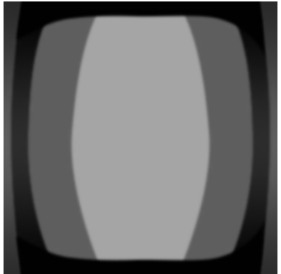

## 1 关于Tex Mapping

### 1.1 albedo和diffuse的区别与联系

Albedo：反照率

diffuse：漫反射

它们都用于定义物体表面的基础颜色。下面是它们的核心区别。

| 特性维度       | Albedo (反照率) 贴图                                         | Diffuse (漫反射) 贴图                                        |
| :------------- | :----------------------------------------------------------- | :----------------------------------------------------------- |
| **核心定义**   | 表面本身**不包含任何光照信息**，只包含物体固有的颜色和反射特性。 | 表面包含简单光影信息：物体固有色、简单的光照阴影、环境遮蔽等 |
| **所属工作流** | 基于物理的渲染（PBR）工作流                                  | 传统/非基于物理的渲染（Non-PBR）工作流                       |
| **设计目的**   | 将材质与光照解耦，确保在不同的光照环境下物理正确。           | 对某光照环境的【预计算】，提前将阴影等光影信息“烘焙”进去。   |
| **金属表现**   | 金属区域通常为**深色甚至纯黑**，因为纯金属几乎无漫反射       | 不严格区分金属与非金属的漫反射表现                           |
| **视觉对比**   | 色调通常**更平缓，对比度较低**                               | 因包含光影，通常**对比度更明显**                             |
| **常见引擎**   | Unity (称 Albedo), Unreal Engine (称 Base Color)             | 旧版引擎或传统Lambert着色器                                  |


总而言之，它们的区别实际上标志着渲染技术的进步：

> **传统的/非真实感渲染：**
>
> 通过将光影信息 “烘培” 进颜色贴图的Diffuse方式，纯粹使用贴图而不考虑光照效果来达到物体阴影表达的目的。
>
> **基于PBR的渲染：**
>
> 从传统的Diffuse方式，演进到基于物理的、纯粹的材质属性（Albedo）与复杂动态光照计算分离的PBR方式，一般需要与**金属度/粗糙度，高光/光泽度**等贴图配合使用。

#### 追问：如何将传统的Diffuse贴图转换为PBR工作流的Albedo贴图？

**核心手动处理思路**

手动调整主要依赖于像Photoshop这样的图像处理软件，其核心步骤包括：

- **去除光照信息：**仔细识别并减弱或移除Diffuse贴图中的阴影、高光和污迹。可以使用**色阶、曲线**等工具调整整体对比度，或用**克隆图章、修复画笔**工具处理掉明显的光影过渡。
- **校准基础颜色**：确保颜色值符合PBR的物理规律。对于非金属（绝缘体），其反照率颜色通常不应过亮（sRGB值一般不建议高于240）或过暗。金属部分在Albedo贴图中应呈现为深色。
- **分离与重构**：有时需要将Diffuse贴图中的某些信息分离出来，交给PBR工作流中的其他贴图。例如，将粗糙的划痕细节从颜色信息中分离，其视觉效果可能通过提高粗糙度贴图的相应区域值来表现，而非在Albedo中保留深色划痕

### 1.2 什么是Metallic Map？

在 Metallic 工作流中：

- `Metallic = 0` **非金属**
  - F0 ≈ 0.04
  - 有漫反射
- `Metallic = 1 `**金属**
  - F0 = Albedo
  - 几乎无漫反射

**为什么通常建议Metallic为 0 或 1 ？**

在物理世界中，物质通常被分为两类：

- **电介质（非金属，Metallic = 0）：** 如木头、塑料、皮毛、玻璃、石头。它们具有弱反射，且反射光保留光线本身的颜色。
- **导体（金属，Metallic = 1）：** 如金、银、铝、铜。它们具有强反射，且反射光的颜色由材质表面（Base Color）决定。

由于自然界中很少有物质处于“半金属”状态，因此在 PBR 模型中，中间值（如 0.5）往往会产生在物理上不真实的效果，看起来既不像塑料也不像金属。

 **什么时候会用到中间值（0 到 1 之间）**？

虽然物理上不常见，但在以下特定场景中会使用中间值：

- **过渡区域（混合材质）：** 当一张贴图覆盖了金属和非金属的边缘时，为了抗锯齿或平滑过渡，边缘像素可能是中间值。
- **氧化或生锈：** 金属表面生锈（氧化层是非金属）或被灰尘、油漆覆盖时，可以使用中间值来模拟这种物理性质的退化。
- **特定复合材质：** 某些半导体或极其特殊的合成材料。

**使用 Metallic Map**

- **使用贴图：** 

  如果一个物体既有金属部分又有塑料部分，你应该使用一张 **Metallic Map（金属度贴图）**，用纯黑（0）表示非金属，纯白（1）表示金属。

### 1.3 MatCap 是什么

MatCap（Material Capture）是一种基于视角的材质采样技术，本质是：

> **用一张 2D 纹理，直接查表“相机空间法线 → 光照结果”**，从而在无需实时光照计算的情况下，模拟复杂材质的明暗、金属感与高光。

一句话总结：

> **MatCap = 把“光照”和“材质响应”预烘焙进一张球面纹理，用法线方向索引它。**

#### MatCap 形式

通常是一张 **正方形 2D 纹理**

内容看起来像一个**被照亮的球**




Matcap使用的是一个【视空间（View Space/ Camera Space）法线】

- 法线会随**相机旋转**
- 光照效果**始终“贴着相机”**
- 不受世界光源影响

#### 核心数学关系

- `N_view = normalize( view-space normal )`
- `N_view = (nx, ny, nz)`

将法线的 **x, y 分量** 映射到 2D 纹理坐标：

```
u = nx * 0.5 + 0.5
v = ny * 0.5 + 0.5
```

例：视空间法线（nDirVS）采样一张金属 MatCap 贴图，并用 lightmap.r 作为“是否为金属”的遮罩，最终生成一个“假金属反射颜色”。

```
//用 lightmap.r 作为“是否为金属”的遮罩
float metalMask = step(0.9, lightmap.r);
// Matcap采样（金属反射）
float3 metalMap = SAMPLE_TEXTURE2D(
    _metalMap,
    sampler_metalMap,
    nDirVS.rg * 0.5 + 0.5
).r;
// 其中，UV的计算部分：nDirVS.rg * 0.5 + 0.5
```


### 1.3 菲涅尔（Fresnel）——边缘光

**菲涅尔效应（Fresnel Effect）** 是一个**核心物理规律**，用于描述**光线在物体表面的反射强度随着视角角度变化的现象**。

在一些风格化渲染样例中，通常把【边缘光】直接起名为Fresnel。

完整的菲涅尔方程依赖折射率（IOR），计算复杂。

实时渲染通用近似：**Schlick Fresnel——游戏引擎 / 实时 PBR 的标准写法**：
$$
F(θ)=F0​+(1−F0​)⋅(1−cosθ)5
$$
其中：

θ：视线与法线夹角

F0：**正视角下的反射率**
$$
cos⁡θ=N⋅V\cos\theta = N \cdot Vcosθ=N⋅V
$$
F0 是什么？为什么它很重要

**对非金属（Dielectric）**

- **F0 ≈ 0.02 – 0.08**
- 常用默认值：**0.04**

**对金属（Metal）**

* **F0 由金属本身颜色决定**

* F0 = Albedo

| 金属 | F0 近似颜色        |
| ---- | ------------------ |
| 金   | (1.0, 0.71, 0.29)  |
| 铜   | (0.95, 0.64, 0.54) |
| 铝   | (0.91, 0.92, 0.92) |

### 1.4 什么是light map？

Light Map 是把“光照计算的结果”烘焙成一张或多张贴图，在运行时直接查表使用。

它通常包含：

- 直接光照（Direct Lighting）
- 间接光照 / 全局光照（Indirect Lighting / GI）
- 阴影（Shadow）
- 光照颜色与强度信息

用 **存储空间换取实时性能**。

### light map怎么制作？

{bilibili}

**在编辑器或离线工具中：**

1. 固定光源（Directional / Point / Spot）
2. 固定静态物体（Static Geometry）
3. 进行高质量光照计算（Ray / Path Tracing）
4. 将结果写入 UV2 对应的纹理（Light Map）

**采样（Runtime Sampling）**

在 Shader 中：

第二套 UV（Lightmap UV / UV2）

```
float3 bakedLight = SAMPLE_LIGHTMAP(uv2);
finalColor = albedo * bakedLight;
```

运行时不再做光照计算，仅采样贴图。

## 2 常见内置着色器

### 什么是URP和HDRP？

在Unity现在的生态里，**URP** 和 **HDRP** 是基于 **SRP (Scriptable Render Pipeline，可编程渲染管线)** 的两套核心解决方案。

- #### **URP** 是一条**极其高效、灵活的流水线**，旨在保证画得快，同时质量不错。

- **灵活多变（非强写实）：** URP 并不强求“照片级写实”，它更擅长处理**风格化（Stylized）**的画面。比如卡通渲染（Toon Shading）、二次元风格、低多边形（Low Poly）风格。

- **光照相对简化：** 它的默认光照模型主要是为了性能妥协的。它通常使用单次Pass的前向渲染（Forward Rendering），对光源数量有限制（虽然后来引入了Forward+技术支持更多光源，但本质还是为了轻量）。

**应用场景 (Scenarios)**

1. **移动端游戏（手游）：** 这是URP的主战场。比如《王者荣耀》、《原神》（虽然原神魔改了管线，但底子更接近URP的思路）这类需要覆盖从低端机到高端机海量设备的游戏。
2. **VR / AR / MR：** 像Meta Quest这样的VR一体机，硬件性能相当于手机，必须用URP才能跑得动高帧率。
3. **独立游戏 & 风格化游戏：** 如果你的游戏像《纪念碑谷》或者任天堂的《塞尔达：旷野之息》那种画风，URP是首选。
4. **任天堂Switch游戏：** 硬件性能受限，URP非常合适。

- #### **HDRP** 是一条**顶级精密的流水线**，旨在画得极度逼真，不惜工本。

- **照片级写实（Photorealistic）：** HDRP 的目标就是**模拟真实世界**。它遵循严格的 PBR（基于物理的渲染）法则。
- **高级光影与材质：**
  - **光照：** 默认支持体积光（Volumetric Lighting，那种空气中的丁达尔效应）、物理单位的光照强度（勒克斯、流明）。
  - **材质：** 支持次表面散射（SSS，比如皮肤通透的效果）、清漆（Clear Coat，比如车漆）、各向异性（头发、拉丝金属）。
- **厚重与电影感：** 默认开启大量高质量的后期处理，如高质量的景深、动态模糊、环境光遮蔽（GTAO/RTAO），画面看起来很有“3A大作”的质感。

**应用场景**

1. **3A主机/PC游戏：** 目标平台是 PS5, Xbox Series X, 高端PC。比如《使命召唤》级别的画质，或者充满赛博朋克霓虹灯的场景。
2. **建筑可视化 & 汽车展示：** 房地产漫游、汽车配置器。这些场景需要极度真实的光影反射，甚至需要用到**光线追踪（Ray Tracing）**技术，只有HDRP原生支持得好。
3. **影视动画制作：** 现在很多动画片用Unity制作，为了接近离线渲染器（如Arnold, V-Ray）的效果，必须用HDRP。
4. **数字孪生：** 模拟真实的工厂、城市光照。

### 为什么 PBR 离不开 HDR？

**核心原因：为了正确的“对比度”和“能量感”。**

举个经典的**“太阳照在镜子上”**的例子：

#### **情况 A：PBR + LDR (普通模式)**

- **输入：** 太阳亮度被锁死在 1.0（因为 LDR 存不下更大的数）。
- **PBR 计算：** 镜子反射了 90% 的光。于是反射光亮度 = 1.0 * 0.9 = 0.9。
- **结果：** 镜子里的太阳是一个**灰白色的圆点**，甚至不如一张白纸（1.0）亮。
- **观感：** **假！** 现实中看镜子里的太阳会亮瞎眼，但在这种模式下，它看起来像贴了一张贴纸。

#### 情况 B：PBR + HDR (正确模式)

- **输入：** 太阳亮度设定为真实的 65000.0 (HDR 数值)。
- **PBR 计算：** 镜子反射了 90% 的光。于是反射光亮度 = 65000.0 * 0.9 = 58500.0。
- **结果：** 这个像素点的亮度是 58500！这远远超过了显示器的上限（1.0）。
- **后期处理（Bloom）：** 引擎发现这个点亮得离谱，于是会给它周围产生**辉光（Bloom）**效果，模拟人眼被强光刺激的感觉。

> Bloom的计算过程：在 Unity 的 URP 或 HDRP 中，Bloom 是作为 Post-Processing（后期处理）的一部分来计算的。流程大概是这样：
>
> 1. **提取亮部 (Thresholding)：**
>    引擎先扫描整张画面，问：“哪些像素特别亮？”（通常由 Threshold 阈值参数控制，比如亮度超过 1.0 的）。
> 2. **模糊处理 (Blurring)：**
>    把这些提取出来的亮斑，进行高斯模糊，让它们从“一个点”变成“一团雾”。
> 3. **叠加 (Combining)：**
>    把这团模糊的光雾，叠加回原始的画面上。
>
> **结果：** 原本亮的地方，现在周围多了一圈柔和的光。

- **观感：** **真！** 那个点亮得刺眼，周围有一圈光晕，看起来非常有能量感。

**结论：**
PBR 的公式是用来处理光照的，如果光照的数据（HDR）本身被“削顶”了（变成 LDR），PBR 算出来的结果也是错的。**HDR 给 PBR 提供了真实的亮度阶梯。**

### standard（标准着色器）

*<u>详见unity shader入门精要18</u>*

**含义：**最常见最通用的基于物理渲染（PBR）着色器。它模拟真实世界的光照行为，**遵循能量守恒原则。**

**核心特点:**

支持PBR工作流。

**追问：**

什么是能量守恒？

> 一个简单的道理：**一个表面反射出去的光线能量，绝对不会超过它接收到的光线能量** 。
>
> 在渲染中，这意味着一个物体不会变得“不自然地亮”，从而保证了材质在不同光照环境下都能呈现出真实、一致的外观。
>
> 一束光打到表面后，其能量主要被分为两部分：
>
> - **漫反射**：一部分光会**穿透进物体内部**，经过散射后，再部分地重新射出表面，形成我们看到的物体固有色（Albedo颜色）。
> - **镜面反射**：另一部分光会在物体**表面直接被反射出去**，形成高光（Specular）。
>
> 能量守恒的关键在于：
> 漫反射和镜面反射的关系是：此消彼长。
>
> ​	-金属度高，表面光滑的物体：镜面反射的能量多，漫反射的能量少。
>
> ​	-金属度低，表面磨砂的物体：镜面反射的能量少，漫反射的能量高。
>
> ​	-完美的镜面：非常光滑的金属，几乎所有的光被反射，几乎没有漫反射。


简单来说，标准着色器的能量守恒原则就是确保材质**不超支**它获得的光线能量。这是其能够模拟真实世界材质，在不同光照条件下保持视觉正确性的基石 

### Terrain（地形着色器）

- **含义**：专门为渲染大面积地形而优化的着色器，支持多纹理混合和地形细节增强。

- **核心特点**：

  通常支持**多层混合**（如草地、泥土、岩石、雪地的平滑过渡）。可能包含**视差映射、细节纹理（Detail Map）** 等，近距离保持细节。针对地形网格进行了性能优化（如LOD、纹理流送）。

- **典型用途**：开放世界地形、自然景观、大型地表。

### Toon（卡通着色器）

- **含义**：也称为“风格化”或“非真实感渲染（NPR）”着色器，用于模拟卡通、动漫、手绘风格。

- **核心特点**：

  **色阶化（Color Ramping）**：将连续的光照过渡转换为有限的几个色块，形成卡通明暗。**描边（Outline）**：常通过背面膨胀、后处理等技术添加轮廓线。高光和阴影往往是**艺术化控制**，而非物理计算。

- **典型用途**：

  卡通风格游戏、动漫风格角色、低多边形艺术风格场景。

### Unlit（无光照着色器）

-   **含义**：最简单的着色器，**完全不进行任何光照计算**，直接输出纹理或颜色。
    
-   **核心特点**：
    -   不受任何光源影响，颜色完全由纹理/顶点颜色决定。
        
    -   性能开销极低，渲染速度最快。
        
    -   常用于不需要光影反应的物体。
        
    
-   **典型用途**：
    -   UI元素、天空盒、**发光体（如自发光广告牌）**。
        
    -   **特效粒子（部分**）、简化的低性能需求场景。

### **Lit着色器**（Lit Shader）

**含义：**在Unity的渲染管线中，**Lit着色器**（Lit Shader）特指那些基于物理的渲染（PBR）原理、能够模拟复杂光线与材质交互的着色器。

**物理基础**：其核心是**微表面理论**和**能量守恒定律**。这意味着光线照射到表面时，反射光的总能量不会超过入射光能量（除非表面自发光），从而保证渲染的物理正确性

**两种工作流**：Lit着色器通常支持两种工作流程以适应不同的制作习惯。

- **金属/粗糙度工作流**：这是最主流的工作流。它使用**Base Map**定义基础颜色和金属反射率，**Metallic Map**区分金属与非金属区域，**Roughness Map**控制表面的粗糙程度。
- **高光/光泽度工作流**：它使用**Diffuse Map**、**Specular Map**定义高光颜色和强度，**Glossiness Map**控制光滑度。此工作流更灵活但更易违反能量守恒，且资源开销稍大。

**高级效果**：在高清渲染管线中，Lit着色器还能实现**次表面散射**（模拟光线穿透半透明材质如皮肤、玉石）、**各向异性**（模拟拉丝金属等方向性高光）等高级视觉效果

### 什么是Tone Mapping（色调映射）

这是连接 HDR 和 显示器的桥梁。

- **问题：** 你的屏幕（手机/显示器）通常只能显示 0-1 的亮度。如果你直接把算出来的 58500 亮度输出给屏幕，屏幕只能把它当成 1（白），结果就是画面一片惨白（过曝），没有任何细节。
- **解决：** **Tone Mapping** 是一种后期处理技术。它的作用是把 HDR 那个巨大的范围（0 到 10000），用一种优雅的曲线，“压”回显示器能显示的范围（0 到 1）。
  - 它能保留暗部的细节，同时让亮部（太阳）虽然在屏幕上只显示为白，但保留了亮部的层次感，配合 Bloom 让人觉得“它很亮”。

#### ACES

在设置 Tone Mapping 时，你会经常看到 **ACES** 这个词。

- **ACES** 是电影工业（奥斯卡级别）的标准色彩编码系统。
- 在 Unity 中选择 ACES Tone Mapping，能让你的 PBR + HDR 画面呈现出**类似电影胶片**的质感：对比度略高，色彩过度非常自然，高光处不会死白，而是会稍微偏向某种颜色（色偏），非常好看。

### MSAA/FXAA 是什么?

这两个概念都属于 **抗锯齿（Anti-Aliasing，简称 AA）** 技术。

**游戏里会有“锯齿”？**

因为屏幕是由无数个方形的**像素点**组成的（像十字绣或乐高拼图）。当你试图用这些方块去拼一条斜线或者圆弧时，边缘一定会出现阶梯状的缺口，这就是**锯齿（Aliasing）**。

MSAA 和 FXAA 就是用来“磨平”这些棱角的两种完全不同的流派。

### MSAA (Multi-Sample Anti-Aliasing) —— 多重采样抗锯齿

**它是怎么工作的？**

MSAA 是一种**传统的、暴力的**方法，它主要发生在显卡光栅化（Rasterization）的阶段。

- **原理：** 比如你开 **4x MSAA**。对于物体的边缘像素，显卡不会只算一次颜色，而是会在这个像素内部再取 **4 个子采样点**。如果这4个点有的在三角形内，有的在三角形外，它就把这4个点的颜色进行混合（平均化）。
- **结果：** 原本生硬的黑白交界（要么是物体，要么是背景），变成了一个过渡色。边缘瞬间变滑顺了。

✅ 优点

- **画面清晰锐利：** 它只处理模型的**边缘几何体**，**完全不影响**物体内部的贴图纹理。所以画面非常干净，不会变糊。
- **静态动态都好：** 不管相机怎么动，边缘都很稳。

❌ 缺点

- **性能开销大：** 显存占用高，计算量大。特别是 8x MSAA，对显卡是巨大的考验。
- **挑剔渲染管线：** MSAA 是 **前向渲染 (Forward Rendering)** 的好基友（URP 默认就是前向），但在 **延迟渲染 (Deferred Rendering)** 下非常难实现（HDRP 默认是延迟）。
- **管不了Alpha Test：** 对于像**草丛、树叶、铁丝网**这种用透明贴图做的模型（Alpha Cutout），MSAA 往往无能为力，边缘依然会有锯齿。

###  FXAA (Fast Approximate Anti-Aliasing) —— 快速近似抗锯齿

**核心关键词：** 后期处理、极快、万金油、由于“糊”而闻名。

⚙️ 它是怎么工作的？

FXAA 不关心场景里有几个三角形，它是一种 **后期处理 (Post-Processing)** 技术。

- **原理：** 等显卡把整张图都画好了（此时图上已经有锯齿了），FXAA 像 PhotoShop 的滤镜一样，扫描整张图。它通过算法寻找“哪里看起来像锯齿”（比如对比度剧烈的边缘），然后直接对那些像素进行**模糊处理**。
- **通俗比喻：** 就像你用美颜相机磨皮，不管脸上是痘痘还是本来就有的痣，统统抹平。

✅ 优点

- **极度便宜：** 几乎不怎么吃显卡性能。几十年前的老爷机都能跑。
- **啥都能抗：** 只要是屏幕上显示的锯齿，不管是模型边缘、还是 MSAA 搞不定的树叶、阴影边缘，它都能给你抹平。
- **兼容性无敌：** 它是后期特效，所以不在乎你是 URP 还是 HDRP，是前向还是延迟，通吃。

❌ 缺点

- **画面变糊：** 这是最大的槽点。因为它不仅模糊了锯齿，也可能把纹理细节（比如衣服的织物纹理、远处文字的清晰度）给误伤了。整个画面会有一种蒙了一层凡士林的感觉。
- **闪烁：** 在画面高速运动时，FXAA 有时处理不过来，边缘可能会出现闪烁。

3. 直观对比：

| 特性           | MSAA (多重采样)                         | FXAA (快速近似)                      |
| -------------- | --------------------------------------- | ------------------------------------ |
| **画质清晰度** | 🌟🌟🌟🌟🌟 (极高，纹理清晰)                  | 🌟🌟🌟 (一般，整体偏软/糊)              |
| **抗锯齿能力** | 几何边缘完美，但对树叶/镂空无效         | 全屏都能抗，但精度不高               |
| **性能消耗**   | 🔴 高 (吃显存和带宽)                     | 🟢 极低 (几乎忽略不计)                |
| **Unity URP**  | ✅ 完美支持 (如果是Forward渲染)          | ✅ 支持 (作为后期特效)                |
| **Unity HDRP** | ❌ 默认不支持 (除非切换渲染模式)         | ✅ 支持                               |
| **适用场景**   | VR游戏 (必须清晰)、风格化游戏、低多边形 | 性能吃紧的低端机、场景极其复杂的游戏 |

### TAA（Temporal Anti-Aliasing）

虽然 MSAA 和 FXAA 还在用，但 3A 大作（HDRP 项目）的主流霸主其实是 **TAA (Temporal Anti-Aliasing，时间性抗锯齿)**。

- **TAA 的逻辑：** 它不仅看当前这一帧，还会借用**上一帧**的画面信息来修补当前帧的锯齿。
- **地位：** 它是目前**画质和性能平衡得最好**的方案。
- **副作用：** 会有“鬼影”（Ghosting），就是物体移动时后面拖着残影，但现在的引擎优化得已经很好了。

**给小白的建议：**

1. **做手游/VR (URP)：**
   - 优先开 **MSAA 4x**。因为手机屏幕小但像素密，MSAA 效果最好且现在手机跑得动。
   - 如果手机发烫太厉害，降到 MSAA 2x 或关掉。
   - 尽量别在手机上用 FXAA，本来屏幕就小，一糊就没法看了。
2. **做PC大作 (HDRP)：**
   - 首选 **TAA**。
   - 如果是配置极低的“老爷机模式”，选 **FXAA**。
   - HDRP 里基本忘掉 MSAA 吧。


### 3 环境光遮蔽（AO）

**环境光遮蔽贴图**：模拟物体缝隙和角落因不易接收光线而产生的阴影，增强立体感.

