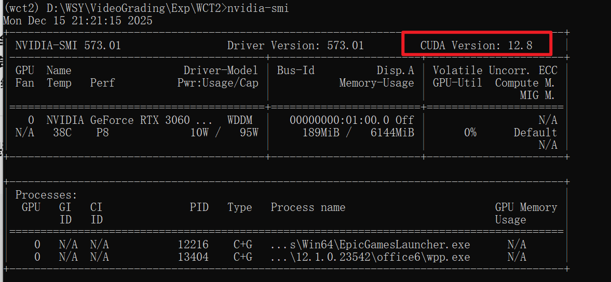

## 1 记录

1.虚拟环境

```
conda create -n wct2 python=3.6 -y

conda activate wct2

```

2.查看NVIDIA-SMI

```
nvidia-smi
```

得到



```
CUDA Version: 12.8
GPU: NVIDIA GeForce RTX 3060 (6GB)
```

`GPU：RTX 3060（6GB）`：显存 6GB，跑 512~1024 分辨率图片完全 OK

  `CUDA Version: 12.8`：
 👉 只是说明：
 **你的显卡驱动支持 CUDA 12.8**
 👉 ❌ 并不等于：你必须安装 CUDA 12.8 的 PyTorch

3.git clone

```
git clone https://github.com/clovaai/WCT2.git
```

4.安装 WCT2 其他依赖

```
pip install -r requirements.txt
```

## featurize

1.持久化环境

```
conda create --prefix /home/featurize/work/wct2test python=3.8
```

```
conda activate /home/featurize/work/wct2test
```

2.

```
git clone https://github.com/clovaai/WCT2.git
```

3.

```
pip install -r requirements.txt
```


输入视频路径

```
D:\WSY\VideoGrading\Exp\WCT2\inputVideo\input_01.mp4
D:\WSY\VideoGrading\Exp\WCT2\inputVideo\input_02.mp4
D:\WSY\VideoGrading\Exp\WCT2\inputVideo\input_03.mp4
```

风格图片路径

```
D:\WSY\VideoGrading\Exp\WCT2\examples\style\in14.png
```

输出视频路径

```
D:\WSY\VideoGrading\Exp\WCT2\outputVideos
```


## 视频颜色迁移

视频

21.14:

```
  python video_transfer.py \
      --content_video "./inputVideo/input_04.mp4" \
      --style "./examples/style/in03.jpg" \
      --output "./outputVideos/output_10.mp4" \
      --image_size 512 \
      --keep_ratio
```

> 总结一下，你对工程文件的修改在哪里，运行视频风格迁移的脚本步骤。

● 工程修改总结

### 新增文件

| 文件              | 路径                                           | 用途                       |
| ----------------- | ---------------------------------------------- | -------------------------- |
| video_transfer.py | D:\WSY\VideoGrading\Exp\WCT2\video_transfer.py | 视频风格迁移主脚本         |
| check_videos.py   | D:\WSY\VideoGrading\Exp\WCT2\check_videos.py   | 视频信息检查工具（可删除） |

### 新增目录

| 目录          | 用途         |
| ------------- | ------------ |
| inputVideo/   | 存放输入视频 |
| outputVideos/ | 存放输出视频 |

### 原有文件未修改

  原项目代码（transfer.py, model.py, utils/）保持不变。

---
###   视频风格迁移运行步骤

####   步骤1：激活环境

```
 conda activate wct2
```

####   步骤2：运行脚本

```
cd D:\WSY\VideoGrading\Exp\WCT2
```

```
python video_transfer.py --content_video "./inputVideo/input_04.mp4" --style "./examples/style/in58.png" --output "./outputVideos/output.mp4" --image_size 512 --keep_ratio
```

####   参数说明

| 参数            | 必填 | 说明           | 示例                      |
| --------------- | ---- | -------------- | ------------------------- |
| --content_video | ✓    | 输入视频路径   | ./inputVideo/input_01.mp4 |
| --style         | ✓    | 风格图片路径   | ./examples/style/in14.png |
| --output        |      | 输出视频路径   | ./outputVideos/output.mp4 |
| --image_size    |      | 处理分辨率     | 512 (默认)                |
| --alpha         |      | 风格强度 0-1   | 1.0 (默认)                |
| --keep_ratio    |      | 保持原始宽高比 | 添加此参数启用            |
| --cpu           |      | 使用CPU运行    | 添加此参数启用            |

####   可用风格图

  D:\WSY\VideoGrading\Exp\WCT2\examples\style\
  ├── in00.png
  ├── in02.jpg
  ├── in03.jpg
  ├── in14.png
  ├── in17.png
  ├── in34.png
  ├── in58.png
  └── in64.png

###   处理速度参考 (RTX 3060)

  - 512分辨率：约 2.5 帧/秒
  - 30fps视频每秒内容需 12秒 处理

  

#   web app下次启动方式：

WCT2/
  ├── app.py                 # Flask 后端
  ├── templates/index.html   # 前端页面
  ├── static/css/style.css   # 样式
  ├── static/js/app.js       # 前端逻辑
  └── requirements.txt       # 依赖

  conda activate wct2
  cd D:\WSY\VideoGrading\Web\WCT2
  python app.py

  然后访问 http://localhost:5000

