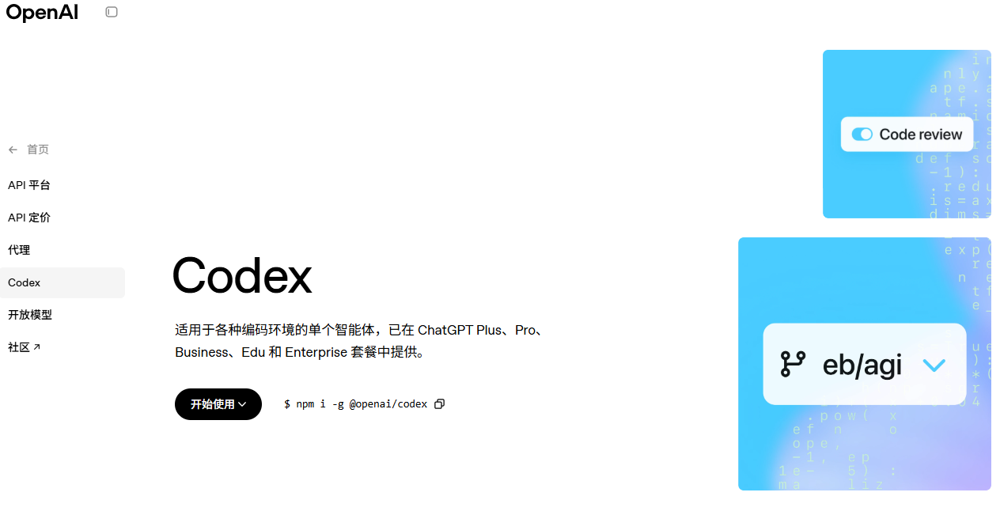
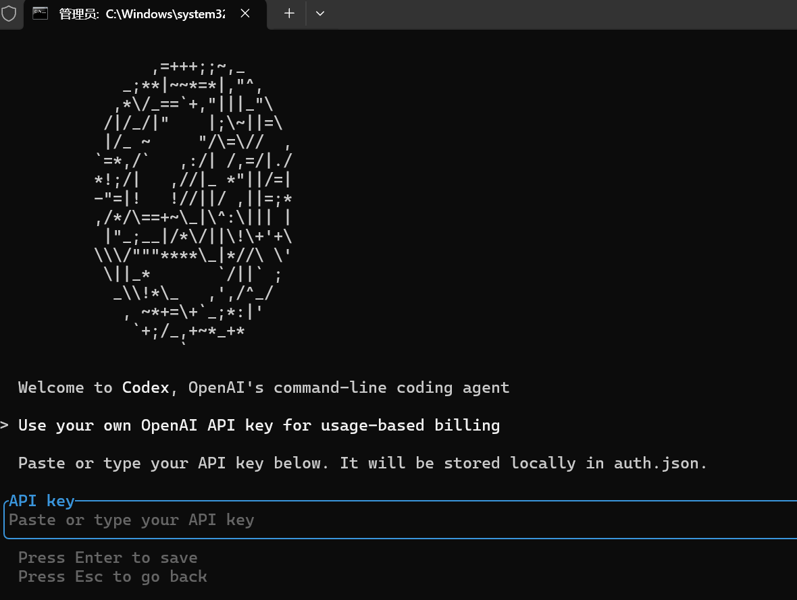
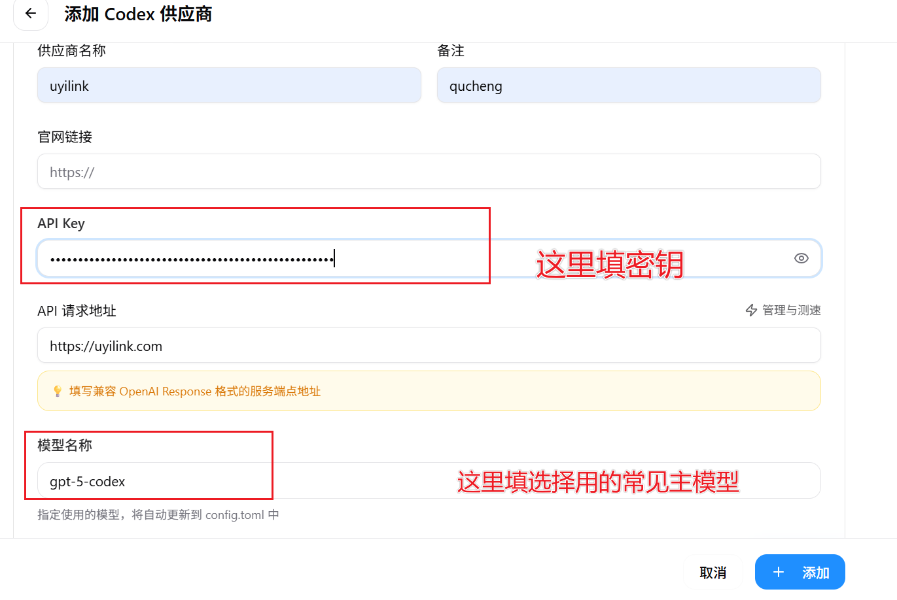

## Codex

适用于各种编码环境的单个智能体，已在 ChatGPT Plus、Pro、Business、Edu 和 Enterprise 套餐中提供。

[Codex | OpenAI](https://openai.com/zh-Hans-CN/codex/)

## 1.切换一个适合的节点


## 2.Codex官网

[Codex | OpenAI](https://openai.com/zh-Hans-CN/codex/)



## 3.命令行下载

```
win+R

cmd
```

使用npm包管理器进行下载：

```
npm i -g @openai/codex
```

检查是否下载成功

```
codex -- -v
```

成功则出现：



## 4.中转站

https://uyilink.com/

> 这个codex价格很便宜，Claude Code价格也算便宜，但是据说用的官方的API 用Codex的话先用这个，下面这个接入Codex时候发送请求体有点问题在修复


## 5.下载cc-switch

https://github.com/farion1231/cc-switch/releases/tag/v3.8.2

> 根据你的电脑win/mac，拉到最后选择对应的安装包下载：CC-Switch（用来快速配置/快速切换中转站）.


下一步


