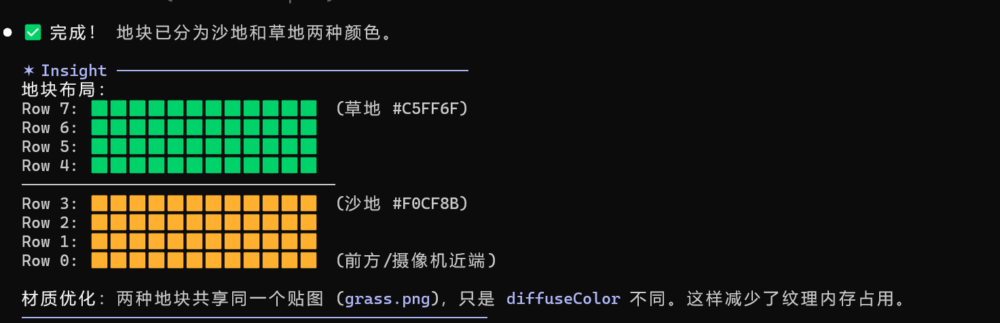

# 1.

贴图

```
 我需要你把src/models/tex中的贴图farmland.png用在游戏中的农田地块中，并用浅棕色着色。实现并运行。 
```

场景光照

```
 目前整个游戏场景的光照很暗，很丑，告诉我怎么调整光照到适宜的程度？
```

地块网格化

```
 目前场景中的草地块是一整片的平面，我很难描述具体的位置。请你把场景地块换成12*8个平面地块，贴图还是使用刚刚的grass.   
png,颜色改成C5FF6F。修改并运行。   
```

这样方便描述位置和坐标了！


```
 把0-3行（从前到后）的地块颜色统一改成F0CF8B（沙地的颜色）。修改运行
```



模型替换

```
我现在需要把僵尸植物模型：plant1.glb/plant2.glb/plant3.glb

```


```
把3个收银台都替换成src\models\SceneObjs\Out_shouyintai.glb模型
```

