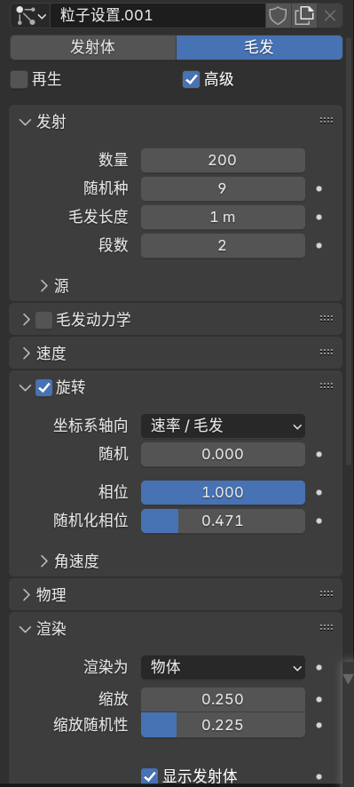
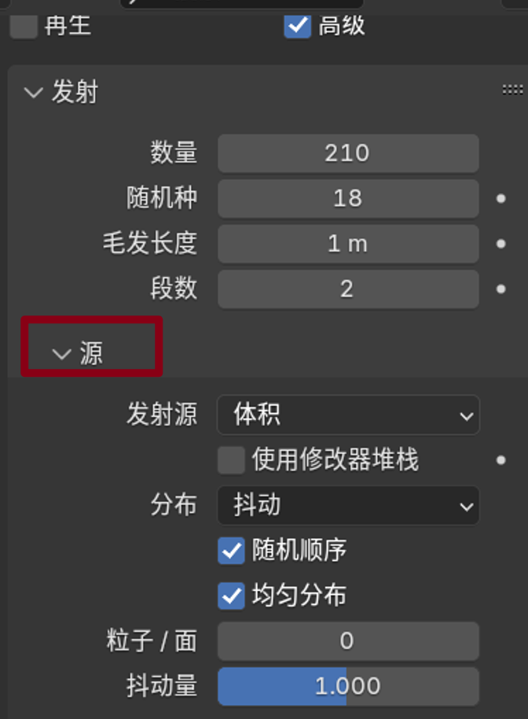
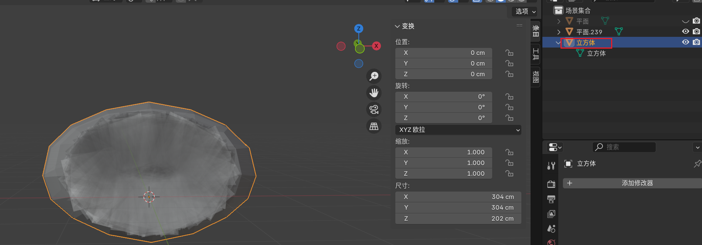
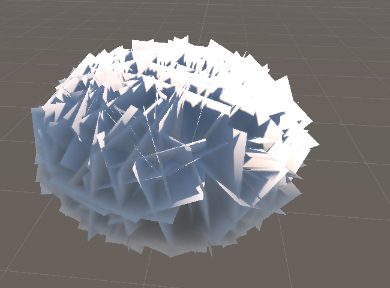
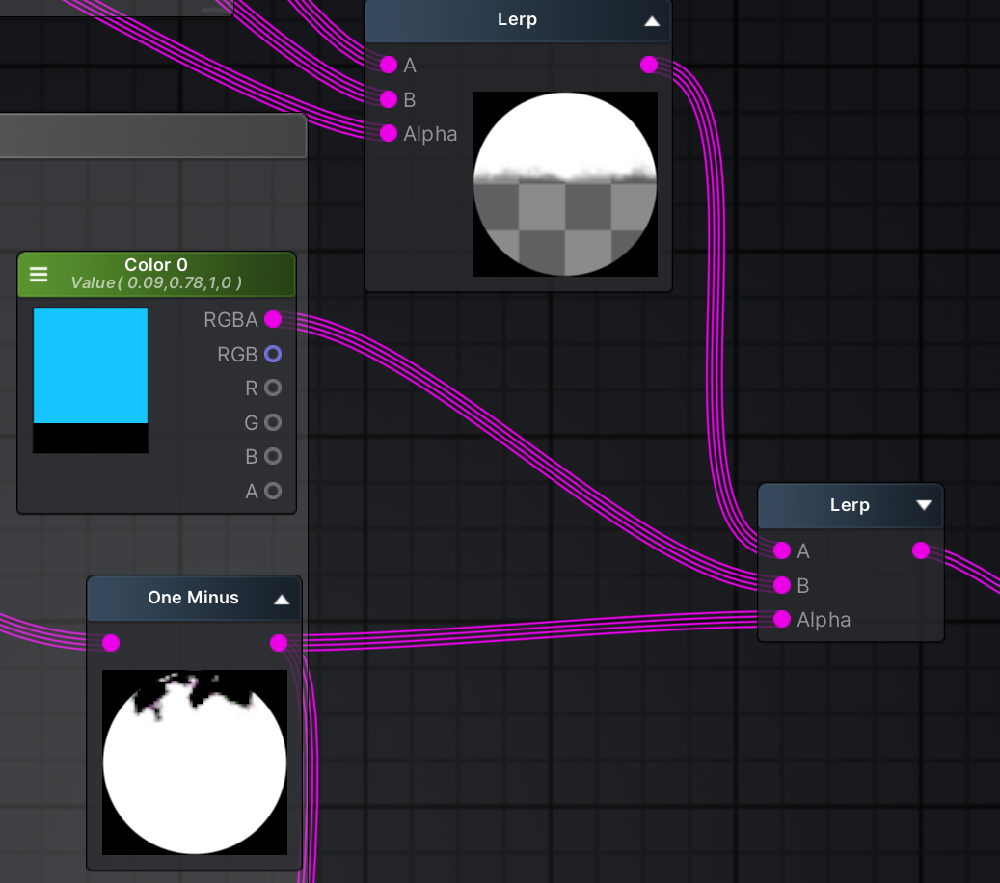
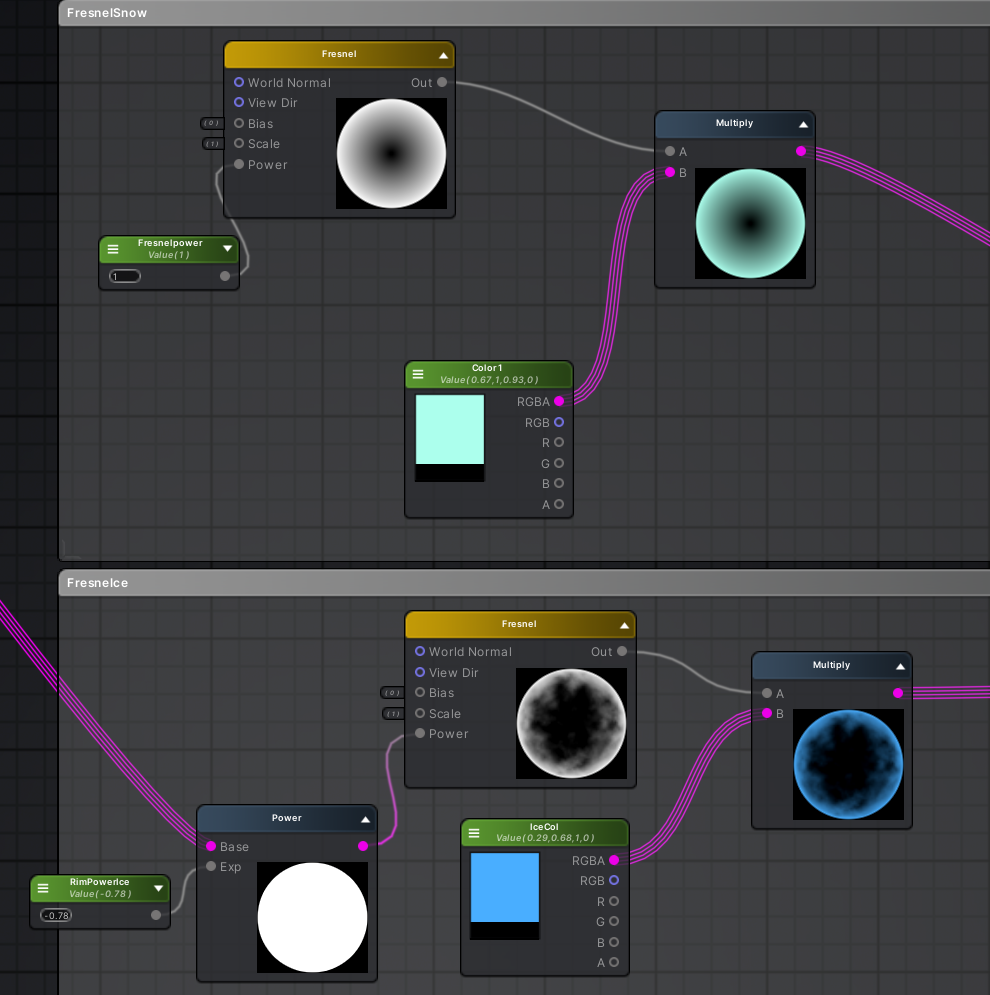
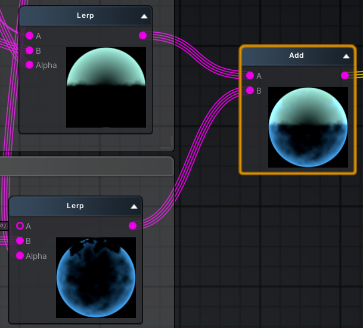
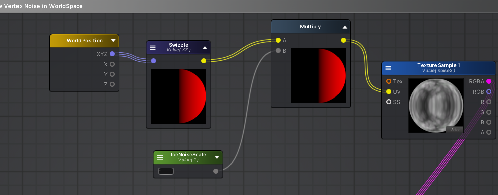
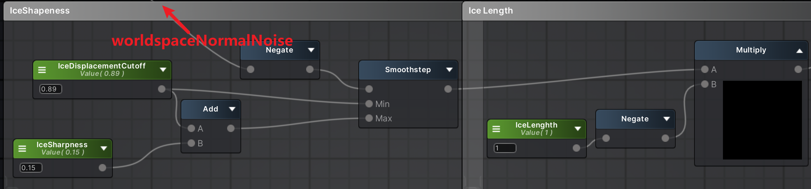
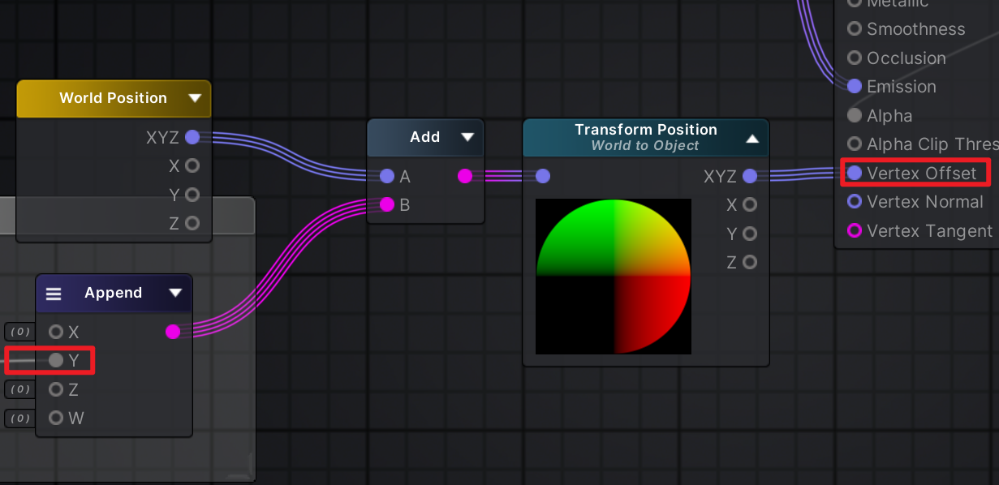

复现一些有趣的场景shader效果。

# 1.插片树

## Blender 模型

1.Blender新建十字插片（2个平面）


2.新建立方体，细分开到2。修改器应用细分后，tab进入编辑模式，选中面进行形状微调，做一个扁椭球状。最后平滑着色。


3.新建粒子系统——毛发——勾选高级——



重点：发射源要改为体积。



否则最终的树叶团子会中空……


其中，渲染勾选【物体】，选择十字插片。


微调上述提及的几个参数即可。


实例化这些面片，ctrl+j合并，作为一个十字插片的平面网格。


调整立方体球，包裹住面片插片网格。



给平面（十字插片）加上【数据传递-面拐数据】，选【自定义法向】，源物体选择的是立方体。这样面片的法线就是这个球体的信息了。


**记得把所有修改器都应用一下…^^**

将Blender做好的模型导出FBX，导入Unity开工。

导出设置参考：


## Unity 

> 导入一下ASE包，这是第一次正式使用ASE写shader，这里截图记录一下ASE的文件结构。
> 

大佬整理出的贴图各个通道的作用。


导入unity连上节点后：




# 2.冰雪效果

参考：https://www.patreon.com/posts/snow-and-icicles-118211037

这里仅作简单的重点记录。


分成三个部分

* 1.上层雪（Snow）
* 2.下层冰（Ice）
* 


需要纹理贴图（2）：
1.主纹理（Main Texture）

2.噪声纹理（Noise Texture）

### Triplanar 

什么是Triplanar mapping？

> Triplanar Mapping（三平面映射）是一种不依赖UV展开的纹理映射方法，其核心思想是：
>
> 沿 **X / Y / Z 三个正交方向**分别投影纹理，并根据**法线方向**对三次采样结果进行**加权混合**。

### 数学原理

| 投影面          | 使用的坐标       |
| --------------- | ---------------- |
| X 平面（YZ 面） | `(pos.y, pos.z)` |
| Y 平面（XZ 面） | `(pos.x, pos.z)` |
| Z 平面（XY 面） | `(pos.x, pos.y)` |

↓

**权重计算（关键）**

使用**法线的绝对值**作为权重来源：

```
float3 w = abs(normalWS);
w = w / (w.x + w.y + w.z);
```

意义：

- 面朝 X → `w.x` 大
- 面朝 Y → `w.y` 大
- 面朝 Z → `w.z` 大

↓

**三次采样 + 加权混合**

```
color =
    texX * w.x +
    texY * w.y +
    texZ * w.z;
```

### 使用场景

Triplanar 是连续混合：

- 消除 UV 接缝
- 平滑过渡
- 更适合自然材质（岩石、地形）
- **岩石、雪、苔藓、风化痕迹**几乎都用 **Triplanar Noise**。

| 方法           | 优点   | 缺点     |
| -------------- | ------ | -------- |
| UV Mapping     | 快     | 接缝     |
| Triplanar      | 无接缝 | 采样多   |
| World UV       | 简单   | 轴向拉伸 |
| Volume Texture | 最干净 | 显存大   |

> **纹理拉伸的本质是：**
>
> **纹理坐标在表面某一方向上的变化速率，远小于几何在该方向上的变化速率。**
>
> 更通俗一点是：
>
> 纹理采样方向 ≠ 表面变化方向
>
> **Triplanar 避免拉伸的“核心原因”**
>
> Triplanar 永远用“当前表面最接近正交的投影平面”进行采样。

### 雪顶：用Triplanar Noise来定义冰&雪的噪声

 用 Triplanar 方式采样 Noise 纹理 ，生成**“空间连续、不依赖 UV 的随机控制信号”**。


> We start by creating some **Triplanar** noise,which we will use to make the edges between the borders of Ice and Snow look more natural.
> 我们先制作一些**三平面**噪点，用来让冰雪边界之间的边缘看起来更自然。


噪声&法线插值：在【世界法线.y】mul【Triplanar Noise.y】与【世界法线.y】之间插值。


雪顶部分：利用噪声法线 Lerp 结果作为smoothstep输入，设定雪顶的平滑度。

当两个效果（雪顶<>主纹理）叠加时，在两者之间做lerp实现叠加与过渡。

### 冰底：与雪顶同理


与雪顶的y方向位置正好相反，所以要对smoothstep后的结果取反（oneMinus）


同样，对雪顶+主纹理的结果之上叠加冰底效果，仍然需要插值：


所以


### 菲涅尔

> Basic **Fresnel** node, with power control and multiplied by **SnowRim** color
> 基础**的菲涅尔**节点，带功率控制，并乘以 **SnowRim** 颜色

连接到自发光输出点，描述一下冰冻的边缘光效果。由于上下冰&雪两层的边缘光不需要重叠处理，直接用Add加一起就行。





### 积雪&冰柱-顶点偏移


> The vertex displacement has two parts, the snow where vertices will be pushed up slightly, and the ice where the vertices will be pulled down
> 顶点位移分为两部分:
>
> 1.雪顶点会被抬起
>
> 2.冰层顶点会被下拉

Worldspace 
因为位移仅在顶部和底部，我们只需在 **Worldspace** 的.xz（即Y平面-俯视）坐标上做一个纹**理**采样，再乘以**缩放。**

代码：

```
float2 uv = positionWS.xz;
```

shader graph


取世界空间的xz作为UV（乘以缩放尺度），采样一下噪声图



再对【世界法线】和【世界法线 mul 世界空间噪声】进行lerp，得到的【世界法线噪声】只取Y分量去step【冰雪的偏移】。


接下来就是雪高度&冰柱长度




> We once again take the world normals y value, this time **negated** to get the bottom of the model, and **Smoothstep** through this to control the sharpness of the icicles pulling down.
> 我们再次取世界法线的 y 值，取负值以获得模型底部，然后用 **Smoothstep**  控制冰柱向下拉动的锐利度。

最后将顶点位移和顶点位移相加起来,只取Y 坐标。


因为我们一直在世界空间中工作，现在需要【输出的Y通道】加上【世界位置】，并用**Transform**节点将其空间变换实现为【World—Object】，最后才能连到主节点的Vertex offset。



