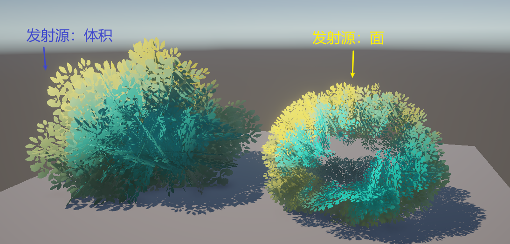

## Blender 模型

1.Blender新建十字插片（2个平面）

2.新建立方体，细分开到2。修改器应用细分后，tab进入编辑模式，选中面进行形状微调，做一个扁椭球状。最后平滑着色。

3.新建粒子系统——毛发——勾选高级——

重点：发射源要改为体积。

否则最终的树叶团子会中空……

其中，渲染勾选【物体】，选择十字插片。

微调上述提及的几个参数即可。

实例化这些面片，ctrl+j合并，作为一个十字插片的平面网格。

调整立方体球，包裹住面片插片网格。

给平面（十字插片）加上【数据传递-面拐数据】，选【自定义法向】，源物体选择的是立方体。这样面片的法线就是这个球体的信息了。

**记得把所有修改器都应用一下…^^**

将Blender做好的模型导出FBX，导入Unity开工。

导出设置参考：

## Unity 

> 导入一下ASE包，这是第一次正式使用ASE写shader，这里截图记录一下ASE的文件结构。
> 

大佬整理出的贴图各个通道的作用。

导入unity连上节点后：

