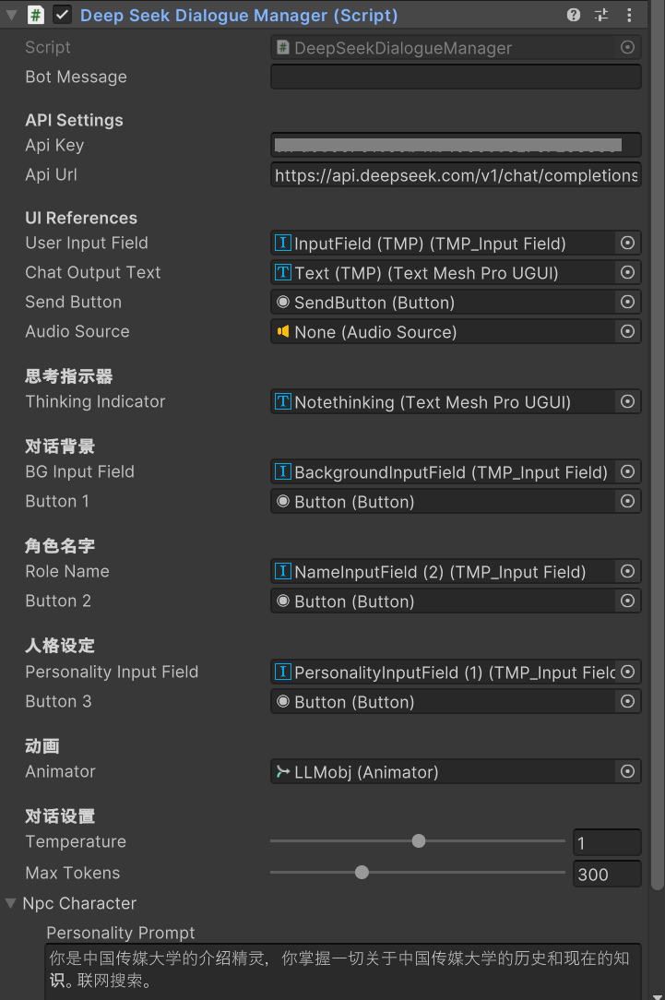

# 

# 进度报告

本次主要记录AI对话功能及用户界面的接入。

## 1 Deepseek API

[首次调用 API | DeepSeek API Docs](https://api-docs.deepseek.com/zh-cn/)


根据Deepseek API 文档，将调用对话API写一个C#脚本。

```python
# Please install OpenAI SDK first: `pip3 install openai`
import os
from openai import OpenAI

client = OpenAI(
    api_key=os.environ.get('DEEPSEEK_API_KEY'),
    base_url="https://api.deepseek.com")

response = client.chat.completions.create(
    model="deepseek-chat",
    messages=[
        {"role": "system", "content": "You are a helpful assistant"},
        {"role": "user", "content": "Hello"},
    ],
    stream=False
)

print(response.choices[0].message.content)
```

> 将官方提供的python脚本给ai，让其改成C#版本的就可以。

### DeepSeekDialogueManager

由于后面要考虑对话的用户界面和动画状态机等等，这里直接贴出最终的LLM调用脚本。

```c#
using UnityEngine;
using UnityEngine.UI;
using TMPro;
using System.Collections;
using System.Collections.Generic;
using UnityEngine.Networking;
using System.Text;
using System.IO;
using System;

public class DeepSeekDialogueManager : MonoBehaviour
{
    public string botMessage;


    // API 配置
    [Header("API Settings")]
    [SerializeField] private string apiKey = "";
    [SerializeField] private string apiUrl = "https://api.deepseek.com/v1/chat/completions";
    //private const string modelName = "deepseek-reasoner";
    private const string modelName = "deepseek-chat";

    // UI 绑定
    [Header("UI References")]
    [SerializeField] public TMP_InputField userInputField;
    [SerializeField] private TextMeshProUGUI chatOutputText;
    [SerializeField] private Button sendButton;
    [SerializeField] private AudioSource audioSource;
    [Header("思考指示器")]
    [SerializeField] public TextMeshProUGUI thinkingIndicator;

    [Header("对话背景")]
    [SerializeField] public TMP_InputField BGInputField;
    [SerializeField] private Button Button1;

    [Header("角色名字")]
    [SerializeField] public TMP_InputField RoleName;
    [SerializeField] private Button Button2;

    [Header("人格设定")]
    [SerializeField] public TMP_InputField PersonalityInputField;
    [SerializeField] private Button Button3;
    [Header("动画")]
    [SerializeField] private Animator m_Animator; // 动画控制器


    // 对话参数
    [Header("对话设置")]
    [Range(0, 2)] public float temperature = 0.7f;
    [Range(1, 1000)] public int maxTokens = 200;

    // 角色设定
    //[SerializeField] private string RoleName;
    [System.Serializable]


    public class NPCCharacter
    {
        [TextArea(3, 10)]
        public string personalityPrompt = $"你是中国传媒大学的介绍精灵，你掌握一切关于中国传媒大学的历史和现在的知识。联网搜索。";
        //public string personalityPrompt = ;
    }
    [SerializeField] public NPCCharacter npcCharacter;

    // 修复1：使用可序列化的数据结构
    private List<MessageData> messages = new List<MessageData>();
    private string tempAudioPath;
    private string sizePrompt = "只需要回答话语，不要有任何动作(比如*推眼镜*等等)。只需要回答150词以内即可。";


    //void Start()
    void Start()

    {
        tempAudioPath = Path.Combine(Application.persistentDataPath, "tts_output.wav");
        // 初始化角色设定
        messages.Add(new MessageData
        {
            role = "system",
            //content = npcCharacter.personalityPrompt + sizePrompt
            content = sizePrompt+BGInputField.text +"你的名字为："+ RoleName.text+"。" + PersonalityInputField.text 
        }) ;

        // 绑定发送事件
        sendButton.onClick.AddListener(OnSendMessage);
        userInputField.onEndEdit.AddListener((text) => {
            if (Input.GetKeyDown(KeyCode.Return)) OnSendMessage();
        });

        // 为设定按钮添加监听
        // 添加UI变更监听
        BGInputField.onValueChanged.AddListener(_ => InitializeSystemMessage());
        RoleName.onValueChanged.AddListener(_ => InitializeSystemMessage());
        PersonalityInputField.onValueChanged.AddListener(_ => InitializeSystemMessage());

        // 按钮绑定更新系统消息
        Button1.onClick.AddListener(() => InitializeSystemMessage());
        Button2.onClick.AddListener(() => InitializeSystemMessage());
        Button3.onClick.AddListener(() => InitializeSystemMessage());

    }

    private void InitializeSystemMessage()
    {
        // 动态获取UI输入值
        string dynamicPrompt = $"{BGInputField.text}{RoleName.text}{PersonalityInputField.text}{sizePrompt}";

        // 清除旧系统消息
        messages.RemoveAll(m => m.role == "system");

        // 添加新系统消息
        messages.Add(new MessageData
        {
            role = "system",
            content = string.IsNullOrWhiteSpace(dynamicPrompt)
                ? npcCharacter.personalityPrompt + sizePrompt // 默认值
                : dynamicPrompt
        });
    }
  
    // 发送消息
    public void OnSendMessage()
    {
        InitializeSystemMessage(); // 每次发送前更新系统消息

        string userMessage = userInputField.text.Trim();
        if (string.IsNullOrEmpty(userMessage)) return;

        // 显示玩家消息
        AppendToChat($"玩家: {userMessage}",false);

        // 添加到历史记录
        messages.Add(new MessageData
        {
            role = "user",
            content = userMessage
        });

        userInputField.text = "";
        //调用api
        StartCoroutine(CallDeepSeekAPI());
    }

    public void OnSendMessage(string audioMess)
    {
        string userMessage = audioMess;
        if (string.IsNullOrEmpty(userMessage)) return;

        // 显示玩家消息
        AppendToChat($"玩家: {userMessage}",false);

        // 添加到历史记录
        messages.Add(new MessageData
        {
            role = "user",
            content = userMessage
        });

        userInputField.text = "";
        //调用api
        StartCoroutine(CallDeepSeekAPI());
    }

    //角色思考文本动画
    private IEnumerator BlinkText()
    {
        while (true)
        {
            float alpha = Mathf.PingPong(Time.time, 1f);
            thinkingIndicator.color = new Color(1, 1, 1, alpha);
            yield return null;
        }
    }
    // API通信协程
    private IEnumerator CallDeepSeekAPI()
    {
        //启动闪烁动画
        thinkingIndicator.gameObject.SetActive(true);
        thinkingIndicator.text = RoleName.text+"思考中……";
        SetAnimator("state", 1); // 设置动画状态为1
        StartCoroutine(BlinkText()); 

        // 构建符合API规范的结构体
        var requestBody = new RequestBody
        {
            model = modelName,
            messages = messages.ToArray(), // 转换为数组
            temperature = temperature,
            max_tokens = maxTokens,
            stream = false
        };

        string jsonData = JsonUtility.ToJson(requestBody);
        byte[] bodyRaw = System.Text.Encoding.UTF8.GetBytes(jsonData);

        using (UnityWebRequest request = new UnityWebRequest(apiUrl, "POST"))
        {
            request.uploadHandler = new UploadHandlerRaw(bodyRaw);
            request.downloadHandler = new DownloadHandlerBuffer();
            request.SetRequestHeader("Content-Type", "application/json");
            request.SetRequestHeader("Authorization", $"Bearer {apiKey}");
            request.SetRequestHeader("Accept-Language", "en-US");

            yield return request.SendWebRequest();
            // 3. 隐藏指示器
            thinkingIndicator.gameObject.SetActive(false);
            StopCoroutine(BlinkText()); // 可选：停止动画

            // 修复3：添加详细错误处理
            if (request.result != UnityWebRequest.Result.Success)
            {
                Debug.LogError($"API错误: {request.error}");
                Debug.LogError($"状态码: {request.responseCode}");
                Debug.LogError($"响应内容: {request.downloadHandler.text}");

                // 尝试解析错误详情
                try
                {
                    var errorResponse = JsonUtility.FromJson<ErrorResponse>(
                        request.downloadHandler.text
                    );
                    Debug.LogError($"错误类型: {errorResponse.error.type}");
                    Debug.LogError($"错误信息: {errorResponse.error.message}");
                }
                catch
                {
                    Debug.LogError("无法解析错误响应");
                }

                AppendToChat("系统: 对话服务暂时不可用",true);
                yield break;
            }

            // 解析响应
            var response = JsonUtility.FromJson<DeepSeekResponse>(
                request.downloadHandler.text
            );
            //string botMessage = response.choices[0].message.content;
            botMessage = response.choices[0].message.content;

            // 显示并存储AI回复
            AppendToChat($"{RoleName.text}: {botMessage}",true);
            messages.Add(new MessageData
            {
                role = "assistant",
                content = botMessage
            });
            SetAnimator("state", 2); // 设置动画状态为2
            // 调用TTS生成语音
            //StartCoroutine(CallTTSService(botMessage));
        }
    }
   

    // 更新对话显示
    private void AppendToChat(string text,bool isBot = false)
    {
        // 设置颜色
        string colorTag = isBot ? "<color=#47A699>" : "<color=#FFFFFF>"; // 深蓝色为 #0000FF，白色为 #FFFFFF
        string closeTag = "</color>";
        // 添加颜色标签
        text = $"{colorTag}{text}{closeTag}";

        chatOutputText.text += $"\n{text}";
        Canvas.ForceUpdateCanvases();
        chatOutputText.GetComponentInParent<ScrollRect>().verticalNormalizedPosition = 0;
        //SetAnimator("state", 0); // 设置动画状态为0
    }

    // 设置动画参数
    private void SetAnimator(string _para, int _value)
    {
        if (m_Animator == null) // 如果动画控制器为空
            return; // 直接返回

        m_Animator.SetInteger(_para, _value); // 设置动画控制器的整数参数
    }

    // 修复4：定义符合API规范的数据结构
    [System.Serializable]
    private class RequestBody
    {
        public string model;
        public MessageData[] messages;
        public float temperature;
        public int max_tokens;
        public bool stream;
    }

    [System.Serializable]
    private class MessageData
    {
        public string role;
        public string content;
    }

    [System.Serializable]
    private class DeepSeekResponse
    {
        public Choice[] choices;
    }

    [System.Serializable]
    private class Choice
    {
        public Message message;
    }

    [System.Serializable]
    private class Message
    {
        public string role;
        public string content;
    }

    // 新增：错误响应结构
    [System.Serializable]
    private class ErrorResponse
    {
        public ErrorInfo error;
    }

    [System.Serializable]
    private class ErrorInfo
    {
        public string message;
        public string type;
        public string param;
    }
}
```

新建空物体gameobj，把该脚本挂在上面。


## 2 用户界面

Unity交互层采用UGUI组件构建用户界面，界面设计遵循易用性原则，采用清晰的布局结构与视觉层次，确保用户能够直观理解各功能模块的作用与操作方式。交互层包含对话框界面与角色设定面板。对话框界面主要由以下组件构成：

1) 对话输入框：使用InputField组件，支持文本输入与语音输入两种方式，用户可直接输入文本或通过语音识别填充文本。

2) 对话显示区域：使用TextMesh Pro组件，显示用户输入与AI回复的内容，通过不同颜色区分双方消息，并支持富文本格式显示。

3) 滚动视图：使用ScrollRect组件包裹对话显示区域，实现对话历史的自动滚动，确保用户始终看到最新消息。

4) 发送按钮：使用Button组件，点击后触发对话发送逻辑，将用户输入传递给智能对话模块。

5) 语音输入按钮：使用Button组件，点击后开启语音录制功能，调用讯飞语音识别服务。

6) 背景设置输入框：使用InputField组件，用户可输入对话场景配置描述，如"回答字数限制在100字以内"等。

7) 确认按钮：使用Button组件，点击后将用户输入的角色设定信息注入智能对话模块。


> 用了M Studio的插件，给不同组件上色方便归纳和查看。

## 3 脚本信息引用

如图，脚本DeepSeekDialogueManager中开放出来的公共变量可以填上，跨物体引用组件。这里主要：

* 填上api key / url
* UI引用写入
  * 输入框
  * 输出框
  * 发送键
  * 思考指示器
  * ……



## 4 初步测试对话功能


可以正常对话。