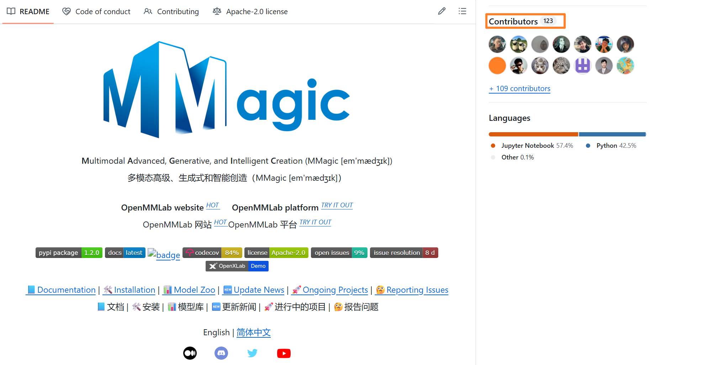

## 1 项目简介

### 什么是 MMagic

**MMagic 是一个开源的 AIGC（生成式人工智能）工具箱**，基于 **PyTorch** 构建，属于 **OpenMMLab 生态系统的一部分**。它整合了图像和视频生成、编辑、恢复、增强等一系列任务的算法与工具，目的是帮助研究者和工程师快速实验、训练与部署生成模型。


### **项目地址：**



[open-mmlab/mmagic: OpenMMLab Multimodal Advanced, Generative, and Intelligent Creation Toolbox. Unlock the magic 🪄: Generative-AI (AIGC), easy-to-use APIs, awsome model zoo, diffusion models, for text-to-image generation, image/video restoration/enhancement, etc.](https://github.com/open-mmlab/mmagic)

1.虚拟环境

```
conda create -n mmagic python=3.9
conda create -n basicvsr python=3.8
conda activate mmagic

```

2.安装 依赖

MMagic 依赖 [PyTorch](https://pytorch.org/)，[MMEngine](https://github.com/open-mmlab/mmengine) 和 [MMCV](https://github.com/open-mmlab/mmcv)，以下是安装的简要步骤。

**步骤 1.** 依照[官方教程](https://pytorch.org/get-started/locally/)安装 PyTorch 。

**步骤 2.** 使用 [MIM](https://github.com/open-mmlab/mim) 安装 MMCV，MMEngine 和 MMagic 。

```
pip3 install openmim
mim install 'mmcv>=2.0.0'
mim install 'mmengine'
mim install 'mmagic'
```

**步骤 3.** 验证 MMagic 安装成功。

```
cd ~
python -c "import mmagic; print(mmagic.__version__)"
# Example output: 1.0.0
```

3.阅读文档

[视频超分辨率 — MMagic 文档](https://mmagic.readthedocs.io/zh-cn/latest/model_zoo/视频超分辨率.html)


## 视频颜色迁移

视频

21.14:

```
  python video_transfer.py \
      --content_video "./inputVideo/input_04.mp4" \
      --style "./examples/style/in03.jpg" \
      --output "./outputVideos/output_10.mp4" \
      --image_size 512 \
      --keep_ratio
```

> 总结一下，你对工程文件的修改在哪里，运行视频风格迁移的脚本步骤。

● 工程修改总结

### 新增文件

| 文件              | 路径                                           | 用途                       |
| ----------------- | ---------------------------------------------- | -------------------------- |
| video_transfer.py | D:\WSY\VideoGrading\Exp\WCT2\video_transfer.py | 视频风格迁移主脚本         |
| check_videos.py   | D:\WSY\VideoGrading\Exp\WCT2\check_videos.py   | 视频信息检查工具（可删除） |

### 新增目录

| 目录          | 用途         |
| ------------- | ------------ |
| inputVideo/   | 存放输入视频 |
| outputVideos/ | 存放输出视频 |

### 原有文件未修改

  原项目代码（transfer.py, model.py, utils/）保持不变。

---
###   视频风格迁移运行步骤

####   步骤1：激活环境

```
 conda activate wct2
```

####   步骤2：运行脚本

```
cd D:\WSY\VideoGrading\Exp\WCT2
```

```
python video_transfer.py --content_video "./inputVideo/input_04.mp4" --style "./examples/style/in58.png" --output "./outputVideos/output.mp4" --image_size 512 --keep_ratio
```

####   参数说明

| 参数            | 必填 | 说明           | 示例                      |
| --------------- | ---- | -------------- | ------------------------- |
| --content_video | ✓    | 输入视频路径   | ./inputVideo/input_01.mp4 |
| --style         | ✓    | 风格图片路径   | ./examples/style/in14.png |
| --output        |      | 输出视频路径   | ./outputVideos/output.mp4 |
| --image_size    |      | 处理分辨率     | 512 (默认)                |
| --alpha         |      | 风格强度 0-1   | 1.0 (默认)                |
| --keep_ratio    |      | 保持原始宽高比 | 添加此参数启用            |
| --cpu           |      | 使用CPU运行    | 添加此参数启用            |

####   可用风格图

  D:\WSY\VideoGrading\Exp\WCT2\examples\style\
  ├── in00.png
  ├── in02.jpg
  ├── in03.jpg
  ├── in14.png
  ├── in17.png
  ├── in34.png
  ├── in58.png
  └── in64.png

###   处理速度参考 (RTX 3060)

  - 512分辨率：约 2.5 帧/秒
  - 30fps视频每秒内容需 12秒 处理

  

#   web app下次启动方式：

WCT2/
  ├── app.py                 # Flask 后端
  ├── templates/index.html   # 前端页面
  ├── static/css/style.css   # 样式
  ├── static/js/app.js       # 前端逻辑
  └── requirements.txt       # 依赖

  conda activate wct2
  cd D:\WSY\VideoGrading\Web\WCT2
  python app.py

  然后访问 http://localhost:5000

## Featurize

安装BasicVSR

```
conda activate basicvsr
```

跑项目

```
python demo/restoration_video_demo.py configs/basicvsr_plusplus_reds4.py chkpts/basicvsr_plusplus_reds4.pth data/input000.mp4 results/output_000.mp4
```


```
python demo/restoration_video_demo.py configs/basicvsr_plusplus_reds4.py chkpts/basicvsr_plusplus_reds4.pth data/demo_000 results/output_000
```

36-40

## ─ Worked for 32m 17s ──────────────────────────────────────────────────────────────────────────────────────────

• 已按 conda 环境把依赖装好并下载了权重，但 demo 运行卡在 Windows 的 DLL 文件被占用（av 的 swscale-*.dll）。我
  这边做过的步骤如下：

  - 已创建 basicvsr 环境并安装了 PyTorch 1.10.2+cu113（为匹配 Windows 的 mmcv-full 预编译包）
  - 已安装 mmcv-full==1.5.0（cu113/torch1.10.0 轮子）
  - 已 pip install -v -e . 安装项目依赖
    当前错误：
    OSError: Error loading swscale-*.dll; 另一个程序正在使用此文件

  请先做这几件事之一，然后重试 demo：

  1. 关闭所有可能在用 Python/AV 的进程（IDE、Jupyter、Python 脚本）
  2. 重新打开终端（或重启电脑）再跑
  3. 如果还不行，重新安装 av：

  conda activate basicvsr
  pip uninstall -y av
  pip install av==12.3.0

  重试 demo 命令（推荐用激活环境跑）：

  conda activate basicvsr
  python demo/restoration_video_demo.py configs/basicvsr_plusplus_reds4.py chkpts/basicvsr_plusplus_reds4.pth
  data/demo_000 results/demo_000

  如果你愿意，我也可以继续帮你：

  1. 排查 DLL 占用（看是哪个进程锁住了 av）
  2. 跑你自己的视频路径并调显存占用参数


› python demo/restoration_video_demo.py configs/basicvsr_plusplus_reds4.py chkpts/basicvsr_plusplus_reds4.pth
  data/demo_000 results/demo_000

• 要我帮你在当前机器上执行这条 demo 命令吗？
  如果要运行，请确认你已先 conda activate basicvsr，我就直接跑。

