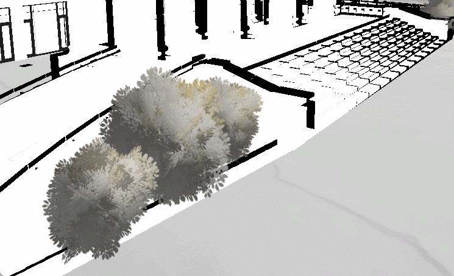

# 进度报告

上周至本周的进度：

1.STT集成：实现语音对话的功能。

2.天空盒：利用nano banana工具，按照天空盒贴图标准，形成水墨风格环境映射。

3.插片摇曳植物：去掉了性能开销较大的公共资产植物，通过十字插片实现植物的叶片效果，以及输入正弦波来驱动顶点偏移，实现随风摇曳的效果。

### 一、 上周至本周工作进度

上周至本周工作主要是：

#### 1. STT（Speech-to-Text）语音交互模块集成

- **工作内容：** 完成了语音输入对话功能。通过调用讯飞星火 STT 接口，实现了对用户麦克风输入音频的实时捕捉，并将其转化为文本字符串显示在 UI 界面上，初步实现了“语音输入-系统识别-反馈显示”的交互。
- **提升沉浸感：** 用户无需脱离画面进行繁琐的打字操作，交互过程更加流畅。
- **技术铺垫：** 为下一阶段结合大语言模型（LLM）的“情景化对话”功能提供了必要的输入接口。

#### 2. 水墨风格天空盒（Skybox）与环境映射

- **工作内容：** 先将普通的HDR环境贴图转成Nano Banana能读懂的图片格式，利用 Nano Banana  AI工具生成符合等距柱状投影（Equirectangular Projection）标准的 360° 全景贴图，并对其进行水墨风格化处理。随后将处理后的贴图应用为场景 Skybox，并重新烘焙了场景的环境反射（Reflection Probe）和环境光（Ambient Light）。
- **统一视觉基调：** 确立了场景整体的冷暖色温和水墨氛围，使天空与地面的衔接浑然一体。
- **优化光影融合：** 通过环境映射，使场景中的模型（如建筑、石块）能反射出带有水墨质感的光泽，避免了“模型像是漂浮在背景上”的违和感。

#### 3. 植被渲染优化：十字插片与动态摇曳

- **工作内容：**

  - **资产重构：** 移除了资源商店中面数过万的高精度植物模型，改用由两个交叉平面组成的“十字插片（Cross-plane）”模型来模拟植物外观。
  - **Shader 开发：** 编写自定义 Shader，在顶点着色器（Vertex Shader）阶段引入时间变量和正弦波函数（Sine Wave），根据顶点的高度信息（UV 或 Y 轴坐标）控制偏移量，模拟风吹摆动的效果。

- **优化：**

  - **性能瓶颈：** 校园场景需要大量植被覆盖，之前的高模资产导致 Draw Call 激增，帧率严重下降，无法满足实时渲染要求。

  - **增强生动性：** 随风摇曳的动态效果极大地增加了场景的“呼吸感”和韵味，利用数学模拟实现了低成本的视觉欺骗，更加符合水墨画中“风动草偃”的意境。

## 二、下一阶段目标：

1.加入水墨风格水体

2.加入亭台水榭等二次装饰元素，对虚拟环境进行进一步抽象和美化

3.情景化对话脚本
