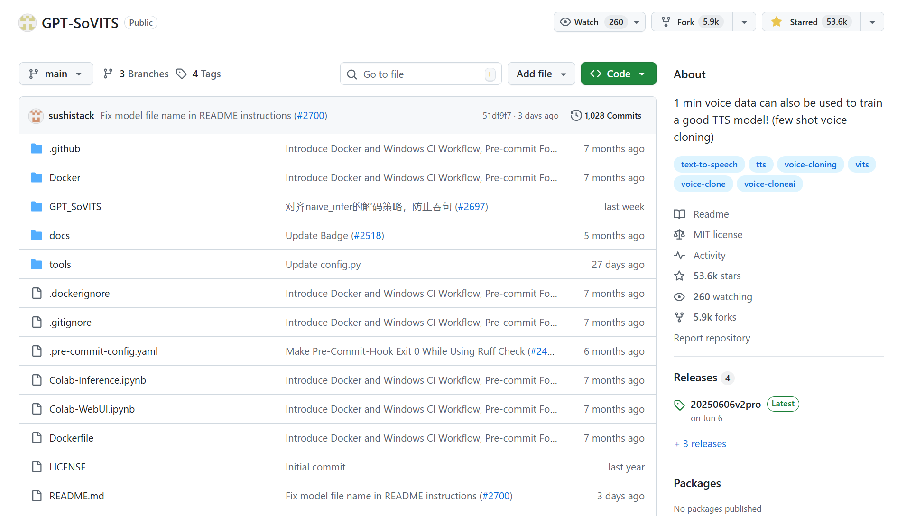
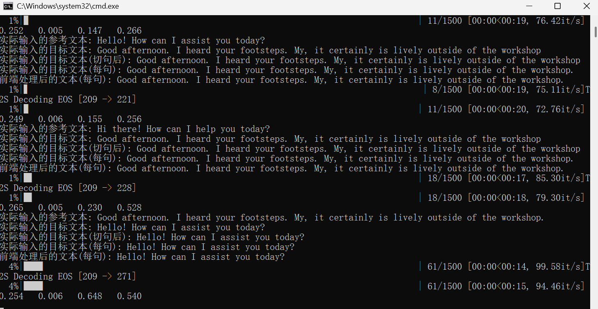

# 进度报告

本次主要记录TTS（文字转语音）的数据集收集，训练，以及推理功能实现。

## 1 GPT-SoVITS

> ### 作品简介模板
>
> **音声来源：**[训练集音声来源]
>
> **免责声明：**本作品仅作为毕业设计发布，可能造成的后果与使用的语音合成项目的作者、贡献者无关。
>
> [attention:] 最好发视频可以带上GPT-SoVITS的Tag

项目地址：https://github.com/RVC-Boss/GPT-SoVITS 

GPT-SoVITS是[花儿不哭](https://space.bilibili.com/5760446/)研发的低成本AI音色合成软件。



TTS（Text-To-Speech）这是一种文字转语音的语音合成。类似的还有SVC（歌声转换）、SVS（歌声合成）等。目前GPT-SoVITS实现了：

GPT-SoVITS-V1实现了：

- 由参考音频的情感、音色、语速控制合成音频的情感、音色、语速
- 可以少量语音微调训练，也可不训练直接推理
- 可以跨语种生成，即参考音频（训练集）和推理文本的语种为不同语种

GPT-SoVITS-V2新增特点：

- 对低音质参考音频合成出来音质更好
- 底模训练集增加到5k小时，zero shot性能更好音色更像，所需数据集更少
- 增加韩粤两种语言，中日英韩粤5个语种均可跨语种合成
- 更好的文本前端：持续迭代更新。V2中英文加入多音字优化。

GPT-SoVITS-V3V4新增特点：

- 音色相似度更像，需要更少训练集来逼近本人（甚至不需要训练SoVITS）
- GPT合成更稳定，重复漏字更少，也更容易跑出丰富情感
- v4修复了v3非整数倍上采样可能导致的电音问题，原生输出48k音频防闷（而v3原生输出只有24k）。作者认为v4是v3的平替，更多还需测试。

## 2 音源训练集

1.前期训练集收集工作：
收集音源干声。总共收集大约10分钟的音频即可训练出较好的效果。


2.音频切割：
将时长超过 显存数 秒的音频手动切分至 显存数 秒以下。比如显卡是4090 显存是24g，那么就要将超过24秒的音频手动切分至24s以下，音频时长太长的会爆显存。


3. 标注
fast whisper是目前最好的英语和日语识别，使用整合包里的ASR脚本即可对处理过的音频进行标注，给每个音频配上文字，这样才能让AI学习到每个字该怎么读。


4. 训练
Windows支持 CUDA 的 NVIDIA 显卡，训练要求每张拥有至少 8G 以上显存。因为显存不够，所以到AutoDL上租卡训练。


训练之后会得到两个权重：


## 3 实时推理

1.放好权重文件：

`GPT_weights_v2`：放.ckpt文件

`SoVITS_weights_v2`:放.pth文件

2.参考音频（一定要准备好）

上传一段参考音频，建议是数据集中的音频。**最好5秒**。**参考音频很重要！**会学习**语速和语气**。建议选择**有参考文本模式**，如果是无文本参考模式很容易出糟糕的推理结果。



### 关于top_p,top_k和temperature

这三个值都是用来控制采样的。在推理的时候要挑出一个最好的token，但机器并不知道哪个是最好的。于是先按照top_k挑出前几个token，top_p在top_k的基础上筛选token。最后temperature控制随机性输出。

比如总共有100个token，top_k设置5，top_p设置0.6，temperature设置为0.5。那么就会从100个token中先挑出5个概率最大的token，这五个token的概率分别是（0.3，0.3，0.2，0.2，0.1），那么再挑出累加概率不超过0.6的token（0.3和0.3），再从这两个token中随机挑出一个token输出，其中前一个token被挑选到的几率更大。以此类推。

> 拉满当赌狗，拉低当复读机。

## 4 效果

> 以下语音纯属TTS合成：

<audio src="F:/UNITY/TEMP/GenshinTest/Assets/PY/res.WAV"></audio>

效果：


## 5 API接入Unity使用TTS推理

API使用TTS推理：
推理已经在http://localhost:9872/开启。此时参考API文档可以通过python脚本来调用推理进行测试。


## C#与Python之间UDP通信


1.C#作为发送端，通过UDP发送AI文本到Python端。
 2.Python接收文本并调用TTS模型生成语音。
 3.Python将生成的语音路径通过UDP发送回C#端。
 4.C#端加载并播放语音文件。

## 效果

```
你好！用英文向我问好！
```

<video src="C:/Users/Administrator/20251222_011630.mp4"></video>

> (本机使用30系显卡，推理速度会稍微慢一点。10词推理10-16s是常有的事。)
>
> 推理已经在http://localhost:9872/开启。此时参考API文档可以通过python脚本来调用推理进行测试。


