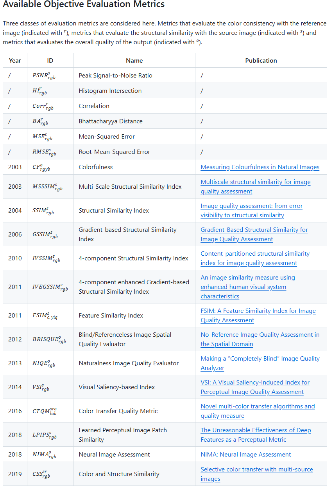

# 记录：


ColorTransferLib 的主要贡献：“三合一、一站式”

### 1.**算法大全**

把 2001-2023 年公开发表的 11 种颜色迁移、5 种风格迁移、3 种上色算法全部收进一个库，并统一重写成相同接口；既有经典（Reinhard 等）也有最新 SOTA（HistoGAN、DDColor 等）。


### 2.**数据类型全覆盖**

同一套 API 可直接处理图像、视频、光场、体积视频、点云、纹理网格、3D Gaussian Splatting，免去了为不同模态反复改写代码的麻烦。


### 3.客观评价基准

内置 20 项无参考/全参考指标（PSNR、LPIPS、VSI、CTQM、NIMA 等），可一次性输出“与参考图颜色一致性、与源图结构保真度、整体感知质量”三类量化结果，方便论文对比和调参。



一句话：ColorTransferLib 让颜色迁移研究从“零散脚本”变成“统一平台”，开发、对比、评估都能一条命令完成。

记录：

**(1)** 在远端服务器上添加环境目录（因为多用户的conda环境中，非管理员用户没有对conda环境（位于/opt/miniconda3）的写权限。）

```
EnvironmentNotWritableError: The current user does not have write permissions to the target environment.
  environment location: /opt/miniconda3
  uid: 1004
  gid: 1004
```

正确的做法是：

```
# 1. 创建用户conda目录
mkdir -p ~/.conda/envs

# 2. 添加用户目录到conda环境路径（使用--prepend）
conda config --prepend envs_dirs ~/.conda/envs

# 3. 查看当前的conda环境路径配置
conda config --show envs_dirs
```


(2)直接创建环境并激活安装包

```
# 1. 尝试直接创建环境（最简单的方案）
conda create -n colortransfer python=3.8

# 2. 如果成功，激活并安装包
conda activate colortransfer
conda install -c conda-forge octave ffmpeg
```

检查一下：

```
# 3. 验证安装
octave --version
ffmpeg -version
```

3）git原文

```
# activate octave environment
octave
# install packages
octave:1> pkg install -forge image
octave:2> pkg install -forge statistics
```

实际上直接运行会报错：

```
octave:1> pkg install -forge image
configure: error: in `/tmp/oct-Z0XxUS/image-2.18.1/src':
configure: error: C++ compiler cannot create executables
See `config.log' for more details
checking for mkoctfile... /home/wsy/.conda/envs/colortransfer/bin/mkoctfile-10.3.0
checking whether the C++ compiler works... no

```

这个错误表明在安装 Octave 的 image 包时，缺少必要的 C++ 编译环境。

所以：

```
# 在 conda 环境中安装必要的编译工具
conda install -c conda-forge gxx_linux-64 make cmake
```

**安装 Octave 开发依赖**

```
# 安装 Octave 开发依赖
conda install -c conda-forge octave-devel
```

**安装 image 包所需的依赖**

```
# 安装图像处理库
conda install -c conda-forge libtiff libjpeg-turbo libpng
```

**尝试重新安装 image 包**

```

```

(3) Run the `gbvs_install.m` to make the evaluation metric VSI runnable:

```
user@pc:~/<Project Path>/ColorTransferLib/Evaluation/VIS/gbvs$ ocatve
octave:1> gbvs_install.m
```


### Install via PyPI


```
pip install colortransferlib
pip install git+https://github.com/facebookresearch/detectron2.git@main
```


### Install from source


```
pip install -r requirements/requirements.txt
python setup.py bdist_wheel
pip install ../ColorTransferLib/dist/ColorTransferLib-2.0.3-py3-none-any.whl 
pip install git+https://github.com/facebookresearch/detectron2.git@main
```


## Usage


### Color Transfer


```
from ColorTransferLib.ColorTransfer import ColorTransfer
from ColorTransferLib.DataTypes.Image import Image

src = Image(file_path='/media/source.png')
ref = Image(file_path='/media/reference.png') 

algo = "GLO"
ct = ColorTransfer(src, ref, algo)
out = ct.apply()

# No output file extension has to be given
if out["status_code"] == 0:
    out["object"].write("/media/out")
else:
    print("Error: " + out["response"])
```


### Evaluation


```
from ColorTransferLib.ColorTransfer import ColorTransferEvaluation
from ColorTransferLib.DataTypes.Image import Image

src = Image(file_path='/media/source.png')
ref = Image(file_path='/media/reference.png') 
out = Image(file_path='/media/output.png') 

cte = ColorTransferEvaluation(src, ref, out)
eva = cte.apply(method)
print(eva)
```


## Test


```
# Test all Color Transfer algorithms with all data type combinations
python main.py --test all_CT --out_path "/media/out"

# Test all Style Transfer algorithms with all data type combinations
python main.py --test all_ST --out_path "/media/out"

# Test all Colorization algorithms with all data type combinations
python main.py --test all_CT --out_path "/media/out"

# Test all evaluation metric on src, ref and out images
python main.py --test all_EVAL
```

# 目前

```
# 重新安装 detectron2
pip install git+https://github.com/facebookresearch/detectron2.git
```

还是卡在 detectron2。无进度。