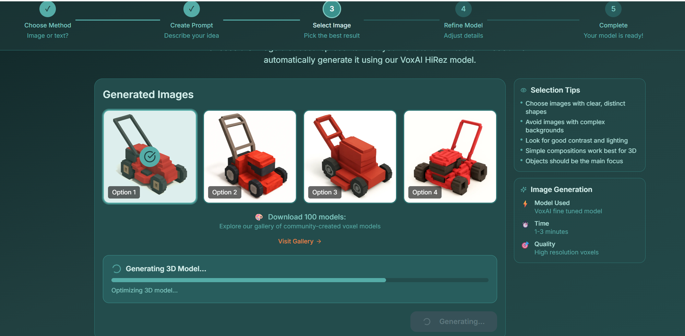
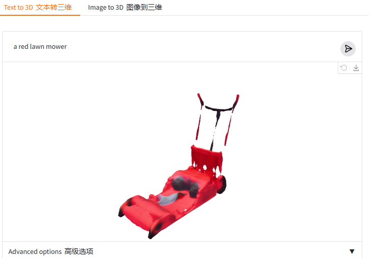

## 方法1：使用conda（推荐）

### 1) 创建一个新环境并安装Python 3.10.16
```
conda create -n py310 python=3.10.16
```

### 2）激活新环境
```
conda activate py310
```

### 3）验证版本
```
python --version
```

```
pip install ipywidgets pyyaml
```


### VoxAI

纯web的线上应用，没有本地软件，也没有找到可调用的API库。应该是闭源的商业化服务。

https://blog.voxelai.ai/




生成的red lawn mower（红色割草机）质量很好，而且是vox和minecraft风格的。免费额度有限，生成大量模型需要付费订阅。只能导出vox和minecraft的格式。需要二次转格式。

闭源且无api库，不能本地部署/集成。


### **Shap-e**

openai的开源项目，可以本地部署，但是质量差，达不到商业水准

[GitHub - openai/shap-e: Generate 3D objects conditioned on text or images](https://github.com/openai/shap-e?tab=readme-ov-file#usage)


输出主流格式：obj/ply



文本prompt生成的效果蛮差，图片to 3D必须是白底的图片才行，比较弱。

本地部署生成的是无贴图无材质的obj网格。

Make‑A‑Shape
