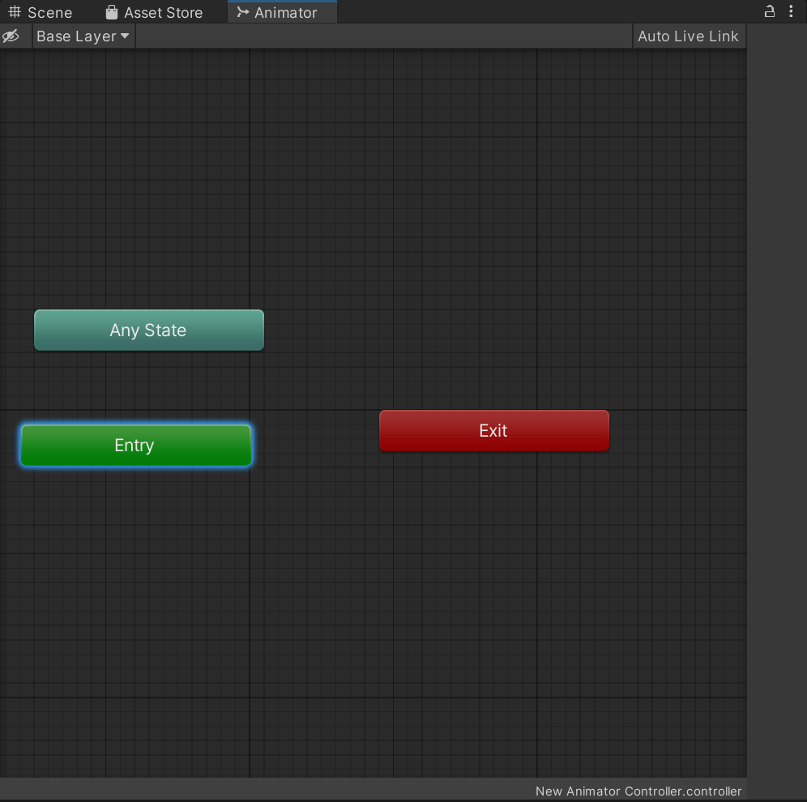
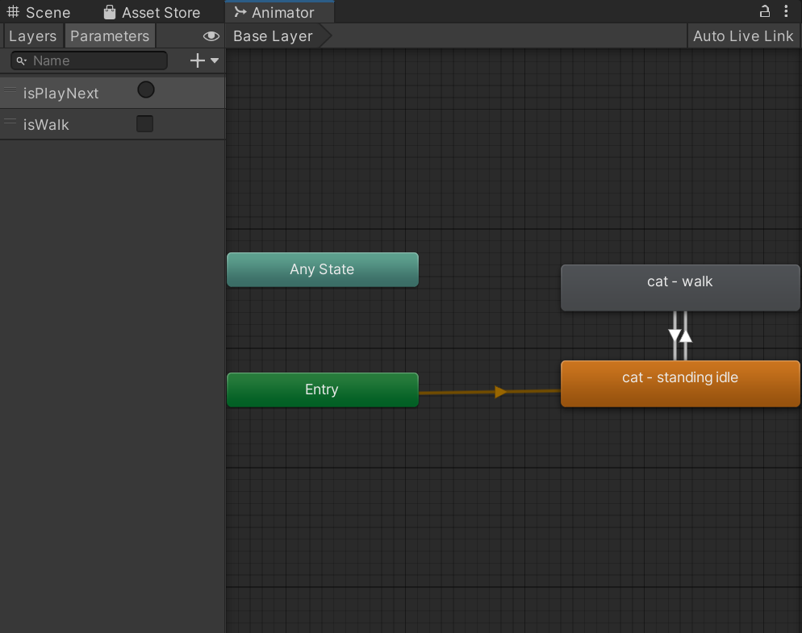
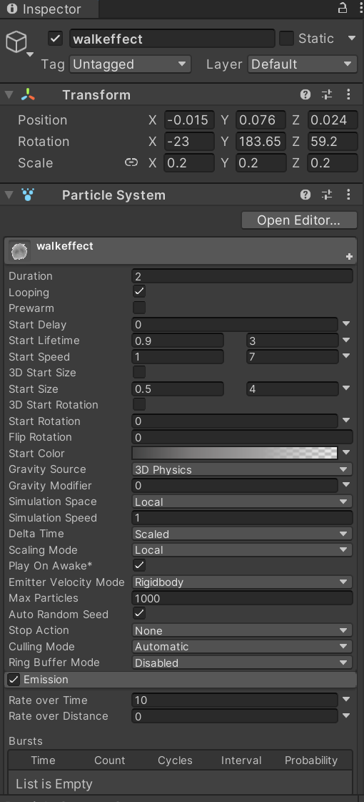
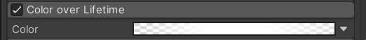

# 进度报告

基于上一次水墨场景基本渲染框架已经完成的进度，本次主要记录主体交互功能的实现。

## 1.第三人称角色基础配置

导入第三人称猫模型，配置骨骼动画系统。为模型上自定义Shader实现动态描边效果，确保角色与场景美术风格融洽。

材质基于unity内置的unlit-Texture shader源码上进行修改，加上一定的描边。


UnlitwithOutlineShader核心代码（片段）

```
 Properties
 {
     // Stroke Color
		_StrokeColor ("Stroke Color", Color) = (0,0,0,1)
		// Noise Map
		_OutlineNoise ("Outline Noise Map", 2D) = "white" {}
		_Outline ("Outline", Range(0, 1)) = 0.1
		// Outside Noise Width
		// _OutsideNoiseWidth ("Outside Noise Width", Range(1, 2)) = 1.3
		_MaxOutlineZOffset ("Max Outline Z Offset", Range(0,1)) = 0.5

     _MainTex ("Texture", 2D) = "white" {}
     _OutlineColor("Outline Color",Color) = (0,0,0,1)
     _OutlineWidth("Outline Width",Range(0.0,1.0)) = 0.05
 }
 SubShader
 {
     Tags { "RenderType"="Opaque" }
     Pass 
		{
NAME "OUTLINE"
Cull Front
CGPROGRAM

#pragma vertex vert
#pragma fragment frag
#include "UnityCG.cginc"

float _Outline;
float4 _StrokeColor;
sampler2D _OutlineNoise;
half _MaxOutlineZOffset;

struct a2v 
{
	float4 vertex : POSITION;
	float3 normal : NORMAL;
}; 

struct v2f 
{
    float4 pos : SV_POSITION;
};

v2f vert (a2v v) 
{
	// fetch Perlin noise map here to map the vertex
	// add some bias by the normal direction
	float4 burn = tex2Dlod(_OutlineNoise, v.vertex);

	v2f o = (v2f)0;
	float3 scaledir = mul((float3x3)UNITY_MATRIX_MV, v.normal);
	scaledir += 0.5;
	scaledir.z = 0.01;
	scaledir = normalize(scaledir);

	// camera space
	float4 position_cs = mul(UNITY_MATRIX_MV, v.vertex);
	position_cs /= position_cs.w;

	float3 viewDir = normalize(position_cs.xyz);
	float3 offset_pos_cs = position_cs.xyz + viewDir * _MaxOutlineZOffset;
             
             // unity_CameraProjection[1].y = fov/2
	float linewidth = -position_cs.z / unity_CameraProjection[1].y;
	linewidth = sqrt(linewidth);
	position_cs.xy = offset_pos_cs.xy + scaledir.xy * linewidth * burn.x * _Outline ;
	position_cs.z = offset_pos_cs.z;

	o.pos = mul(UNITY_MATRIX_P, position_cs);

	return o;
}

fixed4 frag(v2f i) : SV_Target 
{
	fixed4 c = _StrokeColor;
	return c;
}
ENDCG
		}
Pass
{……}
}
```

* 实时动态描边，边缘具有笔触质感
* 支持通过材质面板调整描边颜色/粗细


## 2. 角色控制器与动画逻辑

实现基于输入控制的角色移动系统，通过动画状态机管理待机/行走状态切换，添加运动平滑过渡。

参考教程：[Unity3D--如何让你的人物角色动起来？十分详细（特别教程篇）_unity如何给角色添加动作-CSDN博客](https://blog.csdn.net/qq_36669063/article/details/135228468?utm_medium=distribute.pc_relevant.none-task-blog-2~default~baidujs_baidulandingword~default-1-135228468-blog-130305856.235^v43^pc_blog_bottom_relevance_base9&spm=1001.2101.3001.4242.2&utm_relevant_index=3)

### 2.1 动画状态机

首先搭一下动画切换逻辑。Create-->Animator Controller，创建新的动画系统，命名为NewAnimator，接着我们就会看到以下状态：



把动画片段资源（即.anim）拖进来，拉线实现状态切换。猫比较简单，只有走路和待机两种切换。其中，黄色的方块表示默认的状态，一般都是idle作为默认状态。右键可以Make Transition给其他状态块。 



点左侧小眼睛可以打开参数列表，新建一个bool参数`isWalk`，用于传递给脚本控制【待机】——【走路】的状态切换。


点击状态方块之间的连线部分，可以设置状态间切换条件。


由于只有两个状态间的切换，只需要在conditions里加上一个isWalk参数并设置数值即可。

【注意：记得把Has Exit Time勾选关掉。否则动画会强制播完才能切换到下一个】

动画状态机部分设置完毕。

### 2.2 第三人称移动脚本

这里实现了基本控制移动+播放对应动画的脚本+相机跟随效果。

CatMove.cs

```
/*Create By JesonHumber_f4*/
/*2023.3.10*/
/*Unity3D Digtal Twin Project*/
using System.Collections;
using System.Collections.Generic;
using UnityEngine;

//[RequireComponent(typeof(组件类型))]的意义是：
//为当前挂载该脚本的游戏物体添加需要的组件(这属于保险做法)
//该操作不需要引入其他命名空间
[RequireComponent(typeof(CharacterController))]

//引入播放动画的组件
[RequireComponent(typeof(Animator))]
public class CatMove: MonoBehaviour
{
    CharacterController controller;
    Animator animator;

    //人物移动速度（可自行调节）
    public float MoveSpeed;
    public GameObject footprint;

    //获取键盘水平方向和垂直方向值用（GetAxis()方法）
    public float horizontal;
    public float vertical;

    //用于改变动画状态的变量
    public bool move_var;

    //目标朝向
    public Vector3 target_dir = Vector3.zero;  //初始化为(0,0,0)，可自行调节

    // Start is called before the first frame update
    void Start()
    {
        //获取“角色控制器”组件（如果你要考虑物理碰撞等操作，就必须有这个组件）
        controller = GetComponent<CharacterController>();

        //获取“动画制作者组件”
        animator = GetComponent<Animator>();

        //初始化人物移动速度
        MoveSpeed = 0;

        //初始化动画状态变量为0（人物静止动画播放）
        move_var = false;

        //校准“角色控制器”的胶囊体参数(物理碰撞体积)
        controller.center = new Vector3(0, 1, 0);
        controller.radius = 0.5f;
        controller.height = 2;
    }

    // Update is called once per frame
    void Update()
    {
        HandControl_Move();
    }

    public void HandControl_Move()
    {
        //GetAxis("Horizontal");对应的是键盘上的A和D键（垂直键）
        horizontal = Input.GetAxis("Vertical");
        //GetAxis("Vertical");对应的是键盘上的W和S键（水平键）    
        vertical = -Input.GetAxis("Horizontal"); 

        //注：这上面的“水平垂直键”所映射的键位实际上可以更改，
        //它们只不过是默认规则,它们的最大值均为1
        if (horizontal != 0 || vertical != 0) //按键(默认：WASD)触发时就进行判断
        {
            footprint.SetActive(true);
            //前进
            if (Input.GetKey(KeyCode.D))
            {
                move_var = true;
                MoveSpeed = 1.5f;
                transform.rotation = Quaternion.LookRotation(target_dir);


            }

            //向后走
            else if (Input.GetKey(KeyCode.A))
            {
                move_var = true;
                MoveSpeed = 1.5f;
                transform.rotation = Quaternion.LookRotation(target_dir);

            }

            //向左走
            else if (Input.GetKey(KeyCode.S))
            {
                move_var = true;
                MoveSpeed = 1.5f;
                transform.rotation = Quaternion.LookRotation(target_dir);

        
            }

            //向右走
            else if (Input.GetKey(KeyCode.W))
            {
                move_var = true;
                MoveSpeed = 1.5f;
                transform.rotation = Quaternion.LookRotation(target_dir);

            }

            animator.SetBool("isWalk", move_var);
            //三维坐标方向坐标值更新
            //更新坐标值运用轴坐标参数
            target_dir = new Vector3(horizontal, 0, vertical);
            //人物移动更新
            controller.Move(target_dir * MoveSpeed * Time.deltaTime);

            #region
            //也可以使用该方法代替controller.Move();
            //this.transform.Translate(dir * MoveSpeed * Time.deltaTime);
            #endregion
        }

        else
        {
            move_var = false;
            animator.SetBool("isWalk", false);
            MoveSpeed = 0;
        }
    }
}
```

* WASD控制角色八方向移动
* 移动时自动平滑转向
* 行走/待机动画自然过渡
* 移动速度可通过参数调节


## 3.走路墨色特效


使用粒子系统实现行走时的墨迹扩散效果，通过脚本控制粒子发射时机，模拟毛笔在宣纸上晕染的视觉效果。

粒子系统参数设置如下：



shape模块


color over lifetime模块



renderer模块


这里新建了一个Parti材质作为粒子材质导入，材质细节如下：

透明模式+透明底纹理+Particles内置shader即可。


## 4.贴图水墨化处理


## 5.新逻辑实现计划点

**【AI灵语·诗意叙事】**

校园中散落着一些有“灵性”的物体（一棵古树、一尊雕像、一盏路灯）。猫靠近时，玩家可以按键与之“对话”。物体的回应不是传统对话框，而是由**AI实时生成的一句短诗或哲思短语**，并以水墨书法字的形式浮现在空中。

- **技术实现**： 使用**Deepseek大模型的API**。在Unity中，当玩家触发交互时，将当前物体的名称、预设的性格关键词（如“古树-沧桑-守护”）作为Prompt发送给API，请求返回一句符合意境的短句。 **Unity侧**：收到回复后，调用一个书法字体库（如使用TextMeshPro加载一种书法字体），在一个UI上以渐入、淡出的水墨动画效果显示出来。

  

**【墨迹扩散·环境交互】**

- **创意点**：猫的行走不仅仅是留下脚印，更能**动态“绘制”和“改变”环境**。
- **技术实现**： **渲染技术**：使用Unity的**Render Texture** 作为一张全局的“虚拟宣纸”。当猫走过草地、沙地、水洼时，通过Shader采样这张Render Texture，让接触区域的纹理像墨遇水一样**动态晕染开**，显露出下层不同的材质（如走过草地，草地的绿色会微微扩散）。

