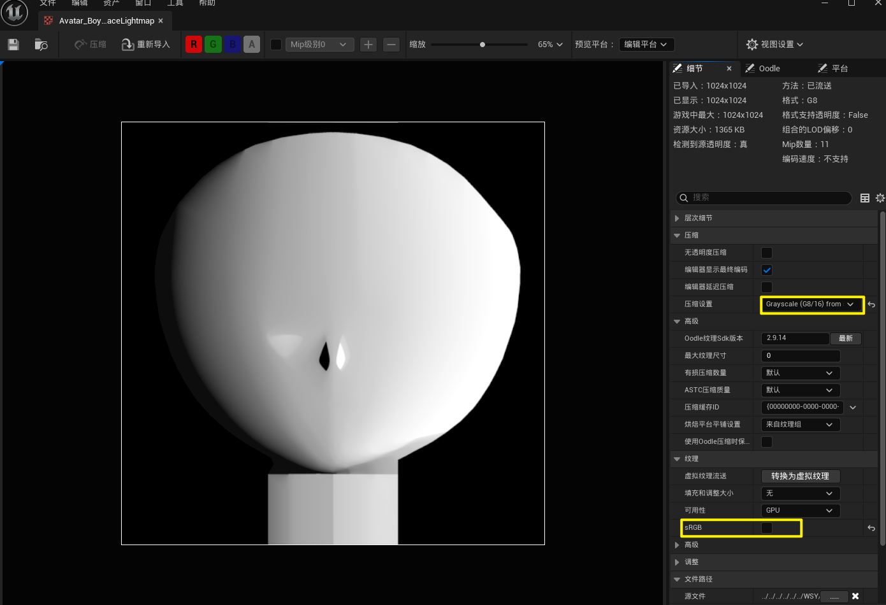
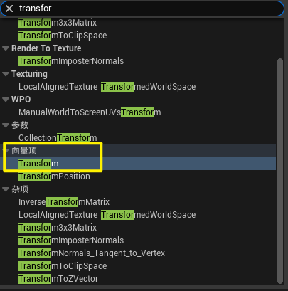

# 虚幻引擎

坐标系：


单位：厘米

> 从DCC软件导入UE的模型，导出设置的up axis要设置为**Z向上**。比如blender：
>
> 
>
> | 引擎              | 坐标系手性 | 轴向约定（世界坐标） |
> | ----------------- | ---------- | -------------------- |
> | **Unity**         | **左手系** | **X 右，Y 上，Z 前** |
> | **Unreal Engine** | **左手系** | **X 前，Y 右，Z 上** |

UE导出资产：

1.选中资产，在细节窗口定位到内容浏览器。


2.在内容浏览器右键——资产操作——导出-迁移


嗯类似导出pakage。

不放心引入的资源：

右键——更新重定向器。


可以修复/避免一些路径丢失的问题。

## Nanite (纳米级模型)

#### 概念：

Nanite是虚幻引擎的虚拟化几何体系统，它采用全新的内部网格体格式和渲染技术来渲染像素级别的细节以及海量对象。

它可以智能地仅处理你能够感受到的细节。 另外，Nanite采用高度压缩的数据格式，并且支持具有自动细节级别的细粒度流送。

[虚幻引擎中的Nanite虚拟几何体 | 虚幻引擎 5.7 文档 | Epic Developer Community](https://dev.epicgames.com/documentation/zh-cn/unreal-engine/nanite-virtualized-geometry-in-unreal-engine)

#### 处理简述：

Nanite **不直接处理 Mesh / LOD**，而是：

- 把模型离线切分成大量 **Cluster**
- 每个 Cluster：
  - ~128 个三角形
  - 有包围盒（Bounds）
  - 有误差度量（Error Metric）

```
Mesh
 └─ Cluster 0
 └─ Cluster 1
 └─ Cluster 2
```

 本质上是 **连续 LOD（Continuous LOD）**，不是离散 LOD。

**流程：**

```
1. CPU 提供相机 & 场景
2. GPU 进行可见性剔除（Cluster Culling）
3. GPU 选择合适精度的 Cluster
4. GPU 直接 Rasterize
```

⚠️ **LOD 选择不在 CPU 上**。

#### 使用场景：

适用于高面数模型。

> 静态 / 准静态场景
>
> 扫描模型
>
> 建筑 / 地形
>
> 高细节环境

不适用于顶点有动态变化的模型。

> 骨骼动画（复杂变形）
>
> 顶点动画
>
> 大量 World Position Offset
>
> 透明物体
>
> 高度动态拓扑

**Nanite网格体和传统静态网格体的不同之处**

> Nanite网格体是一种启用了Nanite的特殊静态网格体。 Nanite网格体本质上仍是三角形网格体，但对其数据进行了大量细节和压缩处理。 此外，Nanite使用了一种全新系统，能以极高效的方式来渲染这种数据格式。
>
> 要让静态网格体利用Nanite，只需一个标记来启用它即可。 编辑Nanite网格体的内容和传统网格体没太大不同，区别就在于相比使用传统方法渲染的几何体，Nanite能够渲染的三角形和实例要多出数个数量级。 将摄像机移到足够近的位置后，Nanite就会绘制出导入的原始源三角形。
>
> Nanite网格体支持多重UV和顶点颜色。 材质可以被分配给网格体的不同分段，并且这些材质可以使用不同的着色模型和动态效果（在着色器中完成）。 材质指定可以动态切换，就像其他静态网格体一样。Nanite也无需任何烘焙材质的过程。
>
> [虚拟纹理](https://dev.epicgames.com/documentation/zh-cn/unreal-engine/virtual-texturing-in-unreal-engine)并非必须与Nanite一起使用，但强烈建议使用虚拟纹理。 虚拟纹理是正交虚幻引擎功能，它与纹理数据的关系类似于Nanite与网格体数据的关系。


## VT(虚拟纹理)

**简述：**

> **Virtual Texture（VT）是一种“按需、分页、GPU 驱动”的纹理管理系统**
>  它让你可以使用**远大于显存容量的纹理数据**，而不需要一次性加载整张贴图。

一句更直白的：

> **VT = 把纹理当成“内存页”来用**

[虚幻引擎中的虚拟纹理 | 虚幻引擎 5.7 文档 | Epic Developer Community](https://dev.epicgames.com/documentation/zh-cn/unreal-engine/virtual-texturing-in-unreal-engine)

利用项目对 **虚拟纹理** 的支持，可在运行时以更低内存占用率和更高一致性创建和使用大尺寸纹理。

虚幻引擎4(UE4)支持两种虚拟纹理方法：**运行时虚拟纹理** (RVT) 和 **流送虚拟纹理** (SVT)。


| Nanite         | Virtual Texture |
| -------------- | --------------- |
| 几何虚拟化     | 纹理虚拟化      |
| GPU 驱动       | GPU 驱动        |
| 按需加载       | 按需加载        |
| Page / Cluster | Page / Tile     |
| 解决规模问题   | 解决规模问题    |

**VT 要解决什么问题？**

传统纹理系统的三个硬伤：

```
1. **显存不够**
   - 8K / 16K / 多通道纹理
2. **重复浪费**
   - 相同区域不同 Mesh 重复加载
3. **带宽浪费**
   - 看不到的区域也在采样
```

**VT的核心思想**

VT 的思想非常简单，但工程极其复杂：

> **只把“当前屏幕真正用到的纹理小块”放进显存**

**1️⃣ Page（页）—— VT 的基本单位**

一张大纹理会被拆成：

```
Page（Tile） = 128×128 / 256×256 texels
```

例如：

```
16K × 16K
↓
4096 个 Pages
```

------

**2️⃣ Virtual Address（虚拟地址）**

每个像素采样时：

- **不直接访问物理纹理**
- 而是访问一个 **虚拟地址（Virtual UV）**

------

**3️⃣ Page Table（页表）**

VT 维护一张：

> **Virtual Address → Physical Texture Page**

类似 CPU 的 MMU。

#### 工作流程

```
1. Pixel Shader 采样 VT
2. 发现某个 Page 不在显存
3. 记录 Page ID（Feedback）
4. CPU / GPU 请求加载该 Page
5. 下一帧 / 几帧后可用

```

VT和Texture Streaming区别

|          | Texture Streaming | Virtual Texture |
| -------- | ----------------- | --------------- |
| 粒度     | 整张 Mip          | Page            |
| 控制方   | CPU               | GPU             |
| 精度     | 粗                | 极细            |
| 显存利用 | 一般              | 极高            |
| 实时性   | 低                | 高              |

#### 不适合 VT 的情况

- UI
- 小尺寸贴图
- 高频动画采样

## 关于sRGB

**一句话总结：**

> 给人看的颜色 → 勾 sRGB
>  给机器算的数值 → 不勾 sRGB

### 核心事实

- 显示器 ≠ 线性
- 人眼 ≠ 线性
- **sRGB = 一种带 Gamma 的颜色编码**

### 直观理解

| 数值          | 真实亮度          |
| ------------- | ----------------- |
| 0.5（sRGB）   | **不是** 50% 亮度 |
| 0.5（Linear） | 是 50% 亮度       |

👉 **渲染计算必须在线性空间**，
 👉 **贴图存储通常在 sRGB 空间**。

首先，推荐的图片格式是TGA>PNG，压缩损失率小。JPG损失的数据多，如果需要无损导入不建议JPG。

### 必须勾 sRGB（“颜色类”）

| 贴图类型            | 原因         |
| ------------------- | ------------ |
| Albedo / Base Color | 给人看的颜色 |
| Diffuse             | 同上         |
| Emissive            | 发光颜色     |
| UI / Sprite         | 直接显示     |

###  绝对不要勾 sRGB（“数据类”）

| 贴图类型              | 原因         |
| --------------------- | ------------ |
| Normal Map            | 法线向量     |
| Roughness             | 数值曲线     |
| Metallic              | 0–1 参数     |
| AO                    | 遮蔽强度     |
| Height / Displacement | 几何数据     |
| Mask（RGBA）          | 任意通道数据 |
| Opacity               | 线性插值     |

❌ Normal Map 勾了 sRGB
结果：
• 法线偏软
• 高光发灰
• 细节丢失
❌ Roughness 勾了 sRGB
结果：
• 表面“油腻 / 塑料感”
• 高光范围不对
❌ Mask 贴图勾 sRGB
结果：
• 阈值不准
• 材质行为怪异

> 快捷键Enter能打开纹理的编辑器。也可以对纹理贴图右键——编辑。

注意：lightmap注意勾选灰阶（grayscale G8/16）



其余，1）漫反射贴图（diffuse）； 2）Ramp图需要勾选sRGB。

其他的法线/Mask/Metal等等都不必勾选sRGB。


准备上下文：

注意，这个transformvector节点，只需要搜索Transform再回车（或者下图）就可以找到……




在金属cap的时候，相机空间是可以等同于观察空间的


注意：虚幻的V和unity的V是相反的。(即xyz中的y是相反的。rgb的g是相反的。)

原神法线贴图导入虚幻记得【翻转绿通道】


## 附录

### MatCap

**MatCap（Material Capture）** 是一种**基于法线方向的贴图着色技术**。
 其核心思想是：

> **不做真实光照计算**，而是用“表面法线在视空间中的方向”作为索引，从一张 **2D 纹理** 中直接查表得到最终颜色。

你可以把 MatCap 理解为：

- 把一个“已经算好光照效果的球体”拍成一张图
- 在渲染时，每个像素根据自身法线，去这张图上“取一个颜色”

因此 MatCap **不依赖灯光、不需要 BRDF、不需要光源遍历**，成本极低。

### 1. 核心输入：**视空间法线（View Space Normal）**

MatCap 使用的不是：

- 世界空间法线
- 切线空间法线

而是：

> **视空间（View Space / Camera Space）中的法线**

原因很简单：
 MatCap 纹理本身就是以“相机视角”为基准烘焙的。

------

### 2. 从法线到 UV 的映射

假设你已经有一个 **单位化的视空间法线**：

```
N_view = (nx, ny, nz)
```

典型 MatCap UV 计算方式：

```
UV = N_view.xy * 0.5 + 0.5
```

含义：

- `N.xy ∈ [-1, 1]`
- 映射到纹理坐标 `[0, 1]`

> `nz` 通常隐含在 MatCap 贴图的亮暗变化中，不直接参与采样。

完整链路

```
Normal Map（Tangent）
   ↓ TBN
Normal（World）
   ↓ ViewMatrix
Normal（View）
   ↓
UV = normal.xy * 0.5 + 0.5
   ↓
Sample MatCap Texture
```

**MatCap 是“假光照”，但“看起来很像真光照”**。