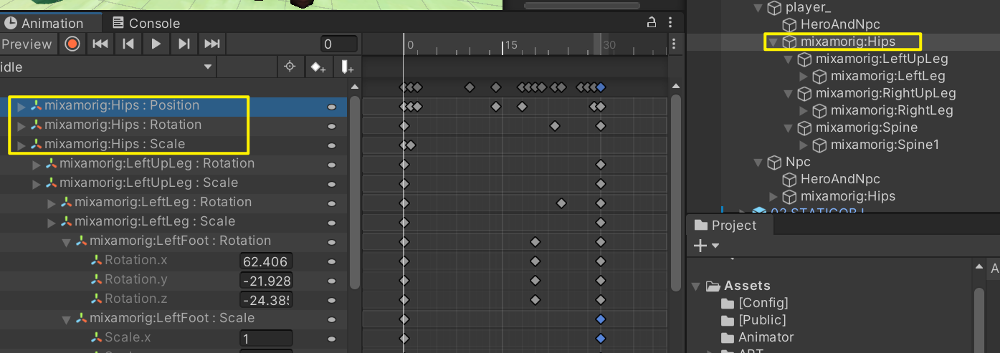

## 1. Blender导出带贴图模型

**资源预处理插件**，目标是对 `AnimationClip` 做 **关键帧冗余消除（Keyframe Reduction）**。在资源大小压缩的角度来看，非常有必要写一个自动化插件来减轻对动画资源的压缩的工作：

```
扫描 AnimationClip
↓
分析所有动画曲线
↓
检测未变化通道
↓
删除无意义关键帧或整条曲线
↓
生成优化后的Clip
```

## 删帧算法思路

**核心思路：**删除整条无变化曲线（认为这是冗余关键帧）

```
给 key[i-1], key[i], key[i+1]
↓
三点线性误差检测
↓
如果：
通过 i-1 和 i+1 插值得到的值
≈ key[i]
↓
则删除 key[i]
```

## 关键风险点

### 1. Quaternion 曲线

旋转通常由：

```
x y z w 四条曲线
```

必须成组处理，否则会破坏旋转。

###  2. Humanoid动画

部分曲线是：

```
Muscle曲线
```

不能随便删。

### 3. Root Motion / 挂点骨骼（重要）

不能删除 root transform 曲线 / 挂点骨骼曲线 。



#### 特别高危的几类“被误删曲线”

**🚨 1. 武器 / 道具挂点骨骼**

- WeaponSocket
- Hand_R_Attach
- PropPoint
- Dummy / Helper Bone

👉 **即使完全静止，也必须保留 TRS**

------

**🚨 2. Root / Pelvis / Hips**

- Root
- Hips
- Pelvis

👉 这些是 **全身空间基准**

------

**🚨 3. Humanoid 的 Muscle 曲线（如果是 Humanoid）**

- `muscle.*`
- `RootT.x / RootQ.y`

👉 删了会直接破坏重定向

> 误删这些帧之后，会出现：第一个正常的角色倒地或者大幅度运动后销毁——在这之后实例化的所有角色动画全部出错。这是因为Unity 在运行时对 Animator / Avatar / AnimationClip 做了共享缓存，删帧共享状态被“污染（State Corruption）”，

### 4. Tangent信息

删除关键帧后要重新设置：

```
curve.SmoothTangents()
```

否则动画会抖。


### 总结：

优化效果大概是：


每个带动画模型都能减少100k左右的话，所有模型加起来减少的大小就很可观，所谓不积跬步无以至千里……


