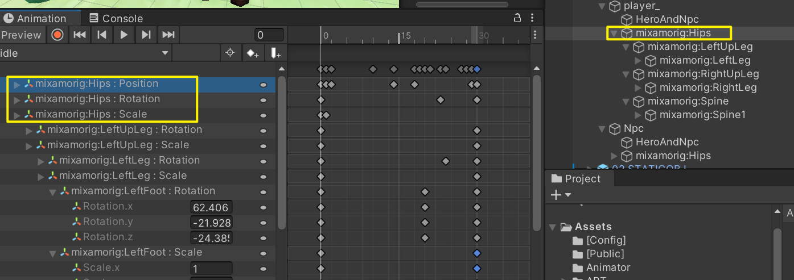
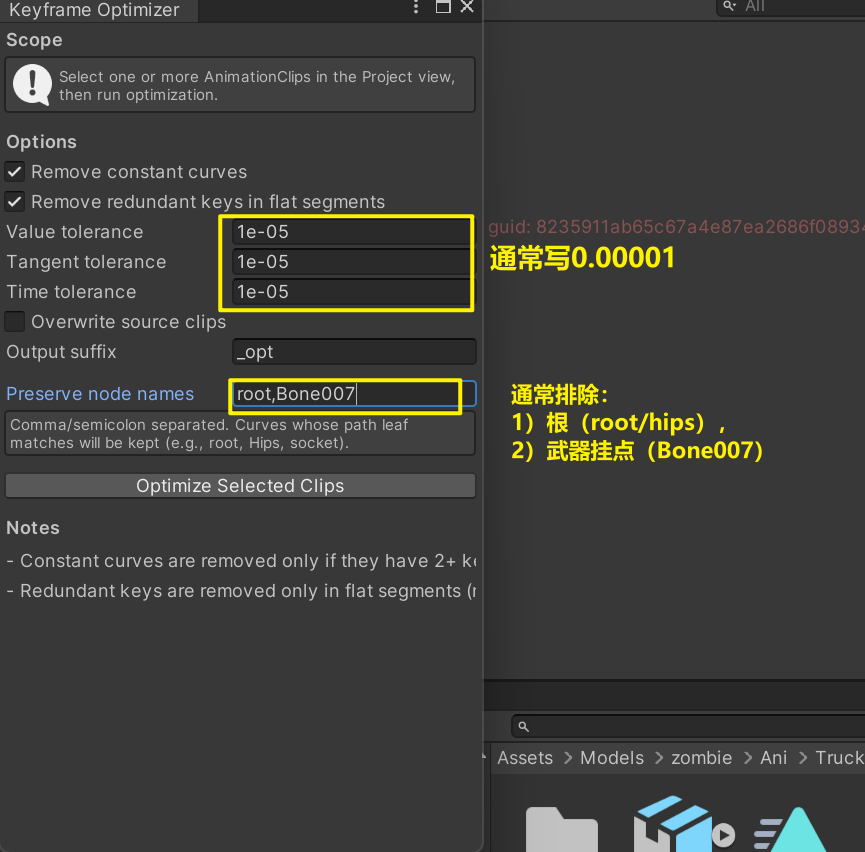
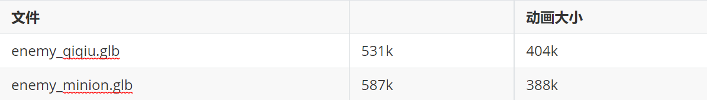
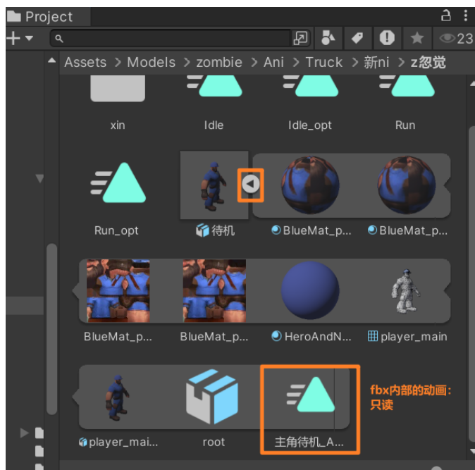
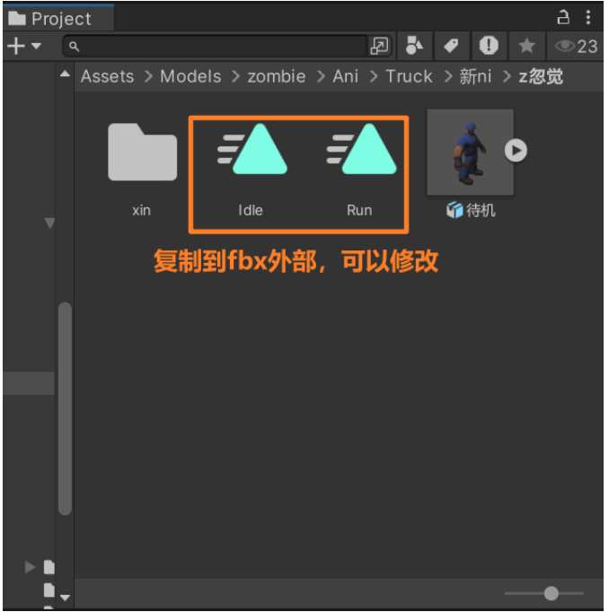
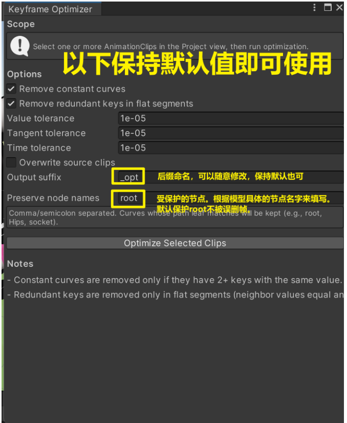
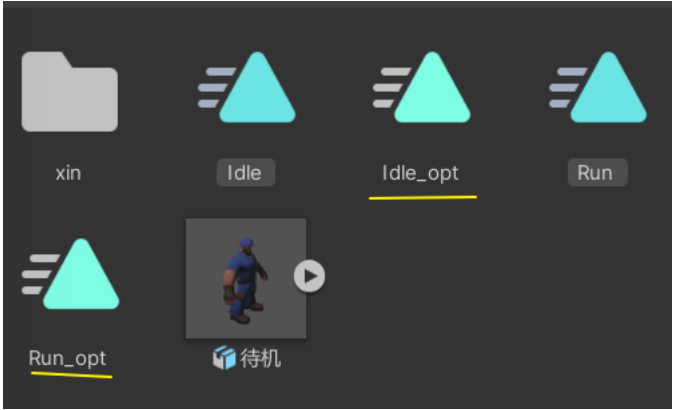

## Unity .Anim冗余空帧删除插件

**资源预处理插件**，目标是对 `AnimationClip` 做 **关键帧冗余消除（Keyframe Reduction）**。在资源大小压缩的角度来看，非常有必要写一个自动化插件来减轻对动画资源的压缩的工作：

```
扫描 AnimationClip
↓
分析所有动画曲线
↓
检测未变化通道
↓
删除无意义关键帧或整条曲线
↓
生成优化后的Clip
```

## 删帧算法思路

删除整条无变化曲线（认为这是冗余关键帧）

```
给 key[i-1], key[i], key[i+1]
↓
三点线性误差检测
↓
如果：
通过 i-1 和 i+1 插值得到的值
≈ key[i]
↓
则删除 key[i]
```

## 主要注意点

### 1. Quaternion 曲线

旋转通常由：

```
x y z w 四条曲线
```

必须成组处理，否则会破坏旋转。

###  2. Humanoid动画

部分曲线是：

```
Muscle曲线
```

不能随便删。

### 3. Root Motion / 挂点骨骼（重要）

不能删除 root transform 曲线 / 挂点骨骼曲线 。



#### 特别高危的几类“被误删曲线”

**🚨 1. 武器 / 道具挂点骨骼**

- WeaponSocket
- Hand_R_Attach
- PropPoint
- Dummy / Helper Bone

👉 **即使完全静止，也必须保留 TRS**

------

**🚨 2. Root / Pelvis / Hips**

- Root
- Hips
- Pelvis

👉 这些是 **全身空间基准**

------

**🚨 3. Humanoid 的 Muscle 曲线（如果是 Humanoid）**

- `muscle.*`
- `RootT.x / RootQ.y`

👉 删了会直接破坏重定向

> 误删这些帧之后，会出现：第一个正常的角色倒地或者大幅度运动后销毁——在这之后实例化的所有角色动画全部出错。这是因为Unity 在运行时对 Animator / Avatar / AnimationClip 做了共享缓存，删帧共享状态被“污染（State Corruption）”，

### 4. Tangent信息

删除关键帧后要重新设置：

```
curve.SmoothTangents()
```

否则动画会抖。




### 总结：

优化效果大概是：



每个带动画模型都能减少100k左右的话，所有模型加起来减少的大小就很可观，所谓不积跬步无以至千里……

### 使用步骤

## 1.脚本导入

上述cs脚本放在Editior目录下。


*有时新建的unity项目没有名为【Editor】的文件夹，手动新建一个即可。

## 2.动画片段备份



fbx内部的动画是**只读**的。意味着不能直接修改fbx内的动画。需要修改动画片段（比如删帧/改旋转等），需要选中fbx内的【动画片段】，复制并粘贴出来。



## 3.插件路径

Tools——Animation——Keyframe Optimizer



点击Optimize Selected Clips按钮即可删帧，默认不覆盖源动画片段。（源动画片段一定要保留、备份）



如图，文件夹多出两个删帧后的动画片段。按照前面给模型加入Animation的方法来检查动画是否表现正常即可。

- 若动画删帧后出现问题，查找出错的节点名，将其加入受保护的节点列表中（比如有的模型根节点命名不是root而是mixamorig:Hips，有的模型武器节点Bone007不能随便删帧；等等）如下图：


附录：

```
using System;
using System.Collections.Generic;
using System.IO;
using UnityEditor;
using UnityEngine;

namespace AnimationTools
{
    public class AnimationKeyframeOptimizerWindow : EditorWindow
    {
        [Serializable]
        private class Settings
        {
            public bool removeConstantCurves = true;
            public bool removeRedundantKeys = true;
            public float valueTolerance = 0.00001f;
            public float tangentTolerance = 0.00001f;
            public float timeTolerance = 0.00001f;
            public bool overwrite = false;
            public string outputSuffix = "_opt";
            public string preserveNodeNames = "root";
        }

        private Settings settings = new Settings();
        private Vector2 scroll;

        [MenuItem("Tools/Animation/Keyframe Optimizer")]
        private static void Open()
        {
            GetWindow<AnimationKeyframeOptimizerWindow>("Keyframe Optimizer");
        }

        private void OnGUI()
        {
            EditorGUILayout.LabelField("Scope", EditorStyles.boldLabel);
            EditorGUILayout.HelpBox("Select one or more AnimationClips in the Project view, then run optimization.", MessageType.Info);

            EditorGUILayout.Space();
            EditorGUILayout.LabelField("Options", EditorStyles.boldLabel);

            settings.removeConstantCurves = EditorGUILayout.ToggleLeft("Remove constant curves", settings.removeConstantCurves);
            settings.removeRedundantKeys = EditorGUILayout.ToggleLeft("Remove redundant keys in flat segments", settings.removeRedundantKeys);

            settings.valueTolerance = EditorGUILayout.FloatField("Value tolerance", settings.valueTolerance);
            settings.tangentTolerance = EditorGUILayout.FloatField("Tangent tolerance", settings.tangentTolerance);
            settings.timeTolerance = EditorGUILayout.FloatField("Time tolerance", settings.timeTolerance);

            settings.overwrite = EditorGUILayout.ToggleLeft("Overwrite source clips", settings.overwrite);
            using (new EditorGUI.DisabledScope(settings.overwrite))
            {
                settings.outputSuffix = EditorGUILayout.TextField("Output suffix", settings.outputSuffix);
            }

            EditorGUILayout.Space();
            settings.preserveNodeNames = EditorGUILayout.TextField("Preserve node names", settings.preserveNodeNames);
            EditorGUILayout.HelpBox("Comma/semicolon separated. Curves whose path leaf matches will be kept (e.g., root, Hips, socket).", MessageType.None);

            EditorGUILayout.Space();
            if (GUILayout.Button("Optimize Selected Clips"))
            {
                OptimizeSelected();
            }

            EditorGUILayout.Space();
            EditorGUILayout.LabelField("Notes", EditorStyles.boldLabel);
            scroll = EditorGUILayout.BeginScrollView(scroll, GUILayout.Height(90));
            EditorGUILayout.LabelField("- Constant curves are removed only if they have 2+ keys with the same value.");
            EditorGUILayout.LabelField("- Redundant keys are removed only in flat segments (neighbor values equal and near-zero tangents).");
            EditorGUILayout.EndScrollView();
        }

        private void OptimizeSelected()
        {
            var clips = Selection.GetFiltered<AnimationClip>(SelectionMode.Assets);
            if (clips == null || clips.Length == 0)
            {
                EditorUtility.DisplayDialog("Keyframe Optimizer", "Please select at least one AnimationClip in the Project view.", "OK");
                return;
            }

            var totalReport = new Report();
            AssetDatabase.StartAssetEditing();
            try
            {
                foreach (var clip in clips)
                {
                    var report = OptimizeClipAsset(clip, settings);
                    totalReport.Accumulate(report);
                }
            }
            finally
            {
                AssetDatabase.StopAssetEditing();
                AssetDatabase.SaveAssets();
                AssetDatabase.Refresh();
            }

            Debug.Log(string.Format(
                "[Keyframe Optimizer] Done. Clips: {0}, Curves removed: {1}, Keys removed: {2}",
                totalReport.processedClips,
                totalReport.removedCurves,
                totalReport.removedKeys));
        }

        private static Report OptimizeClipAsset(AnimationClip source, Settings settings)
        {
            var report = new Report { processedClips = 1 };

            if (source == null)
            {
                return report;
            }

            var sourcePath = AssetDatabase.GetAssetPath(source);
            if (string.IsNullOrEmpty(sourcePath))
            {
                return report;
            }

            var targetPath = settings.overwrite ? sourcePath : BuildOutputPath(sourcePath, settings.outputSuffix);
            var targetClip = settings.overwrite ? source : CreateOptimizedClone(source, targetPath);

            var bindings = AnimationUtility.GetCurveBindings(source);
            var preserveSet = BuildPreserveSet(settings.preserveNodeNames);
            var groups = BuildCurveGroups(source, bindings, settings.valueTolerance);

            foreach (var group in groups)
            {
                var canRemoveGroup = settings.removeConstantCurves && group.isVectorComponentGroup && group.allConstant && group.allHaveTwoOrMoreKeys;

                foreach (var entry in group.entries)
                {
                    var curve = entry.curve;
                    if (curve == null || curve.length == 0)
                    {
                        continue;
                    }

                    if (ShouldPreserveBinding(entry.binding, preserveSet))
                    {
                        if (!ReferenceEquals(targetClip, source))
                        {
                            AnimationUtility.SetEditorCurve(targetClip, entry.binding, curve);
                        }
                        continue;
                    }

                    var removeCurve = false;
                    if (settings.removeConstantCurves)
                    {
                        if (group.isVectorComponentGroup)
                        {
                            removeCurve = canRemoveGroup;
                        }
                        else if (entry.isConstant && curve.length >= 2)
                        {
                            removeCurve = true;
                        }
                    }

                    if (removeCurve)
                    {
                        AnimationUtility.SetEditorCurve(targetClip, entry.binding, null);
                        report.removedCurves++;
                        report.removedKeys += curve.length;
                        continue;
                    }

                    if (settings.removeRedundantKeys)
                    {
                        var reduced = ReduceRedundantKeys(curve, settings);
                        if (reduced.length != curve.length)
                        {
                            SmoothAllTangents(reduced);
                        }
                        var removed = curve.length - reduced.length;
                        if (removed > 0)
                        {
                            AnimationUtility.SetEditorCurve(targetClip, entry.binding, reduced);
                            report.removedKeys += removed;
                        }
                        else if (!ReferenceEquals(targetClip, source))
                        {
                            AnimationUtility.SetEditorCurve(targetClip, entry.binding, curve);
                        }
                    }
                    else if (!ReferenceEquals(targetClip, source))
                    {
                        AnimationUtility.SetEditorCurve(targetClip, entry.binding, curve);
                    }
                }
            }

            EditorUtility.SetDirty(targetClip);
            return report;
        }

        private static AnimationClip CreateOptimizedClone(AnimationClip source, string targetPath)
        {
            var clone = new AnimationClip();
            EditorUtility.CopySerialized(source, clone);

            var existing = AssetDatabase.LoadAssetAtPath<AnimationClip>(targetPath);
            if (existing != null)
            {
                AssetDatabase.DeleteAsset(targetPath);
            }

            AssetDatabase.CreateAsset(clone, targetPath);
            return clone;
        }

        private static string BuildOutputPath(string sourcePath, string suffix)
        {
            var directory = Path.GetDirectoryName(sourcePath);
            var filename = Path.GetFileNameWithoutExtension(sourcePath);
            var extension = Path.GetExtension(sourcePath);
            return Path.Combine(directory ?? string.Empty, filename + suffix + extension).Replace("\\", "/");
        }

        private static bool IsConstantCurve(AnimationCurve curve, float valueTolerance)
        {
            if (curve.length <= 1)
            {
                return false;
            }

            var first = curve.keys[0].value;
            for (var i = 1; i < curve.length; i++)
            {
                if (Mathf.Abs(curve.keys[i].value - first) > valueTolerance)
                {
                    return false;
                }
            }

            return true;
        }

        private static List<CurveGroup> BuildCurveGroups(AnimationClip source, EditorCurveBinding[] bindings, float valueTolerance)
        {
            var map = new Dictionary<string, CurveGroup>(StringComparer.Ordinal);

            foreach (var binding in bindings)
            {
                var curve = AnimationUtility.GetEditorCurve(source, binding);
                if (curve == null || curve.length == 0)
                {
                    continue;
                }

                var groupKey = GetGroupKey(binding, out var isVectorComponent);
                if (!map.TryGetValue(groupKey, out var group))
                {
                    group = new CurveGroup
                    {
                        groupKey = groupKey,
                        isVectorComponentGroup = isVectorComponent,
                        entries = new List<CurveEntry>()
                    };
                    map.Add(groupKey, group);
                }

                var isConstant = IsConstantCurve(curve, valueTolerance);
                group.entries.Add(new CurveEntry
                {
                    binding = binding,
                    curve = curve,
                    isConstant = isConstant
                });
            }

            var result = new List<CurveGroup>(map.Count);
            foreach (var pair in map)
            {
                var group = pair.Value;
                group.allConstant = true;
                group.allHaveTwoOrMoreKeys = true;
                foreach (var entry in group.entries)
                {
                    if (!entry.isConstant)
                    {
                        group.allConstant = false;
                    }

                    if (entry.curve.length < 2)
                    {
                        group.allHaveTwoOrMoreKeys = false;
                    }
                }
                result.Add(group);
            }

            return result;
        }

        private static string GetGroupKey(EditorCurveBinding binding, out bool isVectorComponent)
        {
            var property = binding.propertyName ?? string.Empty;
            var dotIndex = property.LastIndexOf('.');
            if (dotIndex > 0)
            {
                var suffix = property.Substring(dotIndex + 1);
                if (suffix == "x" || suffix == "y" || suffix == "z" || suffix == "w")
                {
                    isVectorComponent = true;
                    var root = property.Substring(0, dotIndex);
                    return binding.path + "|" + root + "|" + binding.type.FullName;
                }
            }

            isVectorComponent = false;
            return binding.path + "|" + property + "|" + binding.type.FullName;
        }

        private static AnimationCurve ReduceRedundantKeys(AnimationCurve curve, Settings settings)
        {
            if (curve.length <= 2)
            {
                return curve;
            }

            var keys = curve.keys;
            var newKeys = new List<Keyframe>(keys.Length);
            newKeys.Add(keys[0]);

            for (var i = 1; i < keys.Length - 1; i++)
            {
                var prev = newKeys[newKeys.Count - 1];
                var current = keys[i];
                var next = keys[i + 1];

                if (IsDuplicateTime(prev, current, settings.timeTolerance))
                {
                    continue;
                }

                if (IsRedundantFlatKey(prev, current, next, settings))
                {
                    continue;
                }

                newKeys.Add(current);
            }

            newKeys.Add(keys[keys.Length - 1]);

            var reduced = new AnimationCurve(newKeys.ToArray());
            reduced.preWrapMode = curve.preWrapMode;
            reduced.postWrapMode = curve.postWrapMode;
            return reduced;
        }

        private static void SmoothAllTangents(AnimationCurve curve)
        {
            if (curve == null || curve.length == 0)
            {
                return;
            }

            for (var i = 0; i < curve.length; i++)
            {
                curve.SmoothTangents(i, 0f);
            }
        }

        private static bool ShouldPreserveBinding(EditorCurveBinding binding, HashSet<string> preserveSet)
        {
            var path = binding.path ?? string.Empty;
            var prop = binding.propertyName ?? string.Empty;
            if (prop.StartsWith("m_LocalPosition", StringComparison.Ordinal)
                || prop.StartsWith("m_LocalRotation", StringComparison.Ordinal)
                || prop.StartsWith("m_LocalScale", StringComparison.Ordinal))
            {
                return IsPreservedPath(path, preserveSet);
            }

            if (prop.StartsWith("localEulerAnglesRaw", StringComparison.Ordinal)
                || prop.StartsWith("localEulerAngles", StringComparison.Ordinal))
            {
                return IsPreservedPath(path, preserveSet);
            }

            return false;
        }

        private static bool IsPreservedPath(string path, HashSet<string> preserveSet)
        {
            if (preserveSet == null || preserveSet.Count == 0)
            {
                return false;
            }

            if (string.IsNullOrEmpty(path))
            {
                return preserveSet.Contains("root");
            }

            var leaf = GetPathLeaf(path);
            return preserveSet.Contains(leaf);
        }

        private static string GetPathLeaf(string path)
        {
            if (string.IsNullOrEmpty(path))
            {
                return string.Empty;
            }

            var lastSlash = path.LastIndexOf('/');
            return lastSlash >= 0 ? path.Substring(lastSlash + 1) : path;
        }

        private static HashSet<string> BuildPreserveSet(string raw)
        {
            var set = new HashSet<string>(StringComparer.OrdinalIgnoreCase);
            if (string.IsNullOrWhiteSpace(raw))
            {
                return set;
            }

            var parts = raw.Split(new[] { ',', ';', '|', ' ' }, StringSplitOptions.RemoveEmptyEntries);
            foreach (var part in parts)
            {
                var token = part.Trim();
                if (token.Length > 0)
                {
                    set.Add(token);
                }
            }

            return set;
        }

        private static bool IsDuplicateTime(Keyframe prev, Keyframe current, float timeTolerance)
        {
            return Mathf.Abs(current.time - prev.time) <= timeTolerance;
        }

        private static bool IsRedundantFlatKey(Keyframe prev, Keyframe current, Keyframe next, Settings settings)
        {
            if (Mathf.Abs(current.value - prev.value) > settings.valueTolerance)
            {
                return false;
            }

            if (Mathf.Abs(current.value - next.value) > settings.valueTolerance)
            {
                return false;
            }

            if (Mathf.Abs(current.inTangent) > settings.tangentTolerance || Mathf.Abs(current.outTangent) > settings.tangentTolerance)
            {
                return false;
            }

            if (Mathf.Abs(prev.outTangent) > settings.tangentTolerance || Mathf.Abs(next.inTangent) > settings.tangentTolerance)
            {
                return false;
            }

            return true;
        }

        private struct Report
        {
            public int processedClips;
            public int removedCurves;
            public int removedKeys;

            public void Accumulate(Report other)
            {
                processedClips += other.processedClips;
                removedCurves += other.removedCurves;
                removedKeys += other.removedKeys;
            }
        }

        private struct CurveEntry
        {
            public EditorCurveBinding binding;
            public AnimationCurve curve;
            public bool isConstant;
        }

        private class CurveGroup
        {
            public string groupKey;
            public bool isVectorComponentGroup;
            public bool allConstant;
            public bool allHaveTwoOrMoreKeys;
            public List<CurveEntry> entries;
        }
    }
}

    
```

