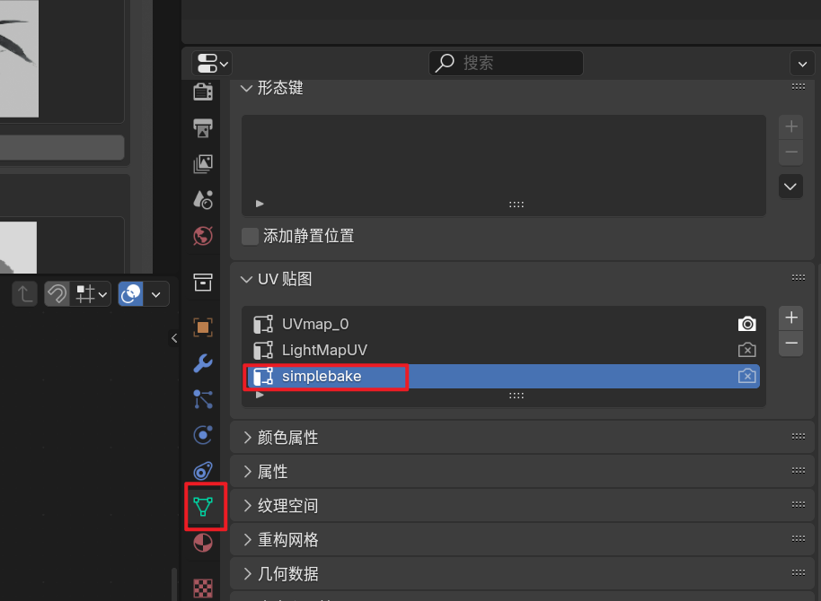
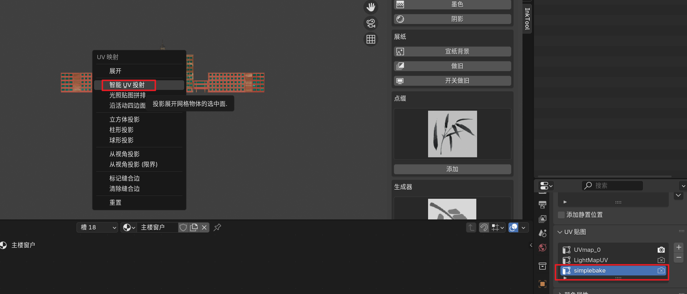
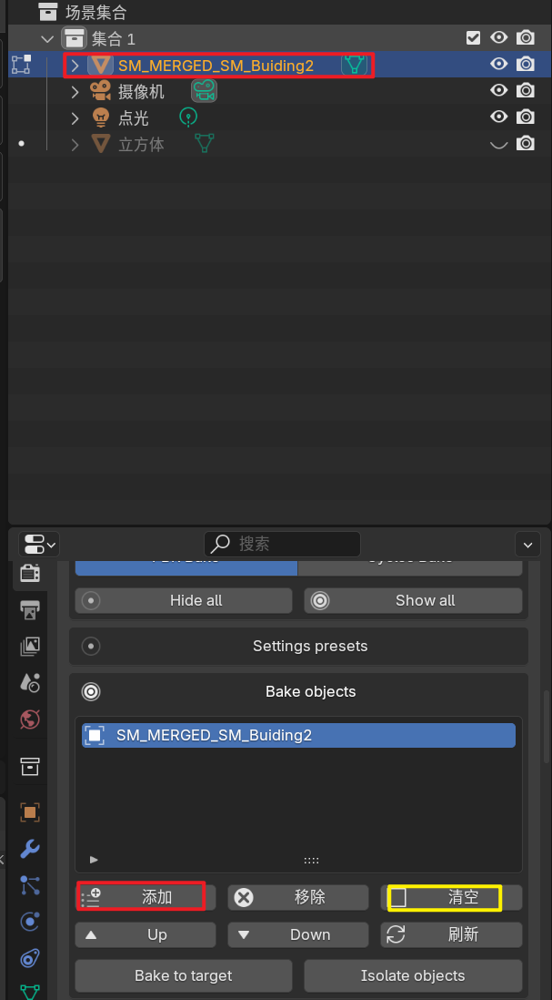
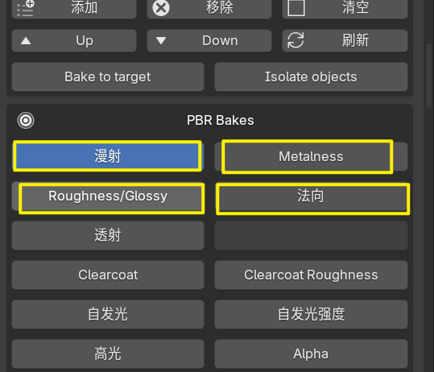
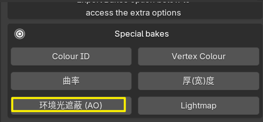
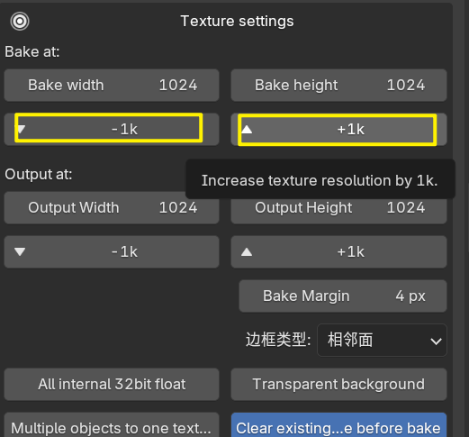
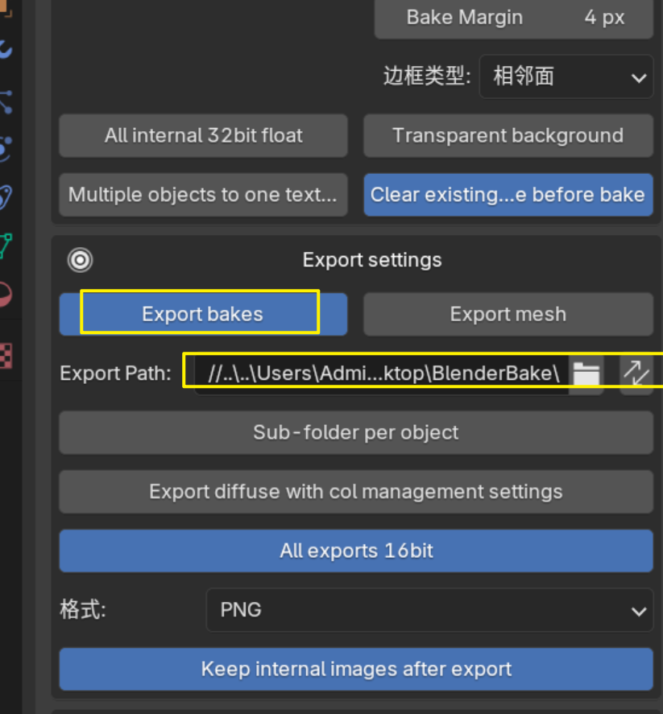
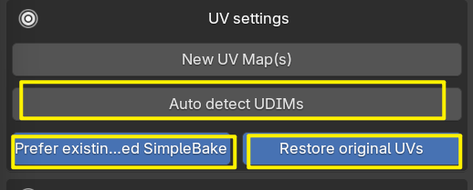
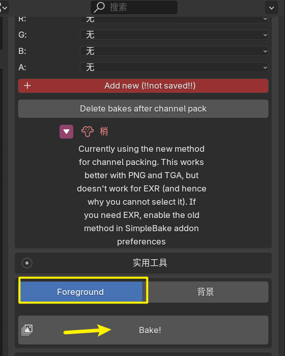

出于将程序化纹理烘焙到贴图上导出的目的，记录插件simplebake的使用方法。

新建UV map，命名改为simplebake（大小写不敏感；不能有空格）

进入编辑模式；全选面；快捷键U；

注意，simplebake插件在右侧渲染的面板上。

1.物体模式；选中需要的物体；（先清空）添加；

2.漫射/金属度/粗糙度/法线比较常用（若都勾选上则输出4张图）

3.（可选）这里可以输出AO。一般用不着勾选。

4.尺寸1k/2k/3k/4k

5.填写导出位置

6.注意不要勾选UDIMs，勾选以下的两个蓝色部分

* prefer existing…意思是优先烘焙到名为simplebake的贴图上
* restore original UVs：意思是烘焙结束后仍然恢复到原UV的状态（而不是覆盖原uv）

7.选中前景色；bake

注意：烘焙需要时间，在烘焙过程中不要操作blender。
