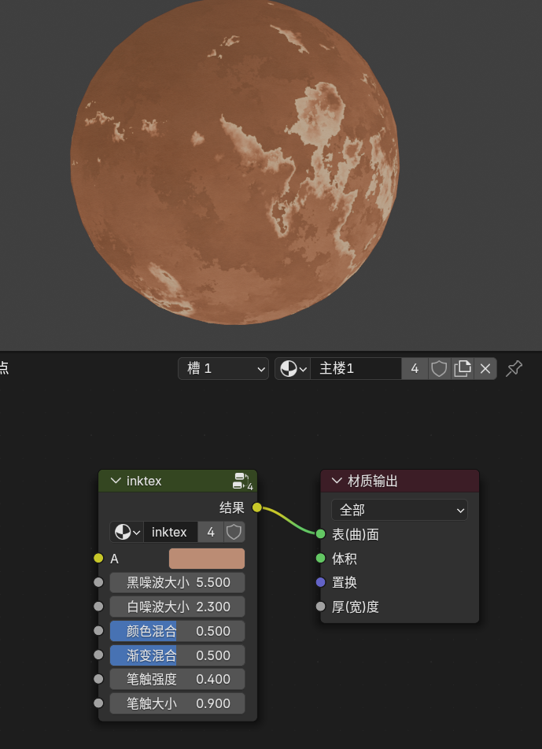
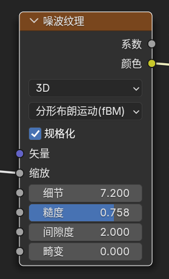
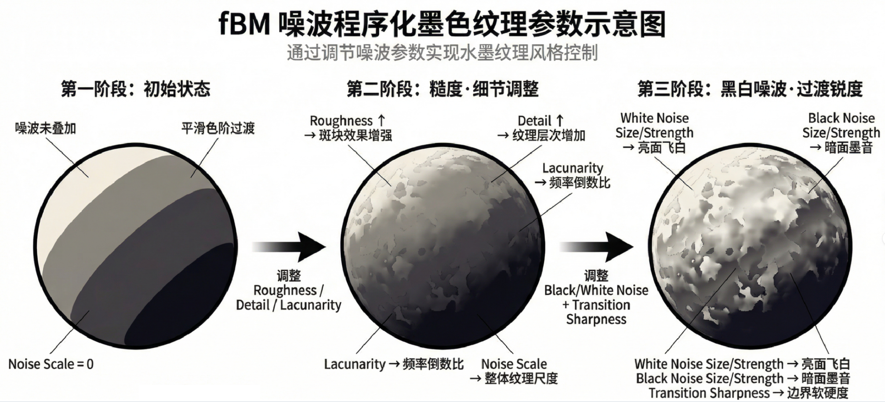
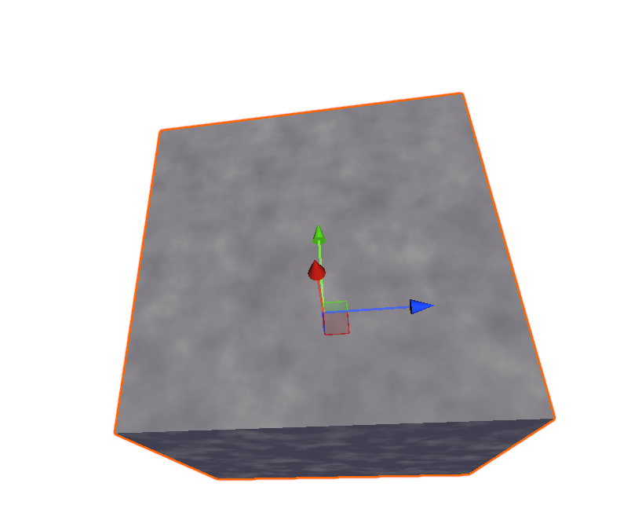
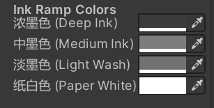
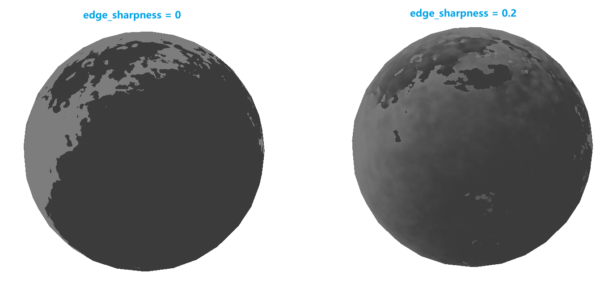
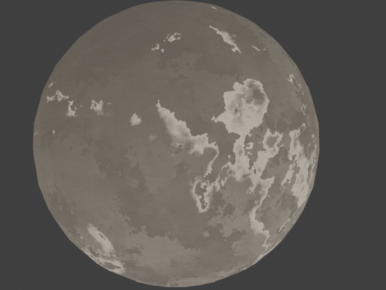
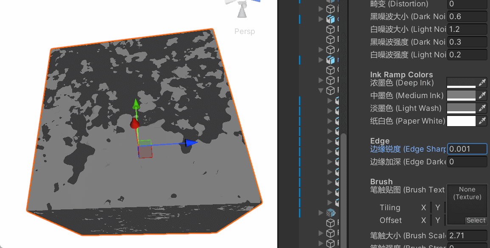

# 技术分享 | 从 Blender 到 Unity：如何实现高保真水墨风格 fBM 噪波与水渍边缘

在非写实渲染（NPR）领域，水墨风格一直是一个极具挑战性的方向。

本文将分享如何通过将 Blender 的 3D fBM 算法移植到 Unity，并结合屏幕空间导数边缘检测，实现程序化水墨材质。

- 关于blender内水墨纹理的实现参考了五天晴老师的方案。
- 代码地址：[Selaphina/Ink-Tex-fBM-Shader: 仿 **Blender 3D fBM 噪波**，在Unity中实现程序化水墨纹理。](https://github.com/Selaphina/Ink-Tex-fBM-Shader)

---

### 一、 奠定基石： Blender 的 3D fBM 噪波

很多传统的 Shader 噪波实现依赖于 `sin(dot(p, v))` 这种简单的伪随机哈希，其边缘和分布往往不够均匀，层叠后极易产生模糊。

为了更加手工可控的质感，我选择了**参考 Blender 的fBM噪波算法**（参考其 `gpu_shader_material_noise.glsl` 源码）到Unity中实现。



开放了这几个重要的变量：

* 黑噪波大小
* 白噪波大小
* 颜色混合
* 渐变混合
* 笔触强度
* 笔触大小

我希望在unity工程内实现水墨风格的渲染建筑，blender的材质当然不能连根拔起地带过去，于是，在unity内实现一个类似的噪波纹理，来近似这个效果。



#### 1. 整数哈希与梯度向量

不同于简易哈希，Blender 使用了经典的 **Bob Jenkins 整数位运算哈希**。这保证了在 3D 空间中点位采样后的结果具有极高的分布均匀性，是消除“噪波感模糊”的第一步。同时采用 12 方向梯度向量而非随机旋向，使得噪波的形状更加硬朗、可控。

#### 2. 3D Object Space 与域扭曲（Domain Warping）

引入了**畸变（Distortion）参数**，通过对坐标进行二次噪波偏移，让水墨的扩散呈现出有机的、云雾般的波动感。采用 **3D Object Space** 进行采样，确保水墨材质在模型移动或变形时保持稳定。

* 这里借助nano banana的学术制图功能制作了示意图：



---

### 二、 去除模糊

Perlin 噪波天然具有连续平滑的特性，直接映射到颜色上非常模糊。



水墨画的核心特征在于**“墨分五色”**——浓、淡、干、湿、焦。这里分了四个色阶来手动把握颜色：



#### `smoothstep` 阈值量化

在 Shader 中，我们不使用简单的 `lerp`，而是通过多个极窄的 `smoothstep` 区间来切割噪波值。

```hlsl
// 将 [0,1] 的连续噪波切割为锐利的色阶
float s = _EdgeSharpness; // 极窄的过渡宽度
float band1 = smoothstep(0.25 - s, 0.25 + s, rampInput);
float band2 = smoothstep(0.50 - s, 0.50 + s, rampInput);
float3 rampColor = lerp(deepInk, lerp(mediumInk, paperWhite, band2), band1);
```

通过控制 `_EdgeSharpness`，我们可以自由控制墨色分层的硬度，从而在保证随机形状的同时，获得极高的视觉对比度。



---

### 三、 模拟水渍边缘（Water Stain Edge）

传统水墨在宣纸上扩散时，水分蒸发会导致颜料停留在边界，形成**“外深内浅”**的锐利轮廓。这是水墨质感最关键的“水渍感”。



#### 进阶技巧：屏幕空间偏导数（ddx/ddy）

通过硬件指令 `ddx` 和 `ddy`，我们可以实时获取当前像素噪波值的变化梯度（Gradient）。梯度越大的地方，恰恰就是噪波纹理的**边缘**。

```hlsl
// 计算噪波输入的屏幕空间梯度
float edgeGradient = length(float2(ddx(rampInput), ddy(rampInput)));
float edgeFactor = saturate(edgeGradient / max(_EdgeSharpness, 0.001));

// 在边缘处加深墨色 -> 模拟颜料堆积
rampInput -= edgeFactor * _EdgeDarken;
```

这种方案的开销低（GPU 硬件原生支持)，但效果立竿见影：它在程序化生成的噪波边界上绘制出一圈深色的水墨沉淀，还原了写意画中墨晕边界的质感。

---

### 四、 综合效果展示

最终实现的 Shader 效果展示：


- **Blender 级参数**：支持 Detail（细节层数）、Roughness（糙度）、Lacunarity（间隙度）等精细化调节。
- **Hue 通道映射**：内部通过三路 3D 噪波合成色彩后提取 **Hue（色相）** 通道，使最终生成的黑白分布比单通道噪波更具随机感和层次感。
- **自定义墨色 Ramp**：支持从浓墨到纸白的四级调色板自定义，配合程序化生成的锐利边缘。

---

*Shader 源码放在：*

https://github.com/Selaphina/Ink-Tex-fBM-Shader.git


