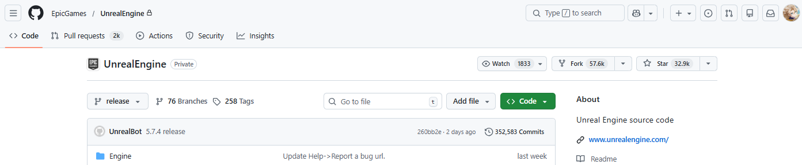
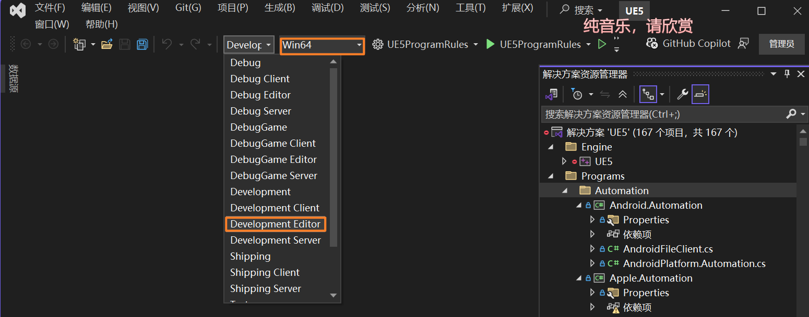

# 虚幻引擎

本文用作记录编译UE5源码的基本流程，以及需要注意的事项。

```
UE版本：5
IDE：Visual Studio 2022
操作系统：windows 11
SSD：400+GB
```

## 1.关联Epic与github账号

[GitHub上的虚幻引擎 - Unreal Engine](https://www.unrealengine.com/zh-CN/ue-on-github)

参考官方文档关联即可。另外，有时候不会收到邀请邮件，需要手动访问：

```
https://github.com/orgs/EpicGames/invitation
```

然后在网页中点击加入按钮即可。

完成授权后，进入UE仓库页面将正常访问，不再显示404：

[EpicGames/UnrealEngine: Unreal Engine source code](https://github.com/EpicGames/UnrealEngine)



## 2.克隆仓库

国内网速较慢，不建议用VS克隆大型仓库（20G+）。直接在自定的文件目录进入git bash进行浅克隆：

```
git clone --depth=1 https://github.com/EpicGames/UnrealEngine.git
```

> --depth=1：浅克隆（shallow clone），只下载最近一次 commit

克隆结束后有两步:

* 执行 Setup.bat。可以在命令行加个 `--threads=20` 参数，多线程下载。
* 执行 GenerateProjectFiles.bat。

1: 运行安装脚本进一步下载

```
cd UnrealEngine

./Setup.bat
```

（或者）提速：

```
./Setup.bat --threads=16
```

（或）**只下载 Windows 平台依赖（节省约20GB）**。

```
./Setup.bat --threads=20 -exclude=Mac -exclude=Linux -exclude=Android -exclude=IOS
```

2: 生成VS工程

```
./GenerateProjectFiles.bat
```

这样才能在 Microsoft Visual Studio 里编译引擎。

## 3.参考官方的VS编译文档

[从源代码构建虚幻引擎 | 虚幻引擎 5.4 文档 | Epic Developer Community](https://dev.epicgames.com/documentation/zh-cn/unreal-engine/building-unreal-engine-from-source?application_version=5.4)

切换到Development Editor

目标平台是Win64



推荐使用Rider IDE

[(5 条消息) 【UE-Dev】UE5.5源码版 编译指引 - 知乎](https://zhuanlan.zhihu.com/p/1899504548462166111)