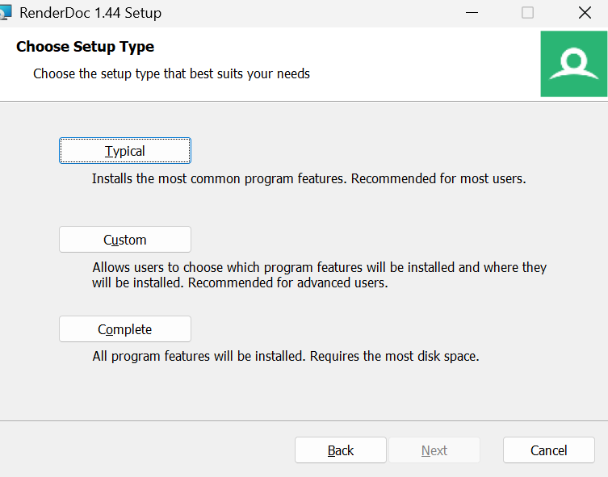
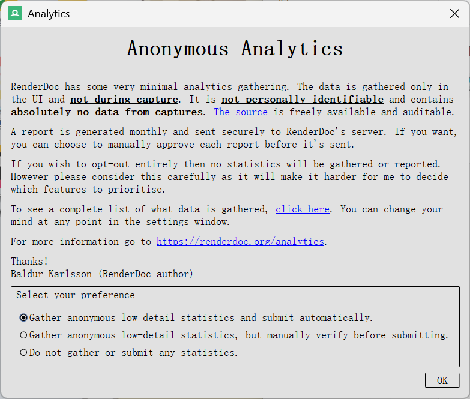
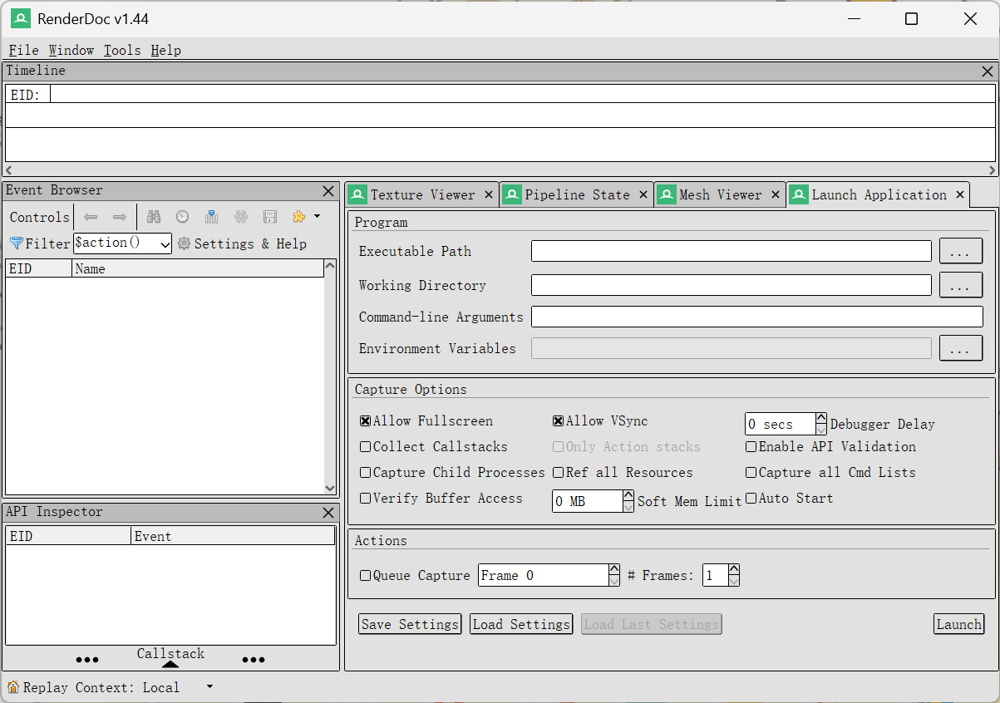

# RenderDoc 安装及使用教程

本文用作记录RenderDoc 安装及使用。具体参考帖子见文末。

下载官网：[RenderDoc - Downloads](https://renderdoc.org/builds)


```
v1.44 - 1 May, 2026
```

1.大部分用户而言，选择typical



2.(●) 自动收集并发送匿名的低细节统计数据。同意即可。



3.正常打开界面：




## 参考帖子

[使用RenderDoc分析虚幻引擎画面 | 虚幻引擎 5.7 文档 | Epic Developer Community](https://dev.epicgames.com/documentation/unreal-engine/using-renderdoc-with-unreal-engine?lang=zh-CN)

[RenderDoc使用教程-CSDN博客](https://blog.csdn.net/weixin_44803928/article/details/144292547)