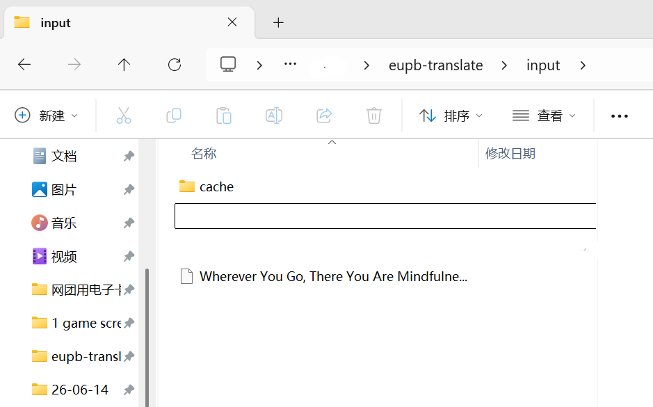
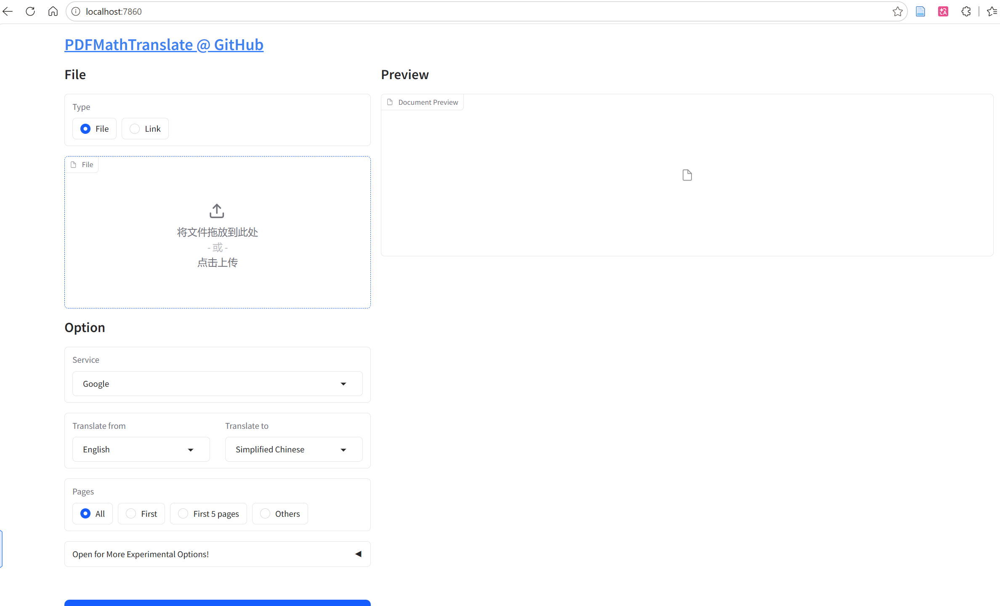

> 使用到的开源工程：

​	https://github.com/oomol-lab/epub-translator

​    https://github.com/PDFMathTranslate

本文主要包括：

**1.前提：**

* 有一本无法网购到中文译本且图书馆藏也搜索不到的英文原著电子版EPUB。获得渠道是海鲜市场（。）
* wps会员过期+沉浸式翻译的网页免费版有很多乱码和错位的问题。

**2.github**搜到5.8k⭐的EPUB-translator。

**3.通过pip install**一键安装epub-translator 成品库并简单跑通翻译代码

4.大部分情况按照README文档来做就足够了，不要过度依赖GPT老师，它会乱加东西。

## EPUB

### 首次使用

#### 1.虚拟环境 (windows)

```
python -m venv venv

venv\Scripts\activate

pip install epub-translator

```

> Mac/Linux：
>
> ```
> source venv/bin/activate
> ```

#### 2.准备一个干净的目录

```
epub-proj
|
|--input/
	|-- original_book.epub
|--output/
|
|--run.py
|
|--cache/
```

#### 3.（可选）直接解压 EPUB

😌：把 `.epub` 改成 `.zip`，就可以直接解压epub来看文件结构是否有问题。

😮：如果你的电子书epub本身有结构性问题，你需要重新打包并转换文件格式：

epub——(直接修改后缀)zip——解压为文件夹——（重新调整后）epub

注意：

可转化epub的文件夹结构一定要包括：

```
book_folder/
│
├── mimetype        ← 必须第1个文件
│
├── META-INF/
│   └── container.xml
│
└── OEBPS/ (或 Text/)
    ├── *.html
    ├── *.css
    ├── content.opf
```

使用下述脚本：

`zip2epub`

```
import zipfile
import os

def zip_epub(folder_path, output_epub):
    with zipfile.ZipFile(output_epub, 'w') as zipf:

        # 1. 先写 mimetype（必须不压缩）
        mimetype_path = os.path.join(folder_path, "mimetype")
        zipf.write(mimetype_path, "mimetype", compress_type=zipfile.ZIP_STORED)

        # 2. 再写其他文件
        for root, _, files in os.walk(folder_path):
            for file in files:
                full_path = os.path.join(root, file)

                if file == "mimetype":
                    continue

                arcname = os.path.relpath(full_path, folder_path)
                zipf.write(full_path, arcname, compress_type=zipfile.ZIP_DEFLATED)

# 使用
zip_epub("已解压文件夹名（例如：你当如鸟飞向你的山）", "rezip-book-name-you-like.epub")
```

#### 4.直接跑run.py（参考README中的示例即可）

填好：

* api-key
* url
* source_path
* target_path

`run.py`

```
from epub_translator import LLM, translate, language, SubmitKind

# 使用 API 凭证初始化 LLM
llm = LLM(
    key="sk-…………",
    url="https://api.deepseek.com",
    model="deepseek-chat",
    token_encoding="o200k_base",
)
from tqdm import tqdm

# 使用列表包装可变对象
progress_data = [0.0]  # 用列表包装

with tqdm(total=100, desc="翻译中", unit="%") as pbar:
    def on_progress(progress: float):
        increment = (progress - progress_data[0]) * 100
        pbar.update(increment)
        progress_data[0] = progress

    # 使用语言常量翻译 EPUB 文件
    translate(
        source_path="input/rezip35.epub",
        target_path="output/translated.epub",
        target_language=language.CHINESE,
        submit=SubmitKind.APPEND_BLOCK,
        llm=llm,
        on_progress=on_progress,
    )
```

```
python run.py
```

### 后续使用

1.将英文原著放入input文件夹下



2.在根文件目录

```
python run.py
```

等待进度条跑完即可。800k的epub大约需要6-7毛钱的额度就可以翻译。


## PDF

### 首次使用

原地址：[PDFMathTranslate/PDFMathTranslate: [EMNLP 2025 Demo\] PDF scientific paper translation with preserved formats - 基于 AI 完整保留排版的 PDF 文档全文双语翻译，支持 Google/DeepL/Ollama/OpenAI 等服务，提供 CLI/GUI/MCP/Docker/Zotero](https://github.com/PDFMathTranslate/PDFMathTranslate)

#### 1.虚拟环境 (windows)

```
python -m venv venv

venv\Scripts\activate

pip install pdf2zh
```

### 运行

```
pdf2zh -i
```

### 后续使用

进入根文件目录 

```
venv\Scripts\activate
```

运行

```
pdf2zh -i
```

访问http://localhost:7860/ 即可使用，选择服务：Deepseek——填入api key。



3.3rmb大约可以跑1000页。


