## 1.前置插件/配置

- node wrangler

- VRM format (用于动捕)

  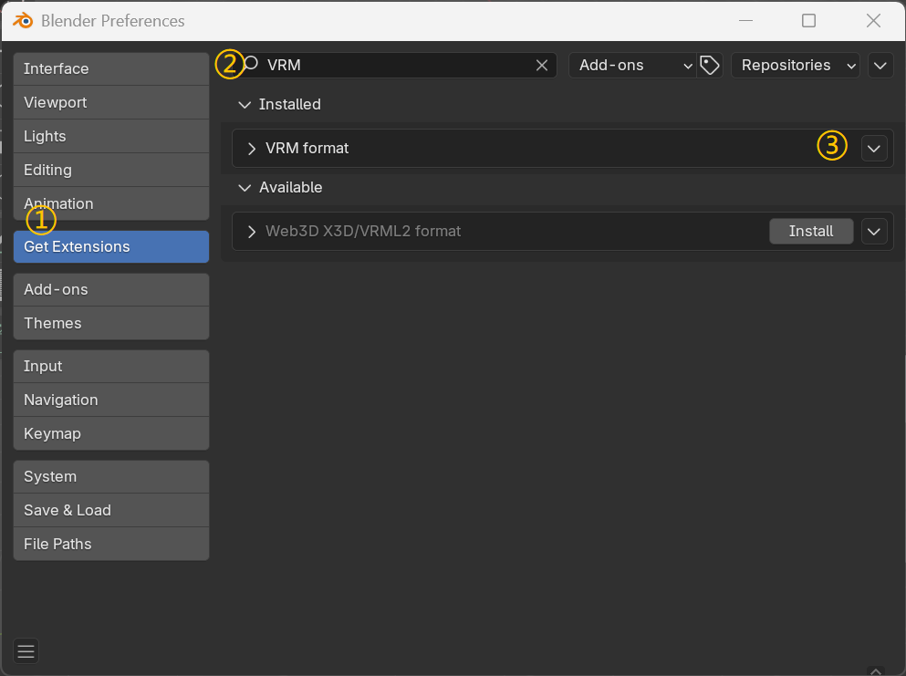

- looptool

  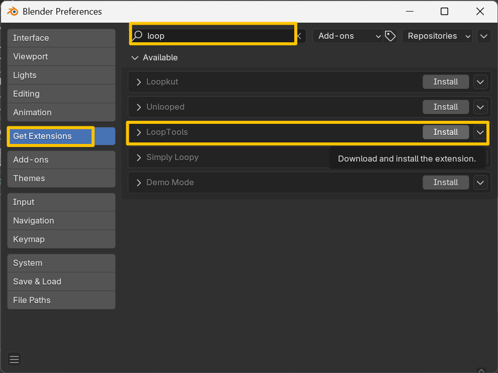

- 文件路径——图像编辑器

  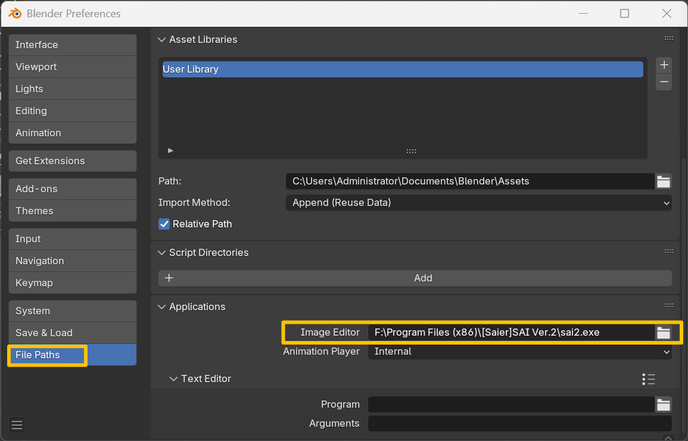

- 界面——拾色器类型——方形（SV+H）

  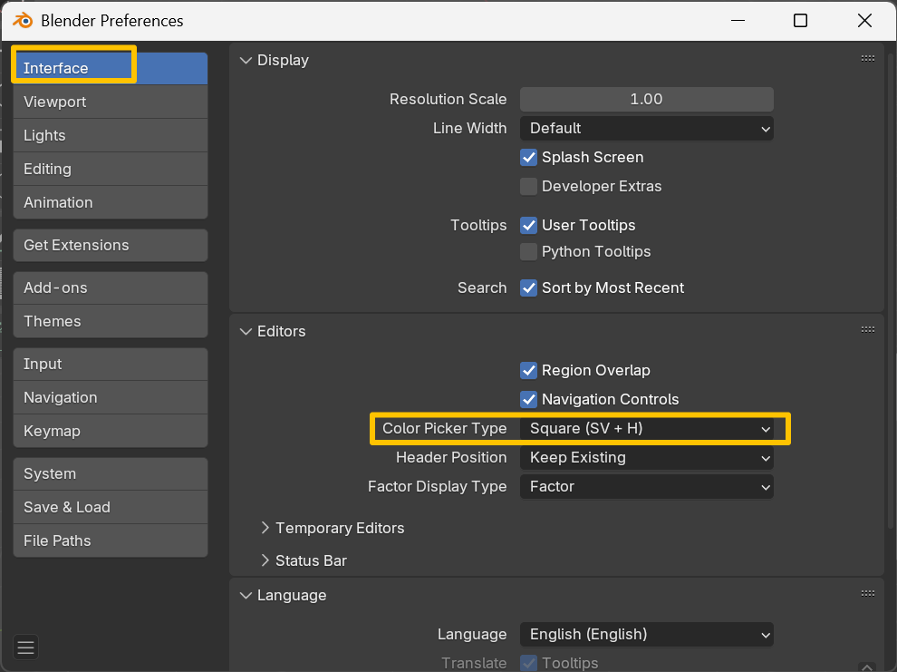

- 视图切换

  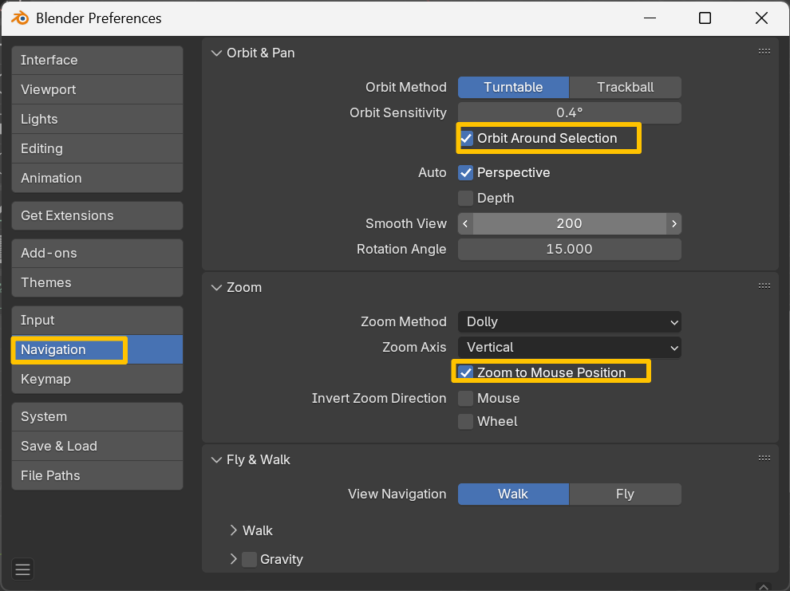

* 坐标轴（面向-Y）

  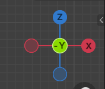

Z表示上下俯仰。Y表示前后，X表示左右。这样导出的模型朝向是正确的。

## 1.面部

1.1 扣出眼睛洞洞：

正方体——修改器【表面细分】——视图3——应用

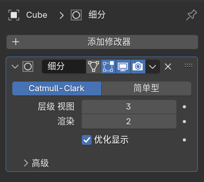

编辑模式——选中左右六个面扣眼睛。

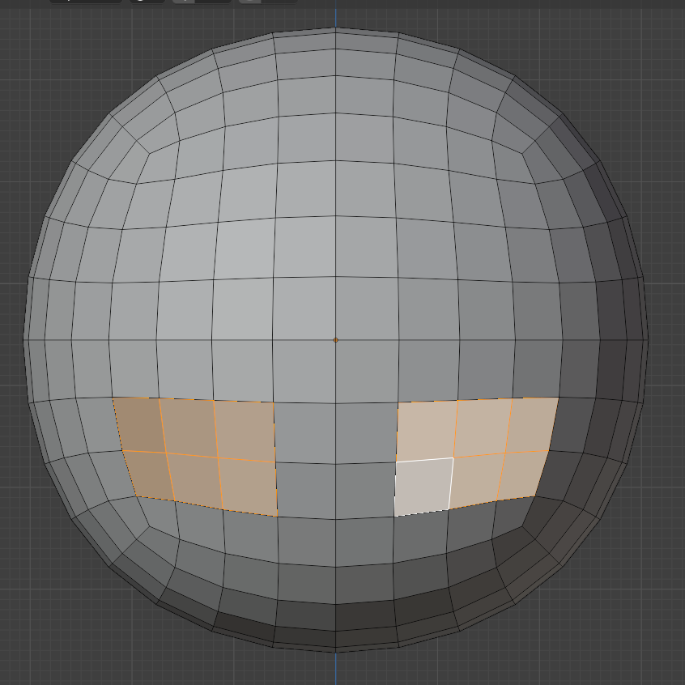

选中并隐藏后脑（H）

>alt+H，显示被隐藏的后脑勺

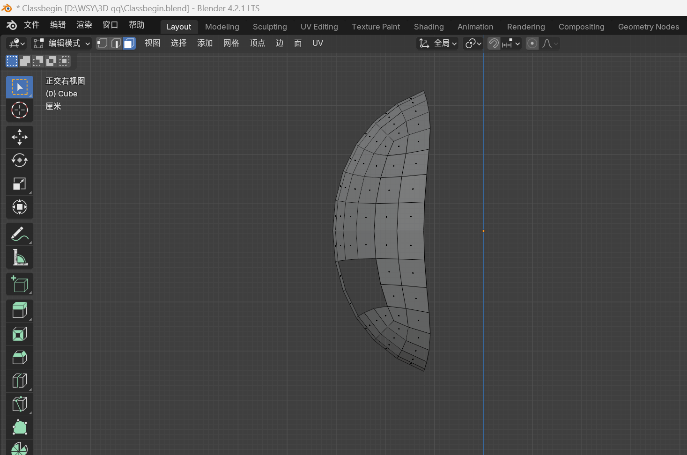

选中嘴巴——I内插——S缩小——X删除面

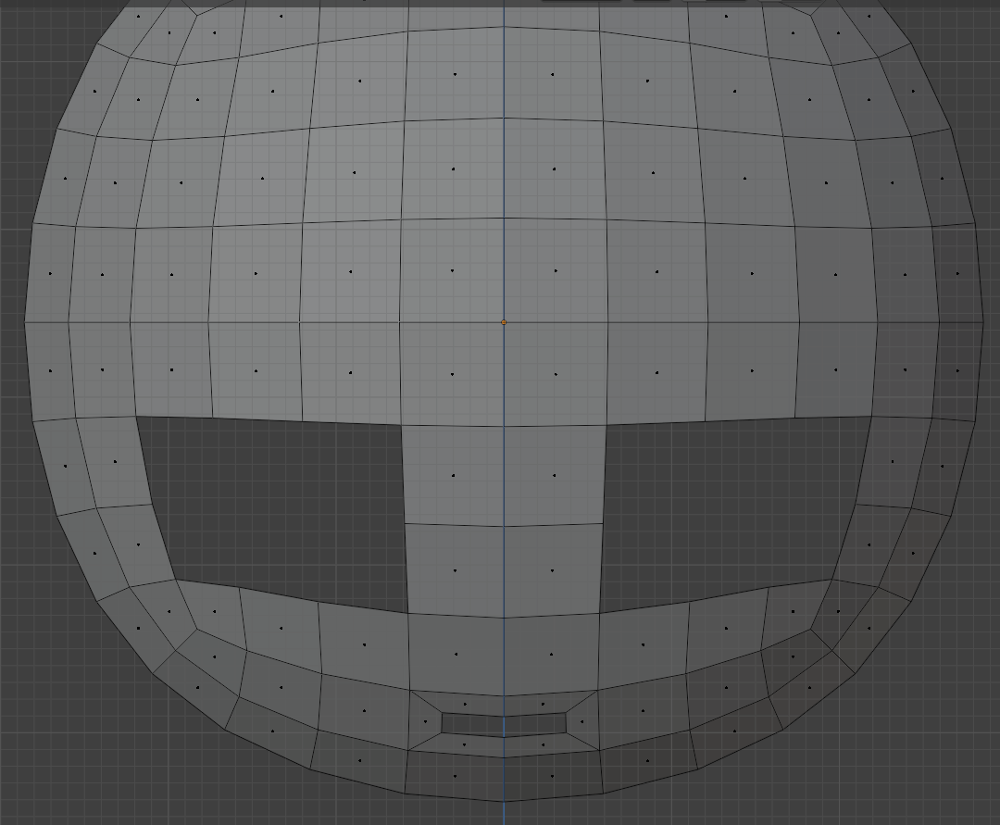

选中鼻子——I内插——S缩小——G微调

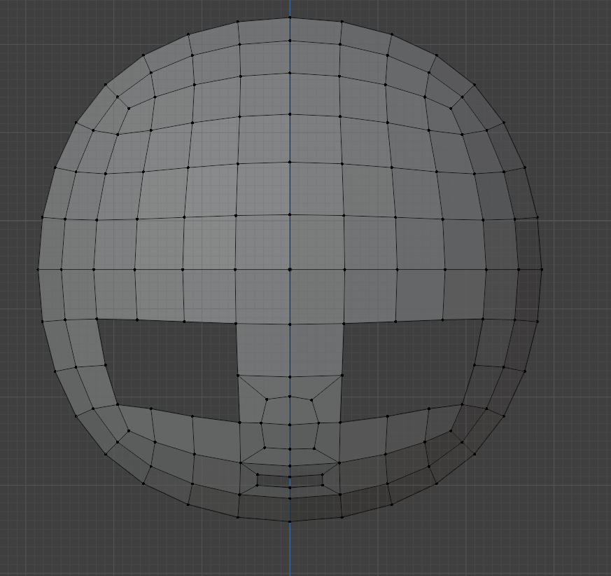

选中左半张脸——x——删除点

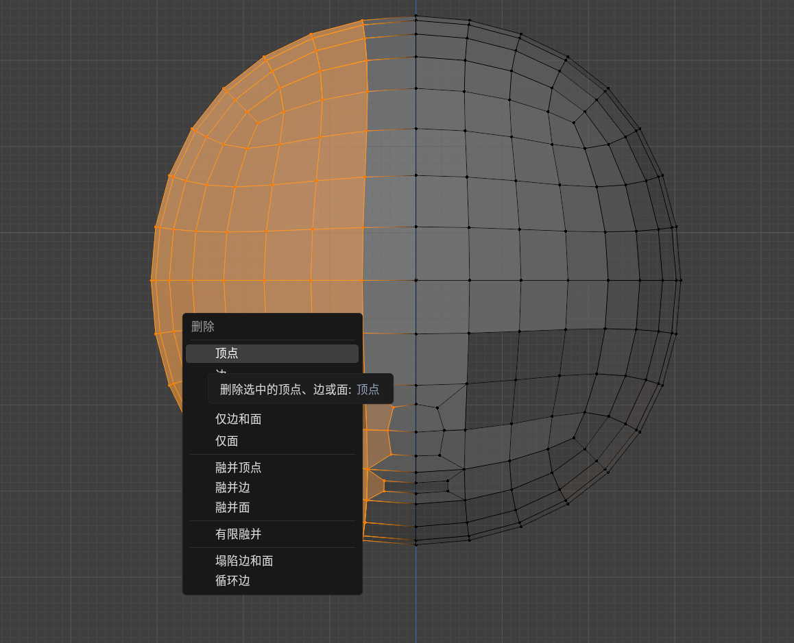

