参考教程：

## 0.前置插件/配置

- node wrangler

- VRM format (用于动捕)

  

- looptool

  

- 文件路径——图像编辑器

  

- 界面——拾色器类型——方形（SV+H）

  

- 视图切换

  

* 坐标轴（面向-Y）

  

Z表示上下俯仰。Y表示前后，X表示左右。这样导出的模型朝向是正确的。

## 1.面部

1.1 扣出眼睛洞洞：

正方体——修改器【表面细分】——视图3——应用

编辑模式——选中左右六个面扣眼睛。

选中并隐藏后脑（H）

>alt+H，显示被隐藏的后脑勺

选中嘴巴——I内插——S缩小——X删除面

选中鼻子——I内插——S缩小——G微调

选中左半张脸——x——删除点

2.后脑勺

新建一个经纬球sphere（与脸部cube是不同的两个网格体），把它拖到适当的位置作为后脑。

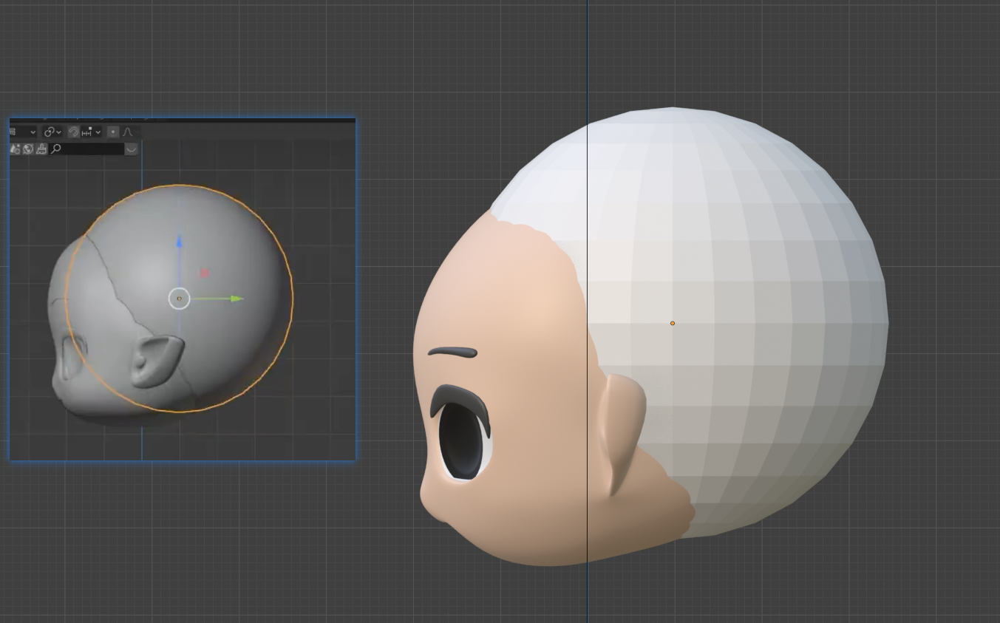

注意记得应用变换+设置原点->几何中心。

进入雕刻模式——右上角可以选择镜像x对称

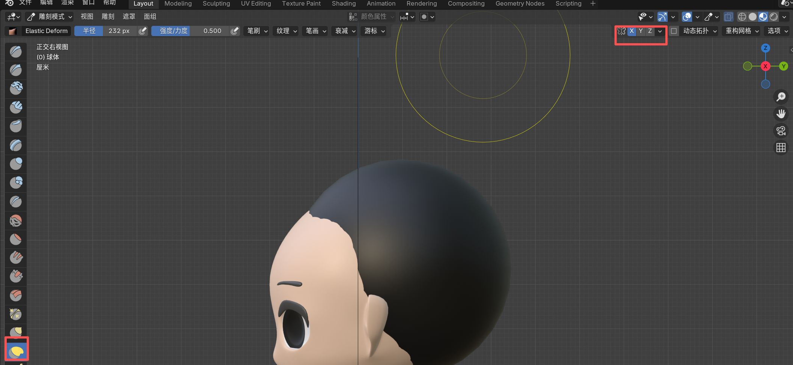

制作一个形状不错的头壳。

按住alt循环选边，右键——标记缝合边。

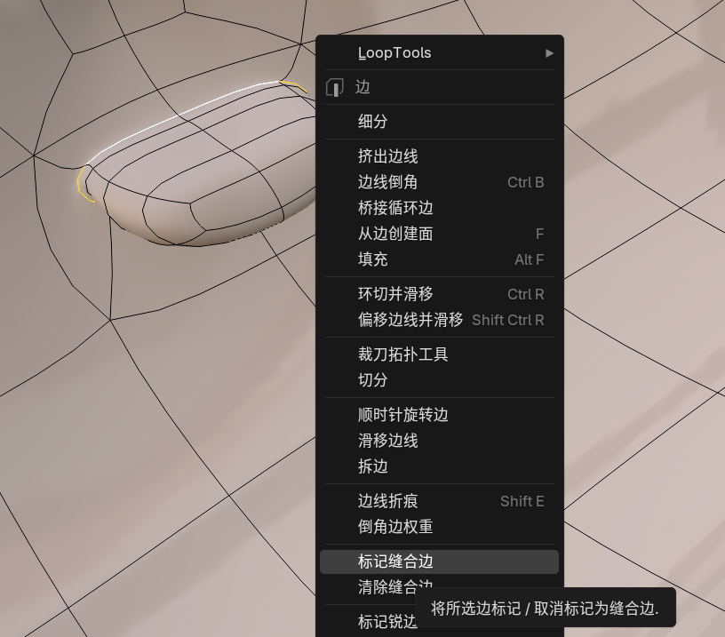

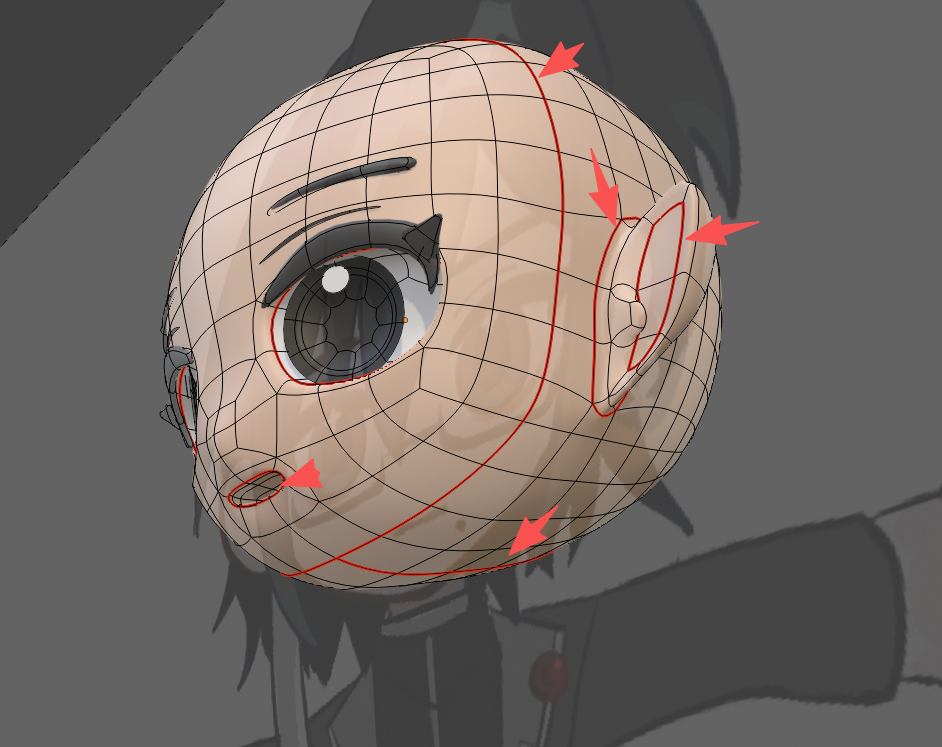

注意：如果左右脸不对称（异瞳/泪痣/犄角等等），需要在脑袋本体后脑勺上，选择后半部分中线标记为缝合边。

> 后续展开UV时候就可以画不对称的脸了。

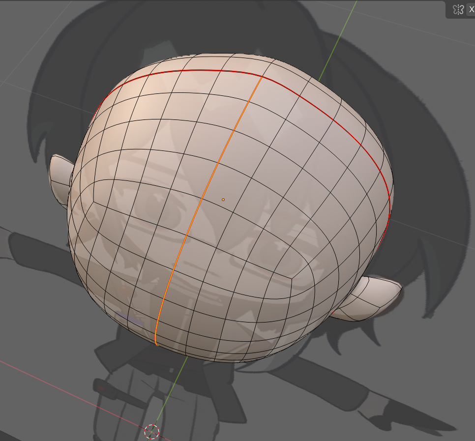

注意：所有缝合边标记好后，物体模式——修改器——从上到下依次应用（镜像——细分）

> 这一步可以先备份一下未合并的版本。

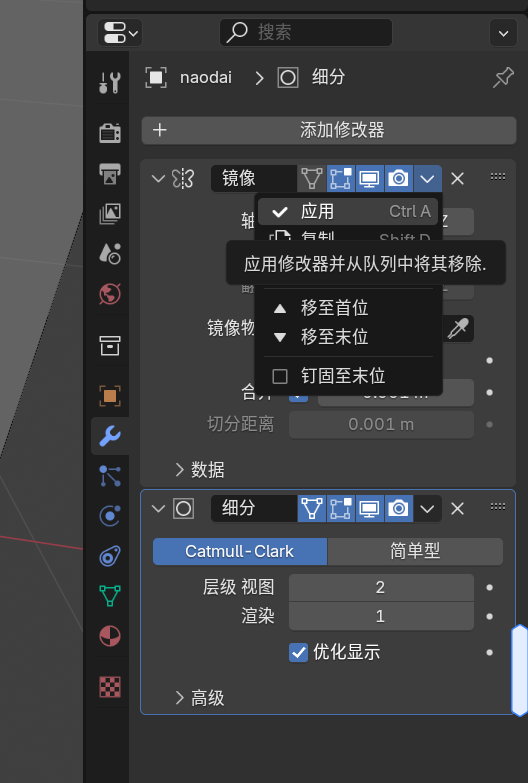

## 2.UV展开

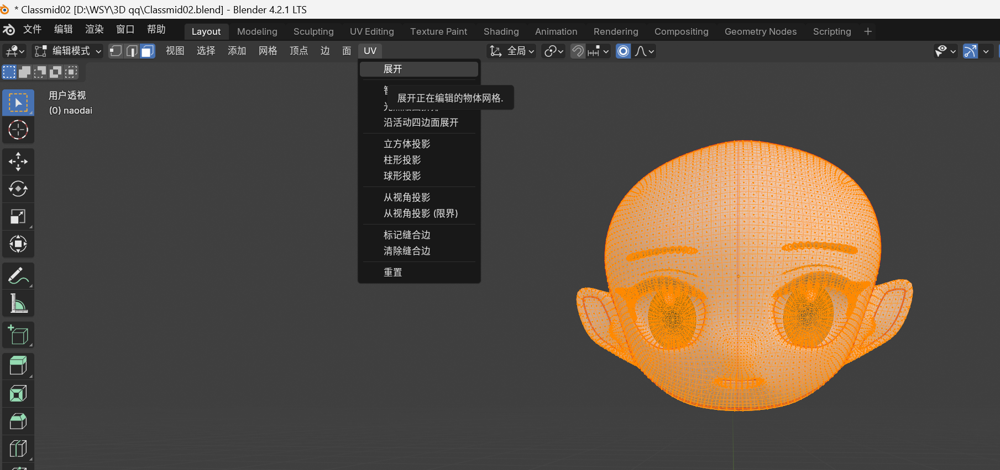

展开后正常在UV Editing中是这样的：

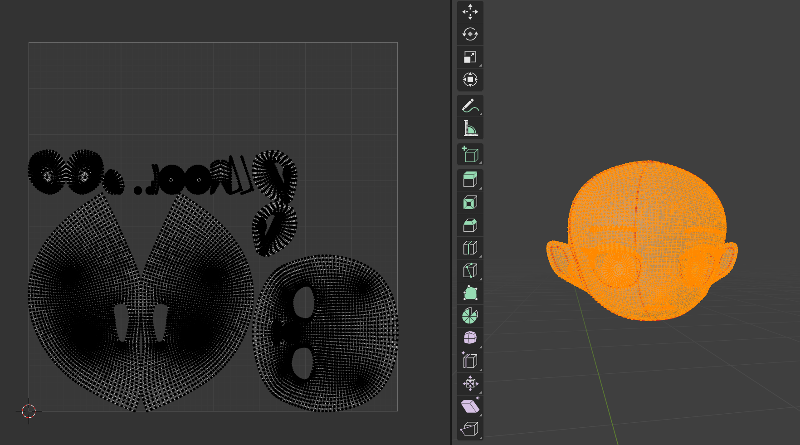

眼睛+眼白+高光+睫毛+眉毛：按L选择，UV——按视角展开

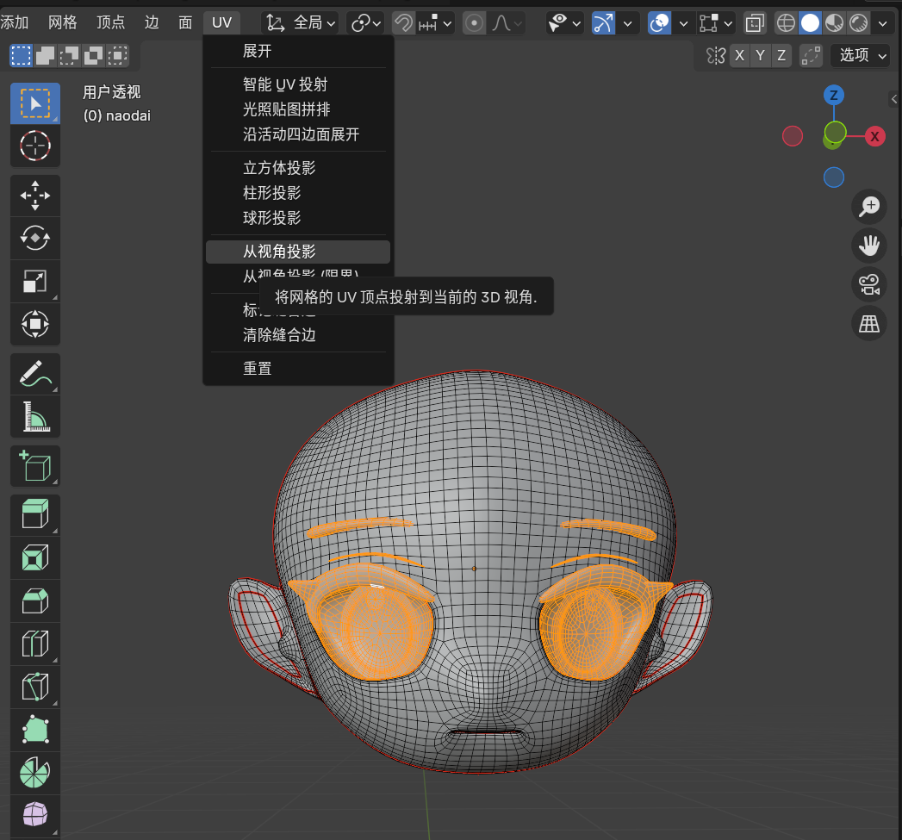

记得同样使用L，将各个部分的UV分开：

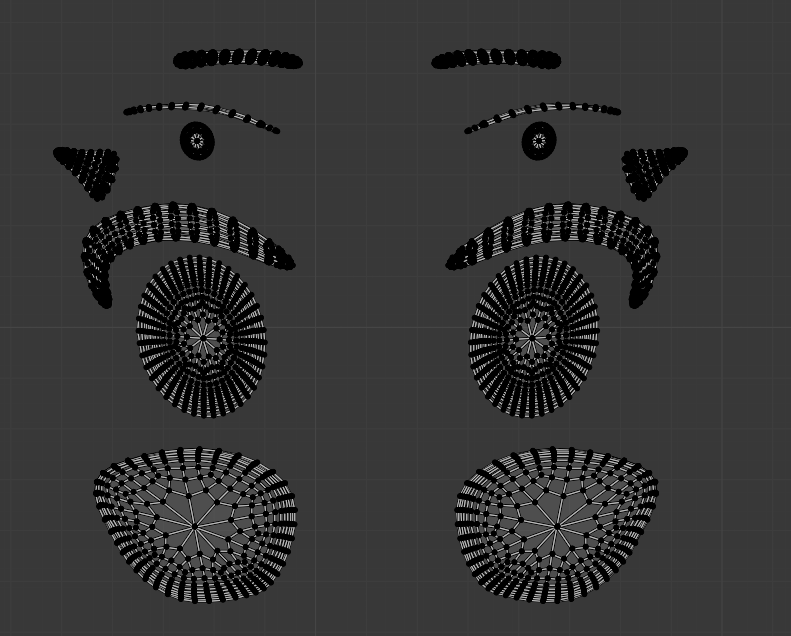

制作牙齿和舌头：新建平面网格体，命名zuiba。

> 所有的网格体命名都不能是骨骼名重名，如mouth/head/hand/thumb等等。

最后合并时：先子后父，ctrl+J，鼠标悬停在模型上！注意是物体模式。

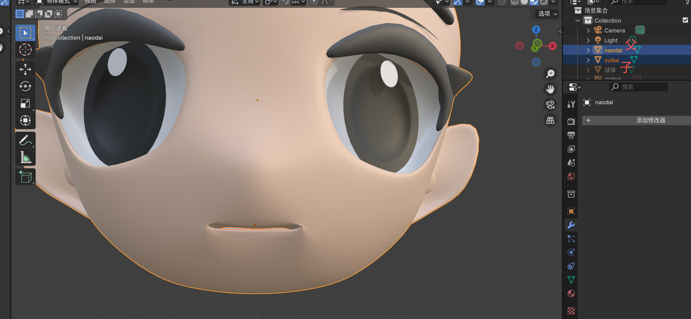

口腔的uv展开：顶视图（z），从视角投影

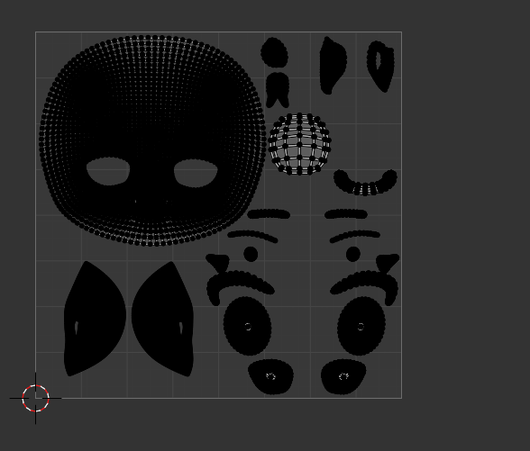

UV布置好之后，新建——命名——保存图片（。png）

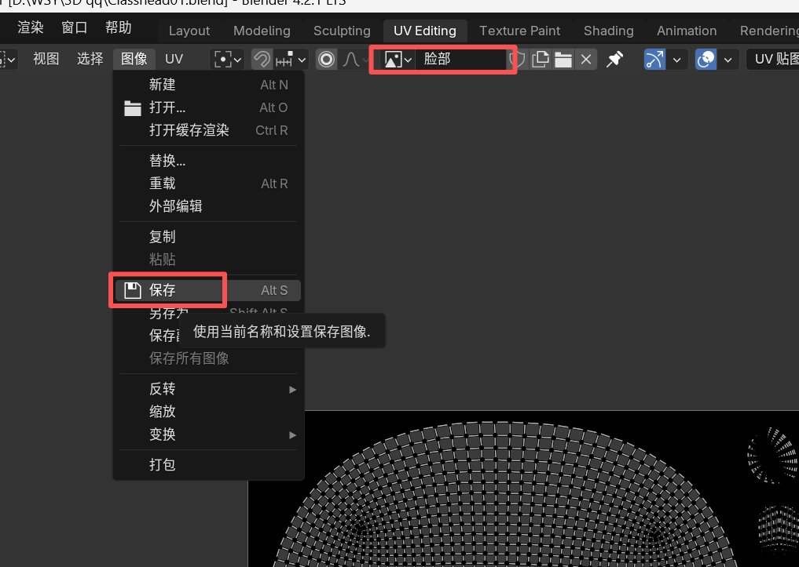

打开着色面板（shading）

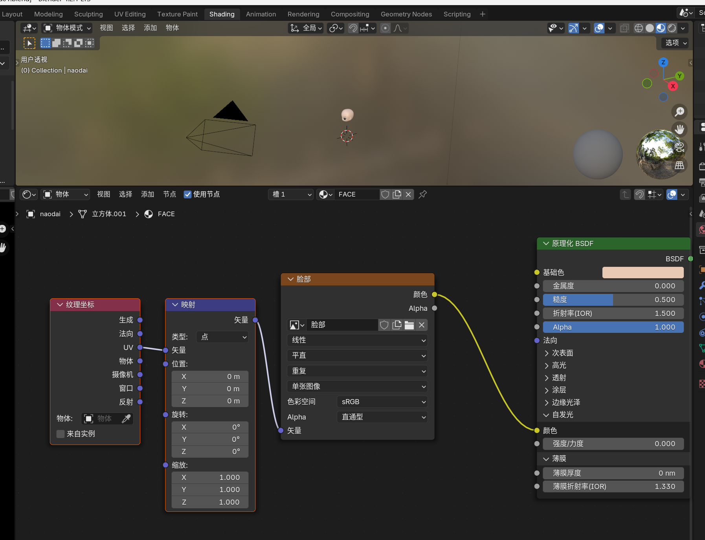

选中图像纹理后+Ctrl+T，即可自动连接完整的节点。

> ctrl+T需要在node wranggle插件开启的前提下才能正常用。