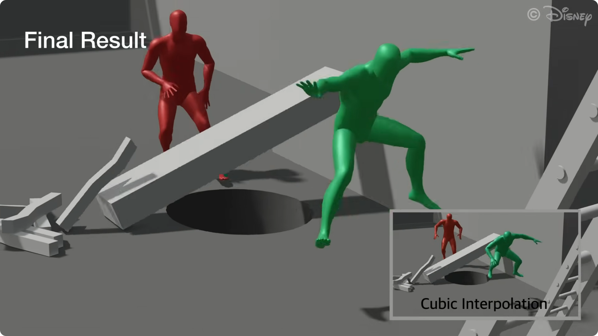
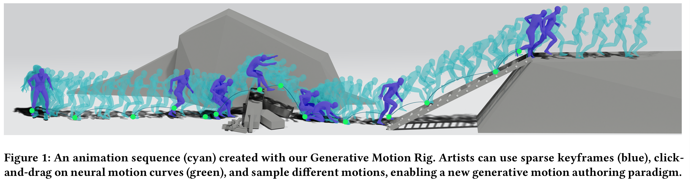
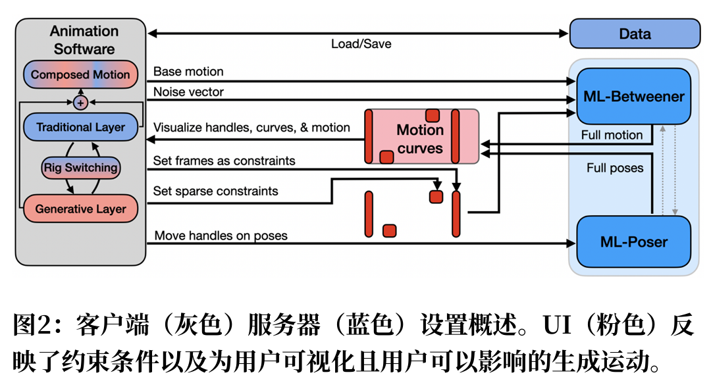
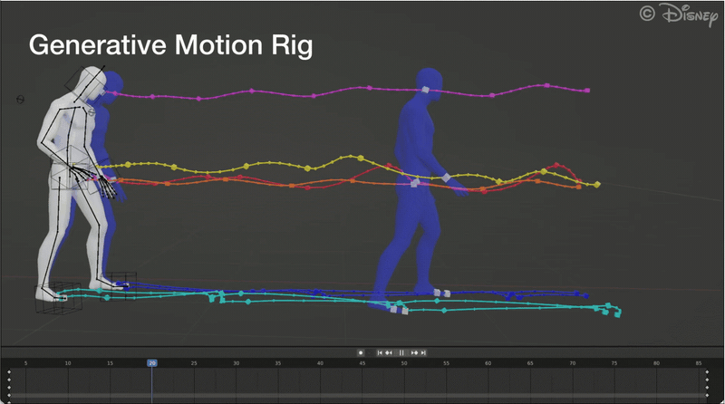
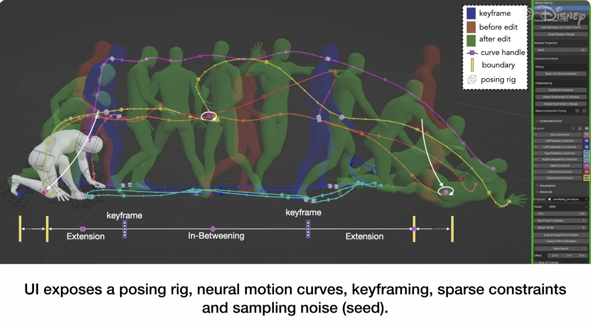
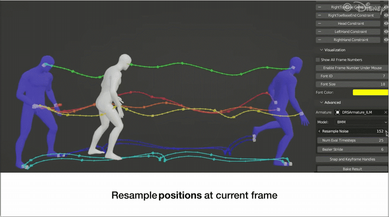
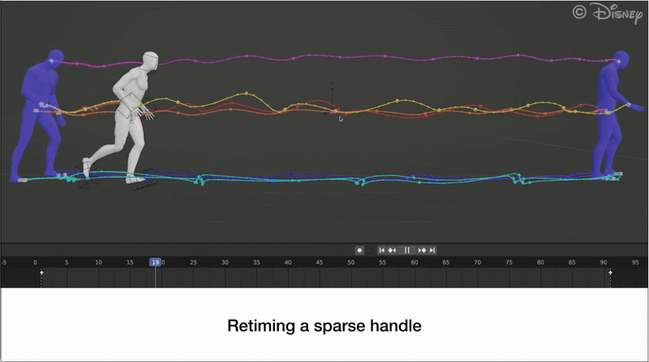
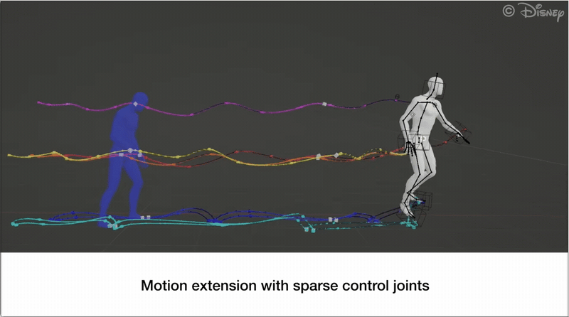
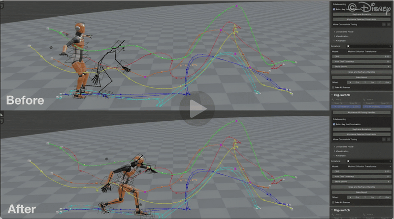
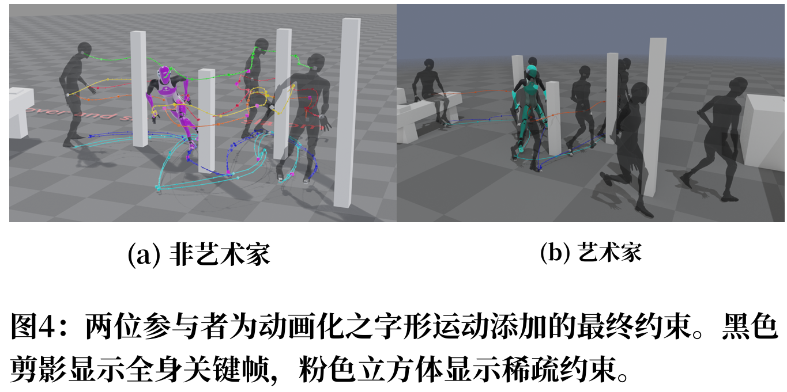

# 生成式运动Rig

2026年7月20日（本周一），迪士尼研究团队在SIGGRAPH的演讲

《A Generative Motion Rig for Artist-Driven Motion Authoring》中展示了他们的最新Blender插件——稀疏关键帧在blender中轻轻一拉，完整的动作一气呵成！



> 减小gif的文件大小：
>
> ```
> ffmpeg -i 06GIF.gif -filter_complex "[0:v]fps=8,scale=800:-2:flags=lanczos,split[a][b];[a]palettegen[p];[b][p]paletteuse=dither=bayer:bayer_scale=4" output_small6.gif
> ```

## 坏消息：插件还没开源

然而，到今日为止（26年7月24日），这个插件尚未开源，Reddit 上已经有不少人在询问插件下载地址，但大家寻寻觅觅没找见，所以普遍认为 Disney 暂时没有公开发布该插件。

本着“来都来了”的心态，既然没有eat到视频中的成品插件，那就顺便看看Disney Research这次演讲的具体内容。

## A Generative Motion Rig for Artist-Driven Motion Authoring

来源：[A Generative Motion Rig for Artist-Driven Motion Authoring | Disney Research Studios](https://studios.disneyresearch.com/2026/07/16/a-generative-motion-rig-for-artist-driven-motion-authoring/)

演讲内容仅3页。



**做了什么工作：**

用**通用动作模型+稀疏约束（少量关节/姿态/曲线控制点）+ 噪声采样**，让动画师像【拖】传统 Rig一样通过操控稀疏姿态、控制柄、窗口长度和噪声采样来创作动画。

### GMR（Generative Motion Rig）系统架构



**客户端-服务器解耦**：Blender做交互界面，模型跑在独立 GPU 服务器，方便换宿主软件。

其中，

**服务器端：**

**ML-Poser**（神经 IK模型）：用于实现【稀疏关节约束中完成全身姿势】

**ML-Betweener** （动作模型）：采用IBMM（隐式贝塞尔运动模型），确保时间稀疏性和平滑性，与动画师传统创作习惯一致。

> 除了展示使用的IBMM模型，本文的框架与其他生成式运动引擎（Cohan 等，2024）也能兼容。

**客户端：**

暴露给动画师/创作者的东西：

- 传统 armature 手柄

- **Neural Motion Curves (NMC)** ：可视化曲线，控制点可在视口/图表编辑器拖拽

- 参数：窗口长度、噪声种子（位置噪声/朝向噪声分开采）、时间边界、初始噪声
- 分层：分为“生成层”&“传统层”，可以在GMR生成和传统绑定之间互相切换、混合、叠加。

生成式创作能力：

> 下面的内容在官方视频里展现的非常直观。

### 1）直接控制 （Direct Control）：

结合IBMM和NMC可以直接操控生成的运动（图3）。

用户通过转换稀疏约束（如只拖脚、只转髋）即可改步态、把走路变旋转/摔倒。





> 图3 在Blender中使用NMC可视化GMR，展示姿势手柄（立方体）、关键帧（蓝色）和稀疏约束（粉色）。 该序列描绘了运动扩展以及仅使用三个稀疏约束编辑的效果 （之前为红色，之后为绿色）。用户指定的评估边界在时间轴上以黄色标出

### 2）噪声操控（Noise Manipulation）：

重采全局或单帧噪声；**位置噪声**改轨迹轮廓，**朝向噪声**保形变速。



### 3）时间控制（Temporal Control）：

把约束沿时间轴前后滑 → 模型提前/推迟命中目标，走变跑。



### 4）运动拓展（Motion Extension）：

约束外推新动作，持续往前生成并受稀疏手柄塑造。



### 5）生成式动作编辑（Generative Motion Editing）：

除了生成新运动，GMR还能通过可选地发送要由服务器上的ML‑Betweener保留的基础运动来编辑现有动画，把 mocap/已有 clip 发到服务端做 diffusion inpainting（扩散 补全），保留指定段、生成段贴合新约束（接断、延长、改跳远距离）——为传统动画技术提供自然的桥梁。

### 6）绑定切换（Rig Switching）：

为了与专业工作流程无缝集成，这种混合方法允许艺术家使用GMR迭代时间和布局， 然后过渡到更精确的传统绑定进行进一步润色，例如对运动进行风格化并使其超越物理真实性。

* 传统 Rig → GMR：当前姿态作为全身约束喂进去。

* GMR → 传统 Rig：**只传当前帧姿态**（不每帧传，避免传统 Rig 被锁死）。

* 同步模式：拖传统 Rig 实时加全身约束给 GMR 看生成结果。

系统允许用户轻松地在所有三种控制类型之间传输姿势



### 很有意思的各项测试

Disney在演讲中介绍了在各项测试中发现的不同工作流程及其与传统工作流程的兼容性。

1）自由风格测试：

他们委托一位专业艺术家使用GMR创建他们选择的任何动画。如图和随附视频所示， 艺术家创作了两个角色之间的长追逐动画。在这个示例中，艺术家结合了关键帧、对NMCs的稀疏操作，并在“生成式关键 帧”工作流程中从其中采样运动和关键姿态。


请注意，这个复杂的22秒片段在不到两天内完成，包括学习工具和故事板设计场景所需的时间。艺术家对创作完整动画的速度特别满意， 尤其是在场景的动态部分。

2）引导测试：

在另一个测试中，Disney布置了一个带有障碍物和动画提示的跑酷场景。该测试由两位参与者进行，一位是专业艺术家，另一位是没有任何动画经验的作者。两位参与者均有1.5小时的时间完成课程，并制作45秒的动画。



鉴于绑定系统的灵活性，两位参与者都能够构建自己的工作流程并成功完成任务。官方视频中包含了最终动画。

### 作者自己承认的局限 

* 首先，生成模型本质上受限于其训练数据，这可能会限制艺术家在尝试实现“分布外”运动时，例如非物理动力学和更具风格化的动画。
* 虽然分层方法是一个让生成式+传统动画在相同软件中共存的初步步骤，但找到最佳方式来融合且不失去物理或风格一致性，仍然是一个令人兴奋的未来探索领域。
* 此外，当前最先进的生成模型加新约束时生成结果可能跳变（pop），同步模式尤明显，所以要实现更无缝的用户体验时需要提高稳定性。
* 最后， 扩展到更复杂的绑定系统和不同的角色形态仍然是一个开放性的挑战。

## Disney Research 在 **2024–2026** 的工作

他们并不是在做一个新的 Motion Diffusion Model，而是在打造一个**面向动画师（Animator）的 AI 动画创作系统（AI Animation Authoring System）**。

### Skel-inbetweening for Intuitive Neural Motion Authoring (2024)

https://studios.disneyresearch.com/2024/11/11/skel-inbetweening-for-intuitive-neural-motion-authoring/

提出Neural Motion Rig——第一次把 Motion Model 当成：

> **Rig（绑定系统）**

而不是：

> **Generator（生成器）。**

这是一个非常重要的思想变化。

### Factorized Motion Diffusion for Precise and Character-Agnostic Motion Inbetweening (2024)

https://studios.disneyresearch.com/2024/11/21/factorized-motion-diffusion-for-precise-and-character-agnostic-motion-inbetweening/

实际上是在解决：SKEL-Betweener 的生成质量问题。

他们发现：Motion Diffusion 同时学习`角色+动作`容易耦合。

于是拆成：Character+Motion两个空间。

### A Generative Motion Rig for Artist-Driven Motion Authoring(2026)

本帖一开始分享的内容，就是今年七月主要公开展示的Blender Plugin，几乎已经不讨论模型，研究的是怎么给动画师用。