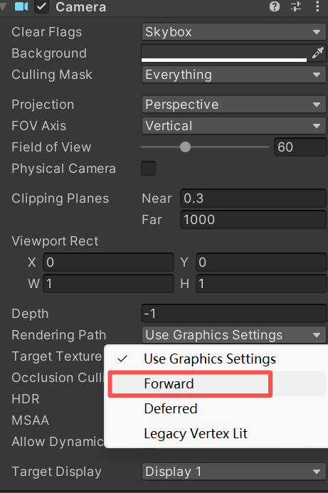

# 9 复杂光照

## 9.1 渲染路径

Unity主要有两种渲染路径：

1.前向渲染路径（Forward Rendering Path）

2.延迟渲染路径（Deferred Rendering Path）

3.(已弃用)顶点照明渲染路径（Vertex Lit Rendering Path）

大多数情况下，一个项目只用一种渲染路径，所以在全局的Edit—Project Setting—Player—Other Settings—Rendering Path中选择。如果有需要使用多个渲染路径，可用多个摄像机的设置中选择渲染路径：

比如摄像机A渲染的物体使用前向渲染路径，摄像机B渲染的物体使用延迟渲染路径。



这样就可以覆盖掉Project Setting的设置。

完成摄像机的设置之后，我们就可以在每个Pass中使用标签来指定该Pass的渲染路径。

```
Pass{
	Tags { "LightMode" = "ForwardBase" }
}
```

**表9.1 LightMode 标签支持的渲染路径设置选项**

| 标签名                            | 描述                                                         |
| --------------------------------- | ------------------------------------------------------------ |
| **Always**                        | 不管使用哪种渲染路径，该 Pass 总是会被渲染，但不会计算任何光照。 |
| **ForwardBase**                   | 用于前向渲染。该 Pass 会计算环境光、最重要的平行光、逐顶点 / SH 光源和 Lightmaps。 |
| **ForwardAdd**                    | 用于前向渲染。该 Pass 会计算额外的逐像素光源，每个 Pass 对应一个光源。 |
| **Deferred**                      | 用于延迟渲染。该 Pass 会渲染 G 缓冲 (G-buffer)。             |
| **ShadowCaster**                  | 把物体的深度信息渲染到阴影映射纹理 (shadowmap) 或一张深度纹理。 |
| **PrepassBase**                   | 用于遗留的延迟渲染。该 Pass 会渲染法线和高光反射的指数部分。 |
| **PrepassFinal**                  | 用于遗留的延迟渲染。该 Pass 通过合并纹理、光照和自发光来渲染得到最后的颜色。 |
| **Vertex/VertexLMRGBM和VertexLM** | 用于遗留的顶点照明渲染                                       |


## 9.2 前向渲染路径（Forwad Rendering Path）

前向渲染路径时传统的渲染方式，也是最常用的渲染路径。

**过程**

每进行一次完整的前向渲染，我们需要渲染该图像的渲染图元，并计算两个缓冲区的信息：

```
1.深度缓冲区：利用深度缓冲来决定一个片元是否可见，如果可见就更新颜色缓冲区的颜色值

2.颜色缓冲区：如上。
```

> 其中，对每个逐像素光源都要进行一次上述完整渲染流程，如果N个物体，M个光源，则渲染整个场景需要N*M个Pass。因此渲染引擎通常会限制**逐像素光照**的数目。

**处理光照方式**

在Unity中前向渲染路径有3种处理光照的方式：

1.逐像素处理

2.逐顶点处理

3.球谐函数（SH，Spherical Harmonics）


**一个光源如何决定使用哪种处理光照的方式？**

> 决定一个光源使用哪种处理模式取决于它的光源类型和渲染模式。
>
> **光源类型**：平行光，点光源，等等。
>
> **渲染模式：**是指该光源是否**<u>重要（Important）</u>**。如果把一个光照的模式设置为Important，意味着告诉Unity：嘿老兄，这个光源很重要，我需要你认真对待，把它当成一个逐像素光源来处理。


**Unity的判断规则：**

* 场景中最亮的平行光总是按逐像素处理。
* 渲染模式被设置成**Not Important**的光源，会按逐顶点处理或SH处理。
* 渲染模式被设置成**Important**的光源，会按逐像素处理。
* 如果根据以上规则得到的逐像素光源数量小于Quality Setting里的逐像素光源数量（Pixel Light Count），会有更多的光源以逐像素的方式进行渲染。

通常，对前向渲染来说，一个Unity Shader通常会定义一个**Base Pass**（Base pass也可以定义多次，例如需要双面渲染的情况。）和一个**Additional Pass**。

一个Base Pass仅会执行一次（定义多个Base Pass除外），一个Additional Pass根据逐像素光源的数目多次调用（当然，是能影响到本物体的逐像素光源）。


## 9.3 延迟渲染路径（**Deferred** Pass）

延迟渲染是一种更古老的方法，但为了解决前向渲染的性能瓶颈问题，近几年又流行起来。

> 前向渲染的性能瓶颈：计算复杂度随物体和光源数量的乘积增长，实时光源增多时性能下降显著。

**原理**

其核心思想可以概括为“**先存储，后计算**”，即将几何信息与光照计算分离。除了前向渲染中的颜色缓冲区和深度缓冲区，延迟渲染利用了额外的一个缓冲区：**G-buffer**（G，Geometry，几何缓冲区）

**G-Buffer 通常包含的数据**：

**位置 (Position)**: 像素在世界空间中的坐标

**法线 (Normal)**: 物体表面的朝向，用于计算光照角度

**漫反射颜色 (Albedo)**: 物体表面的基础颜色，不包含光照信息

**高光属性 (Specular)**: 如高光颜色和光滑度，控制材质反光能力


一般来说，延迟渲染使用的Pass数量就是两个。

**第一个Pass：几何通道 (Geometry Pass)**

> 这个阶段不进行光照计算，收集场景中所有不透明物体表面的原始几何和材质信息，并将其存储到一系列称为**G-Buffer（几何缓冲区）** 的纹理中。

**第二个Pass：光照通道 (Lighting Pass)**

> 在这个阶段，利用G-buffer里的各个片元信息，如法线，视角方向，漫反射系数等等，进行真正的光照计算。

由于 G-Buffer 只存储了最终可见的像素信息，那些被遮挡的（不可见）片段不会进入此阶段，从而**避免了大量无效的光照计算**


**主要局限**：

- **半透明物体渲染困难**。
- **显存带宽占用高**：G-Buffer 包含多张高精度纹理，读写这些数据会消耗大量显存带宽，可能成为性能瓶颈。
- **不支持真正的抗锯齿功能**。


## 9.2 光源类型

### 平行光 (Directional Light)

平行光被模拟为来自**无穷远处**的光源，其发出的所有光线都是**相互平行**的，类似于太阳光照射到地球的效果。由于光源被视为无限远，所以光线**没有衰减**，场景中所有物体接收到光照的方向和强度都是均匀一致的


在图形学和照明设计中，平行光的主要属性是其**方向**，而非位置。它非常适合用于模拟日光等全局照明，能够为场景提供基础而均匀的照明效果


### 点光源 (Point Light)

点光源是从空间中的**一个特定点**向**所有方向**均匀发光的光源，类似于一个白炽灯泡。点光源有明确的位置属性，其光照强度会随着传播距离的增加而**衰减**，通常遵循平方反比定律之类的规律

点光源是理想化的物理概念，现实中并不存在严格意义上的点光源，但像LED灯珠这样的发光体可以近似看作点光源

在照明应用中，多个点光源可以组合成阵列，用于建筑轮廓勾勒、大屏幕显示等，实现丰富的动态效果


### 聚光灯 (Spot Light)

聚光灯从一个点出发，向**特定方向**发射出一个**锥形**的光束，类似于舞台追光灯或手电筒。它同时具有**位置**和**明确的照射方向**两个核心属性。

其光照特性包括锥形光束的**照射角度**（光束张角）和**边缘衰减**（光束边缘的光线如何逐渐变弱）

聚光灯能够产生强烈的中心亮斑和清晰的阴影，非常适合于突出场景中的特定物体或区域，营造戏剧性的视觉效果。在摄影、舞台照明和建筑亮化中应用广泛。


## 9.3 光照衰减

如果是平行光的话，衰减值为1.0。如果是其他光源类型，计算会更复杂，包括开根号/除法等等。应对这种计算量相对较大的操作，Unity选择了用一张纹理作为查找表**（Lookup Table, LUT）**.

LUT计算衰减的局限：

1.**灵活性和直观性上的牺牲**。一旦衰减数据被预计算并存储为纹理，你就很难在Shader中动态地改用其他数学公式来实时调整衰减曲线。调试也变得相对不便。

**2.需要预处理得到采样纹理。衰减的精度依赖于预计算纹理的分辨率**，低分辨率纹理可能导致精度不足或带状瑕疵；而预处理纹理本身也会占用一定的存储和内存资源


## 9.4 Unity的阴影

**阴影的原因**：

> 当一个光源发射的一条光线遇到一个不透明的物体，这条光线就不可以继续照亮其他物体（这里不考虑反射），因此，这个物体就会向它旁边的物体投射阴影。**阴影区域的产生是因为光线无法到达这些区域。**

**阴影映射纹理（shadowmap）**

在前向渲染路径中，如果场景中最重要的平行光开启了**阴影**，那么unity为该光源计算它的阴影映射纹理**（shadowmap）**。这张阴影映射纹理本质上也是一张深度图，记录了该光源位置出发—能看到的场景中距离它最近的**表面位置（深度信息）**。


**如何计算shadowmap呢？**

Unity用一个额外的Pass来专门更新光源的阴影映射纹理。LightMode设置为：**ShadowCaster**的**pass**。

**过程**：

**1.** Unity首先将摄像头放到光源的位置上，判定距离它最近的表面，调用该pass，据此来输出深度信息到阴影纹理映射中。

**2.** 因此开启光源的阴影效果后，底层渲染引擎会首先在当前渲染物体的shader中寻找LightMode为ShadowCaster的Pass，如果没有 会在Fallback指定的UnityShader中继续找

**3.** 如果没有找到，该物体就无法向其他物体投射阴影。但它依然可以接收来自其他物体的阴影。

**4.**  当找到了一个**物体**确实使用shadowCaster的Pass后，unity就会用该Pass来更新**光源**的阴影映射纹理。


**总结**

* 一个物体接收来自其他物体的阴影：就必须在Shader中对阴影映射纹理进行采样，并将采样结果和光照计算结果相乘来得到最终的阴影效果。
* 一个物体向其他物体投射阴影：必须把该物体加入光源的阴影映射纹理的计算中，从而让其他物体在对阴影映射纹理采样时可以得到该物体的相关信息。 


在Unity中：1.首先要开启光源的阴影效果。2.其次要开启物体的投射阴影和接收阴影。


注意，在默认情况下阴影映射纹理会剔除掉物体的背面，但是对于内置的平面只有一个面，所以，需要设置成tow sides的阴影模式，平面才能正确地向其他物体投射阴影。


打开帧调试器：windows——analysis——frame debug


可以看出，绘制该场景一共花19个渲染事件，每一步骤的绘制过程可查看：


没有在shader中写有关ShadowCaster的Pass，也可以投射阴影，这是因为，回调函数

```
FallBack “Specular”
FallBack “Diffuse”
```

等这些回调内部又会回调：`Fallback "VertexLit"`顶点光照路径，它可以提供给阴影的计算。

### 单独阴影

1.在base pass中内置头文件

```
Pass {
	// Pass for ambient light & first pixel light (directional light)
	Tags { "LightMode"="ForwardBase" }
	// 
	CGPROGRAM
	
	// Apparently need to add this declaration 
	// 声明包含阴影纹理映射的头文件
	#include "AutoLight.cginc"
```

2.在结构体v2f中声明一个阴影纹理坐标

```
struct v2f {
	float4 pos : SV_POSITION;
	float3 worldNormal : TEXCOORD0;
	float3 worldPos : TEXCOORD1;
	// 内置宏，作用是声明一个阴影纹理坐标
	SHADOW_COORDS(2)
};
```

3.顶点着色器中计算

```
			v2f vert(a2v v) {
				//……
				
				// 计算阴影纹理坐标
				TRANSFER_SHADOW(o);
				return o;
			}
```

4.片元着色器中采样

```
fixed4 frag(v2f i) : SV_Target {
	//……
	
	//用一张阴影纹理采样阴影映射纹理
	fixed shadow = SHADOW_ATTENUATION(i);
	//将阴影映射结果漫反射+高光的结果相乘。
	return fixed4(ambient + (diffuse + specular) * shadow, 1.0);
}
```

### 统一管理衰减和阴影

1.包含进头文件

```
// Need these files to get built-in macros
#include "Lighting.cginc"
#include "AutoLight.cginc"
```

2.声明阴影纹理坐标

```
v2f vert(a2v v) {
	//……
 	// Pass shadow coordinates to pixel shader
 	TRANSFER_SHADOW(o);
 	
 	return o;
}
```

3.内置宏TRANSFER_SHADOW

```
			v2f vert(a2v v) {
				//……
				
				// 计算阴影纹理坐标
				TRANSFER_SHADOW(o);
				return o;
			}
```

4.与上一部分阴影计算不同，在内置宏UNITY_LIGHT_ATTENUATION	来计算阴影+光照衰减

```
fixed4 frag(v2f i) : SV_Target {
	// UNITY_LIGHT_ATTENUATION not only compute attenuation, but also shadow infos
	UNITY_LIGHT_ATTENUATION(atten, i, i.worldPos);
	
	return fixed4(ambient + (diffuse + specular) * atten, 1.0);
}
```

注意这里没有在代码中声明atten，因为内置宏UNITY_LIGHT_ATTENUATION会帮我们声明这个变量。最后我们将（漫反射+高光）*（atten），atten就是`阴影\*光照衰减`的结果。

### 透明物体的阴影

正常：


而VertexLit内置的阴影投射无法计算出正确透明物体的阴影。包括透明度测试和透明度混合。


这是不对的。

#### 透明度测试

要怎么针对透明物体写阴影投射呢？

1.声明头文件

```
#include "Lighting.cginc"
#include "AutoLight.cginc"
```

2.在v2f中使用，注意我们在前面的三个纹理坐标声明中，已经占用了3个插值寄存器（TEXCOORD0/TEXCOORD1/TEXCOORD2）。

```
			struct v2f {
				float4 pos : SV_POSITION;
				float3 worldNormal : TEXCOORD0;
				float3 worldPos : TEXCOORD1;
				float2 uv : TEXCOORD2;
				SHADOW_COORDS(3)
			};
```

所以在SHADOW_COORDS(3)传入的是3.意味着占用的是第四个插值寄存器TEXCOORD3。

3.顶点着色器中计算阴影映射纹理并传给片元着色器

```
v2f vert(a2v v) {
	//……
 	// Pass shadow coordinates to pixel shader
 	TRANSFER_SHADOW(o);
 	
 	return o;
}
```

4.片元着色器中，使用内置宏UNITY_LIGHT_ATTENUATION计算阴影和光照衰减

```
			fixed4 frag(v2f i) : SV_Target {
				//计算光照衰减和阴影
				UNITY_LIGHT_ATTENUATION(atten, i, i.worldPos);
			 	
				return fixed4(ambient + diffuse * atten, 1.0);
			}
```

5.注意修改回调函数

```
	// FallBack "VertexLit"
	FallBack "Transparent/Cutout/VertexLit"
```

#### 而透明度混合

Unity的Transparent回调中，关于半透明的物体的阴影效果为：不会投射阴影。这是Unity因为深度写入和透明度混合之间复杂的问题决定的，个人编写者自然可以通过dirty work来手动为透明度混合的物体写阴影效果，但unity提供的解法就两种：

1.

```
	FallBack "VertexLit"
	或
	FallBack "Diffuse"等
```


像普通不透明物体一样投射阴影。


2.

```
FallBack "Transparent/VertexLit"
```


不投射阴影。