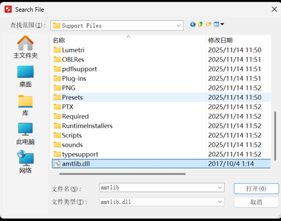

## **AMTEmu使用方法**

　1.、断开网络链接，以试用模式安装 Adobe 各类软件程序

　2、运行Amtemu，选择对应的软件版本，

　3、点击Install运行安装（自动替换amtlib.dll，并生成painter.ini配置文件）

C:\Program Files\Adobe\Adobe After Effects CC 2018\Support Files

　（Ps：在弹出的窗口中手动找到软件安装目录里面的 amtlib.dll 文件）

　4、完成安装。

## 基本介绍：

1.什么是合成（ctrl+K 合成设置-主要是做长度控制）

2.常用尺寸1920x1080/前后缀尺寸L:

3.背景颜色默认，是透明的，不会显示。

4.图层

5.锚点（1.放缩/旋转的中心点 2.平移）

6.位移，缩放，旋转，不透明度

7.U显示所有有变化的关键帧

## 工具/快捷键

0.窗口设置

1.按住alt键轻敲工具栏图标即可切换常用功能

2.ctrl + shift + D 切断素材

3.选中所有关键帧+alt键：等比例缩放

4.顶部菜单栏——动画——关键帧辅助——时间反向关键帧

5.ctrl+shift+C预合成

6.消隐

## 要点：

1.非线性动画

2.效果预设--湍流置换为例，hellow summer，不要奶茶的案例了

3.蒙版（简单易懂的文字出入）

4.alpha遮罩

5.表达式：抖动表达式。时间表达式

6.

## 前后缀的规范：

1. 尺寸：
2. 有学校的元素，一眼记住是CUC STU
3. 时长7-10s是ok的，视觉上尽量快

