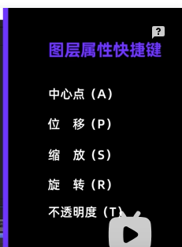

## Ae是什么？

AE 全称 **Adobe After Effects**，它是一个 **视频特效与动态图形设计软件**。
 最主要完成的三件事：

- **动画！**（动画制作）
- **特效！**（爆炸、粒子、灯光、抖动等）
- **合成！**（把图片、视频、文字、素材组合成一个画面）

**使用门槛：**

> *使用门槛其实比想象更低，学 30 分钟做出简单动画完全没问题滴。*

- **图层**（PS同理）
- **关键帧**（剪映同理）

## 强力推荐的入门教程



## 为什么要用Ae？

~~招新宣传片~~

~~社团/活动开场动画~~

~~前后缀动态效果~~

~~动态海报（招生、晚会、文创）~~

~~LOGO 动画~~

~~主视觉 Key visual 动画化~~

~~活动倒计时、字幕条、弹幕效果~~

~~UP 主、运营团队~~

~~学会 AE 简历更亮~~

# 给自推/OC/CP/CB/自设等等 拉磨产粮罢了。

> 高端的食材往往只需要最朴素的烹饪方式。

> 以上都是本人用ae做的小样例，边学边做，忙里偷闲地做。

* AE对于动态的效果，是自由度非常高，非常称手的工具。

* 可以和PS，AI ( Adobe Illustrator ) 等adobe家的工具配套使用，非常方便。
* 那么不用AE可以做到吗？
  - 自然是可以的，工具只是工具，掌握了方法之后，用什么都可以做创意。
  - AE之外的工具不在本次教程的讨论范围内。

## 

## 基本介绍：

1.什么是合成（ctrl+K 合成设置-主要是做长度控制）

2.常用尺寸1920x1080/前后缀尺寸:  

3.背景颜色默认，是透明的，不会显示。

4.图层

5.锚点（1.放缩/旋转的中心点 2.平移）

6.位移，缩放，旋转，不透明度

7.U显示所有有变化的关键帧

## 工具/快捷键

0.窗口设置

1.按住alt键轻敲工具栏图标即可切换常用功能

2.ctrl + shift + D 切断素材

3.选中所有关键帧+alt键：等比例缩放

4.顶部菜单栏——动画——关键帧辅助——时间反向关键帧

5.ctrl+shift+C预合成

6.消隐

## 要点：

1.非线性动画

2.效果预设--湍流置换为例，hellow summer，不要奶茶的案例了

3.蒙版（简单易懂的文字出入）

4.alpha遮罩

5.路径动画

6.表达式：抖动表达式。时间表达式

6.运动模糊

7.导出

## 前后缀的规范：

1. 尺寸：
2. 有学校的元素，一眼记住是CUC STU
3. 时长7-10s是ok的，视觉上尽量快

## 附录

1. Me未安装（已经安装但AE找不到路径）

**解决方案：**

**注意：AE或者PR和AME的版本要一致，比如都是2018版的才能实现。**

使用mklink命令在命令提示符处创建符号链接

1.左下角搜索框中输入cmd，**右键以管理员身份运行（很重要不然会被拒绝访问）**

或者在文件夹C:\WINDOWS\system32中找到cmd.exe右键以管理员身份运行。

2.在cmd窗口中输入命令行

按照所安装的media encoder的版本全称和更改的安装路径输入，

**示例**

软件全称是：Adobe Media Encoder 2020修改的安装地址是在D:\Program Files\Adobe

mklink /J "C:\Program Files\Adobe\Adobe Media Encoder 2020" "F:\Program Files (x86)\Adobe\ME2021\Adobe Media Encoder 2020"

F:\Program Files (x86)\Adobe\ME2021\Adobe Media Encoder 2020

如果是2015的版本是

mklink /J &#34;C:\Program Files\Adobe\Adobe Media Encoder CC 2015&[#34; &#](https://search.bilibili.com/all?keyword=34%3B %26)34;D:\Program Files\Adobe\Adobe Media Encoder CC 2015&#34;

3.操作成功时显示

为 C:\Program Files\Adobe\Adobe Media Encoder 2020 &lt;&lt;===&gt;&gt; D:\Program Files\Adobe\Adobe Media Encoder 2020 创建的联接

说明已经创建成功