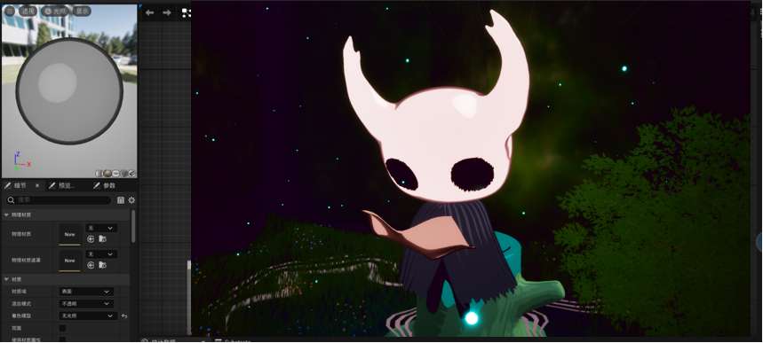

你好！欢迎来到我的小星球。

我是Selaphina。能来访这里的人并不多，谢谢你对我的好奇与关心。我想，每一个来客在此相遇都有独特的意义。

## Introduction

2022.09-2026.07：中国传媒大学	信息与通信工程学院	    数字媒体技术

2026.09-2029.07：厦门大学	电影学院	    计算机科学与技术

## Project

### **2024.08-2024.11: 基于unity开发的2D 横版平台冒险剧情向游戏**  

[简介视频](https://drive.google.com/file/d/1FjW7MCq9ixUjPJ4uHrPh2Scrby3zhsuM/view?usp=drive_link)

###  2025.06-2025.07：**RPAIchat-虚拟角色AI双语对话系统**

[项目地址](https://github.com/Selaphina/RPAIchat-DeepSeek-R1-for-Dynamic-Role-Playing-with-in-Unity)

**2025.05-2025.06：基于UE5的可交互风格化洞穴水体场景**

[演示视频](https://drive.google.com/file/d/1lIqijUMOLgBpfexKJI0soJJlarThKua0/view?usp=drive_link)

> 封面来源：lof @-Syome-

